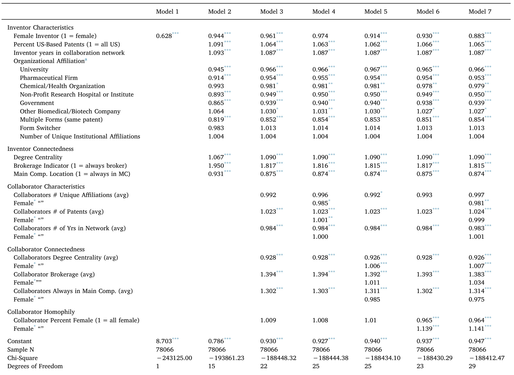

# "A tie is a tie? Gender and network positioning in life science inventor collaboration"  

Kjersten Bunker Whittington  

Reed College.3203 SE Woodstock Blvd.Portland.OR 97202.United States  

# ARTICLEINFO  

# ABSTRACT  

JEL:   
031   
L26   
D85   
J16  

Keywords:   
Commercial science   
Collaboration   
Women   
Science workforce   
Networks  

Collaborative relationships are an important anchor of innovative activity, and rates of collaboration in science are on the rise. This research addresses differences in men's and women's collaborative positioning and collaborator characteristics in science, and whether network influences on scientists’ future productivity may be contingent on gender. Utilizing co-inventor network relations that span thirty years of global life science patenting across sectors, geographic locations, and technological background, I present trends of men's and women's involvement in patenting and their collaborative characteristics across time. Amidst some network similarities, women are less likely to connect otherwise unconnected inventors (brokerage) and have greater status-asymmetries between themselves and their co-inventors. In multivariate models that include past and future activity, I find that some network benefits are contingent on gender. Men receive greater returns from network positioning for brokerage ties, and when collaborating with men. Women benefit from collaborating with women, and are more likely to collaborate with women, but both men and women collaborate with mostly men. I discuss the implications of these results for innovative growth, as well as for policies that support men's and women's career development.  

# 1. Introduction  

Amidst extraordinary strides over past decades, there remain persistent inequities between women and men in a host of outcomes regarding activity in science, technology, engineering, and mathematics (STEM) fields. These include disparities in scientific degree attainment, science labor force participation, salary, the distribution of positions and achievements, material resources and rewards (Long, 2001; Xie and Shauman, 2003; Rosser, 2010). Scholarly and public discussion has highlighted important influences on women's career attainment stemming from the culture and practice of science, the organization and the arrangement of scientific work, and the influence of intersecting social institutions such as marriage and family (National Academy of Sciences,2006).  

Despite focused attention on the topic, less is known about women's collaborative activity, compared to men, specifically regarding their network positioning in research networks and across the science research context (Meng and Shapira, 2010; Meng, 2013; Sugimoto et al., 2015). Scientific collaborations are the backbone of a successful career in science. Research ties facilitate links to additional contacts, assist the diffusion of emergent knowledge streams, and can provide scientists with access to new research opportunities across institutional, disciplinary, and geographic boundaries (Singh and Fleming, 2009; Inoue and Lui, 2015). Collaboration is also increasingly requisite; rates of collaborative efforts in science are increasing as “lone authorships” are in decline (National Science Board, 2004; Greene, 2007). Amidst an expanding scale of research (as well as significant fiscal constraint), funding institutions are now investing more and more in team science and interdisciplinary initiatives (Bennett et al., 2010; Adams 2012).  

A lack of understanding of where women scientists“sit" in networks of collaboration means that little is known about women's embeddedness in the social structure of science, compared to men, as well as how this embeddedness has (or has not) changed over time. Science collaboration is built upon sets of repeated and reciprocal relations between scientists, and linkages between collaborators (and the collaborators of their collaborators) knit together a network of relations (Fleming and Marx, 2006). A scientist's location in this network and the relationships they form and sustain are shaped by the overarching status structure of science, in which hierarchical gender relations prevail (Fox et al., 2017). Against this backdrop is speculation that network benefits may be contingent on gender. By examining gender differences in collaborative positioning, and whether and how network benefits are contingent on gender, it is possible to identify critical factors related to network positioning and women's career attainments in science, and to inform theoretical perspectives about collaborative network mechanisms more generally.  

Using the case of patenting collaboration networks in the life sciences, I construct a global patenting collaboration network of $\sim\!216\,\mathrm{K}$ men and women inventors on $\sim\!784\,\mathrm{K}$ life science patents across a period of three decades (1976-2005). The collaborative relationships are time-ordered and dynamic, and any given network year represents a portrait of inventors working (individually or together) on commercial research endeavors. Their collaborative relationships define a network of linkages that cross geographic and institutional boundaries through much of the rise and early institutionalization of the biotechnology industry.  

The novelty of this data, and the information it provides, comes from the incorporation of two increasingly prevalent, yet not previously combined, strategies to ascertain information about scientific collaboration in a network context. The first regards the challenge of disambiguating patenting and publishing records. Until very recently, data was not readily available to link inventors and authors to their patenting and publishing records in a way that would allow researchers to easily construct unique collaborative profiles for scientists over time. Although not hindering research completely (see, for example, Fleming and Marx, 2006; Lai et al., 2010; Lai et al., 2011; Inoue and Liu, 2015), this has slowed the proliferation of knowledge about collaborative networking in science. In this research, I follow efforts of previous work to disambiguate inventor records and construct networks of collaboration over time (Lai et al., 2010; Lai et al., 2011). Similar efforts can be found in the United States Patent and Trademark Office (USPTO) PatentsView platform, which employs probabilistic methodologies to disambiguate inventor records in a relational database (USPTO, 2016).  

The second challenge relates to the omission of gender identityl in patenting and publishing records (Frietsch et al.,2009). While information on women's patenting and publishing activities can be gathered by self-report on surveys, or through hand-coded case studies, the lack of information at the record level complicates research on men's and women's network positioning, because details about science collaborators (and the collaborators of their collaborators, etc.) need also be known. In this work, I utilize name frequency databases to create a probabilistic likelihood of inventors being male or female, a strategy in line with others (Moody, 2004; Frietsch et al., 2009; Meng, 2013; Sugimoto et al., 2015; Lariviere et al., 2013). Although an imperfect method, such data would be challenging to procure otherwise; indeed, organizations with substantial resources otherwise have, and continue to, rely on similar methodology (Elsevier, 2016, 2017).  

To this researcher's knowledge, this work represents the first effort to employ both strategies in a relational fashion to address questions about women's collaborative positioning, compared to men, using network methodology in a global network context over time.2 I use this network to present descriptive statistics on inventors patenting rates and collaborative profiles, over time, as well as to report on a wide variety of network measures commonly considered to be relevant to innovative output. I then leverage the longitudinal nature of the data, and its relational components, to investigate the possible moderating influence of gender on network benefits to scientists'future commercial activity, finding evidence of some network contingencies for men and womeninventors.  

# 2. The case: patenting in the life sciences  

My focus on patenting - as opposed to other collaborative endeavors 1 science - is guided by both methodological and substantive factors.  

While publishing has long been regarded as the “coin of the realm” for academic science (Storer, 1973), this sector has witnessed a sea change in recent decades with an explosive increase in patenting, licensing, start-up incubation, and founding of companies, most notably in the life sciences (Henderson et al., 1998; Mowery et al., 2001; Owen-Smith, 2003; Owen-Smith and Powell, 2003). At the same time, scholars have recently turned an analytical lens beyond publication to additional indicators of research productivity, including those related to academic and industrial entrepreneurship and commercial activity. Innovation is connected to increased publication productivity (Stephan et al., 2007; Azoulay et al., 2009), and is valuable for academic success and rewards more broadly (Jacobs and Frickel, 2009). In addition, a focus on patenting allows for attention to be paid to the relationship of institutional location and gender equity in science, as the commercial context involves activity beyond academia in industry science, non-profit research institutes, government agencies, and pharmaceutical firms and chemical companies. Cross-sector activity knits together the social structure of science and presents a more accurate portrayal of science collaborations in the biomedical sciences. Methodologically, patenting data is publicly available, and is widely used in social and economic circles to assess individual, state, regional, and national indicators of innovative activity. A base of knowledge exists about inventor network relationships in the science realm (Fleming et al., 2007; Balconi et al., 2004; Obstfeld, 2005; Inoue and Liu, 2015), allowing for useful comparisons and meaningful implications.  

While patenting and publishing activities are distinct - patents grant exclusive rights, and must meet criteria of being useful, novel, and nonobvious - there are similarities. Both tend to be conducted by teams of scientists utilizing recognized research practices, who formulate claims based on extant literature. Both codify results and mobilize evidence, and are governed by an external evaluation system. Furthermore, scientists with academic ties often publish and patent the results of the same research activities in patent/publication pairs (Murray, 2002; Murray and Stern, 2007). That said, commercial activity is more likely to be taken on by those who are highly productive in other performance metrics, such as publishing (Stuart and Ding, 2006), and to occur in certain settings over others (such as industrial science, and in research universities). The concern regarding women's involvement is that the increased emphasis on commercial activity may heighten gender gaps in status because those who are already successful appear better able to capitalize on commercial success (Colyvas et al., 2012).  

As with publishing, a considerable body of research has found that women receive fewer patents than men, and patent at lower rates, with some decrease in the gender disparity over time (Naldi et al., 2005; Thursby and Thursby, 2005; Ding et al., 2006; Stephan and El-Ganainy, 2007; Kugele, 2010; Colyvas et al., 2012; Sugimoto et al.,2015). Some industry settings - particularly firms of a “network form" (Powell, 1990)—-reveal more equity than others (Whittington and Smith-Doerr, 2005, 2008). Compared to men, women are also less likely to be present in other commercial endeavors, such as licensing (Duque et al., 2005), consulting (Corley and Gaughan, 2010), participation in private sector scientific advisory boards (Ding et al., 2013), and company founding (Lowe and Gonzalez Brambilia, 2007). Research finds that a significant hurdle for women may occur at the stage of first involvement, especially in the academy where such activities are not “required” (Whittington, 2011). In interviews with women scientists at a prominent university, Murray and Graham (2007) report that women describe less exposure to the commercial process and fewer opportunities to disclose than men (see also Ding et al., 2006). Women also report fewer invitations from others to participate in commercial activity, and different sources of support for commercial involvement then men—women from close colleagues in comparable positions (and from technology licensing offices), and men from senior advisors.  

Women patent less than men, however it remains unknown how they are integrated in the broader collaborative community. Given the importance of network factors in innovative activity more generally, it is reasonable to assume that accounting for these may help explain gender disparities in innovation, or reveal sites for which targeted policy or best practices may be applied. The data used in this analysis speak to women's positioning in co-inventing networks at the point of theirfirst patent and beyond. If the hurdle of first patenting is the point of greatest disparity between men and women, we might anticipate similar collaborative locations between men and women scientists who have already reached this milestone. However, the fact of divergence in sources of support and connection to the commercial process for men and women (and a long line of research on the ways in which gender infuses the organization and practice of science (National Science Board, 2004)) implies that gender may interact with opportunity in ways that reveal differential locations for men and women in commercially collaborative networks (and perhaps differential benefits of collaborative ties down the line).  

# 3. Collaboration and networks  

The network literature is clear that technical knowledge diffuses through social networks of relations (Breschi and Lissoni, 2004; Singh, 2005; Walsh and Maloney, 2007; Singh and Fleming, 2010). With some important caveats related to the characteristics of one's collaborators as well as the nature of the tie (see Perry-Smith and Shalley 2003; Fleming et al., 2007; Rost, 2011), those with more collaborators have been found to publish more articles, in higher impact journals, and accrue more citations (in a faster amount of time) (Lee and Bozeman, 2005). Some research finds women less likely to collaborate than men (Scott, 1990; Kyvik and Teigen, 1996; Hunter and Leahey, 2008), although others find no difference or that women collaborate more (Prpic, 2002; Gaughan and Bozeman, 2002; Bozeman and Corley, 2004; Bozeman and Gaughan, 2011). In some settings women are less likely to collaborate internationally (Uhly et al., 2015), which can carry implications for downstream citation impact (Elsevier, 2016), as can cross-sector collaboration.  

A broader literature suggests that women and men tend to foster qualitatively different patterns of interaction within their work settings (Kanter, 1977; Ibarra, 1992; Smith-Lovin and McPherson, 1993), with implications for women's performance. Men tend to have predominantly male networks, while women tend to have female or mixed networks (McKinsey and LeanIn.Org, 2015). Women tend to have network compositions with more strong, dense, relations (as opposed to diverse or spanning “brokerage” ties?), and tend to be tied to fewer influential individuals (Brass, 1985; Moore, 1990; Ibarra, 1993; McGuire, 2002). In some settings, these different types of connections have been shown to provide alternate routes to success for men and women (Ibarra, 1997). Some of the variation is likely related to structural differences in occupation and/or job rank (Brass, 1985; Moore, 1990; Ibarra, 1992), yet beliefs about gender also form a background frame from which workplace decisions and outcomes are made (Ridgeway, 2011), and especially in the context of science and entrepreneurship (Wajcman, 1991; Thébaud, 2010; Tinkler et al., 2015). Women are also often excluded from resourceful networks despite their career location (Miller et al.,1981;Ibarra, 1992).  

If network influences on collaborative relations mimic that of other types of work relations, we might expect to see qualitatively different positioning and collaborative profiles between men and women: women may be more likely to be tied to other women or to be in mixedsex inventor teams (homophily), may have fewer spanning ties to unconnected others (brokerage), and fewer may be involved in cross-sector inventing. We might also expect to find decreases in these differences as the number of women in the patenting network grows over time (in tandem with the growth of women in biomedical fields more broadly, and reductions in gender disparities in STEM more broadly); thus, accounting for time in the network may reduce the extent of women's lower aggregate patenting activity compared to men. But this work allows for an examination of areas where previous literature is quiet: the extent to which women are isolated or on the periphery in collaborative science spaces, whether gender differentials exist between men and women when considering frequently invoked centrality measures (degree centrality, closeness centrality, aggregate constraint, etc.4), and how they may differ in the types of collaborators they have (collaborator statusandpositioning).  

# 3.1. Gender and rewards for social capital  

In addition, a scant literature suggests that gendered practices in the workplace may also lead to gender differences in the ways in which rewards for social capital are realized or received (Brass, 1985; Ibarra, 1997). For example, there appears to be a greater ability among men to leverage their positions and credentials (e.g. hierarchical rank, existing network contacts, educational degrees) into centralized network positions (Miller et al., 1981; Ibarra, 1992). In a case study of promotion in a workplace, Burt (1998) finds that female managers most likely to be promoted have strong ties to superiors and dense networks of close ties to colleagues, whereas successful men receive more from maintaining important brokerage, or spanning, ties (of which women had fewer) (Burt, 1992, 2005). Burt attributes this to the need for women to attain "borrowed social capital" in the eyes of their superiors, who make decisions about their upward mobility (1998, page 6). Related work utilizing an experimental setting in venture capital decision-making also finds tie contingencies based on gender (Tinkler et al., 2015). In a simulated environment where differences between a male and female entrepreneur seeking funding were otherwise equal, Tinkler and colleagues found that although both men and women entrepreneurs benefited with the “endorsement" of a trusted colleague, the tie benefits women received were much greater and consequential than they were for men. Like Burt, Tinkler et al. highlight the status and/or signaling effects that ties can provide, and suggest that women more so than men benefit from certain indicators of potential. Connections to key players - and also technical background in their context—helped to instill confidence in evaluators and mitigate uncertainty in their abilities in this male-typed setting. In both cases, underlying status processes yield network influences that differ or are altered for men relative to women. On the one hand, Burt's (1998) work suggests that the type of influential tie may vary: women in the business setting he studied did not see as much reward for spanning relations (e.g. connections to diverse, otherwise unconnected,others) as did men. On the other hand, the work of Tinkler et al. finds that while network signaling is helpful for both men and women, it is particularly consequential for women.  

# 3.2.Analytical approach  

The collaborative space is the coin of the realm of working scientists, and previous work clearly identifies networks of relations to be critical for the production of scientific work. Gendered expectations infuse social interaction in science, and this domain is particularly masculine-typified (Faulkner, 2000). For this there is reason to expect that network factors are important in understanding gender differentials in patenting, and this has yet to be comprehensively examined. We do not know the extent to which women and men foster relationships with different types of collaborators in science settings, and/or receive differential benefit from these ties. Furthermore,“complete" network data is rarely in hand - that is, information that includes all direct and indirect ties, and activity that takes into account typical scientific collaborative relations across sectors, regions, and institutional locations. In this analysis I investigate whether or not there are gender differences in rewards for inventor positioning, as well as for the characteristicsandconnectednessof theircollaborators.Whilethis work does not attempt to adjudicate between the many potential underlying mechanisms responsible for these contingencies, clarification of critical factors related to network differentials can inform theoretical perspectives and provide a roadmap for targeted inquiries in future research and policy development.  

The principle aims of this work are thus to:  

1) characterize men's and women's patenting and commercial network activity, as well as that of their collaborators;   
2) describe men's and women's network positioning over time across a variety of measures commonly mobilized in network analyses of innovative outcomes;   
3) ascertain the extent to which there are moderating influences of gender on network and collaborator characteristics as they relate to scientists’ future commercial activitv. other things eaual.  

# 4. Data  

To construct co-inventor relationships over time, I collect patent records from an institutional sample of dedicated biotechnology firms and their partner organizations (universities, non-profit research institutions and hospitals, pharmaceutical firms, health and chemical corporations, and government agencies) active in the biotechnology industry during the time period 1976-2008. Dedicated biotechnology firms (DBF) in this sample are defined as any organization with a human therapeutic and diagnostic focus, excluding firms that focus on agriculturally-based technology or other non-human agendas. The firm sample is curated from a widely accepted industry database, Bioscan. As described in detail elsewhere (Powell et al., 2005), this industry database catalogs nearly the entire population of biotechnology firms, and lists all partner organizations with which firms maintain contractual relations during this time period. I include all patents assigned to DBF firms during the time period, as well as the patents of all global partner organizations contractually related to the DBF firms during the same time period. I also include the patents of all 89 research-intensive U.S. universities during this time period designated as “Research 1" via the Carnegie Classification of Institutions of Higher Education (n.d.).5 The full institutional sample thus consists of the stock of patents assigned to 1524 firms and institutions: 568 public and private DBFs, 220 public research organizations and research hospitals, 245 pharmaceutical and other chemical and health-related multi-national corporations, 35 government agencies, 103 universities, and 120 biomedical companies. All firm patent records are then resolved to the inventor level.  

Alongside others (Lai et al., 2010, 2011), I consider inventions to be from the same person when two inventors match in first, middle, and last name (or part thereof, in the case of missing middle or first names). As described in additional detail in Whittington (2007, 2009), 1 incorporate an algorithm that allows for matches when similar first, middle and last names and one other matching characteristic - a similar city and state, assignee name, and/or the same primary and secondary technology class—are present.° The resolved inventor list was then matched to a second database of inventors, this time containing the total corpus of USPTO patenting records during that time frame (i.e. including patents beyond the life sciences) (Lai et al., 2010). This allowed for inventor records in the sample to include patents granted to organizations outside the purview of the initial firm and institutional sample. All dates utilized in the analysis stem from the date the patent application was filed with the USPTO. I focus on the years 1979-2005 in the analysis to accommodate the typical waiting period of 2.5 years between filing and grant date of the patent. This allows for the inclusion of patents filed in 2005 that may be been granted up to 3 years later.  

Multi-national corporations, universities, governments, and other institutions patent across a variety of disciplines and topics (for example, consider the range of patents granted to large conglomerates such as Mitsubishi Group, or to universities, both of which are in the sample). I take steps to provide an appropriate field boundary to the network so as not to calculate network influences based on connections to industries very far-afield. I designate “core” biotechnology classes to be those that comprise the 9oth percentile and below of the patents assigned to DBF firms. I include all scientists that always patent in the core (i.e. scientists for whom all of their patents in their portfolio fall within these classes),scientists that sometimes do (i.e.scientists for whom at least one of the patents is a core patent), and all scientists from the patents of DBF firms. I also include all never inventors (i.e. scientists who never patent within the core patenting classes) that are within two steps of an always or sometimes inventor. I include “nevers” in the network calculations to avoid truncating interdisciplinary ties that may serve an important network function, but I remove these individuals from the descriptive and statistical analyses, focusing only on scientists for whom always or at least sometimes patent within core biotechnologv patenting classes.  

I code inventor gender with the assistance of lists of first names provided by the 1990 US Census and other international organizations. The U.s. Census list provides names that comprise the 9oth percentile and below of the set of baby names registered with the U. S. Social Security Administration, classified by sex of the baby and with cumulative percent. A name found only on one list is assigned to the related gender. In the case of “androgynous" names, where a name appears on bothlists $(<10\%$ of names), the cumulative percentage for the name for each sex is compared, and gender is assigned to the least-rare case.7 I supplement with additional name lists that focus on common names in other countries, when available.8 Roughly $25\%$ of the sample has a first or middle name that cannot be identified. Much of the missing data for inventor gender occurs for foreign names, and those of Indian and Asian descent are particularly difficult to code for gender using these approaches. I do not remove these individuals from network calculations to maintain the connective integrity, but exclude them from comparisons of men and women inventors in the statistical models.9  

The two-step network contains 783,835 patents to 215,450 inventors across the approximately thirty-year time frame. There are 114,483 inventors patenting in biotechnology core classes and/or in biotechnology firms (always, or at least some of their time, in the network). Of these, 82,579 inventors have “gender-resolvable” names and do not have missing data on other measures. Unless otherwise noted, all statistics are based on this final sample count.  

Table1 Network Measures and Definitions.   

  

# 5.Thecommerciallifesciencenetwork  

Table 1 presents definitions of key network constructs utilized in the analysis. I construct the network10 such that ties are formed three years prior to the application date of a patent and remain in effect until three years after, although the substantive results of the network analysis remain unchanged if a 2-year collaboration period is utilized instead.11 Ties are valued by the number of patents in which inventors are jointly listed in a given network year.  

Network visualizations of this size are often crowded by nodes, ties, and overlapping network components. Fig. 1 provides a portrait of the collaborative structure through a focus on the largest connected network component (sometimes referred to as the“main component") of the life science commercial network across all years (containing $92\%$ of the inventor sample). In the main component every scientist could—- theoretically - reach everyone else through direct or indirect ties. While inventors are not likely to have practical access to all members of a main component in any year, the concept is none-the-less a useful one for to provide traction on differences between inventors who are working “where most of the action is” in the biotechnology collaborative space, and those who collaborate more afield.  

Each node in Fig. 1 represents a commercial scientist, colored magenta, blue or yellow for women, men, or “gender unknown", respectively. Aside from the large cluster of yellow “gender unknown" inventors in the top right hand corner (the bulk of which are affiliated with patents assigned to Asia-based firms), a simple visual inspection of Fig. 1 suggests that women are more or less evenly distributed throughout the network - that is, they are not all clustered to the periphery or elsewhere, a point given further attention later. Within any given year, the main component of the yearly network is smaller, and contains fewer inventors (yearly networks include between 40 and $80\%$ of inventors), because these years reflect active collaborations rather than a cumulative total across time.12  

# 6. Patenting activity and characteristics of collaborators  

# 6.1. Patenting activity  

In the aggregate, women comprise $24\%$ of the biotechnology inventor population across years and organizational settings, and are assigned $38\%$ fewer patents than men (Table 2).13 On average, womenhold5.4patents compared tomen's average of 8.4. Patent counts are heavily skewed, however, and many inventors have only one or a few patents while only a handful have many. In this, gender disparities are upheld. Men hold a median of 4 patents and women a median of 2, and women are also more likely to be “onetime”inventors than men( $32\%$ of women versus $21\%$ of men). Furthermore, they are overrepresented at the lower counts - women represent $26\%$ of inventors with 1-5 patents, but only $19\%$ of those with 5-10, $15\%$ with 11-25, and $13\%$ at higher counts. Women also have a higher number of years for which they exhibit no collaborative activity after they enter the network (0.56 versus 0.27 years, respectively).  

The average year of first patent in the sample for women is three years behind that of men (1991 versus 1988, respectively), but the data reveal the extraordinary growth of women's involvement in patenting over time. This can be seen both in the percentage of women inventors applying for patents, and in the percentage of patents with at least one woman inventor (Fig. 2a and b), and the percentage of women in the pool of “new entrants" to patenting is also growing each year (Fig. 2c).14 Given these trends, it is important to note that differences seen in aggregate statistics may be related to women's later entrance to the commercial realm than men. For example, gender differences in total patent count decrease when accounting for years since first patent: men patent approximately 0.60 patents/year versus women's average of 0.51/year (Table 2). This corresponds to a reduced difference in yearly output (down to $16\%$ ) considering differentials in the number of years since first patent.  

  
Fig. 1. Largest main component of inventor collaborations in the global life science community,by inventor gender (1976-2005). Global network across all years, with the following node color specifications: women (magenta); men (blue); “"unknown gender" (yellow). (For interpretation of the references to colour in this figurelegend, the reader isreferred to the webversion of this article.)  

Table2 Patenting activity and inventor characteristics, by gender.   

  
a Reference category for “always"” is “sometimes"” a core life science inventor $\mathrm{N}=82{,}579$  

Most inventions are assigned to institutions (as opposed to individuals), and the bulk to only one organization at a time $(97\%)$ Across organizational settings, fewer women inventors in the sample are in multi-national health and chemical corporations and other biomedical companies (less than $25\%$ ) than in other settings,15 however the biggest difference is between men and women with inventing activity that crosses sectors or institutional forms. Women make up only $19\%$ of those who are “form-switchers” (that is, inventors with a patent portfolio that spans organizational forms). Interestingly, they make up a higher proportion of inventors with cross-sector activity (i.e. inventors on “multiple forms" patents, or patents that are assigned to more than one organizational form) than any single institutional location $(33\%)$ although only a very small percentage of scientists in the sample engage in this kind of work.  

  
Fig. 2. Longitudinal Trends in Prevalence, Involvement, and Entrance to Patenting $(\mathrm{N}=82,579)$  

Women inventors in biotechnology are not collaborative isolates (Table 3). They reside on larger inventor teams then men (women have an average of 4.1 inventors on their patents and men have 3.6 (a $14\%$ increase)), are less likely than men to be sole inventors ( $15\%$ of women are singleton inventors versus $20\%$ of men), and are less likely to be on a team with just one other person compared to men ( $19\%$ versus $22\%$ of women and men are in teams of two). Although women have fewer total collaborators than men (6.94 compared to 8.63), they have more than men when the measure is normalized to total patent count (1.69 for men compared to 2.15 for women).  

# 6.2. Collaborator profiles  

There is a general trend towards gender homophily in the inventing network, despite the small percentage of women in the sample (Table 3). Whereas twenty-eight percent of women's collaborators are women, only $18\%$ of men's collaborators are. The relative difference between men and women is highest among those that work in pharmaceutical firms (a $47\%$ percent difference) and multinational chemical and health corporations $(70\%)$ , and hovers around $20{-}25\%$ for those in dedicated biotechnology firms, universities, non-profit research hospitals, and universities. The organizational variation appears to be related to differences across settings in men's proportions of women collaborators; women's proportions remain relatively similar regardless of setting. The general trend of homophily underscores the persistent role of status and similarity in network formation (McPherson et al., 2001), and provides implications for the role that diversity may play in the scientific workforce. On one hand, although the content and science may be the same, women inventors are involved in networks of collaborations that are—at least as related to gender—significantly more diverse in nature across settings. The implication is that women may "bring into and/or better locate other women" in the commercial context. On the other hand, the fact that there are far fewer women than men in life science commercial networks, suggests that the tendency for homophily may mean women experience a reduced set of available collaborators compared to their male colleagues.  

Women and men have collaborators that are similar in other respects. Their collaborators are similar in the numbers of organizations to which they are affiliated, their international orientation, their time spent in the network, prior patenting experience and total patent counts. However, as Table 3 reveals, while both men and women have collaborators that are, on average, more experienced and commercially productive than them, women's relative difference is greater than men's. For example, while men's collaborators have spent $32\%$ more time in the network than they have, women's collaborators have spent roughly $50\%$ more. Men's and women's collaborators are more prolific inventors then they are (on average), but men's collaborators are more similar to them in their total number of patents then are women's collaborators. These asymmetries may be related to myriad factors that deserve further treatment, including the types of collaborative relationships men versus women inventors foster, the availability of collaborators given inventors’ positions in the network, and the types of projects or roles men and women embody in their organizations, among other factors.  

Table3 Inventor collaborative profiles, by gender.   

  

# 7. Network positioning  

Network scholars utilize a number of measures that capture the extent to which women and men are reachable or more centrally connected to others in the network, and I evaluate men's and women's locations across a set of commonly used and robust measures incorporated in literature elsewhere (Table 1). The measures cluster into three broad sets of categories: 1) inventor location in the network; 2) inventor “closeness” to other inventors, including immediate collaborators and those more than one step away (centrality and reach); and 3) the degree to which an inventor is strategically placed, on short paths to highly central others ("betweenness") as well as to“non-redundant" others ("brokerage").  

It is not the case that women are morelikely tobe isolated inventors or clustered in network components of small size (Table 4).A similar percentage of men and women are located in the main component of at least one network year ( $78\%$ versus $75\%$ 0, and women are more likely than men to reside in the main component every year ( $35\%$ versus $25\%$ respectively).16 Subsequent analysis (not shown in the table), finds these trends hold across time, with little deviation through the network years.  

Table 4 and Fig. 3a reveal little difference between men and women in degree centrality, measured by the number of ties that are one path length away. This captures the number of active collaborations, across projects, an inventor has at any given time in the network. Aside from those in chemical and health corporations (where women have lower average degree centrality compared to men for many years), the table and graph shows little substantive difference between men and women in this regard - in the aggregate sample, within organizational affliations, and across time.17  

Table4 Inventor network location (across patenting profiles), by gender.   

  

Inventors′“closeness centrality” to others is evaluated by taking into account the number of geodesic “steps” between themselves and everyone else in the network. On average, women tend to be equal or slightly “closer”to others compared to men,as indicated by their slightly higher average closeness scores, across sectors and time (Fig. 3b). These small differences are likely related to the fact that women are located in clusters with higher size and are less likely to patent alone. Men and women also do not differ greatly in their average "clustering", measured by the extent to which an inventor's collaborators are in turn connected to each another (women's clusters are slightly more dense), or their aggregate constraint, a measure of the (proportional) importance or strength of an inventor's ties to their collaborators, given their collaborator's investment in other ties.18  

The third set of measures represents the point of greatest difference between men and women inventors. Stemming from a long and established line of research built on the idea of the “strength of weak ties" (Granovetter, 1973), network theorists posit that individuals who sit on a high number of “shortest" paths between others in the network (betweenness), and those that connect two otherwise unconnected people (brokerage), have more efficient access to information, enhanced access to new opportunities, and power to constrain others (Burt, 2005). In the innovation context, inventors who are in strategic locations may more easily bring together collaborators that have boundary-spanning knowledge, and may be in particularly unique positions to learn of, build, and/or capitalize on diverse knowledge sources that support combinatory innovative development (Perry-Smith and Shalley, 2003; Uzzi and Spiro, 2005; Fleming et al., 2007; Lingo and O'Mahoney, 2010).  

In the aggregate as well as across time and organizational space, women are less likely to be in positions of strategic advantage compared to men (Fig. 3c and d). There is a $45\%$ difference in men's and women's average betweenness centrality, with the largest percent differences between men and women who patent with government agencies(a $79\%$ decrease) and chemical and health corporations $\left(58\%\right)$ Women in non-profit research hospitals and organizations, DBFs, and pharmaceutical firms range have a smaller, yet still significant, difference from men $(42\!-\!46\%)$ . The gender disparity is much smaller among those in universities $(19\%)$ , although even there women still trail men.  

  
Fig. 3. Men's and women's average network centrality by year and organizational affiliation, 1975-2005.  

Women also tend to have more redundant ties than men, and are less likely to be in possession of ties to others that do not have ties to each other (brokerage). On average, men hold almost twice the number of brokerage positions than women do across their years in the network (14.7 versus 8.7, respectively, a $52\%$ difference). The percent difference is greatest for inventors in government $(93\%)$ , chemical and health corporations $\left(69\%\right)$ and universities $(55\%)$ ; it is least in dedicated biotechnology firms $(12\%)$ pharmaceutical firms $(19\%)$ , and for“form-switchers" $(29\%)$  

Much of the difference between men and women in these positions, however, appears to be related to the fact that women are less likely to be in network locations that have any degree of strategic positioning. While only about half of the sample has any degree of brokerage and betweenness $(49\%)$ ，it reduces to $40\%$ for women. Proportionally, women comprise $28\%$ of inventors without any degree of betweenness and brokerage, but only $19\%$ of inventors with a non-zero value. Among those with any amount, the percent difference in betweenness drops to below $10\%$ in DBFs, pharmaceutical firms, and non-profit research institutions, and below $50\%$ in chemical/health corporations, universities, and government. The disparity is also related to the fact that men are more prominent in the upper tails of the distribution for these two measures. That is, there are disproportionately more men "star inventors” who are prominently and centrally located in the network. A particularly useful focus at this point, then, may be better understanding mechanisms around which women become less likely to gain access to strategic brokerage positions in collaborative work more generally, an implication discussed in more detail later.  

Key takeaways from the descriptive results suggest that women follow similar trajectories as men into commercialization, just more slowly, have fewer overall patents, and represent fewer“star inventors" at the high end of the patent count distribution. While they have coinventors with similar commercial profiles, there are greater asymmetries between their collaborators and themselves in experience and proclivity to patent. Men are more likely to collaborate with other men, and women's collaborative networks include more women; yet men coinventors make up the majority of inventor's collaborators. Finally, differences in brokerage and betweenness are suggestive of a more peripheral location for women in network positions that maximize information transmission and resource opportunities—in particular, more women than men are in positions of complete strategic periphery.  

Table5 Maximum likelihood estimates (odds ratios, logit) of patenting $(\mathfrak{t}=1)$ given inventor demographic and network characteristics (t-1).   

  
Notes: All models include fixed effects for year; ? omitted category is “Dedicated Biotechnology $\operatorname{Firm}^{\gamma}$ $\ddot{\mathrm{~p~}}<\,0.10$ $**_{\mathrm{~p~}}<\,0.05$ $\mathrm{~p~}<\,0.01$ (two-tailed).  

# 8. The influence of position and collaborator characteristics on innovativeoutcomes  

Although it is commonly accepted that social connections enhance the creative process underpinning scientific discovery, the gendered organization and structure of science may mean that network mechanisms that enhance women's productivity may differ from that of men. In this section I leverage the longitudinal nature of the data to address the importance of men's and women's differential positioning on future patenting and collaborative endeavors, controlling for inventor characteristics, sector- and organizational-level affiliations, and year. By taking this approach I do not attempt to statistically resolve the underlying mechanisms behind network influences or contingencies, or to utilize these models to explain away the gender gap in patenting, both of which require more targeted efforts. Instead, I pay particular attention to the idea that an important first step is to document whether collaborative science spaces reveal network benefits that are contingent on gender (Burt, 1998; Ding et al., 2006; Tinkler et al., 2015), and whether there may be “alternate paths to the same outcome”for women versus men (Ibarra, 1997), as research suggests may be the case. I include measures from each conceptual domain in which network influence may be reasonably expected (e.g. location in the network, reach of ties, and positions of strategy), and focus specifically on constructs where theoretical expectations suggest attention is due—namely collaborator experience and position, homophily, and brokerage.  

The modeling strategy is comprised of two separate analyses. The first set of models utilizes the temporal nature of the database to predict how inventor demographic and network positioning in one year influence the probability of patenting in a subsequent year. The second analysis collapses observations of inventors into a single inventor profile to assess the importance of men's and women's collaborator characteristics on cumulative patent count. Tables Al and A2 provide variable correlation matrices for eachanalysis.  

# 8.1. Network correlates of future patenting  

Table 5 presents odds ratios of maximum likelihood estimates from logistic regression models where the unit of analysis is inventor-years, and the outcome of interest is a granted patent at time 1 given network characteristics at t-1 years. I utilize clustered (robust) standard errors and fixed year effects to account for repeated measures of inventors across time, and find substantively similar results when incorporating a two- or three-year lag instead. All models include controls for the following characteristics: inventor organizational affiliation; percent of portfolio containing US-based patents ("internationality"); number of years the inventor has been in the collaboration network; whether or not the inventor patented in the previous year $(1=\mathrm{yes})^{19}$ ; number of unique organizational identities or affiliations to which the inventor has been linked; and whether or not the inventor is "always" (or only “sometimes") a “core” life science inventor $(1=\mathrm{yes})$ Following on the heels of the descriptive analysis, I turn my focus to three primary network measures for inclusion in the model sets - 1) degree centrality, 2) an indicator variable for (non-zero) brokerage (betweenness)  

Table6 Predicted odds of patenting for selected interactions (Model 10, Table 5).   

  
Notes: $({\tt p}\,<\,.01)$ $*_{\mathrm{~(p~<~.~1)~}}$  

positioning, and an indicator variable for location in the network main component (yearly). I include each variable separately and together (Models 3-6), and as a set of interaction variables with inventor gender (Models 7-10). The final model is best fitting and is the model for which all interpretations are derived.  

The models show the odds of patenting activity increase as a scientist's embeddedness in the networks grows, controlling for inventor characteristics, prior experience and year. Furthermore, the models show that there are statistically relevant interaction effects between gender and network position, suggesting that gender may moderate the influence of embeddedness on inventors’ future activity. While the interaction between gender and brokerage loses significance in the final model (as does the baseline effect of being female), statistically appropriate conclusions from interactions in logistic regression can only be made when considering marginal or predicated probabilities (calculations of the difference of differences in probabilities) (Buis, 2010). Table 6 presents the marginal effects of the odds of patenting for both brokerage and membership in the main component, holding all other variables within group at their observed values. In the case of brokerage, the final model reveals no gender differential in the odds of patenting between men and women who lack a brokerage position. For nonbrokers, the baseline odds of patenting in a future year for men and women are 0.31 and 0.30, respectively. However, while men and women both experience a significant boost to these odds when in brokerage positions, the odds of patenting for women brokers are 0.63 that of men brokers. This suggests that women's brokerage locations are not as predictive for future patenting activity as are men's.  

A similar result is found in the marginal calculations for the influence of holding a location in the network “main component". While both men and women benefit being in this hub of activity, men benefit significantly more so than women. In this case, women's predicted odds of patenting when in the main component are $53\%$ that of men who are in the same location. Men and women who are not in a main component in a previous year are closer in their predicted odds of patenting (0.39 versus 0.33, respectively) than men and women who are more centrally located.  

Despite the statistically significant interaction effect between the variables for gender and degree centrality, there are no substantively revealing differences between men and women in the network benefits they receive from increasing ties to additional collaborators. In a graph of the predicted odds of patenting, as degree centrality rises from 1 to 25 (not shown), the effect on women's patenting compared to men is reduced by only 0.06 patents (n.s.). Similar (non-)effects were found in sensitivity analyses utilizing alternative measures in the models that relate to degree, such as closeness centrality, the clustering coefficient, and measures of aggregate constraint.  

A final consideration relates to our understanding of the influence of network versus non-network characteristics on the probability of patenting for men and women in the life science commercial network. Although it is not appropriate to compare the direct effect for gender across the set of non-linear nested models, model fit statistics suggest that both network and non-network characteristics shed light on inventor propensity to patent in the life sciences. Each nested model improves in fit; and models that isolate network and non-network variables contribute independently to this fit.2° In the baseline model (Model 1), the predicted odds of patenting for men are 0.55 and 0.45 for women (when all other variables are held at their observed value). The inclusion of nonnetwork variables (Model 2) reveals predicted odds of 0.59 for men and 0.55 for women, suggesting that these characteristics serve to decrease the gap. The final, fully specified model that adds network variables predict the odds of men patenting to be 0.89, and that of women 0.70 (Model 10).21 These results provide support for previous work that emphasizes the strength of “sorting” dynamics (such as women's differential rates of participation across science fields) in explaining aggregate differences between men's and women's innovative activity in science (see, for example, Hunt et al., 2013). While sorting effects (and other nonnetwork characteristics) can help us understand how differences in men's and women's experience, international reach, and distribution across types of institutions play a role in the gender gap in propensity to patent, the results of the final model suggest that there are still differences in men's and women's propensity to patent despite controlling for these and network measures. The likelihood of patenting again is high, and wellpositioned network relationships benefit everyone's odds of patenting. Yet men's differential rewards result in findings of greater average disparity between men and women after network positioning and tie influence is taken into account.  

# 8.2.Collaborator benefits towards future patenting  

In the second analysis, in order to examine the influence of collaborator characteristics I collapse yearly records over time to convert the sample from one where the unit of analysis is inventor-years to that of cumulative inventor profiles over time. The sample now includes all inventors that have at least one collaborator $(\mathrm{N}=78,066)$ .These models utilize the total patent count in an inventor's portfolio as the dependent variable, and incorporate a negative binomial count modeling strategy because of overdispersion in the outcome variable.22 Table 7 presents incidence rate ratios from a series of nested models that include measures for inventor's collaborator's experience (average years in the network), productivity (average number of patents), and connectedness (average degree centrality, brokerage, and frequency of location in the main component). The models also include a measure of collaborator homophily, calculated as the proportion of an inventor's collaboratorswho arewomen( $\mathrm{~\cdot~}1=$ all women co-inventors). All measures for collaborator characteristics are constructed by taking the average of the collaborator values, although findings related to gender differentials and interactions are similar when the measures are constructed to reflect status asymmetries between inventors and their collaborators.  

Like the first set of models, increases in model fit across the set underscore the importance of both network and non-network influences in understanding commercial activity. While each represent a significant proportion of the variation, collaborator characteristics can be seen to exert a smaller (yet independent), influence on inventor productivity as well. Model 7 includes all variables together, and is best fitting.  

Table7 Negative binomial incidence rate ratios of inventor's total patent count given collaborator and inventor characteristics.   

  
Notes: $\ddot{\mathrm{~p~}}<\,0.10$ $**_{\mathrm{~p~}}<\,0.05$ $\mathrm{~p~}<\,0.01$ (two-tailed). a Omitted category is “Dedicated Biotechnology Firm".  

The models characterize several significant main and interaction effects of collaborator characteristics on the outcome variable; in particular, collaborator brokerage and collaborator positioning in the main component are positively associated with inventor productivity, for both men and women. In contrast, there is a negative relationship between inventor's patent count and being tied to many collaborators who have many co-inventing ties themselves—that is, inventors that are tied to those with fewer co-inventors tend to have more patents in their portfolio. It is possible that this may relate to typical divisions of labor in laboratory science—with technicians and other support staff represented periodically on patents associated with PIs that have many collaborators. This may also relate to notions that cohesion and strong ties can lead to innovative redundancy for inventors (Fleming et al., 2007). Although the relationship holds for women as it does for men, there is a slight, substantively small, reduction in the negative association for women compared to men.23  

The model results suggest that gender homophily supports patent productivity for men and women. Fig. 4 takes into account the direct and interactive effects of gender and homophily and presents the gender difference in predicted patent count as the proportion of collaborators who are women increases. All else equal, women with all male collaborators are predicted to receive one fewer patent (1.03) than men who have all male collaborators. In contrast, when all collaborators are women, women are predicted to receive nearly one (0.85) patent more than men who have all female collaborators. Although the reasons for homophily in this context likely depend on a variety of factors, including status-based influences as well as gendered sorting mechanisms related to job positions, subfields, and roles (West et al., 2013), the implications are that both men and women benefit from gender homophilous ties. Despite the benefits, that there are far fewer women are in the network than men may translate into substantial disadvantage towomen.  

Out of the remaining six interactions between inventor gender and collaborator characteristics, calculations of the marginal effects reveal that most have little gender differentiation in influence. These include: the influence of the average number of years collaborators are in the network, the average collaborator cumulative patent count, and the number of unique organizational affiliations collaborators have. In contrast to the previous set of models, which finds that gender moderates the influence of brokerage, collaborator brokerage—that is, the extent to which an inventor's co-inventors are strategically well-connected—is also not significantly different in influence for men and women.  

  
Fig. 4. Women's predicted patent count compared to men as proportion of collaborators who arefemalerises( $\mathrm{[0=}$ all male collaborators; $1=$ all women collaborators),holding all other variables at their observed values. (Table 5,Model 7).  

# 9. Discussion  

Past work on gender disparities in science has proposed many potential mechanisms for women's differential participation in commercial science, and these include complex interactions between supply(e.g., human and social capital) and demand-side (e.g., opportunities to participate) influences (Murray and Graham, 2007; Stephan and ElGainainy, 2007). Scholars have not ignored the fact that network influences on collaborative activity may underscore many of these dynamics (Hunt et al., 2013), yet gaining access to these in an analytically fruitful way has been challenging. Focusing on the case of patenting in the life sciences, the data at hand provides an opportunity to examine myriad ways in which women are positioned in the social structure of commercial science compared to men, and whether network benefits are contingent upon or moderated by gender in this collaborative space.  

This research finds that women's similarity with men regarding collaborative positioning and rewards to connectedness is uneven. When centrality is conceptualized as an abundant number of close ties and the availability of others within reasonable reach, there are only subtle differences in the positioning of women and men inventors in the sample. The results show that women inventors are not more peripheral in terms of their close ties and access to indirect others, nor that they are located amongst less dense subsets of ties (clustering) or to those for whom their ties are “less important”" (aggregate constraint). As expected, however, a focus on collaborative networks reveals substantial differences between men and women with respect to their strategic positioning among other inventors. Most notably, women are much less likely to collaborate in positions traditionally thought to lead to added innovative benefits—positions that hold brokerage opportunities. In addition, men tend to include more men in their collaborations, women more women, and women have more status-asymmetric ties. Given that the network is comprised of scientists who all have at least one patent, and that scientists involved in commercial activity are a minority in the life science population, we might expect these similarities and differences to be at the low end of what we would see if able to take into account the positioning of those not (yet) involved in commercial life science.  

The results also reveal evidence that some network benefits may be contingent on gender, and imply that we cannot assume, both in theory or in practice, that the association between collaborative positioning and innovation is similar for men and women. This is true particularly with respect to the influence of strategic positioning, of being in the main “hub" of network activity (i.e. the main component), and also regarding the prevalence and influence of gender-homophilous ties.  

It is useful to consider the implications of these findings against the backdrop of previous work on this topic. Previous work has found little difference in the scientific quality men's and women's work, including in patenting and other commercial endeavors (Whittington and SmithDoerr, 2009). This has led scholars to suggest that increasing the number of women involved in scientific activity is thus tied to increasing the quality of scientific capacity more generally. Furthermore, greater diversity among creators of science and technology tends to lead to better knowledge and products (e.g. Jehn et al., 1999). Accordingly, diversity and gender equity are seen more and more on the agenda of global forums, and in the mission statements of funding agencies and public and private institutions. The focus of this research dovetails with that of those looking to understand the effects of diversity on collaborative endeavors, and well as diversity and inclusion initiatives. If women inventors are involved in more diverse networks of collaborations (at least in terms of gender-homophilous ties), the implication is that women may be more likely to bring other women (and new ideas) into the commercial context. A tendency towards homophily and gender-homophilous benefits, however, may disproportionately stifle women inventors when there are far fewer women in the collaborative space more generally. Attention to building men's and women's communication and cooperation, towards balancing gender representation in research teams and policy and decision making groups, and to sustaining careers (especially, women's advancement in the discipline), may help improve innovation and research quality as it relates to these findings.  

The policy implications of this research are further underscored by the increasing importance being given to data such as this as an evidence base for policy-making. Quantitative data provides policy-makers with evidence for the persistence of social inequalities, and aids in the determination and articulation of best approaches. In this, there is a need for better clarity around the mechanisms by which women are less likely to gain access to and benefit from strategic positions. It remains a question for future research whether the differences between men and women arise from issues of underrepresentation or social differences more generally, and may include: the types of connections men and women have (that is, how ties come to fruition and in what context); the ways in which women and men extract downstream resources from their connections; the availability of collaborators in one's immediate network; and/or from other, not yet specified, mechanisms related to men's and women's network locations. While there is evidence of progress, this analysis provides a road map for areas in need of specific attention.  

Furthermore, if women have less access to and knowledge of the commercial process, as Murray and Graham (2007) find, greater attention to fostering networks of relationships within organizational settings could improve women's involvement. Some suggest that Technology Licensing Offices (TLO) provide just this kind of institutional support, and that this may be why women's patenting in the university setting has increased (Sugimoto et al., 2015). One study of academic faculty in three Academic Health Centers finds employment context and resources to be tantamount in supporting women's involvement in commercial endeavors (Colyvas et al., 2012).  

The focus of this case is on just one of many possible innovative activities, and it would be helpful to know more about predictors of collaborative relationships before the patenting application process occurs, and in collaborative relationships that do not result in a granted patent or product. Future research should also examine network data that includes collaborative ties beyond the commercial realm, such as publishing relationships, and/or social capital relations accrued through other aspects of the science career, such as through the labor market. Women may be more or less likely to be poorly positioned in commercial networks compared to publication networks, for example, or may (differentially) gain from non-commercial linkages in their research networks. It would be useful to know the extent to which network effects interact with additional job- and individual-specific characteristics, and to compare the relative size of within- versus betweenpersoneffects.  

Finally, although the organizational level is not the primary focus of the analysis, this work suggests that the greatest gender disparities in collaborative activity appear in industry science, specifically among inventors in large, multi-national health-related firms and in pharmaceutical companies. Although the nature of the disparity varies across measures and is not uniformly present across all years, the broad trend may be due to the fact that multi-national firms patent more and are also distributed more broadly globally (where gender disparities may be more pronounced). It may also be due to differences in women's likelihood of working in corporate R&D. A final factor may be related to the incentive structure and logic of organizing in these firms. Collaborative settings and those with a more horizontal distribution of work relations (such as that of dedicated biotechnology firms and in academia) may boost women's integration and have been shown to be more gender equitable in terms of leadership positons (Smith-Doerr, 2004) and in patenting and publishing productivity (Whittington and Smith-Doerr, 2008; Sugimoto et al., 2015). Future attention to the organizational antecedents of women's performance in science is sorely needed, both for the research insights such comparisons can illuminate  

# Appendix A  

but also for greater understanding of the experiences of the high percentage of men and women who work outside of the academic science seting.  

Understanding how network relationships underscore productivity rates, and other performance differentials, is important in order to assess—and help redress—gender differences in rewards because these are partially explained by productivity (Fox, 1999; Long, 2001; Sonnert and Holton, 1995).24 If, as Powell and Padgett state, “In the short run, actors create relations; in the long run, relations create actors" (2012, p. 2), these critically important network antecedents have implications not only for women's careers, but for the production of knowledge and innovation in the scientific market as well.  

TableA1 Correlation Matrix of Inventors Characteristics,Network Panel (Table 5, $\Nu=82{,}579)$   

  

# Acknowledgements  

The author wishes to acknowledge grant support from the NSF Science of Science and Innovation Policy program (SBE-0915725), and the Sloan Foundation Science and Engineering Workforce Project. Additional thanks go to the National Bureau of Economic Research (Hall, Jaffe, and Trajtenberg 2001) and Lee Fleming (University of California, Berkeley) for providing supplemental USPTO inventor-level data utilized in this project. This work benefited from helpful feedback from many, including Walter W. Powell, Cecilia Ridgeway, Rebecca Sandefur, Laurel Smith-Doerr, Jason Owen-Smith, Jeannette Colyvas, Kelly Porter Packalen, Andrew Nelson, James Evans, Justine Tinkler, and Stefanie Mollborn and three very thoughtful reviewers.  

TableA2 Correlation Matrix for Characteristics of Inventors and their Collaborators, Collaborator Panel (Table 7, $\Nu=78,066)$   

  

  

# References  

Adams, Jonathan, 2012. Collaborations: the rise of research networks. Nature 490, p335-p336. http://dx.doi.org/10.1038/490335a.   
Azoulay, P., Ding, W, Stuart, T., 2009. The mpact of academic patenting on the rat, quality and direction of (public) research output. J. Ind. Econ. 57, 637-676.http:/ dx.doi.0rg/10.1111/j.1467-6451.2009.00395.x.   
Balconi, Margherita, Breschi, Stefanno, Lissoni, Frecesco, 2004. Networks of inventors and the role of academia: an exploration of Italian patent data. Res. Policy 33 (1), 127-145.   
Bennett, Michelle L., Gadlin, Howard, Levine-Finley, Samantha, 2010. Collaboration and Team Science: A Field Guide. Report. National Institutes of Health. Available at: https://ombudsman.nih.gov/collaborationTS.html.   
Bozeman, Barry, Corley, Elizabeth, 2004. Scientists′ collaboration strategies: implications for scientific and technical human capital. Res. Policy 33 (4), 599-616.   
Bozeman, Barry, Gaughan, Monica, 2011. How do men and women differ in research collaborations? An Analysis of the collaborative motives and strategies of academic researchers. Res. Policy 40 (10), 1393-1402.   
Brass, Daniel J., 1985. Men's and women's networks: a study of interaction patterns and influence in an organization. Acad. Manage. J. 28, 327-343.   
Breschi, Stefano, Lissoni, Francesco, 2004. Knowledge networks from patent data: methodological isses and research targets. In: Moed, Henk, Glanzel, Wolfgang, Schmoch, Ulrich (Eds.), Handbook of Quantitative Science and Technology Research. Kluwer Academic Publishers, New York.   
Buis, Maarten, 2010. Interpretation of interactions in non-linear models. Stata J. 10 (2), 305-308.   
Burt, Ronald S., 1992. Structural Holes: The Social Structure of Competition. Harvard University Press, Cambridge, MA.   
Burt, Ronald S., 1998. The gender of social capital. Ration. Soc. 10, 5-46.   
Burt, Ronald S., 2005. Brokerage and Closure: An Introduction to Social Capital. Oxford University Press, Oxford.   
Ceci, Stephen J., Ginther, Donna K., Kahn, Shulamit, Williams, Wendy M., 2014. Women in academic science: a changing landscape. Psychol. Sci. Public Interest 15, 75-141.   
Colyvas, J.A., Sneman, K, Bercovit, J., Feldman, M.P, 2012. Disentangling effort and performance: a renewed look at gender differences in commercializing medical school research. J. Technol. Transfer 1-12.   
Corley, Elizabeth, Gaughan, Monica, 2010. Science faculty at US research universities: the impacts of university research center-affliation and gender on industrial activities. Technovation 30 (3), 215-222.   
de Nooy, W, Mrvar, A, Batagelj, V, 2011. Exploratory Social Network Analysis with Pajek. Cambridge University Press, New York.   
Ding, Waverly W, Murray, Fiona, Stuart, Toby E, 2006. Gender differences in patenting in the academic life sciences. Science 313, 665-667.   
Ding, Waverly, Murray, Fiona, Stuart, Toby, 2013. From bench to board: gender diferences in university scientists' participation in corporate scientific advisory boards. Acad. Manage. J. 55, 1443-1464.   
Duque, R.B., Ynalves, M., Sooryamoorthy, R., Mbatia, P., Dzorgbo, D.S., Shrum, W., 2005. Collaboration paradox: scientific productivity,the internet, and problms of research in developing areas. Soc. Stud. Sci. 35 (5), 755-785.   
Elsevier,B.V.2016.MappingGender n theGermanRsearchArena:AReport Condutd by Elsevier. Available at: https://www.elsevier.com/research-intelligence/researchinitiatives/gender-2015 (Accessed 1 December 2016).   
Elsevier, B.V., 2017. Gender in the Global Research Landscape. . Can be Accessed at: https:/www.elsevier.com/promo/research-intelligence/gender-report (Accessed 1 June 2017).   
Faulker,ndy,000.ualism, rarch andGnderinEginincialSti of Science 30 (5), 759-792. http:/dx.doi.org/10.1177/030631200030005005.   
Fleming,L, Marx, Matt, 2006.Managing creativity in small words. Calif Manage R. 48, 6-27.   
Fleming, Lee, Mingo, Santiago, Chen, David, 2007. rokerage and collaborative creativity. Adm. Sci. Q. 52, 443-475.   
Fox, Mary Frank, 1999. Gender, hierarchy, and science. In: Chafetz, Janet S. (Ed.), Handbook of the Sociology of Gender. Kluwer Academic/Plenum Publishers, New York, pp. 441-457.   
Fox, Mary Frank, Whittington, Kjersten Bunker, Linkova, Marcela, 2017. Gender, (In) Equity, and the Scientific Workforce. In: Felt, U., Fourche, R., Miller, C., Smith-Doerr, L. (Eds.) Handbook of Science and Technology Studies. Mass MIT Press, Cambridge.   
Frml 40, 35-41. http:/dx.doi.org/10.2307/3033543.   
Frietsch, R., Haller, I, Vrohlings, M, Grupp, H, 2009. Gender-specific patterns in patenting and publishing. Res. Policy 38, 590-599.   
Gaughan, Monica, Bozeman, Barry, 2002. Using curriculum vitae to compare some impacts of NSF research grants with research center funding. Research Evaluation 11 (1), 17-26.   
Granovetter, Mark, 1973. The strength of weak ties. Am. J. Sociol. 78 (6), 1360-1380.   
Greene, Mott, 2007. The demise of the lone author. Nature 450 (7173), 1165 Bibcode:2007Natur.450.1165G.   
Henderson, Rebecca, Jaffe, Adam, Tratjenberg, Manual, 1998. Universities as a source of commercial technology: a detailed analysis of university patenting, 1965-1988. Rev. Econ. Stat. 80 (1), 119-127.   
Hunter, L., Leahey, E., 2008. Collaborative Research in Sociology: Trends and Contributing Factors. The American Sociologist 39 (4), 290-306. Retrieved from http://www.jstor.org/stable/25799553.   
Hunt, J., Garant, J.P., Herman, H., Munroe, D.J., 2013. Why are women underrepresented amongst patentees? Res. Policy 42, 831-843.   
Ibarra, Herminia, 1992. Homophily and differential returns: sex differences in network structure and access in an advertising firm. Adm. Sci. Q. 37, 422-447.   
Ibarra Herminia, 1993. Personal networks of women and minorities in management: a conceptual framework. Acad. Manage. Rev. 18, 56-87.   
Ibarra, Herminia, 1997. Paving an alternative route: gender differences in managerial networks. Soc. Psychol. Q. 60, 91-102.   
Inoue, Hiroyasu, Liu, ang-u, 2015.Revealing the intricate effect of collaboration n innovation. PLos One 10 (3), e0121973. http:/dx.doi.org/10.1371/journal.pone. 0121973.   
Jacobs, erry, Frickel, Scott, 209. Interdisciplinarity a critical assessment. Anu. Rev. Sociol. 35, 43-65.   
Jehn, Karen, Northcraft, Gregory B., Neale, Margaret A., 1999. Why differences make a difference: a field study of diversity,conflict, and performance in workgroups. Adm. Sci. Q. 44 (4), 741-763.   
Kanter, Rosabeth M., 1977. Men and Women of the Corporation. Basic Books, New York.   
Kugele, Kordula, 2010. Patents invented by women and their participation in research and development: a european comparative approach. In: Godfroy-Genin, A. (Ed.), Women in Engineering and Technology Research. The PROMETEA Conference Procedings No.1. Lit VerlagZurich. pp.373392.   
Kyvik, Svein, Teigen, Mari, 1996. Child care, research collaboration, and gender differences in scientific productivity. Sci. Technol. Hum. Values 21 (1), 54-71.   
Lai, Ronald, DAmour,Alxandr, Flming,Lee, 2010. h Carees and C-authorhi Networks of U.s. Patent-Holders, Since 1975. http:/hdl.handle.net/1902.1/12367 Harvard Dataverse, V3.   
Lai, Ronald, D'Amour, Alexander, Yu, Amy, Sun, Ye, Fleming, Lee, 2011. Disambiguation and Co-Authorship Networks of the U.S. Patent Inventor Database (1975-2010). http://hdl.handle.net/1902.1/15705 Harvard Dataverse, V5.   
Lariviere, Vincent, Ni Chaqun, Gingras, Yves, Cronin,Blase, Sugimto, R.Cassdy, 2013. Bibliometrics: global gender disparities in science. Nature 504, 211-213. http://dx.doi.org/10.1038/504211a.   
Lee, S., Bozeman, B, 2005. The impact of research collaboration on scientific productivity. Soc. Stud. Sci. 35 (5), 673-702.   
Lingo, Elizabeth Long, OMahoney, Siobhan, 2010. Nexus work: brokerage on creative projects. Adm. Sci. Q. 55 (1), 47-81.   
Long, J. Scott, 2001.FrmScarcity toVisibility: Gender Difeencs in the Carers f Doctoral Scientists and Engineers. National Academy Press, Washington, D.C.   
Lowe, Rober, Gonzalez Brambilia, Claudia, 2007. Faculty entrepreneurs and research productivity. J. Technol. Transfer 32, 173-194.   
McGuire, Gail, 2002. Gender, race, and the shadow structure: a study of informal networks and inequality in a work organization. Gender Soc. 16, 303-322.   
McKinsey, Company and Leanln.Org, 2015. Women in the Workplace.. Report available at: http:/womenintheworkplace.com/ui/pdfs/Women in.the_Workplace_2015.pdf? $\mathtt{V}\!=\!5$   
McPherson, Milr, Smith-Lovin, Lyn, Cook, James M., 2001. Birds of a feather: homophily in social networks. Annu. Rev. Sociol. 27, 415.   
Meng,Yu, Shaira Phip, 200.mn and patentin in natehlogy: sale, s and equity. In: In: Cozzens, S.E, Wetmore, J. (Eds), Nanotechology, Equity, and EqualtykfNtlyyline   
Meng, Yu, 2013. Colaboration Patterns and Patenting in Nanotechnology: Exploring Gender Distinctions. Dissertation. Georgia Institute of Technology.   
Miller, J., Lincol, J., Olson, J., 1981. Rationality and equity in profesional networks: gender and race as factors in the stratification of interorganizational systems. Am. J. Sociol. 87, 308-335.   
Moody, James, 2004. The structure of a social science collaboration network: disciplinary cohesion from 1963 to 1999. Am. Sociol. Rev. 69, 213-238.   
Moore, Gwen, 1990. Structural determinants of men's and women's personal networks. Am. Sociol. Rev. 726-735.   
Mowery, David C., Nelson, Richard R., Sampat, Bhaven N., Ziedonis, Arvids A., 2001. The growth of patenting and licensing by US universities: an assessment of the effects of the Bayh-Dole act of 1980. Res. Policy 30 (1), 99-119.   
Murray, F., 2002. "Innovation as co-evolution of scientific and technological networks: exploring tissue engineering". Research Policy, Vol. 31, Issues 8-9. pp 1389-1403.   
Murray, Fiona, Graham, Leigh, 2007. Buying science and selling science: gender differences in the market for commercial science. Ind. Corporate Change 16, 657-689.   
Naldi, Fulvio, Luzi, Daniela, Valente, Adriana, Parenti, laria V., 2005. Scientific and technological peformance by gender InMoedHenkF,Glanzel,Wolgang, Schmoch, Ulrich (Eds.), Handbook of Quantitative Science: The Use of Publication and Patent Statistics in Studies of S & T Systems. Kluwer Academic Publishers, New York, pp. 299-314.   
National Science Foundation, 2002. National Center for Science and Engineering Statistics. Survey of Doctoral Recipients. Available at https:/www.nsf.gov/statistics/ srvydoctoratework/.   
National Academy of Sciences, 2006. Beyond Bias and Barriers: Fulfilling the Potential of Women in Academic Science and Engineering Committee on Maximizing the Potential of Women in Academic Science and Engineering, National Academy of Sciences. National Academy of Engineering, and Institute of Medicine. The National Academies Press, Washington, D.C.   
National Science Board [NSB], 2004. Science and Engineering Indicators. US GPO, Washington.   
Obsteld, David, 2005. Social networks, the tertius iungens orientation, and involvement in innovation. Adm. Sci. Q. 50, 100-130.   
Owen-Smith, Jason, Powl, Walter W., 2003. The expanding role of university patenting in the life sciences: assessing the importance of experience and connectivity. Res. Policy 32 (9), 1695-1711.   
Owen-Smith, Jason, 2003. From separate systems to a hybrid order: accumulative advantage across public and private science at research one universities. Res. Policy 32 (6), 1081-1104.   
Perry-Smith, J.E., Shalley, C.E., 2003. The social side of creativity: a static and dynamic social network perspective. Acad. Manage. Rev. 28, 89-106.http://www.jstor.org/ stable/30040691.   
Powell, Walter W., Padgett, John, 2012. The Emergence of Organizations and Markets. Princeton University Press, Princeton, NJ.   
Powell, Walter W., White, Douglas R., Koput, Kenneth W., Owen-Smith, Jason, 2005. Network dynamics and field evolution: the growth of interorganizational collaboration in the life sciences. Am. J. Sociol. 110, 1132-1205.   
Powell, Walter W., 1990. Neither market nor hierarchy: network forms of organization. Res. Organ. Behav. 12, 295-336.   
Prpic, K., 2002. Gender and productivity differentials in science. Scientometrics 55 (1), 27-58.   
Ridgeway, Cecilia, 2011. Framed by Gender: How Gender Inequality Persists in the Modern World. Oxford University Press, New York.   
Rosser, S., 2010. The gender gap in patenting: a feminist issue preventing economic equality. In: Nardi, V. (Ed.), Feminism and Women in Leadership, pp. 111-125.   
Rost, Katja, 2011. The strength of strong ties in the creation of innovation. Res. Policy 40 (4), 588-604. http://dx.doi.org/10.1016/j.respol.2010.12.001.   
Sabidussi, G., 1966. The centrality index of a graph. Psychometrika 31, 581-603.   
Scott,J, 1990. Disadvantage of women by the ordinary processes of science: The case of informal collaboration. In: Ainley, M. (Ed.), Despite the odds: Essays on Canadian women and science. QC, Vehicule, Montreal.   
Singh, Jasjit, Fleming, Lee, 2010. Lone inventors as sources of breakthroughs: myth or reality? Manage. Sci. 56 (1), 41-56.   
Singh, J., 2005. Collaborative networks as determinants of knowledge diffusion patterns. Manage. Sci. 51 (5), 756-770.   
Smith-Doerr, Laurel, 2004. Women's Work: Gender Equality vs. Hierarchy in the Life Sciences. Lynne Rienner Publishers, Boulder, CO.   
Smith-Lovin, Lynn, McPherson, Miller, 1993. You are who you know: a network perspective on gender. In: England, P. (Ed.), Theory on Gender/Feminism on Theory. Aldine de Gruyter, New York, pp. 223-241.   
Sonnert, Gerhard, Holton, Gerald, 1995.Gender Differences in Science Careers. Rutes University Press, New Brunswick, NJ.   
Stephan, Paula, El-Ganainy, Asmaa, 2007. The entrepreneurial puzzle: explaining the gender gap. J. Technol. Transfer 32 (5), 475-487.   
Stephan, Paula E., Gurmu, Shiferaw, Sumell, A.J., Black, Grant, 2007. Who's patenting in the university? Evidence from the survey of doctorate recipients. Econ. Innov. New Technol. 16, 71-99.   
Storer, Norman (Ed.), 1973. The Sociology of Science: Theoretical and Empirical Investigations. The University of Chicago Press, Chicago, pp. 325-342.   
Stuart, Toby, Ding, Waverly, 2006. When do scientists become entrepreneurs? The social structural antecedents of commercial activity in the academic life sciences. Am. J. Sociol. 112 (1), 97-144.   
Sugimoto, Cassidy, Ni, Chaoqun, West, Jevin, Lariviere, Vincent, 2015. The academic advantage: gender disparities in patenting. PLoS One 10 (5), e0128000.   
Thebaud, Sarah, 2010. Gender and entrepreneurship as a career choice: do self-assessments of ability matter? Soc. Psychol. Q. 73 (2), 288-304.   
The Carnegie Classification of Institutions of Higher Eduation. n.d. About Carnegie Classification. Retreved (January 2, 2018) from http:/carnegieclassfications.u. edu/.   
Thursby, J.G, Thursby, MC., 2005. Gender pattens of resarch and licnsing activity f science and engineering faculty. J. Technol. Transfer 30, 343-353.   
Tinkler, Justine, Bunker Whittington, Kjersten, Ku, Manwai, Davies, Andrea, 2015. Gender and venture capital decision-making: the effects of technical background and social capital on entrepreneurial evaluations. Soc. Sci. Res. 51, 1-16.   
USPTO, 2016. Patents View Data Plaform. available at http:/wWw.patentsview.org/ web/ (Accessed on 1 May 2016).   
Uhly, Katrina, Laura, Visser, Zippel, Kathrin, 2015. Gendered patterns in international research collaborations in academia. Stud. Higher Educ. O, 1-23.   
Uzzi, B., Spiro, J., 2005. Collaboration and creativity: the small world problem. Am. J. Sociol. 111, 447-504.   
Wajcman, Judy, 1991. Feminism Confronts Technology. Pennsylvania State University Press, University Park.   
Walsh, John P., Maloney, Nancy, 2007. Collaboration structure, communication media and problems in scientific work teams. J. Comput. Mediated Commun. 12 (2), 712-732.   
Watts, Duncan, Strogatz, Steven, 1998. Collective dynamics of 'small-world' networks. Nature 393 (6684), 440-442.   
Wenneras, Christine, Wold, Agnes, 1997. Nepotism and sexism in peer-review. Nature 387 (6631), 341-343.   
West, J.D., Jacquet, J., King, MM., Correll, S.J, Bergstrom, C.T., 2013. The Role f Gender in Scholarly Authorship. PLoS ONE :. 8 (7), e66212. http://dx.doi.org/10. 1371/journal.pone.0066212.   
Whittington, Kjersten Bunker, Smith-Doerr, Laurel, 2005. Gender and commercial science: women's patenting in the life sciences. J. Technol. Transfer 30, 355-370.   
Whittington, Kjersten Bunker, Smith-Doerr, Laurel, 2008. Women inventors in context: disparities in patenting across academia and industry. Gender Soc. 22, 194-218.   
Whittington, Kjersten Bunker, 2007. Employment Sectors as Opportunity Structures: The Effects of Location on Male and Female Scientific Dissemination, Dissertation. Stanford University, Department of Sociology.   
Whittington, Kjersten Bunker, 2009. Patterns of male and female dissemination in public and private science. In: Freeman, Richard B., Goroff, Daniel F. (Eds.), The New Market for Scientists and Engineers: The Science and Engineering Workforce in the Era of Globalization. University of Chicago Press.   
Whittington, Kjersten Bunker, 2011. Mothers of invention? Gender, motherhood, and new dimensions of productivity in the science profession. Work Occup. 38, 417-456.   
Xie, Yu, Shauman, Kimberlee, 2003. Women in Science: Career Processes and Outcomes. Harvard University Press, Cambridge, MA.  