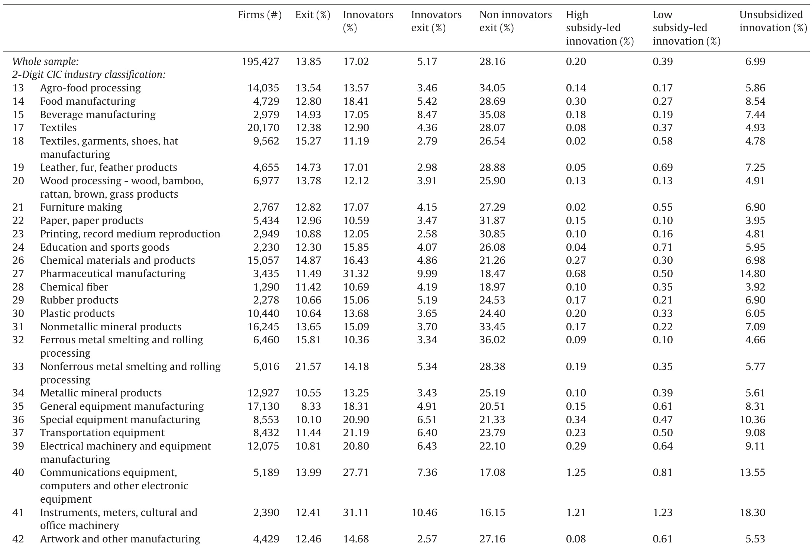
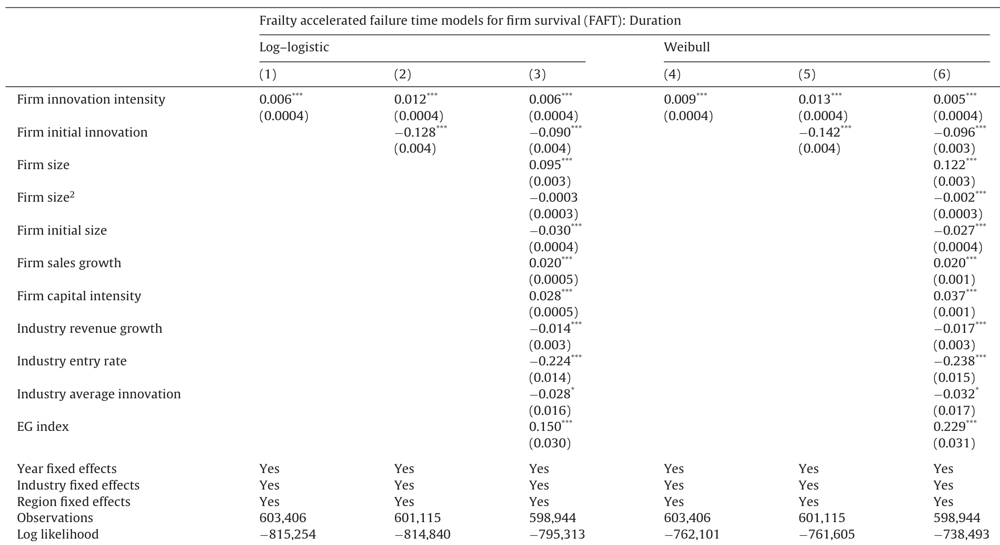
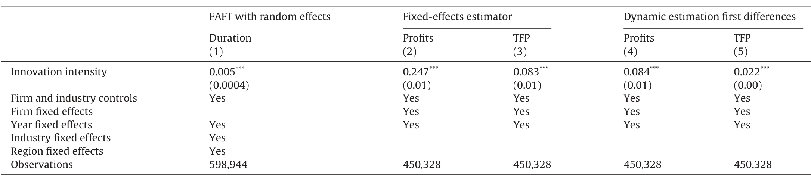
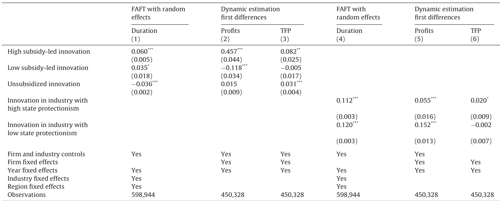
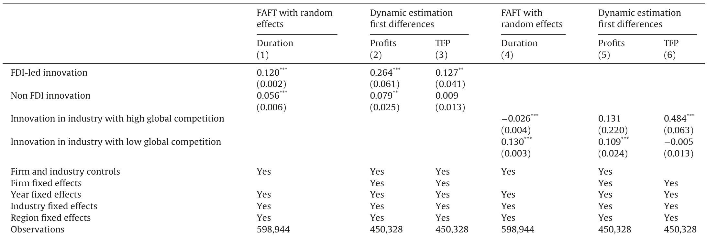
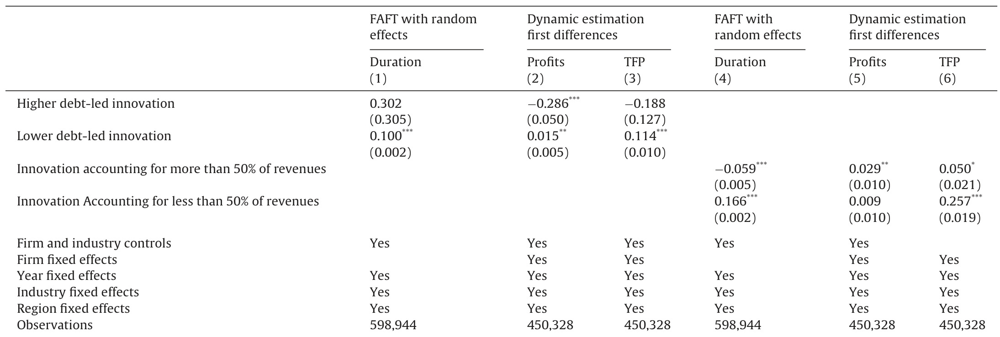
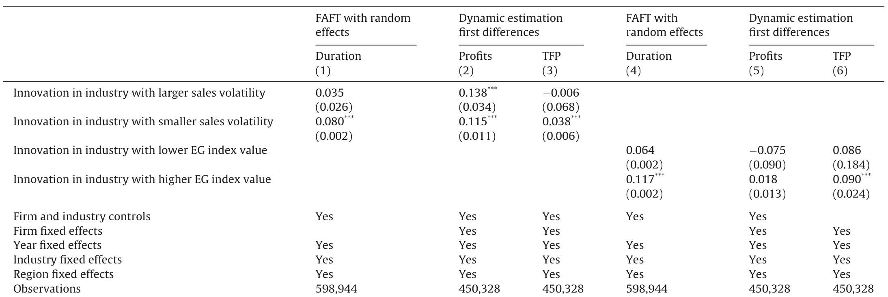
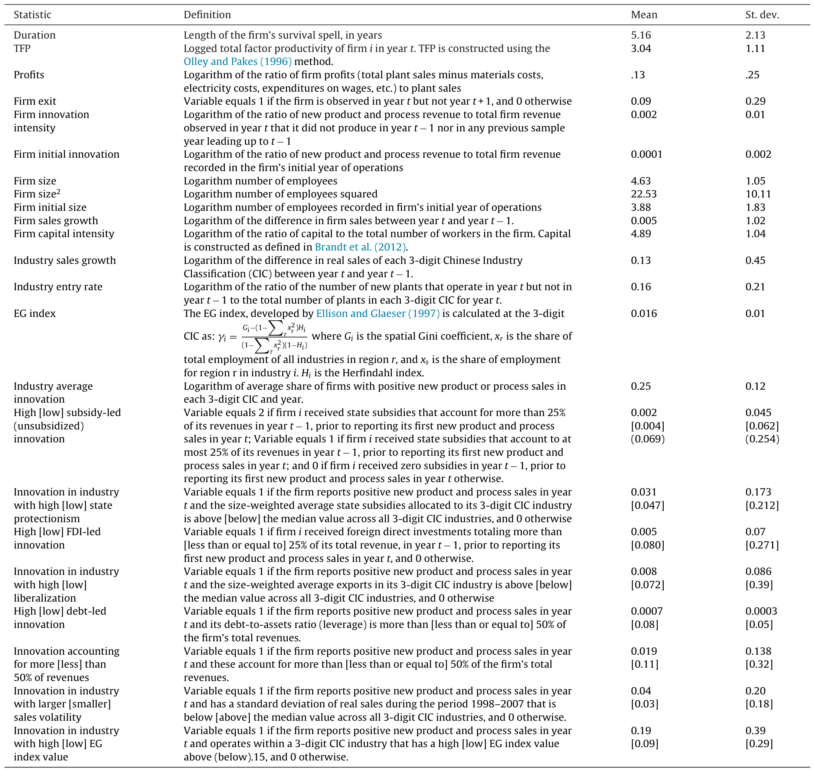

# Indigenous' innovation with heterogeneous risk and new firm survival in a transitioning Chinese economy  

Anthony Howell \*  

School of Economics,PekingUniversity,No.5Yiheyuan Road,Haidian District,Beijing,PRChina  

# ARTICLEINFO  

# ABSTRACT  

Article history:   
Received310ctober 2014   
Received in revised form 12 May 2015   
Accepted 29June 2015   
Available online 11 August 2015   
IEL classification:   
030   
038   
L11   
C1  

Keywords:   
Firm survival   
Innovation   
Heterogeneous risk   
Firm profits   
TFP   
China  

This paper explores how heterogenous risk drives the firm innovation-survival relationship using a large sample of new entrepreneurial firms in China. Results show that innovation increases the probability of survival, although the impact on firm survival is conditioned by the timing of the innovation, the characteristics associated with the innovation strategy, along with the level of risk embodied in the innovation process. Cautious innovators are found to survive longer and contribute to a higher social welfare via gains in firm efficiency. In contrast, risky innovators are less likely to survive, are less efficient, and are only sometimes compensated for their risk in terms of higher profits. Results therefore show that other factors besides higher payoffs force some firms to engage in riskier innovation strategies.  

$\mathcal{C}\,2015$ Elsevier B.V. All rights reserved.  

# 1. Introduction  

Firm entry and exit are important aspects of the evolution of industries (Caves, 1998; Tybout, 2000). In the Schumpeterian tradition, models of industry evolution predict that the process of market selection will penalize firms with a lower‘environmental fit' leading to early exit (Nelson and Winter, 1982). The firm will carry out innovation in an attempt to modify its‘environmental competencies in order to increase its efficiency, capture more market share and survive longer. In models of 'active learning' (Nelson and Winter, 1982; Ericson and Pakes, 1995), a firm will reduce its probability of failure only if it is able to appropriate gains related to the new opportunities created by the innovative search process, otherwise the unproductive investment will increase the probabilitv of failure.  

The firm-learning and industry-dynamic models are all originally developed in advanced market economies in which market entry and exit is determined by economic efficiency. These models assume away the institutional environment, and predict a one-to-one relationshipbetween productivity and survival (Baldwin, 1995). Transitioning economies however, by definition, undergo substantial changes in their political, economic and legal institutions, which present new opportunities and challenges to innovative activitiesnotpresentin advancedmarketeconomies.  

In China, as well as in other transitioning economies, the risk of engaging in innovative activities is comparatively higher than in advanced market economies, due to widespread intellectual property theft, unlawful abrogation of legal contracts and unfair competitive practices, the shortage of venture capital, poor institutional protection, and insufficient market demand (Zhou, 2008). Thepresenceof theseinstitutional barriersincreasethefixed costs associated with innovation. As a result of the poor institutional and legal frameworks, Chinese innovative firms must depend heavily on stateintervention and protectionism in order to survive.  

In general, the impact of innovation on firm survival in transitioning economy contexts is not well-understood. How do certain characteristics - i.e. public subsidies, FDl, global competition - influence the innovation-survival relationship? How do various dimensions of risk - leverage, diversification, market and location - impact the innovation-survival relationship? In an attempt to answer these questions, the current paper explores the innovation-survival relationship using a sample of nearly 2o0,000 new entrepreneurial firms in Chinese manufacturing during the 1998-2007period.  

In addition, the scope of the empirical analysis extends beyond measuring only the innovation-survival relationship. Following Fernandes and Paunov (2014), a dynamic framework is used to estimate the impact of innovation on firm profits and efficiency, respectively. This framework, although far from a rigorous welfare analysis, is capable of discerning between the private returns to innovation and the social returns to innovation that extend beyond the firm.  

The outline of this paper is as follows. The subsequent section gives an overview of the survival literature. Section 3 introduces the hazard model. Section 4 provides information on the data source and variable development. Section 5 presents the empirical results, and Section 6 concludes.  

# 2. Firm innovation and survival: a review  

A number of recent studies focusing on different country contexts has emerged in the literature linking the innovation activities of the firm to its survival. The majority of these studies find that innovation, in general, tends to reduce the risk of business failure (Perez et al., 2004; Cefis and Marsili, 2006, 2011).At the same time, some studies highlight the fact that not all types ofinnovation result in a higher probability of survival (Buddelmeyer et al., 2010; Zhang and Mohnen, 2013; Fernandes and Paunov, 2014).  

Rather, the type of innovation - e.g. product or process, radical or incremental - is found to have important implications on the innovation-survival relationship. Banbury and Mitchell (1995), for instance, find that incremental innovation does not effect firm failure in the U.s. cardiac pacemaker industry. For Australian firms, Buddelmeyer et al. (2010) find that a more radical innovation strategy may increase the risk of firm exit.  

Astebro and Michela (2005) further suggest that firm survival is not only contingent on the type of innovation but also on the innovation strategy, or more precisely, how firms carry out innovation. In other words, the innovation-survival relationship is, at least in part, conditioned by the level of risk embodied in how innovation is carried out by the firm. Offering some support for this view, Zhang and Mohnen (2013) find in their study of Chinese manufacturing firms that R&D and new innovation sales both exhibit an inverted-U relationshipwithlong-term survival.  

In advanced market-based economies, firms pursue more risky innovation strategies in the hopes of receiving a higher payoff. In less developed country contexts,however,riskier innovation does not necessarily result in higher potential rewards. In their study of firm survival in Chile, Fernandes and Paunov (2014) find that risky innovators are only sometimes compensated for their risk in terms of higher payoffs. The authors argue that pursuing a risky innovation strategy is irrational, and suggest that other factors besides higher payoffs force some firms to engage in risky innovation. Such factors that are common in transitioning economies include market failures, information asymmetries, bankruptcy risks and agency conflicts.  

# 3. Model specification  

Hazard analysis describes the probability of survival for a business in a time span t, conditional that it survived up to $t-1$ periods $(\Delta t)$ . and given firm characteristics. The general hazard function represents the probability of failure of a firm during $t+\Delta t$ conditioned on the fact that the firm survives up to the time t. The hazard function is expressed as:  

$$
h(t)=\operatorname*{lim}_{\Delta t\rightarrow0}\frac{P(t<=T<t+\Delta t|T>=t)}{\Delta t}=\frac{f(t)}{1-F(t)}=\frac{f(t)}{S(t)}
$$  

where $f(t)$ is the density function, $F(t)$ is the distribution function and $S(t)$ is the survival function. The survival function is $S(t)\!=\!e x p(-\Lambda(t))$ and $\begin{array}{r}{\Lambda(t)=\int_{0}^{t}h(u)d u}\end{array}$ is the cumulative hazard function.  

A key drawback of the typical hazard models like Cox or discrete-time hazard is that they are subject to the proportionality assumption, which is unlikely to hold true when examining multiple cohorts. One way to deal with this shortcoming is to include a time-scaling factor using accelerated time failure (AFT) models. Using an AFT model relaxes the proportionality assumption and takes into account the fact that the relationship between innovation and survivalvaries over time.One main shortcoming of the conventional AFT approach,however,is that it does not control for unobserved firm heterogeneity. To address this issue, a frailty term is added (referred to as FAFT) to include random effects. In a FAFT model, the survivor function at time t, $S(t|\mathbf x_{i},\boldsymbol\alpha)$ areassumedtobe of the following form  

$$
S(t|\mathbf x_{i},\alpha)=S_{0}\left(\frac{t}{\psi_{i}}\right)
$$  

where $S_{0}(t)$ is the baseline survival model associated with a set of time-varying covariates, $\pmb{x}_{i}$ ,and random effects $\alpha$ .The scaling factor $\psi_{i}$ is expressed as follows,  

$$
\psi_{i}(\mathbf{x}_{i},\alpha)=\exp(\eta_{i})=\exp(w+\beta^{\prime}X_{i})
$$  

where $\alpha=\exp(w)$ is assumed to have a gamma distribution with distribution function $G(\alpha)$ ,and $\eta_{i}$ is the linear component of the model. Thus, conditionally on $\alpha$ , the AFT model is assumed to hold, and the term $\alpha$ represents the frailty term with the mean of the distribution set to the value unitv.  

The model is fit using maximum likelihood. The likelihood function with left-truncated and right-censored observations is given in general form as:  

$$
L=\prod_{i=1}^{g}\int_{0}^{\infty}\left\{\prod_{j=1}^{N}h(T_{i})^{c_{i}}\left(\frac{S(T_{i})}{S(E_{i})}\right)\right\}d G(\alpha)
$$  

where $E_{i}$ takes into account the left truncation, giving the first time a firm enters into the panel; $c_{i}$ takes into account right censoring and take the value of 1 for firms that fail and 0 for firms that are still active at the end of observation time.  

An appropriate underlying distribution must be chosen to estimate the hazard function. The log-logistic distribution provides a good starting place as it has a flexible form that allows for monotonous functional forms, and other shapes as well. The hazard function with a log-logistic distribution is:  

$$
h(t|\mathbf{x}_{i},\alpha)=\frac{\psi_{i}^{1/\lambda}\,t^{(1/\lambda-1)}}{\lambda[1+\left(\psi_{i}\,t\right)^{1/\lambda}]}
$$  

The shape of the function is determined by $\lambda$ .For $\lambda>=1$ ,the functional form is decreasing monotonously and $0<\lambda<1$ has a bellshaped form. To obtain the survival probabilities, the hazard model in Eq. (6) can be equivalently expressed as a log linear model for the random variable $T_{i}$ by writing  

$$
\log(T)=\alpha+\mu+\beta^{\prime}X+\sigma\epsilon
$$  

where $\mu,\sigma$ are unknown location and scale parameters, and $\epsilon$ has a distribution that determines T. Written in this way a positive coefficient represents a longer survival spell.  

# 4. Data and variable development  

This analysis utilizes the Annual Report of Industrial Enterprise Statistics compiled by the State Statistical Bureau of China for the years 1998-2007. Included in the data are all firms with an annual turnover over 5 million Renminbi (approximately $^{\S600,000)}$ ，accountingfor $90\%$ of industrial output in China. An extensive set of firm characteristics are included in the database, including information on firm production, sales revenues, employment, geographic location, industry affiliation, new product or process sales, sources of finance, and so forth.1  

Numerical IDs are assigned to each firm using the firm's name, industry, address, etc. to link firms over time. When possible, firms are tracked as their boundaries or ownership structure change. On occasion, restructuring, merger, or acquisition results in new IDs being assigned to firms. The fraction of firms in a year that can be linked to a firm in the previous year ranges from $84.5\%$ in the years1998-1999upto $92.2\%$ in the final two years (2006-2007). Overall, $95.9\%$ of all year-to-year matches are constructed using firm IDs, and $4.1\%$ using other information on the firm. See Brandt et al.(2012)for further treatment of the data.  

The sample is restricted to new firms where the majority shareholder is designated as a private, non-state-owned entity. The analysis focuses on entrepreneurial firms because their survival is based more on achieving competitive competency in the market, unlike for instance, state-owned enterprises whose survival may rest more on political connections or policy directives than on competitiveness. A clear benefit of focusing on new firms, aside from guiding policy, is that they are less constrained by previous decisions, i.e. past capital installments, that may influence the firm's innovation activities,therebyreducing concerns ofendogeneity.  

# 4.1. Variable development  

# 4.1.1. Performance indicators  

Firm entry, exit and duration are determined based on the firm's unique numerical ID. An important issue to consider is how to properly interpret firm exit, distinguishing financial distress and closure from that of other reasons for firm exit such as merger or acquisition or falling below the minimum sales threshold of $^{\S600,000}$ .Exit in this study is defined as firm closure. This claim is asserted for two reasons.  

First, the panel data was carefully constructed in such a way that, when possible firms received a new firm ID if they go through restructuring, merger or acquisition, thereby reducing the risk that firms exit the survey due to merger or acquisition. Second, due to the measurement procedures of the China Statistical Bureau, the sales threshold barrier is not strictly enforced. Over the time period of analysis, $5\%$ of privately owned firms reported sales below the five million RMB sales threshold.  

The entry year of the firm is identified for the first year, t, that the firm is observed but not in any years prior to t. The exit year of the firm is defined as the last year, t, that the firm reported information but not in the year $t+1$ $t+2,\ldots,2007$ . The duration of a firm is defined by counting the number of years the firm is in operation, excluding its initial year of operation. All firms that entered and exited the survey in the same year are removed from the sample to reduce noise in the data from firms that are likely hovering around the sales threshold.  

In addition to firm duration, profit rates and productivity are also used as proxies to measure firm performance beyond basic survival. The firm's profit rates is calculated as the ratio of firm profits (total plant sales minus materials costs, electricity costs, expenditures on wages, etc.)to plant sales.  

While labor productivity is generally the most widely used measure of firm productivity,it does not take into account capital intensity. This is a key disadvantage, especially, in the case of China where theshareoflabor earningsinGDP accountsforlessthan one half of Chinese manufacturing. Instead, estimates of the firm's total factory productivity (TFP) are obtained following the three-step approach developed in Olley and Pakes (1996). TFP is the difference between the growth rate of output and the weighted average of the input factors'growth rate, and assumes the contribution from technological progress. Before the TFP estimates can be obtained, other variables like value added and the real capital stock must first be developed. The real value added (VA) is constructed by separately deflating output, net of goods purchased for resale and indirect taxes, and material inputs, where the input deflators are calculated using the output deflators and information from China's 2002NationalInput-Output(IO)table.  

Next, the real capital stock for 1998 is developed using the perpetual inventory method, assuming a depreciation rate of $9\%$ and deflating annual investment using the Brandt-Rawski deflator. Following 1998, the observed change in the firm's nominal capital stock at original purchase prices is used as the estimate for the nominal fixed investment using the same rate of depreciation and deflator to roll the real capital stock estimates forward.  

After constructing the firm's VA and real capital stock, the TFP estimates are obtained as follows. In the first step, consider a simple Cobb-Douglas production function:  

$$
y_{i t}=\beta_{0}+\beta_{l}l_{i t}+\beta_{k}k_{i t}+\beta_{a}a_{i t}+u_{i t}
$$  

where $y_{i t}$ is logged value added for firm iin period t. The coefficients $l_{i t},k_{i t}$ and $a_{i t}$ represent the log of labour, capital and age of firm i in year t. $u_{i t}=\Omega_{i t}+\eta_{i t}$ ,where $\Omega_{i t}$ is the productivity shock observed bv the firm's decision makers and $\eta_{i t}$ is the unobserved errors.  

In the second step, the investment equation is inverted nonparametrically to proxy for unobserved productivity that controls for the non-random sample selection that results from differing exit probabilities of small and large low-productivity firms. In many cases this step is problematic due to a high number of zero investments, but in the high-growth Chinese context only $1\%$ offirms suffer from negative real investment. In the third step, TFP estimates are obtained by estimating the non-linear equations using theOLSmethod.  

# 4.1.2. Innovation measure: new product and process sales  

The main variable of interest is the firm's revenue from new product and process sales,whichis used as ameasure ofinnovation output, and is calculated as the ratio of new product and process sales to the firm's total revenue observed in year t. Most existing studies rely on innovation inputs such as R&D spending and patents, or a count variablefornumber of newproducts introduced to the firm. A key disadvantage with these measures of innovation is that they do not account for how successful the firm is at innovation, in terms of bringing the new product or process to market.  

While the innovation proxy used in the current analysis offers some advantages over existing alternatives, it is important to mention one of its limitations is that it does not necessarily serve as a good indicator for the depth of innovation. This limitation does not impede the objectives of the current study since Chinese firms are expected to be carrying out'minor' innovations that are incremental in nature. Studying the process of incremental innovation remains important for transitioning economies, since the cumulative effects of minor innovations are thought to be key drivers of productivity gains (Puga and Trefler, 2010).  

Table 1 reveals that $17\%$ of the almost 200,000 firms successfully introduced new products or processes during the 1998-2006 time period. On average, less than $5\%$ of innovative firms exited the sample compared to more than $28\%$ of non-innovative firms. The innovation rate is highest in the pharmaceuticals industry and lowest in the ferrous metal smelting and rolling processing industries.  

Table1 Descriptive statistics by industry.   

  
Notes: 2-Digit industries are based on the China Industrial Classification (CIC) system. Values are based on averages calculated across the sample period 1998-2006. The variable definitions and summary statistics are provided in the Appendix Table A.1.  

Fig. 1 reveals the regional concentration of innovation among 333 Chinese cities. The figure shows a high level of innovation clustering, especially along the coast in the Yangtze River Delta and the Pearl River Delta, both well known for their high-tech innovation centers. Smaller clusters farther north along the coast can also be spotted in and around Beijing and Tianjin. In contrast, innovation clusters in the interior of the country are noticeably absent.  

Fig. 2 shows the Kaplan-Meier estimator, plotting the grouped survival probabilities separately for innovative and non-innovative firms. The figure reveals that innovative firms have higher survival probabilities for each year of duration. For the 1998 cohort, approximately $75\%$ of innovative firms survived the entire 9-year time span, compared to only $55\%$ of non-innovative firms. It is important to note that the gap in the survival probability increases over time, suggesting that the proportionality assumption is not satisfied. This finding offers some support that AFT modeling is an appropriate estimation strategy.  

# 4.2.Dimensions of innovation risk  

Four dimensions of innovation risk are considered in the empirical analysis. Emanating from the portfolio theory of finance, the first two dimensions of risk include firm's leverage (debt-to-assets ratio) and revenue diversification. While a healthy level of debt can provide innovative firms the necessary liquidity to carry out innovation, becoming over-leveraged puts the firm in danger of default, especially if innovation sales are not sufficient to pay off creditors. Innovative firms that accumulated a debt-to-assets ratioabove[below] $50\%$ prior to introducing a new innovation are classified as high [low] risk debt-led innovators.  

The second dimension is diversification risk. Firms with a higher proportion of its revenue stemming from new product or process sales face increased risk because the ability of new innovations to raise revenues is less certain than those of more established products (Fernandes and Paunov, 2014). Firms are distinguished as having a higher diversification risk versus a lower diversification risk if the proportion of the firm's new innovation sales accounts for more than $50\%$ oftotal revenue.  

The two additional risk dimensions - market risk and location risk - respectively take into account uncertainty operating at the industry and regional level. Market risk arises due to challenges associated with introducing new products or processes into the market. Firms that introduce a new product or process in industries with a higher [lower] sales volatility are exposed to greater [less] risk as the demand for the product may fluctuate widely.  

The location of the firm also influences the amount of risk embodied in the innovation process. Firms that are located in more geographically concentrated areas may benefit from spatial externalities like knowledge spillovers, thereby reducing innovation risk.At the same time, innovative firms in concentrated areas may simultaneously expose themselves to higher risk of failure by co-locating nearby with competing firms in the same industry. It is expected though that this additional risk is eclipsed by the positive externalities. Firms attempting to innovate in more isolated [concentrated] regions are therefore considered to be more [less] risky.  

  
Fig.1. Number of innovative startups,1998-2007.  

  
Fig. 2. Survival probability for firms with positive innovation sales (active) and withoutinnovationsales(inactive),1998-2007.  

# 4.3.Control variables  

The survival of new firms is related to various factors, including firm-specific characteristics, the intensity of market competition, and macroeconomic conditions. In line with the literature, the following firm level controls are included: current size and its square, initial size at which the firm started operations, and time-varying sales growth and capital intensity. The following time-varying industry and region controls are also included: industry sales growth, industry entry rate, a proxy for spatial agglomeration as measured by the Ellison & Glaeser (EG) index (Ellison and Glaeser,  

1997),2 industry average innovation and industry average subsidies.  

Controlling for firm size and size squared addresses nonlinearities in the survival-size relationship, while including initial firm size takes into account the initial conditions of the firm, which tend to have persistent effects on firm survival (Mata and Portugal, 1994; Ger0ski et al.,2010).  

The firm's sales growth is included to avoid capturing the 'desperate innovator effects - poor performing firms that switch products as a desperate measure to avoid imminent closure. This control is especially important in this study of risk on the innovation-survival relationship (Fernandes and Paunov, 2014). Controlling for capital intensity ensures that the effects of product innovation are not being picked up by capital accumulation related to process innovation.  

# 5. Results on the effects of innovation on firm survival  

Table 2 reveals the estimates from the baseline FAFT models with random effects.3 Columns (1)-(3) report results using the log-logistic distribution while Columns (4)-(6) report results from the weibull distribution. Consistent with the existing literature, the 2 The EG index can be written as $\gamma_{i}=G_{i}-(1-\sum_{r}x_{r}^{2})H_{i}/(1-\sum_{r}x_{r}^{2})(1-H_{i}),$ where $G_{i}=\sum(x_{r}-x_{i})^{2}$ represents the spatial Gini coeffcient, $x_{r}$ is the share of total employment of all industries in city $r,$ and $x_{i}$ is the share of employment for city $r$ in industry i, and $H_{i}$ is the Herfindahl index.  

3 To add random effects, it is assumed that those effects are orthogonal to firm characteristics, a condition not easily satisfied for non experimental data. Alternative model specifications thatare more flexible than theFAFT-e.g.linear exit probability model, logit, and discrete-time hazard models - were also estimated as robustness checks to account for unobserved heterogeneity.All robustness checks confirm original findings irrespective of the model estimation strategy.  

Table 2 Results for innovation and firm survival.   

  
Notes: $^{***}p\,{<}\,0.001$ $\ddot{\boldsymbol{p}}\!<\!0.01$ $\dot{\boldsymbol{p}}<0.05.$ .t statistics in parentheses. Robust standard errors were used obtaining these t statistics. The accelerated failure time models take into account right censoring,left truncation and do not asumethe proportionality assumption - they have atime-scaling factor that increases (decreases the probability of failure when the value is greater (lesser) than 1. Columns (1)-(3) are estimated using the log-log distribution and Columns (4)-(6) are estimated using the Weibull distribution. The dependent variable is the duration period of the firm. The coeficients are presented as survival probabilities and represent the conditional probability of competing a survival spell. The variable definitions and summary statistics are provided in the Appendix Table A.1.  

coefficient on innovation is positive and statistically significant at the .001 confidence level in all six models. Since the log likelihood values suggest that the weibull model provides the best fit to the data, the remaining discussion will be confined to Columns (4)-(6).  

Column (4) shows that a one percentage increase in innovation intensity increases the probability of firm survival by a factor of 1.06.4 Coinciding with previous findings (Mata and Portugal, 1994; Geroski et al., 2010), column (5) shows a negative and statistically significant coefficient on the firm's initial innovation intensity.  

One interpretation of this finding is that attempting to introduce a new product or process in the same year that the firm enters the market are unsure of the market needs due to their lack of prior production experience. As a result, the resources utilized to carry out the innovativesearch will tend tobe less efficiently allocated, thereby increasing the firm's survival risk. Note that the increase in the size of the coefficient on current innovation intensity doubles in size from 0.06 to 0.12.This finding indicates that of the firms that innovate in their initial year and are able to survive, their returns on subsequent investments will be higher as a result of the extra vear of innovation experience.  

Column (6) adds firm and industry controls to the model. In general, findings reflect results from existing studies (Dunne et al., 1989; Disney et al., 2003; Fernandes and Paunov, 2014). Larger firms tend to have a higher probability of survival, although the size effect is non-linear. More capital intensive firms tend to survive longer. Regarding the industry controls, firms have a higher probability of survival in industries with low sales growth, low entry rates and a higher EG index, respectively. Firms located within industries that have a higher industry average innovation are less likely to survive, an indication that the conditions in faster-paced industries are more unstable and may create higher turnover (Audretsch, 1991).  

# 5.1. Comparing the effects of innovation on firm survival to profitsand productivity  

The effects of innovation extend beyond influencing survival, and are expected to also affect both the profits and the productivity of the firm. Table 3 estimates the effect of innovation on firm profits and productivity, respectively, using a fixed effect (FE) panel estimator as well as a dynamic panel model estimated in first differences.5 The dynamic panel model takes into account possible dynamics and is estimated using the instrumental variables estimation method developed bv Anderson and Hsiao (1982).  

Column (1) re-reports the firm survival results from Table 2 above. Columns (2)-(5) show the results from the FE and dynamic analysis on firm profits and productivity, respectively. In each column, the findings reveal that the coefficient on innovation is positive and statistically significant for both firm profits and productivity. The positive increase in profits reflect the private gains from innovation, i.e. the ability of the firm to capture innovation rents, whereas the positive increase in productivity reflects efficiency gains that extend beyond the firm and are expected to benefit society (Fernandes and Paunov, 2014).  

Table3 Comparing the effects of innovation on firm survival to profits and productivity.   

  
Notes: $^{**}p\!<\!0.001$ $\ddot{\textit{p}}{<}0.01$ $\dot{\boldsymbol{p}}<0.05$ . t statistics in parentheses. Robust standard errors were used obtaining these t statistics. Column (1) report the results from the FAFT model. Columns (2)-(3) report the results from the fixed effects panel data estimator for firm profits and TFP, respectively. Columns (4)-(5) report the results from the dynamic estimations using first differences for firm profits and TFP, respectively. The Anderson-Hsiao specifications are valid as indicated by the Anderson canon. corr. LM statistic for underidentification and the Cragg-Donald Wald F statistic test for weak identification test. All models include the full set of firm and industry controls from Table 2. Columns (2)-(5) include an additional dummy variable for firm exit to account for possible attrition effects. All variable definitions and summary statistics are provided in the AppendixTable A.1.  

Table4 Moderating effects of State-Intervention on Innovation and Firm Survival, Profits and Productivity   

  
Notes: $^{***}p\!<\!0.001$ $\ddot{\textit{p}}{<}0.01$ $\dot{\l}_{p}<0.05.\,t$ statistics in parentheses. Robust standard errors were used obtaining these t statistics. Columns (1) and (4) report the results from the FAFT model. Columns (2)(3) and (5)-(6)report the results from the dynamic estimations using frst differences for frm profits and TFP, respectively. The Anderson-Hsiao specifications are valid as indicated by the Anderson canon. corr. LM statistic for underidentification and the Cragg-Donald Wald F statistic test for weak identification test. All models include the full set of firm and industry controls from Table 2. The dynamic models also include an additional dummy variable for firm exit to account for posble attrtion effects. All variable definitions and summary statistics are provided in the Appendix Table A.1.  

# 5.2. Results on the effects of innovation with Chinese characteristics on firm survival, profits and productivity  

Tables 4 and 5 show how several main innovation characteristics influence firm survival, profits, and productivity, respectively. Columns (1)-(3) in Table 4 reveal the role of state-led innovation, i.e. firms that became innovators after receiving production subsidies, on firm survival, productivity and profits. Innovative firms that initially received comparatively more subsidies are associated with a longer survival spell, higher profits, and larger productivity gains compared to their less subsidized and unsubsidized counterparts. Based on a t-test( $p$ value ${<}0.05\$ ), the coefficients are statistically different from one another6. Innovative firms whoinitially received fewer subsidies increase their survival chances relative to unsubsidized innovators, but tend to be less profitable and less efficient.  

Columns (4)-(6) show the returns to innovation in industries that are more (less) protected by the state. Firms that carry out innovation in industries that are less protected by the state are associated with higher profits, but lower efficiency, and tend to survive as long as innovative firms in more protected industries. The results from the t-test( $\boldsymbol{p}$ -value $=0.243$ )，however,showthat the coefficients are not statistically different for innovator firms in moreversuslessprotectedindustries.  

While previous empirical findings from within China suggest that state-subsidized innovation leads to positive results (Guan et al., 2009), in theory, firms with unfettered access to state finance areinsulatedfrom outside competition, and are thereby deprived of the incentives to be efficient innovators. As it turns out, both the empiricalfindings and theoretical expectationsmaybe too simple, failing to take into account the complex, non-linear relationship between state support programs and innovation.  

Table5 Moderating effects of China's opening-up strategy on innovation and firm survival, profits and productivity.   

  
Notes: $^{***}p\,{<}\,0.001$ $\ddot{\boldsymbol{p}}\!<\!0.01$ $\^{*}p<0.05.$ t statistics in parentheses. Robust standard errors were used obtaining these t statistics. Columns (1) and (4) report the results from the FAFT model. Columns (2)(3) and (5)-(6) report the results from the dynamic estimations using first differences for frm profits and TFP, respectively. The Anderson-Hsiao specifications are valid as indicated by the Anderson canon. corr. LM statistic for underidentification and the Cragg-Donald Wald F statistic test for weak identification test. All models include the full set of firm and industry controls from Table 2. The dynamic models also include an additional dummy variable for firm exit to acount for posible attrition effects. All variable definitions and summary statistics are provided in the Appendix Table A.1.  

Table6 Moderating effects of firm-level risk on innovation and firm survival, profits and productivity   

  
Notes: $^{***}p\,{<}\,0.001$ $\ddot{\boldsymbol{p}}\!<\!0.01$ $\^{*}p<0.05.$ t statistics in parentheses. Robust standard errors were used obtaining these t statistics. Columns(1) and (4) report the results from the FAFT model. Columns (2)(3) and (5)-(6) report the results from the dynamic estimations using frst diffrences forfrm profits and TFP, respectively.The Anderson-Hsiao specifications are valid as indicated by the Anderson canon. corr. LM statistic for underidentification and the Cragg-Donald Wald F statistic test for weak identification test. All models include the full set of firm and industry controls from Table 2. The dynamic models also include an additional dummy variable for firm exit to account for possible attrition effects. ll variable definitions and summary statistics are provided in the Appendix Table A.1.  

Table 5 reveals how China's opening up strategy moderates firm survival, profits and productivity, respectively. In Columns (1)-(3), firms that carry out innovation after attracting FDI tend to survive longer, earn higher profits and enjoy higher efficiency gains compared to firms that carried out innovation without FDI.  

In spite of claims that Chinese firms are over-reliant on FDI (Young and Lan, 1997), the findings here suggest that expanding access to FDI increases both the social welfare via firm efficiency gains, as well as the private benefits accrued to the firm via higher profits. This finding coincides with the assertions in Nahm and Steinfeld (2014), who argue that access to foreign capital enables  

Chinese firms to re-create new products at a cheaper cost and in a more efficient manner.  

In Columns (4)-(6), firms that introduce new innovations in more globally competitive industries are less likely to survive and are less profitable, but enjoy higher efficiency gains relative to their counterpart firms in less globally competitive industries. One interpretation of this finding is that the higher exposure to global competition erodes away the private gains from innovation, although that same competition drives firms to become more efficient innovators.  

# 5.3.Results on the effects of innovation with heterogeneous risk on firm survival, profits and productivity  

Table 6 presents the results on the two firm-level dimensions of risk. In Columns (1)-(3), firms that accumulated higher levels of debt prior to innovation experience a higher risk of failure, are less profitable and are less efficient relative to firms with lower debt levels. The results indicate that over-leveraged firms fail to be compensated in spite of taking on higher survival risk. The negative and statistically significant coefficient in Column (3) further reveals that more risky, i.e. higher debt-led, innovators experience a loss in efficiency.  

Table7 Moderating effects of environmental risk on innovation and firm survival, profits and productivity.   

  
Notes: $^{***}p\!<\!0.001$ $\ddot{\boldsymbol{p}}<\boldsymbol{0}.01$ $\dot{p}<0.05.\,\i$ statistics in parentheses. Robust standard erors were used obtaining theset statistics. Columns (1) and (4) report the results from the FAFT model. Columns (2)-(3) and (5)-(6) report the results from the dynamic estimations using first differences for firm profits and TFP, respectively. The Anderson-Hsiao specifications are valid as indicated by the Anderson canon. corr. LM statistic for underidentification and the Cragg-Donald Wald F statistic test for weak identification test All models include the full set of frm and industry controls from Table 2. The dynamic models also include an additional dummy variable for firm exit to account for possible attrition effects. All variable definitions and summary statistics are provided in the Appendix Table A.1.  

In Columns (4)-(6), innovative firms that have higher diversification risk, i.e. innovation sales that account for more than $50\%$ of firm revenues, are less likely to survive relative to their counterpart firms with lower diversification risk. This result confirms the finding in Zhang and Mohnen (2013). More diversification risk tends to generate higher profits, but come at the expense of efficiency. Innovative firms with higher diversification risk are therefore,found to be only partially compensated for their higher survival risk. The positive and statistically significant coefficient in Column (6), on the other hand,reveals that innovativefirms withlower diversification risk enjoy a larger efficiency gain.  

Table 7 presents the results on the market and regional dimensions of risk. In Columns (1)-(3), firms that innovate in industries with more market volatility are less likely to survive and are less efficient, but are as profitable as firms that innovate in industries with less market volatility.7 The positive and statistically significant coefficient in Column (3) further indicates that innovation carried out in less volatile industries improves firm efficiency. In Columns (4)-(6), firms that innovate in more isolated regions, i.e. regions with a lower EG index, are less likely to survive, are less profitable, and are less efficient than spatially concentrated firms.  

# 6. Conclusion  

Innovation risk is higher in China compared to more advanced market economies, posing significant barriers to innovation. At the same time, state support and access to foreign capital present new opportunities that may help to mitigate certain risk factors, thereby facilitating the innovation process. Throughout this paper, I explored how the presence of these opportunities as well as certain risk factors moderate the effects of indigenous innovation on firm survival and subsequent performance.  

Based on the partial welfare analysis,the results suggest that more cautious innovators increase their chances of survival and contribute more to social welfare via larger gains in firm efficiency. In contrast, more risky innovators are less likely to survive, are less efficient, and are only sometimes compensated for their risk in terms of higher profits. A similar relationship between innovation risk and firm performance is also found in the case of Chile (Fernandes and Paunov, 2014), providing some confirmation that factors other than higher payoffs force some firms in transitioning economies to engage in riskierinnovationstrategies.Common factors include market failures, asymmetric information, bankruptcy risks and agency conflicts.  

Policy interventions are therefore necessary to help correct such market failures and other distortions that arise during economic transition in order to minimize innovation risk and promote a higher social welfare. The analysis shows, however, that the effects of public subsidies on survival and subsequent performance of innovative firms are complex and non-linear.  

State-led innovators, for instance, are associated with higher rates of survival, higher profits, and larger efficiency gains, but only for innovative firms who initially received comparatively larger amounts of public subsidies. In contrast, innovative firms who initially received fewer subsidies ended up becoming less profitable and less efficient than their unsubsidized counterparts.  

It is important to note that these findings are intended only to reveal the potential difficulties that can arise in transitioning economies as policy makers attempt to mitigate market failures and other undesirable factors in the economy. Future research is ultimately required to more closely examine the causal impacts of public programs that aim to encourage the type of innovation that is beneficial to both the firm and to society at large.  

# Acknowledgements  

The author would like tothank the School of Economics at Peking University for funding support during the preparation of this manuscript. The author benefited from comments and other forms of assistance from the editor, Maryann Feldman, two anonymous referees, Canfei He, Yang Rudai, Cindy Fan, David Rigby, Don  

Lien, and participants at the Chinese Economy: Past, Current, and Future Conference hosted by Tsinghua University. All errors and omissions are the responsibility of the author.  

# Appendix A.  

See Table A.1.  

TableA.1 Variable definitions and summary statistics.   

  

# References  

Anderson, T., Hsiao, C., 1982. Formulation and estimation of dynamic models using panel data. J. Econom. 18, 47-82.   
Astebro, T., Michela,J.L.,2o05. Predictors of the survival of innovations.J. Prod. Innov. Manage.22,322-335.   
Audretsch, D., 1991. New-firm survival and the technical regime. Rev. Econ. Stat. 72, 441-450.   
Baldwin, J.R., 1995. The Dynamics of Industrial Competition: A North American Perspective. Cambridge University Press, Cambridge, MA.   
Banbury, C., Mitchell, W., 1995. The effects of introducing important incremental innovation on market share and business survival. Strateg. Manage. J. 16, 161-182.   
Brandt, L., Van Viesebroeck, J., Schott, P.,2012. Creative accounting or creative destruction? Firm-level productivity growth in Chinese manufacturing. J. Dev. Econ.2,339-351.   
Buddelmeyer, H., Jensen, P.H., Webster, E., 2010. Innovation and the determinants of company survival. Oxf. Econ. Pap. 62, 261-285.   
Caves, R., 1998. Industrial organization and new findings on the turnover and mobility of firms.J. Econ. Lit.36,1947-1982.   
Cefis, E., Marsili, O., 2006. Survivor: the role of innovation in firms' survival. Res. Policy 35, 626-641.   
Cefis, E., Marsili, O., 2011. Born to flip. Exit decisions of entrepreneurial firms in high-tech and low-tech industries. J. Evol. Econ. 21, 473-498.   
Disney, R., Haskel, J., Heden, Y., 2003. Entry, exit and establishment survival in U.K. manufacturing. J. Ind. Econ. 51, 91-112.   
Dunne, T., Roberts, M.J., Samuelson, L., 1989. The growth and failure of U.S. manufacturing plants. Q. J. Econ. 104, 671.   
Ellison, G., Glaeser, E.L., 1997. Geographic concentration in U.S. manufacturing industries: a dartboard approach. J. Polit. Econ. 105, 889-927.   
Ericson, R., Pakes, A., 1995. Markov-perfect industry dynamics: a framework for empirical work. Rev. Econ. Stud. 62, 53.   
Fernandes, A.M., Paunov, C., 2014. The risks of innovation: are innovating firms less likely to die? Rev. Econ. Stat., 1-58 (Online View).   
Geroski, P.A., Mata, P., Portugal, P., 2010. Founding conditions and the survival of new firms. Strateg. Manage. J. 31, 510-529.   
Guan, C.J., Yam, R.C., Tang, E.P., Lau, A.K., 2009. Innovation strategy and performance during economic transition: evidences in Beijing, China. Res. Policy 38, 802-812.   
Mata, J., Portugal, P., 1994. Life duration of new firms. J. Ind. Econ. 42, 227-245.   
Nahm, J., Steinfeld, E.S., 2014. Scale-up nation: China 's specialization in innovative manufacturing.World Dev.54, 288-300.   
Nelson, R., Winter, S., 1982. An evolutionary theory of economic change. Harvard University Press, Cambridge, MA.   
Olley, G.S., Pakes,A.,1996. The dynamics of productivity in the telecommunication equipment industry. Econometrica 64, 1263-1297.   
Perez, S.E., Llopis, A.S., Sanchis Llopis, J.A., 2004. The determinants of survival of Spanish manufacturing firms. Rev. Ind. Organ. 25, 251-273.   
Puga, D., Trefler, D., 2010. Wake up and smell the ginseng: International trade and the rise ofincremental innovation in low-wage countries.J. Dev. Econ. 91, 64-76.   
Tybout,J, 20oo. Manufacturing firms in developing countries: how well do they do, and why? J. Econ. Lit.38 (11),44.   
Young, S., Lan, P., 1997. Technology transfer to China through foreign direct investment. Reg. Stud. 31, 669-679.   
Zhang, M., Mohnen, P., 2013. Innovation and survival of new firms in Chinese manufacturing, 2000-2006. In: United Nations University, Maastricht Economic and Social Research and Training Centre on Innovation and Technology Working Paper. No. 57.   
Zhou, Y., 2008. The Inside Story of China's High-tech Industry: Making Silicon Valley in Beijing. Rowman & Littlefield, Lanham, MA.  