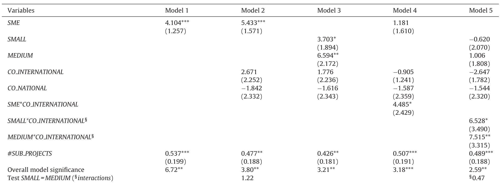

# (International) R&D collaboration and SMEs: The effectiveness of targeted public R&D support schemes  

Hanna Hottenrotta,b,c,1 , Cindy Lopes-Bentob,c,d,\* aDisseldorf Institute for Competition Economics(DICE),Germany bK.U.Leuven,Department of Managerial Economics, Strategy and Innovation,Leuven,Belgium Centre for European EconomicResearch(ZEW),Mannheim,Germany d University of Zurich, Zurich, Switzerland  

# ARTICLEINFO  

Article history:   
Received 21 February 2013   
Received in revised form   
27 November 2013   
Accepted 12 January 2014   
Available online 21 February 2014  

# ABSTRACT  

# IEL classification:  

C14   
C30   
H23   
031   
038  

Keywords:   
Public innovation policy   
Subsidies   
R&D   
SMEs   
International collaboration   
Treatment effects  

This study analyses the impact and effectiveness of targeted public support for R&D investment at the firm level. We test whether the policy design aiming at incentivizing (international) collaboration and R&D in SMEs achieves input as well as output additionality. Our results show that the targeted public subsidies trigger R&D spending, especially so in internationally collaborating SMEs. We further evaluate the different impact of privately financed and publicly induced R&D investment on innovation performance. The results confirm that the publicly induced R&D is productive as it translates into marketable product innovations. While both types of R&D investments trigger significant output effects, the effect of policy-induced R&D investment on sales from market novelties is highest for international collaborators aswellasforSMEs.  

$\circledcirc$ 2014 Elsevier B.V. All rights reserved.  

# 1. Introduction  

It is today widely acknowledged that private sector firms' investment in research and development (R&D) plays a crucial role, not only for the discovery of new technologies, but also for their diffusion. Market failures, however, impede firms from investing the socially optimal amount in R&D, so that the private level of R&D-investment tends to be lower than socially desirable (Nelson, 1959; Arrow, 1962; Bloom et al., 2010). Consequently, public policies are designed such as to reduce the cost of private  

R&D in order to incentivize firms to pursue socially valuable R&D projects thatwouldnotbecarried out otherwise.  

The present study is concerned with one specific public policy, namely direct financial support for R&D. While the effectiveness of such R&D subsidies has been studied at length before, the following analysis goes beyond the questions that are commonly raised in this stream of literature. Whereas most studies are primarily concerned with whether a subsidy has a positive effect on input and/or output additionality,2 our analysis evaluates firstly how the treatment effect is affected by specific policy features that aim to target particular recipient firms. By pursuing targeted R&D support schemes governments aim to address those firms that have the highest crowding-in potential, thereby reducing the likelihood that public money is wasted. However, the ex-post effectiveness of the design is not obvious ex-ante. Moreover, we analyze if the targeted innovation policy design fosters innovation performance in the recipient firms, that is, whether the publicly induced part of the R&D investment translates subsequently into product market innovations. In particular, we study the case of the innovation policy in place in Flanders (to be explained in detail in the following section), the northern part of Belgium. This policy distinguishes itself from other policies in that it incorporates special features for small- and medium-sized firms (SMEs) and for firms that engage in (international) R&D collaboration.  

Our results indeed suggest higher input additionality for SMEs and, in particular for internationally collaborating SMEs. Moreover, distinguishing between the privately financed and the publicly induced part of R&D investment, our findings point to significantly higher output additionality for internationally collaborating firms as compared to nationally collaborating firms or non-collaborators as well as for SMEs compared to large-sized firms. In other words, the results show that the subsidy-triggered R&D expenditures do indeed lead to product market innovations, especially so in the targeted groups.  

The article proceeds as follows. Section 2 illustrates the Flemish policy design as well our research question. Section 3 briefly reviews related literature. The empirical research strategy will be described in Section 4. Section 5 presents the data, Section 6 discusses the results and Section 7 concludes.  

# 2. Our research question in light of Flemish innovation policies  

The general feature of the subsidy scheme of the agency for Innovation by Science and Technology in Flanders/Agentschap voor Innovatie door Wetenschap en Technologie in Vlaanderen(IWT),is its bottom-up character: it is a permanently open and non-thematic scheme. In other words, any firm can submit an R&D project at any time of the year.? Upon evaluation, the firm will get informed about whether or not the proposed project has been accredited for public support. The subsidies are granted as matching grants, that is, the firm can apply with a specific project and in case of a successful refereeing process the government covers a certain share of the proposed totalproject cost,usuallybetween30 and $50\%$  

In Flanders, the government spent 628 million euros for a total of 3019 projects between 2002 and 2008. The policies in place in Flanders during that time period comprise special features targeting SMEs as well as collaborating firms. The percentage to be borne by the government will depend on these features. To support small and medium-sized firms in conducting R&D projects, the government covers a higher share of their total R&D project costs. That is, SMEs receive an additional $10\%$ of their total R&D project costs. Likewise, in order to encourage firms to collaborate, an additional $10\%$ of the total project costs can be obtained if the firm collaborates with one or more partners for its R&D activities. This amount is again linked to firm size: If a firm qualifies as an SME,it receives a $10\%$ top-up for national or international collaboration. If a firm qualifies as large-sized firm, it receives the additional $10\%$ if at least one of its partners is an SME or an international partner.4 The rationale of the former element of the current R&D policy is based on the argument that SMEs are more often financially constrained than larger firms (see for instance Czarnitzki and  

Hottenrott, 2011). Yet, SMEs do contribute considerably to knowledge creation and technological progress as younger, smaller firms tend to engage in more basic and radical innovation projects (see e.g. Henderson and Clark, 1990; Henderson, 1993; Schneider and Veugelers, 2010; Haltiwanger et al., 2010). Furthermore, SMEs are an important source of job creation as they constitute the majority of firms in Flanders. Being aware of these aspects, the Flemish funding agency grants a higher subsidy to SMEs in order to incentivize them to become active in R&D or to enable them to pursue R&D proiects at the desired level and scope.  

The rationale of the second policy element, i.e. granting higher subsidies to collaborating firms in order to increase incentives for such collaborations, is based on well-known arguments that stress the value of collaborations not only for triggering additional R&D spending, but also for enhancing R&D productivity (e.g. Van Leeuwen, 2002; Janz et al., 2004; Sakakibara, 1997; Hagedoorn and Narula, 1996; Hagedoorn, 2002; Belderbos et al., 2004; Cassiman and Veugelers,2002, 2005). In the case of Flanders,the benefits from collaboration, and in particular of the cross-border type, may be particularly pronounced as in a small country thepool of knowledge a firm can dig in on national territory is usually limited. Firms may thus benefit from the larger pool of knowledge provided by international collaboration partners that facilitate spillovers from a richer pool of other R&D-active firms (Griliches, 1995). Moreover, international R&D collaboration promises additional gains through direct access to knowledge that is relevant for foreign markets. While off-shoring of own R&D abroad may be costly and subject to a liability of foreigners (Sofka and Schmidt, 2009), collaborating with partner firms that are already active in the target markets may therefore constitute a more cost-efficientway of doingR&D internationally. International collaboration may thus be particularly beneficial for firms active in global markets and firms that are "lonely riders" in their domestic markets. Moreover, SMEs may find collaborations to be an appealing strategy for the internationalization of their (R&D) activities.  

One concern with such grant-based direct support for R&D is of course that firms could substitute private investment with public money. Put differently, instead of topping-up the public support by the amount foreseen by the policy, they may top it up by less, respectively not at all. Likewise, firms may use the public money to finance a project that they planned to do anyways. In that situation, no additional R&D spending takes place. In this case we would face partial crowding-out (respectively full crowding-out).5 By designing R&D support schemes in a way to best target firms with the highest crowding-in potential, governments aim at reducing the likelihood that public money is wasted. However, the ex-post effectiveness of the design is not obvious ex-ante.  

In order to gain some novel insights on the ex-post effectiveness,we estimate in a first step whether we find evidence on input additionality. In a second step, we estimate whether the additional R&D induced by the public policy - controlling for other performance drivers - leads to higher innovation performance. Indeed, even if we were to find positive treatment effects and significant effects of specific policy features, it is a priori not clear whether the undertaken projects induced by public support only have an impact on input additionality or whether they also impact output additionality, as measured for instance by product innovations. Project evaluation byfunding agencies is generally notonly concerned with the financial criteria of a submitted project, but also the social and economic return for the region (Larosse, 2004). In other words, the government also finances, or even favors, projects of more radical or basic research nature, generally linked to higher risks and financial constraints. If such policy is efficient, the likelihood of the selected projects toresult in product innovations that can belabeled asmarket novelties should be quite high, given that the latter are generally driven by more radical R&D as opposed to incremental innovations resulting more often in products that are new to the firm, but not to the market. In this case, one could expect to see a positive significant effect of induced R&D investment on firms' sales from market novelties. On the other hand, however, it is not obvious to which extent the risk of failure might be higher when undertaking riskier or more basic projects. In other words, if the government were to finance too many too risky projects or R&D that is too far from the market, one would not find a positive impact of publicly induced R&D on market novelties,even if there is evidence ofadditional R&D triggered by the subsidy. Given these opposing arguments, it is not clear a priori what to expect with respect to the output additionality effect of the innovation policy in place.  

# 3. Related literature  

The impact of public policies on firms' innovative behavior has attractedalotofinterestintheliteratureandmoststudiesfind evidence for crowding-in effects. Studies tackling this research question used different types of estimation methods to take the endogeneity of receiving a subsidy into account, but with the exception of(Wallsten, 2000) who find dollar per dollar crowding-out, all conclude that direct subsidies stimulate private R&D funding irrespective of the used method (see Czarnitzki and Lopes-Bento, 2013 for a recent review). This is also the case in previous studies for Flanders by Aerts and Czarnitzki (2006), Aerts and Schmidt (2008) or Czarnitzki and Lopes-Bento(2012,2013)who find that public support stimulates private R&D investment. While these studies focus on additionality at the firm level, other studies have been interested in the expected welfare effects of targeted R&D grants. Takalo et al. (2013), for instance, use structural modeling to model the grant application and R&D investment decisions of the firms as well as the funding decision of the government agency. They find that the social rate of return on targeted subsidies is 30 to $50\%$ strongly suggesting that the benefits exceed the opportunity cost of public funds.  

A separate stream of research has expressed an increased interest in the impact of collaboration on innovation performance. Empirical findings generally confirm the expected positive relationship between R&D collaboration on innovation performance (Van Leeuwen, 2002; Janz et al.,2004; Sakakibara, 1997; Hagedoorn and Narula, 1996; Hagedoorn, 2002; Belderbos et al., 2004; Cassiman and Veugelers, 2002, 2005).  

SubsidizedcollaborativeR&Dhasreceived less attentionin the empirical literature so far. Exceptions are Sakakibara (2001) and Branstetter and Sakakibara (2002) who analyzed Japanese government-sponsored R&D consortia. Both studies found evidence that participating firms have higher R&D expenditures as well as more patents. Further, Czarnitzki et al. (2007) apply a matching estimator in a multiple treatment setting, analyze the effects of R&D collaboration and public R&D funding on R&D per sales and patent outcomes for Germany and Finland and find that collaboration has positive effects. Likewise, only a few studies have distinguished the productivity effects of privately respectively publicly funded R&D. To the best of our knowledge, even though Madsen et al. (2008) suggest that input and output additionality are interrelated, the only exceptions are Czarnitzki and Hussinger (2004) and Czarnitzki and Licht (2006) who find a positive impact of publicly induced R&D investment on German firms' patent activity and Hussinger (2008) who analyses the effects on new product sales for German firms. The present study is thus not only among the first to combine evaluation studies with insights from research on collaborative R&D, but also the first to study multiple-target innovation policy features in terms of input and output additionality.  

# 4. Estimation strategy  

# 4.1. Treatment effects analysis  

The aim of the first part of the following analysis is to estimate the treatment effect of a subsidy on an outcome variable of interest. In other words, we want to know if, and to which extent, the subsidy impacts R&D investment. In order to do so, we test for the effect of the subsidy receipt on the firms' internal R&D spending by conducting a treatment analysis.  

Econometric evaluation techniques have been developed to addresstheestimationof treatmenteffectswhentheavailable observations on individuals or firms are subject to a potential selection bias (see Heckman et al.,1999; Imbens and Wooldridge, 2009, for surveys). This typically occurs when participants of a public policy measure differ from non-participants in important characteristics. In the following we use propensity score matching, which has the advantage over selection models not to need assumptions about functional forms and error term distributions.6 In other words, based on the probability of receiving a treatment (obtained from a probit regression) conditional on a set of observable characteristics X, the propensity score is an index function summarizing in a single number (the score) the wide set of observable characteristics affecting the probability of receiving a treatment (i.e. a subsidy by the Flemish government). Matching on the propensity score has the advantage not to run into the“curse of dimensionality" since we use only one single index as matching argument (see Rosenbaum and Rubin.1983).  

The fundamental evaluation question can be illustrated by an equation describing the average treatment effect on the treated firms:  

$$
\alpha^{T T}=\frac{1}{N^{T}}\sum_{t=1}^{N^{T}}(R\&D_{i}^{T}-\widehat{R\&D_{i}^{C}})
$$  

where $R\&D_{i}^{T}$ indicates the expenditure of treated firms and $\widehat{R\&D_{i}^{C}}$ the counterfactual situation, i.e. the potential outcome which would have been realized if the treatment group $(S\!=\!1)$ had not been treated. In other words, for the untreated firms, $\widehat{R\&D_{i}^{C}}$ corresponds to their internal R&D expenditures. $S\in\{0,\,1\}$ indicates the receipt of a subsidy and $N^{T}$ the number of treated firms.  

For the matching estimator to be valid, we have to build on the conditional independence assumption introduced by Rubin (1977). That is, we have to observe all the important determinants driving the selection into program participation, namely the receipt of an IWT subsidy. In other words, after conditioning on $X,$ thesetting comes close to an experimental setting, and we have no a priori judgment about whethera firmreceives ordoesnotreceive atreatment. Based on this assumption, we can estimate the counterfactual situation by using a selected group of non-subsidized firms that have similar characteristics in $X$  

$$
E(R\&D^{C}|S=1,X)=E(R\&D^{C}|S=0,X)
$$  

and the averagetreatmenteffecton the treated canbewritten as:  

$$
\alpha^{T T}=E(R\&D^{T}|S=1,X=x)-E(R\&D^{C}|S=0,X=x)
$$  

The construction of the control group depends on the algorithm chosen to conduct the matching. In the present analysis, we conduct a variant of the nearest neighbor propensity score matching, namely caliper matching.' Furthermore, we allow for two rather than just one nearest neighbor in our matching routine.8 The pairs are chosen based on the similarity in the estimated probability of receiving a subsidy stemming from a probit estimation on the dummy for the receipt of subsidiesS.9  

Finally, it is essential that there is enough overlap between the control and the treated group (common support). In practice, the samples of treated and controls are restricted to common support. We thus calculate the minimum and the maximum of the propensity scores of the potential control group, and delete observations on treated firms with probabilities larger than the maximum and smaller than the minimum in the potential control group.10  

# 4.2. Innovation performance analysis  

We estimate whether the additional R&D induced by the public policy also leads to more R&D outcome. In other words, we investigate the effect of the“additionality"of an IWT subsidy on innovation performance. Innovation performance is measured by the firms' success in bringing innovations to the market, i.e. by the share of sales that can be attributed to products that were new to the market. Such market novelties are not only an indicator for successful R&D outcome, but also reflect the radicalness of the underlying R&D.Incremental R&D may rather result in productrange innovations that may be new to the firm, but not new to the market.  

Given that noteveryfirm hasmarket novelty sales,the outcome variable NOvEL is left censored. We therefore estimate Tobit models to account for this censoring.11 Since the subsidies are matching grants where the percentage of covered costs can vary, we split R&D investment into the part that is induced by the policy and the amount that a firm invested anyways from private resources as indicated in Eq. (1). In other words, we separate R&D expenditures into two components: R&D expenditures which would have taken place even if the subsidy scheme was not in place $(\widehat{R\&D^{C}})$ and those expenditures that were induced by the subsidv $(\alpha^{T T})$  

Using $\alpha^{T T}$ , we estimate whether the acceleration in R&D induced by the subsidy (provided that $\alpha^{T T}\!>\!0$ )also triggers an increase in output additionality,as measured by sold market novelties. In order to obtain the estimated treatment effect at the level of the individual firm, we calculate the difference between the overall R&D investment and the counterfactual R&D investment as follows:  

$$
\alpha_{i}^{T T}=R\&D_{i}-\widehat{R\&D_{i}^{C}}
$$  

For non-subsidized firms $\widehat{R\&D_{i}^{C}}$ is equal to their R&D intensity and $\alpha_{i}^{T T}$ is equal to 0.  

The Tobit model to be estimated can be written as:  

$$
N O V E L^{*}=X^{\prime}\beta+\varepsilon,
$$  

where $N O V E L^{*}$ is the unobserved latent variable.The observed dependent variable is equal to  

$$
N O V E L=\left\{\begin{array}{c l}{{N O V E L^{*}}}&{{\mathrm{if}\,X^{\prime}\beta+>0}}\\ {{0}}&{{\mathrm{otherwise}}}\end{array}\right.
$$  

where $X$ represents a matrix of regressors, $\beta$ the parameters to be estimated and $\varepsilon$ the random error term. Since the standard Tobit model requires the assumption of homoscedasticity in order for the estimates to be consistent (see Wooldridge, 2002, pp. 533-535), we conducted several tests on heteroscedasticity using a heteroscedastic specification in the Tobit model. The Likelihood Ratio tests confirm the presence of heteroscedasticity. Hence, we estimated the heteroscedasticity-robustmodelbya maximum likelihood function in which we replace the homoscedastic standard error term $\sigma$ with $\sigma_{i}\!=\!\sigma\exp(Z^{\prime}\alpha)$ in the likelihood function. We included size class dummies based on the number of employees and industry dummies to model group-wise multiplicative heteroscedasticitv.  

Finally, given that the measures of R&D are estimated values for the treated firms, ordinary standard errors would be biased downwards and usingthem as covariates would inducemeasurement error. Therefore,we conduct the procedure 2oo times to obtain bootstrapped standard errors for the Tobit estimates. It should be noted that the entire estimation is bootstrapped 2o0 times, i.e. including the matchingroutine. In otherwords,the bootstrap takes the sample as the population and the estimates of the sample as true values for all the steps of our estimation. This procedure thus allows us to estimate how the sample mean of our actual sample varies due to random sampling.  

# 5. Data and variables  

The data used in this study stem from the Community Innovation Survey (CIs) from the Belgian region of Flanders. More precisely, they stem from three distinct waves of the CIs. First, the CIS4, covering the years 2002-2004, second the CIS5, covering 2004-2006 and third the CIS6 that refers to the period 2006-2008. This data has been complemented by accounting data from the Belfirst data base issued by Bureau Van Dijk. Finally, information on R&D subsidies has been retrieved from the ICAROS database provided by the Flemish agency for innovation and technology (IWT). Thelatter provides detailed information on the amounts of the grants (and grant history) as well as on the duration of the funded projects.  

After elimination of missing values, our final sample consists of 1973 year-firm observations (referring to 1593 different firms) and comprises innovative as well as non-innovative firms, covering manufacturing as well as business related services sectors.12 Tables A.1 and A.2 in Appendix A show the industry structure as well as the firm size distribution of the firms in the sample. In this final sample, 300 firms received a public R&D subsidy from the Flemish government.  

# 5.1.Outcomevariables  

In the first part of our analysis, we consider R&D investment, i.e. the ratio of internal R&D expenditures13 to sales (multiplied by 100) as the outcome variable (RDINT). In the second part, estimating firms' innovation performance, the outcome variable is defined as sales generated from market novelties as percent of total sales (NOVEL).14  

# 5.2.Explanatory variables  

The receipt of a subsidy form the IWT is denoted by a dummy variable that is equal to one for firms that received public R&D funding and zero otherwise (SUBS). Moreover, we employ several control variables in our analysis that are likely to influence the selection into a public funding scheme or the firms'innovation performance. The number of employees (EMPL) takes into account possible size effects. We also allow for a potential non-linear relationship by including $(\ln E M P L^{2})$ 0. As the firm size distribution is skewed, these variables enter in logarithms. We further include a dummy variable that is equal to one if a firm qualifies as an SME (SME).15  

In addition, we include a dummy variable capturing whether or not a firm is part of an enterprise group $(G P)$ .Firms that belong to a group may have a lower incentive to apply for subsidies since firms that have a large majority shareholder do not qualify for the SME program in which higher subsidy rates are granted, even if they are small. On the other hand, firms belonging to a group may benefit from better communication structures and thus are better informed about possible funding sources including public technology policy programs. Furthermore, firms belonging to a larger network may be preferred by the funding agency as the group membership possibly promises knowledge spillovers and thus economies of scope from the R&D process to a larger extent than for standalone companies. This might be even more pronounced for firms that have an (international) network. For this reason, we account in addition for the collaboration patterns at the sector level, capturing the collaboration propensity in the different industries and sub-regions (CoOP_industry). In other words, this variable takes into account that firms active in certain industries might be more prone to engage into collaboration agreements, susceptible to influence both the likelihood of applying as well as of receiving a subsidy. Subsidiaries with a foreign parent (FOREIGN) may be less likely to receive subsidies as the parent may prefer to apply in its home country or because the funding agency gives preference to local firms. Furthermore, foreign parents with Flemish subsidiaries are typically large multinational companies and thus the local subsidiary does not qualify for special SME-support which reduces its likelihood to apply. As a consequence, it is a priori unclear whether the effect of these variables is positive or negative because of the opposing arguments outlined above.  

The log of the firm's age (lnAGE) is included in the analysis as older firms may be more reluctant to pursue innovation, and hence are less likely to apply for R&D funding, all else constant. Furthermore, younger firms may be more likely to apply given that they are more likely to be financially constrained.  

R&D experience, especially if successful, may be a crucial determinant of applying for public subsidy schemes for future projects.  

Moreover, it may increase chances of a proposal being approved if governments adopt a picking-the-winner strategy and favor firms with previously successful R&D. Patents may thus signal R&D quality and increase chances for future project proposals to be granted. To capture these dynamics, we include the firms' past patent stock (PS) in our regression. The patent information stems from the database of the European Patent Office (EPO). Patent stocks are computed as a time series of patent applications with a $15\%$ rateof obsolescence of knowledge capital, as is common in the literature (see e.g. Griliches and Mairesse, 1984; Iaffe, 1986):  

$$
P S_{i,t}=(1-\delta)P S_{i,t-1}+P A T A P P L_{i,t}
$$  

where PATAPPL is the number of patent applications in each year. The patent stock enters into the regression as patent stock per employee to avoid potential multicollinearity with firm size (PS/EMP).  

Often governments do not only look at previous experience with conducting R&D projects when attributing a subsidy to a firm, but also at previous experience with a specific funding scheme. Hence, we also control for publicly supported R&D projects in the past. We include a variable equal to the number of IWT co-funded projects a firm has completed within the three preceding years (SUBS_PAST3YRS).  

We also control for the firms'activities in foreign markets reflecting the importance of international competition by including a dummy equal to one if a firm is export active (EXPORT). Firms that engage more heavily in foreign markets may be more innovative than others (Bernard and Jensen, 1999, 2004) and, hence, more likely to apply for subsidies. We further include the labor productivity as a covariate, measured as sales per employee, LABPRO, since high labor productivity may be a relevant determinant for receiving public funds if the government follows a picking-the-winner strategvrigorously.  

We further control for the firms' collaboration activity. We can derive directly from the survey whether a firm collaborated for its R&D activities (CO). In addition, firms are asked to indicate the partner's location. Thus, we identify international collaborators as firms that have at least one partner outside of Belgium (CO_INTERNATIONAL) and national collaborators as firms that have exclusively Belgian collaborating partners (CO_NATIONAL).  

Finally, ten industry dummies control for unobserved heterogeneity and technological opportunity across sectors and three time dummies, one for each wave of the survey, are included to capturemacroeconomic shocks.  

# 5.3. Timing of variables  

Given that each wave of the survey covers a three-year period, we employ lagged values wherever possible in order to avoid direct simultaneity between the dependent variables and the covariates to the largest possible extent. For instance, if the dependent variables are measured in period t, then EMP, PS/EMP, LABPRO and EXPORT are measured at the beginning of the survey period, i.e. in t -2.  

Attributes that are usually highly persistent over time like the information on group membership and foreign ownership (GP and FOREIGN), are available such that they refer to the whole 3-year period, i.e. t - 2 to t. For instance, “"Did your firm belong to a group during the period 2004-2006?". Likewise, we consider AGE as truly exogenous and hence it is measured in period t.  

# 5.4.Descriptive statistics  

Table 1 shows the descriptive statistics for the variables employed at the first stage of our analysis. As shown by the t-tests, almost all variable means are significantly different between the treated and the non-treated firms.  

Table 1 Descriptive statistics.   

  
Notes: ${{\ast}^{\ast}}\left({{}^{\ast}}{{}^{\ast}},{{}^{\ast}}\right)$ indicate a significance level of 1% $:(5\%,10\%)$  

For instance, on average, treated firms are larger than nontreated firms. While, on average, a treated firm has some 100 employees, an untreated firm employs about 45. Treated firms also belong more often to a group and are more export oriented than non-treated firms. Furthermore, we can see that while a nontreated firm has 3 patents per 1000 employees, a treated group has on average 6 times more patents per 1oo0 employee. In addition, subsidized firms belong more often to an industry prone to collaborate and engage significantly more in collaboration agreements, both nationally and internationally. For instance, while $66\%$ of treated firms engage in national collaboration agreements( $18\%$ in international ones), less than half as many untreated firms engage into national collaborations, with a mere $30\%$ (with $11\%$ engaging into cross-border collaboration). Further, treated firms have had more previously government co-funded projects. Interestingly, we do not see a difference between the shares of firms with a foreign headquarter in the subsidized and un-subsidized sub-samples and no difference in terms of average firm age and labor productivity. With respect to the outcome variable (RDINT), we find - as expected - that subsidized firms are more R&D-intensive. At this point, however,it is not clear how much of this difference can be attributed to the financial support provided by the subsidy and how much to the fact that R&D-active companies are more likely to apply for R&D subsidies.  

# 6. Empirical findings  

# 6.1. The average treatment effect on the treated  

As previously explained, in order to apply the matching estimator, we first estimate a probit model to obtain the predicted probability of receiving a grant from the Flemish funding agency. As we can see in Table 2,with the exception of labor productivity and belonging to a group, all of our covariates are statistically significant and hence important characteristics in driving the selection into the public funding scheme. Even though the share of collaborators by industry is not individually significant, a test on joint significance on the share of collaborators, national collaborators and international collaborators displays highly significant results $(\chi^{2}(3)\!=\!85.61^{***})$ . As a consequence, we let all three controls enter the model. The same is true for the size variables. Even though they are not individually significant, jointly the test displays that these characteristics should be controlled for $(\chi^{2}(3)\!=\!20.80^{***})$  

Table2 Probit results on the selection into the treatment(SUBS)1973 obs   

  
The model contains a constant, industry and year dummies (not presented). $^{2888}\left({}^{848},{}^{\ast}\right)$ indicate a significance level of $1\%\left(5\%,10\%\right)$  

We also included interaction terms between the policy feature characteristics, i.e. between size and collaboration status. However, the latter were neither individually nor jointly significant. As a consequence, we dropped them from the probit estimation (joint significance of SME\*NATIONAL and $S M E^{*}C O$ INTERNATIONAL is rejected with $\chi^{2}(2)\!=\!4.00!$  

A precondition for the matching to be valid is to have common support. We reinforced this condition by imposing a caliper. In total, we lose 17 observations because of the common support condition and 11 because of the caliper. Our final sample hence consists of 272 subsidized firms.  

As displayed in Table 3, all our covariates are well balanced after the matching as we no longer find significant differences in the variable means. We can thus conclude that our matching was successful.The only difference that remains is in our outcome variable. Hence, we can conclude that this difference can be attributed to the treatment, and that we can reject the null hypothesis of total crowding-out. The estimated treatment effect on R&D intensity is about 3.033 percentage points which is very similar to previously found treatment effects for Flemish firms.  

# 6.2. The impact of specific policy features on the estimated treatmenteffects  

A central question that arises from the design of the Flemish innovation policy is whether the specific features do indeed have the desired positive impact on the estimated treatment effect. Using the obtained treatmenteffectfrom thematchingestimation as our new dependent variable, we run several OLS regressions in order to analyze the impact of certain specific policy features on the treatment effect. In order to do so, we regress the individual treatment effect $\alpha_{i}^{T T}$ on firm size and collaboration dummies. Besides the policy design dummies, we further control for the number of subsidized project a single firm has at the same time. Indeed, it is possible for a same firm to submit several projects and hence to get subsidies for more than one project at the same time. Based on the findings of Czarnitzki and Lopes-Bento (2013), concluding that the treatment effect increases with the number of subsidized projects a firm has at the same time, we control for this possibility by including a variable taking into account the number of simultaneously financed projects one firm has (SUB_PROJECTS).16 The equation to be estimated can be expressed as:  

Table 3 Matching results.   

  
$\mathbf{\Psi}^{*}*\mathbf{\Phi}^{*}\left(\mathbf{\Phi}^{**},\mathbf{\Phi}^{*}\right)$ indicate a significance level of $1\%\left(5\%,10\%\right)$  

$$
\begin{array}{c}{{\alpha_{i}^{T T}=\beta_{0}+\displaystyle\sum_{1}^{m}\beta(p o l i c y\_d e s i g n\_d u m m i e s)_{i}}}\\ {{+\ \beta_{n}(S U B\_P R O J E C T S)_{i}+\varepsilon,}}\end{array}
$$  

where the $m$ policy design dummies comprise: (i) an SME dummy, (ii)twodummiesequalto one if a firm qualifiesas a small respectively a medium-sized firm,(i) two dummies for national, respectively international collaboration as well as (iv) dummies for specific collaboration partner location. $48\%$ of the firms in our sample do engage in some form of collaborative R&D. $12\%$ collaborate with other firms in Belgium, but not with firms abroad. $36\%$ have at least one international partner. These partners are located in within the European Union in most cases (for $87\%$ of the firms). $34\%$ have a partner in the US and $20\%$ somewhere in the rest of the world. Of course firms can have multiple partners in several locations. Descriptive statistics of these variables are presented in Table A.3 in Appendix A.  

The results of the impact of collaboration status and firm size are displayed in Table 4. As we can see in Model 1, SMEs have on average a higher treatment effect compared to larger firms. In Model 2 the effect of collaborating (differentiating between national and international collaboration) is included. While qualifying as an SME remains highly significant, being engaged in (international) collaboration does not display any significant impact on the magnitude of the treatment effect. These conclusions hold when differentiating between small and medium sized firms in Model 3. However, we do notfind asignificant differencebetween thecoefficients ofsmall and medium firms (see test at the bottom of Table 4), reaffirming the effectiveness of an overall SME policy.1/ In light of these findings and given the important number of SMEs in the Flemish region, one interesting question would be to assess whether internationallycollaboratingSMEs differ in their treatment effectfrom other firms. For this purpose, we introduce interaction terms between size and international collaboration status. While the current policy offers a higher subsidy rate to collaborators provided that at least one qualifies as an SME or one is an international partner, we are interested in knowing whether further incentivizing international collaborating SMEs would display significant impacts. Especially for SMEs, cross-border collaboration may be an appealing strategy to internationalize their R&D activities. When introducing an interaction termbetween being an SME and aninternational collaborator in Model 4, we indeed find that the coefficient is positive, albeit only at a $10\%$ level. When separating between small and mediumsized firms in Model 5, we find a positive interaction term for both, small as well as medium-sized firms. These findings suggest that special features for SMEs that engage into cross-border collaboration might be effective. In other words, the current R&D policy may be more effective if it targeted international R&D collaboration in SMEs more directly or intensively. Put differently, instead of incentivizing partnerships with either an SME or an international partner, the policy could pay closer attention to partnerships within international SMEs.  

# 6.3. The impact on innovation performance  

We turn next to our assessment of innovation performance, measured as sales generated from market novelties as percent of total sales. Specifically, we report in Table 6 the results of the heteroscedasticity-robust Tobit model on NovEL. The average sales share from NovEL in our sample is 9.77 (percent of turnover). Table 5 presents the average value for NovEL for different sub-samples and reveals interesting differences between these groups. SMEs achieve a significantly higher share of their turnover from market novelties compared to larger firms (10.27 versus 8.13). Likewise, collaborating firms show higher values than non-collaborators (11.11 versus 8.30). Interestingly, the difference is only significant for international collaborators, not for firms with national partners only. Finally, we see that the sales share from market novelties within the group of subsidized firms is on average 5 percentage points higher than within non-subsidized firms.  

Table4 OLS regressions on the impact of size and collaboration on the individual treatment effect $\alpha_{i}^{T T}$ $"N=272"$   

  
$\mathbf{\Psi}^{*}*\mathbf{\Phi}^{*}\left(\mathbf{\Phi}^{**},\mathbf{\Phi}^{*}\right)$ indicate a significance level of $1\%\left(5\%,10\%\right)$  

We can see that in all the Models presented in Tables 6a and 6b, the R&D spending in the counterfactual situation $(\widehat{R\&D^{C}})$ -i.e.R&D spending in absence of the subsidy - exhibits a significant positive effect on the share of sales from market novelties. For instance, we can see that in Model 1, an increase of $10\%$ in the counterfactual R&D intensity would lead to an increase of 5 percentage points in the estimated latent dependent variable, i.e. the estimated sales share in market novelties, on average. Furthermore, Model 1 shows that the subsidy-triggered R&D has a positive impact on sales market novelties. With respect to the coefficient, we find that it is similar in size to the coefficient of the privately induced R&D. In other words, the impact inflicted by private and public R&D investment is of similar magnitude. On top of estimating the effects of privately financed and publicly induced R&D, Model 1 shows that collaborating has a positive effect on NOvEL. Collaborating in R&D activities induces, on average, an increase in the estimated sales share from market novelties by 6 percentage points. When interacting collaboration with the privately $(\widehat{R8\!D^{C}}*C O)$ aswell as the publicly induced part of R&D $(C O^{*}\alpha^{T T})$ ，we see that the privately financed R&D is significant for both collaborating as well as non-collaborating firms. The policy-induced investment, however, is only significant for collaborators (Model 2).  

In Model 3, we go a step further and distinguish between national and international collaboration.We can see that the significant result of collaboration was driven by international collaboration as it captured the full effect from collaboration in general and the coefficient of CO_NATIONAL is insignificant. In Model 4 we distinguish between partner locations and find that having a partner within the EU has a significant impact on sales in market novelties.  

When interacting both types of R&D investment with international collaboration (Model 5), we find that the private part of the R&D investment is significant for both, international collaborators as well as for the other firms, whereas the policy-induced part only displays a significant result when received by international collaborators. Inother words,while the private partofinvested R&D always has a positive impact on marketable products, the governmental support only displays an effect when the recipient firm collaborates with one or more partners. This finding may suggest that knowledge spillovers from partner firms contribute substantially to the firms' success when introducing radical innovations. This may be attributed to the fact that, in line with the policy's objective, firms' may be incentivized to undertake riskier, more basic and more radical R&D projects, which are also more resource intensive and therefore might only become feasible when undertaken by consortia. Being engaged in collaboration contributes to both increased incentivestoinvestinR&Dasfree-ridingisreduced andhigherR&D productivity as a result of pooled of knowledge and exploitation of complementary assets.  

Table5 Market novelties in targeted groups.   

  
$(^{**},\,^{*})$ indicate a significance level of 1% $(5\%,10\%)$ \*Note that the total sample size is reduced to 1533for NOvEL due to missing values.  

Table6a Heteroscedasticity-robust Tobit results oninnovation success(NovEL).   

  
Standarddeviations in parentheses are bootstrapped 200replications).Time dummies (industry dummies) are jointly significant in theindividual models in each replication of the Tobit models. All models contain a constant, industry and year dummies (not presented). $\mathbf{\Psi}^{*}*\mathbf{\Phi}^{*}\left(\mathbf{\Phi}^{**},\mathbf{\Phi}^{*}\right)$ indicate a significance level of $1\%\left(5\%,10\%\right)$  

In order to be able to assess whether international collaboration has an added value compared to national collaboration only, we reduce the sample to collaborating firms only in Model 6. Whilein Model5 the term1-CO_INTERNATIONALincluded also noncollaborating firms, in Model 6, it will capture exclusively national collaborators. The results show that for both types of R&D spending, the firms' investment is more productive if the firms are engaged in international collaboration as compared to national collaboration only, reaffirming our previous findings.18  

In Model 7we interact $\widehat{R\&D C}$ and the treatment effect with the SME dummy. We see that both types of R&D investment have a significantly positive effect on NOVEL for SMEs when compared to large firms.19 As could already be gathered by the descriptive statistics, this was to be expected. Indeed, it is often smaller and younger firms that undertake more basic and more radical research, able to translate into market novelties.  

Finally, we find for all models that age and size have non-linear effects, with a significant negative impact on market novelties sales for firms larger than about 115 employees and for firms older than about 17 years of age. This finding is in line with our expectations, given that often younger and smaller firms pursue more radical innovationthatmakeupfor a largershare of marketnoveltysales. We also controlled for other characteristics likely to influence market novelty sales like for instance the patent stock per employee and the number of competitors, as well as for headquarter location.  

Table6b Heteroscedasticity-robust Tobitresults oninnovation success(NovEL).   

  
Notes: see Table 6a.  

Given that we did not find significant effects for these variables, they were not included in the final models.20  

# 7. Discussion and conclusions  

The present paper provides new insights with respect to the evaluation of direct subsidies for R&D and innovation. The aim of the analysis was firstly to evaluate if specific policy features currently in place in Flanders are effective in terms of input additionality, and, secondly, whether the effect triggered by these policies also translates into higher output additionality.  

With respect to input, we can, in line with the literature, reject the null hypothesis of total crowding-out of firms'own R&D efforts due to public support. We indeed find that subsidies trigger R&D spending in the private sector. When analysing the impact of the specific policy features on the treatment effect, we find evidence for the efficacy of the policy currently in use. The results show that SMEs do have a larger treatment effect than larger-sized firms.We further find that internationally collaborating SMEs have a larger treatment effect than internationally collaborating larger firms or non-internationally collaborating SMEs, and that there is no significantdifferencebetweensmallinternational collaboratorsversus medium-sized ones. This finding may provide the grounds on which the existing policy design can be improved so as to target these groups in particular, i.e. conditioning the percentage of costs covered not on either having an SME or and international partner, but further favor the firms that fulfill both conditions simultaneouslv.  

The implementation of the results from the treatment effects analysis into a series of innovation output models brought forward additional insights. Both, privately financed as well as publicly induced R&D have significant positive effects on firms' innovativeness. Leading to higher sales from market novelties, public co-financing of R&D projects seemed to have encouraged R&D of more fundamental nature. Further, we find that the effect of policyinduced R&D on market novelties is highest for internationally collaborating firms. With respect to firm size, we find that both, privately as well as publicly induced R&D, have a positive impact on sales from market novelties for SMEs. This is not necessarily surprising as smaller and younger firms often undertake more basic and radical innovation, which would be the kind of research resulting in product market novelties. Interesting is, however, that R&D induced by public subsidies does indeed contribute to innovation performanceofSMEs.  

While this paper provides new insides to the effect of R&D policies on firms' innovative behavior, it has some caveats that ought to be addressed by future research.First,it would be advantageous to have longer time lags between the receipt of a subsidy and market novelty sales. Second, given that governments also aim at stimulating employment, evaluating whether and to which extent the higher innovation performance translates into employment growth could constitute an interesting extension to this study. Third, it would be interesting to see if and how the results would be affected if partner type and mode of collaboration was taken into account. Finally, our results are based on data for the region of Flanders. It would thus be of particular interest for policy makers to know whether these findings are specific to Flanders, a small open economy, or whether some of these seemingly efficient policy features might also be effective in larger regions or countries.  

# Acknowledgments  

We thank Rene Belderbos, Dirk Czarnitzki, Bernd Ebersberger, Jeffrey Furman, Alfonso Flores-Lagunes, Katrin Hussinger, Pierre Mohnen, Otto Toivanen, Philippe Van Kerm, Reinhilde Veugelers and two anonymous referees for very helpful comments. Financial support from the IWT is gratefully acknowledged. Furthermore, Cindy Lopes-Bento is grateful for financial support by the National Research Fund, Luxembourg, cofounded under the Marie Curie Actions of the European Commission (FP7-COFUND) and Hanna Hottenrott appreciates research funding from the Research Foundation Flanders (Fwo).  

TableA.1 Industry classification and distribution.   

  

Table A.2 Size distribution.   

  

TableA.3 Descriptive statistics (1973 obs.).   

  
a Available for 1533 obs. only.  

# Appendix B. Supplementary data  

Supplementary data associated with this article can be found, in the online version, at http://dx.doi.org/10.1016/j.respol. 2014.01.004.  

# References  

Aerts, K., Czarnitzki, D., 2006. The Impact of Public R&D - Funding in Flanders, IWT Study No.54, Brussels.   
Aerts, K., Schmidt, T., 2008. Two for the price of one? Additionality effects of R&D subsidies: a comparison between Flanders and Germany. Research Policy 37, 806-822.   
Arrow,K.,1962.Economic welfare and the allocation of resources for invention. In: Nelson, R.R. (Ed.), The Rate and Direction of Inventive Activity. Economic and Social Factors, Princeton, pp. 609-625.   
Belderbos, R., Carree, M., Lokshin, B., 2004. Cooperative R&D and firm performance. Research Policy 33,1477-1492.   
Bernard, A., Jensen, J., 1999. Exceptional exporter performance: cause, effect, 0r both? Journal of International Economics 47 (1), 1-25.   
Bernard, A., Jensen, J., 2004. Why Some Firms Export. Review of Economics and Statistics 86 (2), 561-569.   
Bloom, N., Schankerman, M., Van Reenen, J., 2010. Identifying Technology Spillovers and Product Market Rivalry, CEP Discussion Paper No 675, initially February 2005,updated:September 2010,London.   
Branstetter, L.G., Sakakibara, M., 2002. When do research consortia work well and why? Evidence from Japanese panel data. American Economic Review 92 (1), 143-159.   
Cassiman, B., Veugelers, R., 2002. R&D co-operation and spillovers: some empirical evidence from Belgium. American Economic Review 92, 1169-1184.   
Cassiman, B., Veugelers, R., 2005. R&D cooperation between firms and universities. Some empirical evidence from Belgian manufacturing. International Journal of Industrial Organization 23, 355-379.   
Czarnitzki, D., Ebersberger, B., Fier, A., 2007. The relationship between R&D collaboration, subsidies and R&D performance: empirical evidence from Finland and Germany. Journal of Applied Econometrics 22 (7), 1347-1366.   
Czarnitzki, D., Hottenrott, H., 2011. R&D investment and financing constraints of small and medium-sized firms. Small Business Economics 36 (1), 65-83.   
Czarnitzki, D.,Lopes-Bento, C., 2012.Evaluation of public R&D policies: a crosscountry comparison. World Review of Science, Technology and Sustainable Development 9(2-4),254-282.   
Czarnitzki, D., Lopes-Bento, C., 2013. Value for money? New microeconometric evidence on public R&D grants in Flanders. Research Policy 42, 76-89.   
Czarnitzki, D., Hussinger, K., 2004. The Link between R&D Subsidies, R&D Spending and Technology Performance, ZEW Discussion Paper N. 04-56, Mannheim.   
Czarnitzki, D., Licht, G., 2006. Additionality of public R&D grants in a transition economy: the case of Eastern Germany. Economics of Transition 14 (1), 101-131.   
David, P.A., Hall, B.H.,Toole, A.A., 2000. Is public R&D a complement or substitute for private R&D? A review of the econometric evidence. Research Policy 29 (4-5), 497-529.   
Griliches, Z., Mairesse, J., 1984. Productivity and R&D at the firm level. In: Griliches, Z. (Ed.), R&D, Patents and Productivity. University of Chicago Press, Chicago, IL, pp.339-374.   
Griliches, Zvi, 1995. R&D and productivity. In: Stoneman, P. (Ed.), Handbook of Industrial Innovation. Blackwell Press, London.   
Hagedoorn, J., 2002. Inter-firm R&D partnerships: an overview of major trends, and patterns since 1960. Research Policy 34, 477-492.   
Hagedoorn, J., Narula, R., 1996. Choosing organisational modes of strategic technology partnering: international and sectoral differences. Journal of International BusinessStudies27,265-284.   
Haltiwanger, J.C., Jarmin, R.S., Miranda, J., 2010. Who Creates Jobs? Small vs. Large vs. Young, NBER Working paper No. 16300.   
Heckman, JJ., Lalonde, R.J., Smith, J.A., 1999. The economics and econometrics of active labour market programs. In: Aschenfelter, A., Card, D. (Eds.), Handbook of Labour Economics, vol. 3. Elsevier, Amsterdam, pp. 1866-2097.   
Henderson, R., 1993. Underinvestment and incompetence as responses to radical innovation: evidence from the photolithographic industry. Rand Journal of Economics 24(2),248-270.   
Henderson, R., Clark, K., 1990. Architectural innovation: the reconfiguration of existing product technologies and the failure of established firms. Administrative Science Quarterly 35, 9-30.   
Hussinger, K., 2008. R&D and subsidies at the firm level: an application of parametric and semiparametric two-step selection models. Journal of Applied Econometrics 23 (6), 729-747.   
Imbens, G.W., Wooldridge, J.M., 2009. Recent developments in the econometrics of program evaluation. Journal of Economic Literature 47, 5-86.   
Jaffe, A.B., 1986. Technological opportunity and spillovers of R&D: evidence from firm's patent, profits, and market value. American Economic Review 76 (5), 984-1001.   
Janz, N., Loof, H., Peeters, B., 2004. Firm-level innovation and productivity - is there a common story across countries? Problems and Perspectives in Management 2,184-204.   
Larosse, J., 2o01. Conceptual and empirical challenges of evaluating the effectiveness of innovation policies with'behavioural additionality'. In: Case of IWT R&D Subsidies. IWT-Flanders, Belgium.   
Larosse, J., 2004. Conceptual and empirical challenges of evaluating the effectiveness of innovation policies with'behavioural additionality'. In: Case of IWT R&D Subsidies. IWT-Flanders, Belgium.   
Madsen, E.L, Clausen, T.H., Ljunggren, E., 2008. Input, output and behavioural additionality: concepts and relationships. In: Druid Conference Paper, Copenhagen.   
Nelson, R.,1959.The simple economics ofbasic scientific research.Journal ofPolitical Economy 49,297-306.   
OECD, 1993. The Proposed Standard Practice for Surveys of Research and Experimental Development. Frascati Manual, Paris.   
OECD/Eurostat, 2005. Guidelines for Collecting and Interpreting Innovation Data, 3rd ed. The Oslo Manual, Paris.   
Rosenbaum, P.R., Rubin, D.B., 1983. The central role of the propensity score observational studiesfor causaleffects.Biometrica 70,41-55.   
Rubin, D.B., 1977. Assignment to treatment group on the basis of a covariate. Journal of Educational Statistics 2,1-26.   
Sakakibara, M., 1997. Evaluating government-sponsored R&D consortia in Japan: who benefits and how?Research Policy 26,447-473.   
Sakakibara, M., 2001. The diversity of R&D consortia and firm behavior: evidence from Japanese data. Journal of Industrial Economics 2, 181-196.   
Schneider, C., Veugelers, R., 2010. On young highly innovative companies: why they matter and how (not) to policy support them. Industrial and Corporate Change 19 (4), 969-1007.   
Smith, J.A., Todd, P.E., 2005. Does matching overcome LaLonde's critique of nonexperimental estimators? Journal of Econometrics 125, 305-353.   
Smith, R.J., Blundell, R.W., 1986. An exogeneity test for a simultaneous equation tobit model with an application to labor supply. Econometrica 54, 679-685.   
Sofka, W., Schmidt, T., 2009. Liability of foreignness as a barrier to knowledge spillovers: lost in translation? Journal of International Management 15 (4), 460-474.   
Takalo, T., Tanayama, T., Toivanen, O.,2013. Estimating the benefits of targeted R&D subsidies.Review of Economics and Statistics 95 (1), 255-272.   
Van Leeuwen, G.,2002. Linking Innovation to Productivity Growth Using Two Waves of the Community Innovation Survey. In: OECD, Science, Technology and Industry Working Papers, 2002/08. OECD Publishing.   
Wallsten, S.J., 2ooo. The effects of government-industry R&D programs on private R&D: the case Small Business Innovation Research Program. RAND Journal of Economics 31 (1), 82-100.   
Wooldridge, J.M., 2002. Econometric Analysis of Cross Section and Panel Data. MIT Press, Cambridge, Massachusetts.  