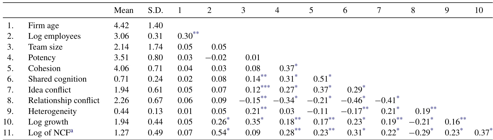
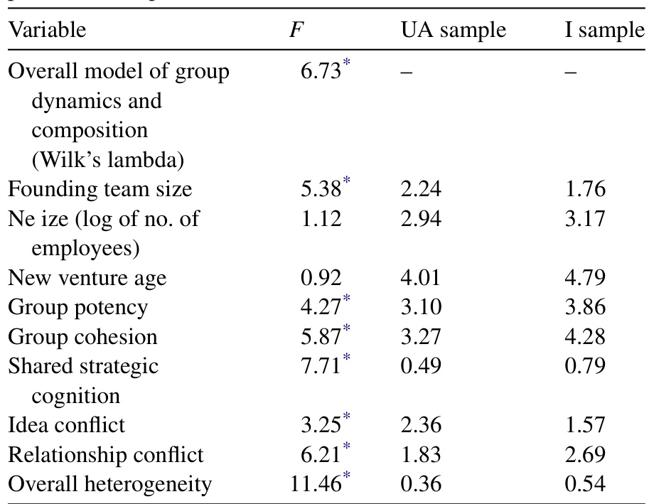
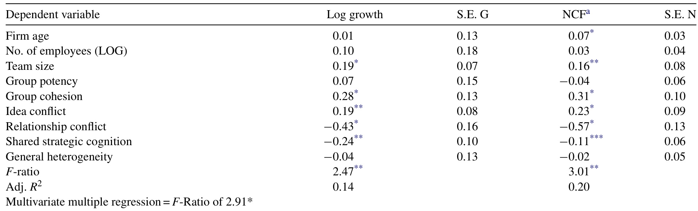
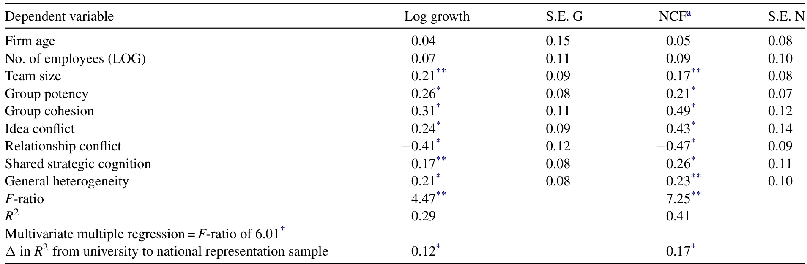

# A comparative study of new venture top management team composition, dynamics and performance between university-based and independent start-ups  

Michael D. Ensley a,\*, Keith M. Hmieleski b,1  

aRensselarPolytechnicInstitute,LallySchoolofManagement andTechnlogyTroyN180UA b Texas Christian Universty, M.J. Neeley School of Busines, Fort Worth, TX 76129, USA  

Available online 19 July 2005  

# Abstract  

The current study tests for differences in top management team (TMT) composition (education, functional expertise, industry experience, and skill), dynamics (shared strategic cognition, potency, cohesion, and confict) and performance (net cash flow and revenue growth) between a sample of 102 high-technology university-based start-ups and an otherwise equivalently matched sample of 154 independent high-technology new ventures. The results find university-based start-ups to be comprised of more homogenous TMTs with less developed dynamics than their independent counterparts. Further, university-based start-ups are found to be significantly lower performing in terms of net cash flow and revenue growth than independent new ventures.  

$\copyright$ 2005 Published by Elsevier B.V.  

JEL classification: M13; O31; 032  

Keywords: Entrepreneurship; Institutional theory; Technology transfer  

# 1. Introduction  

Over the last 25 years, university interest in the commercialization of new technologies within the United States has increased considerably (Siegel et al., 2003).  

Perhaps the most significant reason for this development is the opportunity that was presented by the Bayh-Dole Act of 1980 (Shane, 2004). This legislation decreased the uncertainty associated with the commercialization of federally funded research and led to the increased recognition of intellectual property rights by governing bodies (Hackett and Dilts, 2004). As a result, the incentive for universities to extend their focus from basic research through to commercialization became clear and present. Universities have capitalized on this opportunity by developing formal technology transfer programs, and high-technology business incubators and technology parks (Franklin et al., 2001). These undertakings have formed pathways through which universities can directly leverage the technology-transfer process, while also providing a variety of benefits to university-based start-ups. Examples of these benefits include access to cutting-edge scientific knowledge (Smilor and Gill, 1986), human capital in the form of student labor and faculty consultants (Mian, 1996), physical resources such as reduced rent and access to university libraries and laboratories (Quintas et al., 1992), social networks including other university-based start-ups, alumni, angel investors and venture capital groups (Colombo and Delmastro, 2002), and the legitimization and status inherent to affiliation with the university (Mian, 1996).  

Although these benefits appear to be considerable, we still know little about whether they translate to performance gains for university-based startups. For example, a resent study by Colombo and Delmastro (2002） found only marginal difference between university-based and independent start-ups. Specifically, university-based start-ups were found to have a slightly easier time gaining access to public subsidies, adopting advanced technologies, and participating in international research and development programs. Yet university-based start-ups were not found to be any more innovative or higher performing. In contrast, a study by George et al. (2002) found that university-based start-ups tend to be more innovative, but do not necessarily achieve greater financial performance than independent high-technology start-ups. Westhead (1997） found no differences in innovation between university-based and independent high-technology start-ups in regard to the number of new products and services launched to existing customers and new markets. Further, Westhead (1997) found no difference in employment of academic personnel, the sponsorship of research contracts, the use of test and analysis services provided by universities, the employment of graduates, and the launch of student projects. Other reviews by Macdonald (1987) and Quintas et al. (1992) also question whether high-technology start-ups reap any performance gains through university linkages. Further, there has been virtually no work toward identifying why performance gains have not been found or what metrics should be used to measure performance. Additionally, complicating matters, Mian (1997) points out that most studies of affliation between universities and high-technology start-ups have been primarily descriptive and lacking of theoretical and/or methodological grounding. Over the last 25 years we simply have not had enough empirical research directly comparing equivalently matched groups of high-technology university-based and independent start-ups in order to draw definitive conclusions worthy of use toward informing university business incubator and technology park related policy.  

# 2. Filling the gap  

The current study attempts to fill this gap in the literature by first developing theoretically grounded hypotheses concerning why differences in TMT composition, dynamics and performance are likely to exist between university-based and independent hightechnology start-ups, and then testing for these differences using equivalently matched samples. New venture TMTs are selected as the focus of the study due to the natural linkage that exists between TMTs and firm performance (Ensley and Pearce, 2001; Hambrick and Mason, 1984).  

Specifically, we consider differences across samples with respect to TMT composition, dynamics and performance. Theoretically, we draw from work on institutional isomorphism to predict that universitybased new venture TMTs will be more homogenous in composition, display less developed team dynamics, and as a result, be lower performing than independent start-ups. In so doing, we adopt the view that universitybased firms willinstitutionalizethemselves toward the norms of the university and the successful ventures that have been launched through their nurturing, rather than toward their own industry. To this end, we paint a picture of what we term “localized" isomorphic behavior. The costs associated with localized isomorphism are used to explain why the benefits of university affiliation might fail to translate into performance gains.  

# 3. Institutional isomorphism  

According to institutional theory, there is a strong tendency for new ventures to replicate both the organizational structure and activities of focal firms within their environment in order to gain legitimacy and offset the liability of newness (Delmar and Shane, 2004; Meyer and Rowan, 1977). This process is termed institutional isomorphism (DiMaggio and Powell, 1983). Firms are thought to seek two different forms of legitimisation-cognitive and sociopolitical (Aldrich and Fiol, 1994; Roberts and Greenwood, 1997). Cognitive legitimization refers to the level of public knowledge about the firm. University-based start-ups may gain cognitive legitimization through university media and entry into the university community. Sociopolitical legitimization is the extent to which key stake-holders, the general public, key opinion leaders, and government officials accept the new venture as appropriate with respect to existing norms and laws. In this case university affiliation in itself provides an indicator of sociopolitical legitimization to others, since a new venture would not likely be offered entry into a university incubator or technology park without conforming to minimal standards with respect to existing norms and laws. It should be noted that these two forms of legitimatization are not mutually exclusive, as the behavior of organizations is often targeted toward both forms of legitimization at any given time.  

There are three primary forces that move organizations toward institutional isomorphism-coercive, mimetic, and normative pressures (DiMaggio and Powell, 1983). Coercive isomorphism results from formal and informal pressure exerted on firms by organizations to which they are dependent (Guler et al., 2002). As such, university-based start-ups are likely to experience coercive pressure by agreeing to adhere to university policies and perhaps less directly from university administratorswhocanwithhold assistanceif theTMT chooses to deviate from what is viewed by university administrators as behavior which is conducive to a successful new venture (which is likely to be predicated by what has worked for previous university-based ventures). In this regard, independent start-ups face fewer restrictions and are likely to be more independent in choosing how to structure and operate their firms. Both university-based and independent start-ups still, of course, must equally conform to guidelines set by local, state and federal regulatory agencies. Mimetic isomorphism refers to the tendency, on occasions when goals are unclear and/or environmental uncertainty is high, for firms to model themselves after other organizations (Mizruchi and Fein, 1999; Williamson and Cable, 2003). Clearly these circumstances are commonplace for high-technology start-ups (Baron, 1998). Following this reasoning, it can be expected that universitybased start-ups should have a tendency to mimic the structure and behavior of other university-based firms to which they are in close contact; whereas independent start-ups, more likely to be lacking nearby reference groups to model themselves after, will be more apt to mimic the leading firms within their industry. Normative isomorphism stems primarily from occupational pressures regarding the norms of particular professions (Zucker, 1987). Occupational norms tend to be engrained into individuals through formal training and reinforced through professional societies. Since universities are particularly keen to such pressures, university-based start-ups are likely to feel considerable need to conform to normative pressures in order to maintain approval from the universities to which they are affiliated. Although independent start-ups are also likely to feel some degree of normative pressure, they are not as likely to be in as close contact with professional bodies and, as a result, experience less pressure to act in ways that are consistent with the standards set by their given field.  

In summary, it appears that coercive, mimetic and normative isomorphic pressures might act to move university-based start-ups toward replication of organizational structures and activities in which their affiliated universities view to be appropriate in order to gain cognitive and sociopoliticallegitimization that can help to mitigate the liability of newness and increase their odds of survival. In the next section, we describe in more detail why TMTs of university-based start-ups are likely to be more homogeneous than their independent counterparts.  

# 4. Team composition  

To offset the uncertainty surrounding TMT selection, Williamson (2000) suggests that new venture founders seek advice from those nearest to them and search for successful models to learn from. Indeed, a recent study by Williamson and Cable (2003) lends empirical support to the proposition that founders tend to select TMT members from sources with whom they share network ties, and that TMT hiring patterns appear to be shaped by mimetic isomorphism. These results further support DiMaggio and Powell (1983) assertion that, when faced with ambiguity, firms look to the actions of other organizations in search of models that can be used to find viable solutions to their problems. In this vein, it is expected that founders of universitybased start-ups will turn to university incubator and technology park staff for hiring advice, select a disproportionate number of TMT members from the university community, and model the TMT composition of their neighboring university-based firms. As a result, it can be expected that TMTs of university-based startups will be more homogeneous in terms of important characteristics such as education, industry experience, functional expertise and skills than their independent counterparts. Below, we outline more precisely why TMT heterogeneity in terms of these characteristics is likely to vary between university-based and independent start-ups.  

# 4.1. Educational background  

Educational heterogeneity is the extent to which TMT members have received training within the same field and also the similarity to which they have earned equivalent levels of academic degrees. More generally, educational heterogeneity speaks to the content and extent of training amongst TMT members. Universitybased start-ups are often composed of founders who are already members of the university community as current or former students and faculty. For example, it is common for students and faculty working together on research in university laboratories to recognize commercial opportunities for their work, decide to form new ventures in order to exploit those opportunities, and subsequently seek university assistance in helping them to do so. It thus becomes a natural progression for these teams, which are typically comprised of scientists and engineers and lacking in business experience, to launch their businesses under the tutelage of their university's incubator program and then, if successful, graduate to the university's technology park for the next stage in their development. In contrast, start-ups without university linkages are not as likely to have such an extensive network of business experience to fall back on. As a result, they cannot as easily allow their TMTs to be uniformly technology-centered. Instead they must recruit TMT members with diverse training in regard to both business and technology if they are to establish viable organizations. As such, we expect the level of educational heterogeneity to be lower for TMTs of university-based start-ups than for independent new ventures.  

# 4.2. Industry experience  

Industry experience is the number of years that TMT members have worked within a certain industry. Due to the fact that university employment tends to be less volatile than that which is experienced in the private sector, and that TMTs of university-based high-technology start-ups tend to be most often comprised of individuals from within the university community, it seems logical to deduce that TMT members of university-based start-ups would be more likely to have work histories within a single industry, whereas their independent counterparts - having careers that are more highly subject to altering economic conditions -- would tend to have been forced to seek employment across multiple industries throughout their careers. In this vein, the amount of industry related experience should be less diverse for TMTs of university-based start-ups than their independent counterparts.  

# 4.3. Functional expertise  

Functional expertise represents the degree to which TMT members have overlapping skill sets (Ucbasaran et al., 2003). Since university-based start-ups have an array of sources to turn to for advice within the university community in respect to both technology and business related knowledge, they are less likely to feel the need for TMT members to take on diverse functional roles. This allows university-based TMTs the ability to focus their work more fully on the development of a niche competence within the team, such as technology development. In contrast, TMTs of independent start-ups are forced to fulfill all business functions within their team. Therefore, it is important for TMT members in these firms to have backgrounds from a wider array of functional areas. As such, the level of functional heterogeneity should be lowest for TMTs of university-based, rather than independent, start-ups.  

# 4.4. Skills  

TMT skills can be broken down into three segments—technical, human, and conceptual (Katz,  

1982). Technical skill is the level of competency that TMT members have within various functional areas. Human skill is the ability of TMT members to interact effectively with diverse groups of individuals. Conceptual skill refers to the capacity of TMT members to learn and apply new knowledge. Since TMTs of university-based start-ups are likely to act with a more singular focus, having the ability to lean on functional expertise from the university and similarity in educational and industrial backgrounds within the team, they are less likely to have been forced to deal as frequently with individuals outside of their area of technical competency, have knowledge of normal behavior only as it relates to their given field, and only easily recognize and integrate informationfrom within their restricted environment.For these reasons,it is expected that the level of skill heterogeneity will be less for TMTs of university-based start-ups than for their independent counterparts. Taken together, we suggest that the team composition characteristics that we have discussion tend reinforce one another. Thus, we propose the existence of an overall relationship as follows:  

Hypothesis 1. Top management teams of university-- based start-ups will be more homogenous in terms of education, industry experience, functional expertise and skills than those of independent start-ups.  

# 5. Team dynamics  

In this section, the importance of TMT dynamics and how they relate to TMT composition is discussed. In particular, we focus on TMT shared strategic cognition, potency cohesion, and conflict.  

# 5.1. Shared strategic cognition  

Shared strategic cognition is the degree to which TMT members hold a common mental model of the organization's strategy (Ensley and Pearce, 2001). Mental models are cognitive images or visions of a desired future state (Thoms and Greenberger, 1995). TMTs high in shared strategic cognition are deeply committed to their goals and unified in their actions (Hambrick, 1997). Further, the collective vision of top management is often cited as having a direct link to new venture performance (Ensley and Pearce, 2001). Amason (1996)  

suggests that this relationship is likely to, in part, result from the fact that teams sharing a collective vision often allow their members to act independently and, thus, more fully leverage their individual abilities.  

Since strategy is the point of interaction between the firm's competitive behaviors and the state of the external environment, it is important for TMTs to acquire as much information as possible regarding both the intricacies of alternative strategies and the state of the external environment. In this vein, only teams that fully understanding such aspects are likely to develop a wellgrounded appreciation for the firm's strategic direction (Katzenbach, 1997). To this end, teams that are comprised of members with diverse backgrounds and high in task conflict are likely to build a strong sense of shared strategic cognition. Following this logic, it is our assertion that the degree of shared strategic cognition will be lower for TMTs of university-based start-ups than for independent new ventures.  

# 5.2. Team potency  

Team potency is the degree of collective efficacy within a group toward achieving its goals (Guzzo et al., 1993). Therefore, a team that is highly potent believes with great certainty that it can achieve the tasks in which it has been formed to accomplish (Pearce et al., 2002). Numerous studies have found a direct linkage between team potency and performance (Riggs and Knight, 1994). A study by Sosik et al. (1998) found this relationship to be even greater for teams led by transformational leaders, who promote the consideration of multiple viewpoints en route to the adoption of a collective vision. These authors explain that transformational leaders tend to focus on members’ strengths rather than weaknesses, and that by empowering members to utilize and learn about each others strengths, the team gains greater confidence in its abilities. In further support of the powerful effects of team potency, research by Gevers et al. (2001) indicates that teams low in potency tend to experience greater levels of perceived time pressure and react more negatively to time pressure, whereas highly potent teams - due to their confidence in their abilities - more often rise to the occasion under time restricted conditions.  

Recent work by Sosik and Jung (2002) has found that collectivist groups tend to be less potent than those that are more independent. These authors explain that independent teams tend to be more competitive, which causes them to more frequently test and expand their abilities. In turn, their confidence in their ability to function as an effective team increases. It is our argument that the TMT dynamics that result from conflict between team members in independent ventures lead to greater clarity of the team's goals and its potential for achievement than for more homogenous and less conflict-prone university-based TMTs. Guzzo et al. (1993) work strictly depicts team potency as the extent to which the team believes that it can accomplish the task. Without a clear understanding of the task, which we argue can only be ascertained through rigorous debate and discussion, it is unlikely that high levels of team potency will result. As such, universitybased start-ups should be less potent than independent newventures.  

# 5.3. Team cohesion  

Team cohesion is the perceived sense of morale and belonging among members (Bollen and Hoyle, 1990). Cohesion is an affective state that influences motivation and commitment, and as a result, shares a positive relationship with team performance (Klein and Mulvey, 1995). This is to say that cohesive teams tend to put forth greater and more persistent effort, and accordingly perform better. For example, Shaw and Shaw (1962) found that highly cohesive teams spend a great deal of their time planning and problem solving, whereas their less cohesive counterparts waste valuable time dealing with unproductive social conflict. A metaanalysis by Mullen and Copper (1994) confirmed a significant positive linkage between team cohesion and performance. These findings are not surprising considering that cohesive teams have been consistently found to react faster, be more fexible, use superior problem solving techniques, and work more efficiently than less cohesive teams (Smith et al., 1994). Although cohesion appears to be a requirement for effective team performance, it is not, however, by itself a sufficient explanation of TMT performance (Ensley et al., 2003). Rather, cohesion appears to be an integral part of an array of factors (e.g., ability, experience, and other team dynamics) that jointly affect important team outcomes.  

From a comparative perspective, we believe that high levels of shared strategic cognition and team potency, which we have made the case as being higher for independent start-ups, will act to unify TMTs of independent start-ups in a way that leads to higher levels of cohesion than for their university-based counterparts.  

# 5.4. Team conflict  

There are two primary forms of conflict that are important in regard to the dynamics of TMTs - idea and interpersonal (Ensley and Pearce, 2001). Idea conflict is the level of disagreement that members have about the activities, strategy and goals of the team (Jehn, 1995). Idea conflict can be productive if ideas are openly and respectfully exchanged. However, research has shown that even idea conflict often spirals into destructive infighting between team members (Holahan and Mooney, 2004). The degeneration of constructive idea conflict can be traced to increased levels of negative affect - the degree of internal emotional strife that can build within members of teams that experience idea conflict (Knight et al., 1999). Chronic negative idea conflict can cause members to become so disenchanted with the group that they disagree simply as a pathway to vent their highly emotional displeasure, thus creating a downward spiral of increasing infighting. Interpersonal conflict occurs when members move their disagreement beyond the scope of the team's purpose. In such instances conflict extends beyond differences of opinion between team members and takes on a more personal nature (Jehn, 1994).  

From the perspective of this comparison, we anticipate that shared strategic cognition, team potency and cohesion will act to promote idea conflict, while buffering TMTs from the potential downward spiral effect toward interpersonal conflict that often occurs. Thus, it is expected that TMTs of independent start-ups will experience more idea conflict and less interpersonal conflict than their university-based counterparts.  

In sum, the extent of TMT heterogeneity seems likely to influence important TMT dynamics including strategic cognition, potency, cohesion, and conflict. Since there appears to be a consistent relationship within which these effects take place, we propose the existence of an overall relationship as follows:  

Hypothesis 2. Top management teams of universitybased start-ups will have less well-developed dynamics in terms of shared strategic cognition, potency cohesion, and confict than those of independent start-ups.  

# 6. New venture performance  

Recent findings linking TMT composition and dynamics with new venture performance have been substantial. In this regard, empirical evidence has identified clear linkages between the composition and group dynamics variables that we have described in the preceding sections with the survival and growth of startups (Ensley and Pearce, 2001; Ensley et al., 2002). The foundation of these studies has been based in upperechelons theory, which argues that firms are a refection of the top managers that lead them (Hambrick and Mason, 1984). This link has been supported through the study of several thousand new ventures, as well as countless larger and more established organizations. Such relationships, however, are typically found to be most robust in the new venture context. This is because the new venture context tends to be characterized by “weak” rather than “strong"” strong situations. Mischel (1977) describes strong situations as those in which there are relatively uniform expectancies regarding appropriate behavior. In strong situations certain behaviors are reinforced by normative expectations and incentive structures that support learning those behaviors. Weak situations lack these characteristics and do not provide clear incentives, support, or normative expectations for what constitutes appropriate behavior. It has been demonstrated that in weak situations, the individual characteristics and behavior of top management are likely to display clearer linkages to organizational outcomes than those acting within strong situations (Beaty et al., 2001). In this vein, due to isomorphic pressure, we expect that university-based start-ups will be drawn to conform to the norms of the universities to which they are affliated. In contrast, independent start-ups are not apt to have as close of a referent group with which to conform or mimic. Therefore, the context in which university-based start-ups operate is likely to be stronger in terms of expected behavior than that in which independent new ventures are exposed. As a result, it is anticipated that the top management team composition and dynamic variables that we have outlined will account for a lower proportion of variance in firm performance for universitybased start-ups than for those without such affiliation. In addition, the homogenous nature and less developed dynamics of university-based new venture top management teams should lead to deficits in firms performance as compared to that of independent start-ups. This leads us to our final hypotheses:  

Hypothesis 3. The amount of variance in firm performance that is accounted for by new venture TMT composition and dynamics will be lower for university. based start-ups than for independent start-ups.  

Hypothesis 4. The performance of university-based start-ups will be lower than the performance of independent start-ups.  

# 7. Methodology  

# 7.1. Participants  

Two different samples of firms are utilized in the current study. The first sample is comprised of universitybased high-technology start-ups that were located in either a university incubator or technology park at one of three different universities in the southeastern section of the United States. Each of these firms was a university spin-off, developed by students or faculty based on their research, or utilized research from a university's technology transfer area. The second sample is comprised of a nationally representative sample of high-technology new ventures and was drawn by Cognetics Inc. using methods developed by noted economist David Birch. These firms had achieved at least $20\%$ growth over a three-year period and were still under the direction of the founding top management team. All participants from both samples were top management team members. To be included, participants had to meet at least two of three additional criteria: they had to be founders, significant equity stakeholders( $10\%$ or more), or actively involved in the strategic decision-making of the firm. Data for both samples was collected in 2001.  

# 7.1.1. University-based sample of start-ups  

Eachof the884officersofthe256 identified university-based start-ups was mailed a personalized letter and individually numbered questionnaire. A total of 342 responses were returned from 192 firms. After eliminating firms from which we received responses from less than half of the TMT, managers who were not active on the TMT, and managers who provided incomplete responses, our sample was reduced to 217 managers from 102 firms, a response rate of $24.5\%$ .Of the 217 managers retained, approximately $77\%$ were male and the average age was 32.1 years. Eighty-two percent were founders and $90\%$ held at least $10\%$ equity in their firm. Nearly $90\%$ considered themselves entrepreneurs and $15\%$ had been involved in new ventures previously. Just over $80\%$ reported their highest degree as a bachelor's, $57\%$ held master's degrees, and $20\%$ held doctorates. Twenty-Seven percent majored in engineering, $17\%$ in science (biology or chemistry), and $13\%$ in business. The firms in this sample grew at a rate of $43\%$ per year during the previous five years. The range was from a low of $11\%$ to a high of $63\%$ .A total of 24 industries were represented and the average firm age was 5.4 years. Average revenue was $\mathbb{S}1.7$ million  

Non-response bias was checked by sampling 30 non-respondent teams using interviews to capture responses to several key questionnaire variables. Ttestswereusedto checkfor differencesbetween the samples and the non-response sample. The variables used to test non-response bias were strategic orientation, revenue, frm age, size, growth rate, and net cash flow. All yielded non-significant results, which indicate that non-response bias is not a major factor.  

# 7.1.2. Nationally representative sample of independent start-ups  

Each of 1242 officers from the 500 sampled independent start-ups was mailed a personalized letter and individually numbered questionnaire. A total of 657 responses were returned from 231 firms. After eliminating firms from which we received responses from less than half of the TMT, managers who were not active on the TMT, and managers who provided incomplete responses, our sample was reduced to 417 executives from 154 firms, a response rate of $33.5\%$ . Of the 417 managers retained, approximately $88\%$ were male and the average age was 44.2 years. Sixty-eight percent were founders and $71\%$ held at least $10\%$ equity in their firm. Nearly $90\%$ considered themselves entrepreneurs and $47\%$ had been involved in new ventures previously. Just over $45\%$ reported their highest degree as a bachelor's degree, $17\%$ held master's degrees and $5\%$ held doctorates. Majors included engineering, accounting, business, biology, chemistry, history, political science, and others (less than $5\%$ ). The firms in the sample had grown at an average rate of $78\%$ per year and ranged from a low of $21\%$ to a high of $114\%$ .A total of 72 industries were represented by the firms and the average firm age was 4.3 years. The firms averaged $\mathbb{S}8.6$ million in revenue.  

Non-response bias was checked by sampling 30 non-respondent teams using telephone interviews to capture responses to several key questionnaire variables. $T\!\!\!\!/\!\;\!\!\!\;\;\;$ -tests were used to check for differences between the samples and the non-response sample. The variables used to test non-response bias were strategic orientation, revenue, firm age, size, growth rate, and net cash flow. All yielded non-significant results, which indicate that non-response bias is not a major factor for the independent sample.  

In a final validity check for sample correspondence, we tested whether the high-growth of the independent sample of start-ups biased the results. To do so, we reran all of the statistical procedures without universitybased start-ups that failed to meet a $20\%$ growth rate (these firms comprised less than $20\%$ of the universitybased sample). This cut-off was used because of the fact that Cognetics Inc. used a $20\%$ growth rate as criteria for drawing the sample of independent start-ups that they classified as entrepreneurial. The findings of this validity check demonstrated that no bias was caused by the independent firm sampling procedure and that comparing the samples was not a cause for concern.  

# 7.2. Measures  

Cohesion was measured using the Perceived Cohesion Scale (PCS) developed by Bollen and Hoyle (1990). The PCS contains six items, three of which assess the individual's sense of belonging and three relate to the individual's feelings of morale. In this study, Cronbach's coefficient alpha coefficients for the combined samples were .83 and .85 for the morale and sense of belonging subscales, respectively. Withinteam agreement was assessed with the reliability Within Groups on j number of items, also known as the rwG(I) (James et al., 1993). The rwG(J) is developed on a scale from 0 to 1.0, with scores above .70 considered to demonstrate agreement within the team. The $r_{\mathrm{WG(J)s}}$ for the cohesion sub-dimensions were .91 for morale and .87 for belonging, thus demonstrating acceptable inter-rater reliability.  

Conflict was measured using six items adapted from Jehn's (1994) Interpersonal conflict scale (ICS). Three items were used to measure cognitive conflict and three items were used to measure affective conflict. Cronbach's coefficient alphas for the combined samples were observed at .79 for cognitive conflict and .85 for affective conflict. The rwG(I)s were .81 for cognitive conflict and .86 for affective conflict.  

Potency was measured using an instrument developed by Guzzo et al. (1993). This eight-item scale measures the team's belief in its ability to perform effectively. The aggregate of these items produced a Cronbach's coefficient alpha for the combined samples of .86. The rwG() statistic for potency was .82.  

Shared strategic cognition was measured as the coefficient of variation of the Strategic Orientation of Business Enterprises (STROBE) scale. The STROBE scale, developed by Venkatraman (1989), is a 33-item, seven dimension scale intended as a measure of business level strategy. The seven dimensions include aggressiveness, analysis, defensiveness, futurity, proactiveness, innovativeness, and riskiness. Cronbach's coefficient alphas for these dimensions were found to range ranging from .68 to .79 for the combined samples. All of the dimensions represented in the STROBE scale were found to have acceptable levels of inter-rater reliability, with $r_{\mathrm{WG(J)s}}$ ranging from .81 to .93.  

Heterogeneity was measured using an instrument developed by Herron (1990). The measure is comprised of the following four dimensions: skill, functional, educational specialty, and educational level. To measure heterogeneity on these scales we calculated the within team standard deviations on each of the measured skills. We then averaged those standard deviations to obtain a measure of skill heterogeneity for each team.  

Following Murray (1989), Jackson et al., (1991), and Bantel and Jackson (1989), functional specialty was defined as the position currently held. Educational specialty was defined as the major area in which the highest degree was attained and educational level was defined as the highest degree attained. Heterogeneity on these items was measured with Blau, (1977) index for categorical dissimilarity. Blau's categorical index is calculated as follows:  

# Blau's Categorical Index = 1 - Zpi2  

where pi is the proportion of the population in a given group. This calculation results in a measure of heterogeneity. Finally, in an effort to capture the omnibus effects of total heterogeneity, a combined measure of TMT heterogeneity was created as the sum of the previous four measures. The result allows us to test the overall validity of our models and then discuss the implications of specific types of heterogeneity.  

Control variables included firm age, firm size, and TMT size. Firm age was measured as the number of years since the firm had been established. Firm size was controlled for using the natural log of the number of employees. TMT size was assessed as the number of managers who met our criteria for inclusion in the study.  

Since two different statistical approaches are employed in this study, it is important that each criterion variable be clearly specified. For the discriminant analysis, the criterion variable was group membership. In this case, the groups are university-based start-ups and a national random sample of independent new ventures. For the new venture performance model comparisons, net cash flow and revenue growth were used as criterion variables.  

A combination of discriminant analysis, multiple regressions, and $t^{\prime}$ -tests were utilized in this study. In addition, a holdout sample of 50 randomly selected firms was developed in an effort to understand the efficacy of the discriminant function.  

# 8. Results  

Overall, the correlations listed in Table 1 support the proposed linkages of group composition and dynamics with firm performance. Table 2 shows the overall discriminant model of differences in group dynamics and composition in university-based and independent firms. The Wilk's lambda was 4.65 $(p<.01)$ .The canonical $R^{2}$ was.71 $(p<.01)$ , meaning that the group composition and dynamics variables predicted $71\%$ of the variation between university-based and independent new ventures. Generally, our proposition that TMTs of university-based and independent ventures process information differently and interact differently was supported.  

We will now discuss the findings in reference to our specific hypotheses. Hypothesis 1 states that universitybased firms will have less heterogeneous teams than independent ventures. The results from both the discriminant analysis support this hypothesis. In the discriminant function, general heterogeneity was found to be significant, with the mean for the independent new venture sample being significantly higher than the university-based sample.  

Table1 Correlations, standard deviations, and means   

  
a Net cash flow. $p<.01$ $p<.05$ \*\*京 $p<.10$  

Hypothesis 2 states that the group dynamics of the independent ventures will be more developed and functional. This suggests that independent TMTs develop higher levels of group potency, cohesion, idea conflict, shared strategic cognition, and lower levels of relationship conflict than their university-based counterparts. The results demonstrate statistically significant support for this hypothesis, across each of these factors. This is shownthrough the $F$ -ratios of the individual factors and the overall significance of the discriminant function.  

Table2 Discriminant analysis $F$ -ratios and probability levels for differences in group dynamics and composition for university-based and independent start-ups   

  
UA: university-based; I: independent. $p<.01$  

Hypothesis 3 states that team composition and group dynamics will account for a significantly lower portion of variance in firm performance for university-based start-ups than for independent new ventures. As shown in Tables 3 and 4, separated regressions were run for each sample to test this hypothesis. The significance tests on the change in $R$ -square (Cohen and Cohen, 1987) for the two performance models, one for revenue growth and one for net-cash-flow, demonstrates that the link between the groups’ variables and firm performance is significantly weaker in university-based ventures than with the independent start-ups. In fact, the heterogeneity variable fell completely out of the performance model for the university-based firms, whereas the most highly significant variable was the measure of dysfunctional team behaviors (i.e. relationship conflict). This suggests that there was a significant difference in the ability of the teams to function.  

Hypothesis  4 suggests that the university-based start-ups will be lower performing than their independent counterparts. To examine this hypothesis a $t$ -test was performed comparing the two samples on the basis of the performance criterion variables. The universitybased sample experienced (per year) an average growth rate of $43\%$ $(\mathrm{S.D.}=9.3\%)$ and negative cash flow of $\mathbb{S}123{,}760$ (S.D. $=\mathbb{S}51$ , 771); whereas the sample of independent start-ups experienced (per year) an average growth rate of $78\%$ $(\mathrm{S.D.}=24.7\%)$ and positive cashflowof $^{\S90,156}$ $\mathrm{\bfSD}\!=\!\mathbb{S}22\!,\!474\!\!\!\rangle$ .Fornet-cashflow the $t$ -test was 4.17 $(p<.05)$ and for revenue growth the $t$ -test was 6.93 $(p<0.01)$ . Hypothesis 4 is therefore supported, as the finding demonstrate the university-based sample to be significantly lower performing in terms of both revenue growth and cash flow than the independent sample.  

Table3 University-based sample multiple regression analysis predicting new venture performance   

  
a Net cash flow. $p<.01$ \*\*p<.05. $p<.10$  

Table4 Nationally representative independent sample multiple regression analysis predicting new venture performance   

  
a Net cash flow. \* p<.01. \* $p<.05$  

To further validate our findings in regards to differences between the two samples, the discriminant function that was developed in the study was applied to a holdout sample of 50 randomly selected teams. Ninetysix percent of the teams from the holdout sample were correctly classified. This demonstrates additional support for the viability of the discriminant function, since chance accuracy is $60\%$ and $96\%$ accuracy far exceeds that figure. Therefore, we have additional evidence that the model represents the data.  

# 9. Discussion  

This  research  examined differences between university-based and independent start-ups. Since popularity in the development of university incubators and technology parks emerged nearly 25 years ago, there has been surprisingly little research regarding the extent to which these undertaking have improved the performance of the new ventures that they have supported. Further, the extant literature on this topic has been primarily descriptive - failing to compare otherwise equivalently matched samples of university-based and independent start-ups, and lacking in theoretical grounding (Mian, 1997). In response, the current study set out to examine differences in TMT composition, dynamics and performance between matched samples of university-based and independent hightechnology start-ups. Further, hypothesized differences between samples were grounded in well-established theory on institutional isomorphism (DiMaggio and Powell, 1983; Zucker, 1987). By examining the composition and dynamics of TMTs, the study attempted not only to identify differences in performance between university-based and independent new ventures-but also the nature behind why such differences may exist. In so doing, the desire was to extract meaningful insight that might be used to help inform policy making in regard to university technology transfer activities, and university business incubators and technology parks.  

Given our results, we are left with an important overarching question—do university and technology transfer officers and managers focus too much on technology and market and in the process fail to adequately develop the dynamics of new venture TMTs? Our findings demonstrate that university-based ventures, while perhaps being mature from a technology perspective, appear to be somewhat immature in regard to their TMT dynamics. This suggests that universities and their agencies (i.e., incubators and technology parks) might not spend adequate time developing the TMTs of the new ventures that they advise. Although TMT development is one of the most critical factors related to new venture performance, it can often be difficult to find expertise on university campuses that is devoted to the development of TMT dynamics for their university-based ventures. Instead, university support tends to focus primarily on technology and marketing. As such, there appears to be an excellent opportunity for technology transfer organizations such as the Association of University Technology Managers (AUTM) and the Technology Transfer Society (T2s) to create policy initiatives that promote the development of new venture TMTs as a means to increase the viability of university-based firms. To this end, technology transfer managers should have at their disposal the kinds of tools needed to develop founding TMTs within the new ventures that they support. Seminars, team building sessions, and structured discussions regarding group decision-decision making could potentially improve the survival rates of new ventures that are spun from university campuses.  

# 10. Limitations  

With regard to the generalizability of our results, there are some limitations that are worthy of discussion. The university-based sample frame is one potential limitation. A convenience sample of universitybased start-ups was drawn, because gathering a random national sample of university-based ventures would not have been possible. There simply is no available list of national university-based high-technology start-ups. However, we have no reason to believe that the results found from our sample will not generalize to other university-based start-ups. As a test of this assumption, we conducted a small comparison of this universitybased dataset with several university-based ventures in Southern California and found no significant difference on several key indicators such as growth rate, age, size, industry, and strategic orientation.  

Finally, even though we identified clear differences in regard to TMT composition, dynamics and performance between university-based and independent new ventures, we are not able to claim that TMT composition directly affected TMT dynamics or that TMT composition and dynamics directly affect new venture performance. Although we have found no evidence leading us to believe that a causal relationship does exist, quasi-experimental research is necessary in order to further validate the assumed causal linkages. Such research might provide team building training to one sample of university-based new venture TMTs, while withholding treatment from an otherwise equivalent sample.  

# 11. Conclusions  

The policy implications of this study are straightforward. Universities would be well advised to focus as much attention on the assessment and development of the top management teams of the new ventures to which they support as any other aspect these firms. In this regard, university personnel advising affiliated start-ups need skills not just in intellectual property protection, market and product development, and financial feasibility——-but also in understanding how TMTs function and impact new venture performance. As such, these individuals would need specific training on how to coach and develop founding teams, so as to support the building of teams that are compositionally representative of new ventures in the “outside” world. They also need to understand how to develop TMT dynamics in regard to group decision-making, conflict management, and unification of a shared strategic vision. Universities that acknowledge the importance of these factors are likely stimulate higher growth rates amongst the new ventures that the support. Further, the findings of this study suggest that institutional isomorphism is a powerful force in the development of TMTs of university-based firms. As such, there may be a problem with how new ventures are developed on university campuses from a human capital perspective. To this end, we recommend that government agencies, institutions and foundations, and associations should be as equally concerned about the development of human capital as they are with technological capital or financial capital. It is our assessment that the creation of guidelines for the assessment, monitoring, and development of TMTs from university campuses are essential for the long-term viability and success of the technology transfer process. We believe that such guidelines would offer universities an opportunity to break out of their localized isomorphic influence and increase the probability that the assistance that they provide to new ventures will translate into performance gains.  

# References  

Aldrich, H., Fiol, M., 1994. Fools rush in? The institutional context of industry creation. Academy of Management Review 19 (4), 645-670.   
Amason, A.C., 1996. Distinguishing the effects of functional and dysfunctional confict on strategic decision making: resolving a paradox for top management teams. Academy of Management Journal 39 (1), 123-148.   
Bantel, K., Jackson, S., 1989. Top management and innovations in banking: does the composition of the top team make a difference? Strategic Management Journal 10, 107-124.   
Baron, R.A., 1998. Cognitive Mechanisms in entrepreneurship: why and when entrepreneurs think differently than other people. Journal of Business Venturing 13, 275-294.   
Beaty, J.C., Cleveland, JN, Murphy, K.R., 2001. The relation between personality and contextual performance in “strong" versus “weak" situations. Human Performance 14 (2), 125- 148.   
Blau, PM., 1977. Inequality and Heterogeneity. Free Press, Glencoe, IL.   
Bollen, K.A., Hoyle, R.H, 1990. Perceived cohesion: a conceptual and empirical examination. Social Forces 69, 479-504.   
Cohen, J., Cohen, P., 1987. Applied Multiple Regression/Correlation Analyses for The Behavioral Sciences, third ed. Lawrence Erlbaum, Hillsdale, NJ.   
Colombo, M.G., Delmastro, M., 2002. How effective are technology incubators? Evidence from Italy. Research Policy 31, 1103- 1122.   
Delmar, F., Shane, S., 2004. Legitimating frst: organizing activities and the survival ofwventures. Journal ofBusinessVenturng 19 (3), 385-410.   
DiMaggio, PJ., Powell, W.W., 1983. The iron cage revisited: Institutional isomorphism and collctive rationality in organizational fields. American Sociological Review 48, 147- 160.   
Ensley, M.D., Pearce, C.L., 2001. Shared cognition in top management teams: implications for new venture performance. Journal of Organizational Behavior 22 (2), 145-160.   
Ensley, M.D., Pearson, A., Amason, A.C., 2002. Understanding the dynamics of new venture top management teams: cohesion, conflict, and new venture performance. Journal of Business Venturing 17, 365-386.   
Ensley, M.D, Pearson, A., Pearce, C.L., 2003. Top managemnt team process, shared leadership, and new venture performance: a theoretical model and research agenda. Human Resource Management Review 13 (2), 329-346.   
Franklin, S.J., Wright, M., Lockett, A., 2001. Academic and surrogate entrepreneurs in university spin-out companies. Journal of Technology Transfer 26, 127-141.   
George, G., Zahra, S.A., Wood, D.R., 2002. The effects of business-university alliances on innovative output and financial performance: a study of publicly traded biotechnology companies. Journal of Business Venturing 17 (6), 577- 609.   
Gevers, J.M.P, van Eerde, W, Rutte, C.G., 2001. Time pressure, potency, and progress in project groups. European Journal of Work and Organizational Psychology 10 (2), 205- 221.   
Guler, I, Guillen, MF, Macpherson, JM., 2002. Global competition, institutions, and the diffusion of organizational practices: the international spread of ISO 9000 quality certificates. Administrative Science Quarterly 47 (2), 207-232.   
Guzzo, R.A., Yost,PR., Campbell, R.J., Shea, G.P, 1993. Potency in groups: articulating a construct. British Journal of Social Psychology 32, 87-106.   
Hackett, S.M., Dilts, D.M., 2004. A systematic review of business incubation research. Journal of Technology Transfer 29, 55- 82.   
Hambrick, D.C., 1997. Corporate coherence and the top management team. Strategy & Leadership 25, 24-30.   
Hambrick, D.C., Mason, PA., 1984. Upper echelons: the organization as a refection of its top managers. Academy of Management Review 9, 193-206.   
Heron, L. 1990. The effects of characteristics of the entrepreneur on new venture performan. Unpublished doctoral dissertation, University of South Carolina, Columbia, SC.   
Holahan, P., Mooney, A. (2004). Confict, decision outcomes and project team performance. Unpublished manuscript, Stevens Institute of Technology.   
Jackson, S.E., Brett, J.F, Sessa, V.I., Cooper, D.M., Julin, J.A., Peyronnin, K., 1991. Some differences make a difference: Individual dissimilarity and group heterogeneity as correlates of recruitment, promotion and turnover. Journal of Applied Psychology 79, 675-689.   
James, L.R., Demaree, R.G., Wolf, G., 1993. R/sub wg/: An assessment of within-group interrater agreement. Journal of Applied Psychology 78 (2), 306-309.   
Jehn, K.A., 1994.Enhancingffectiveness: aninvestigation ofadva tages and disadvantages of value-based intragroup confict. International Journal of Conflict Management 5, 223-238.   
Jehn, K.A., 1995. A multi-method examination of the benefits and detriments of intragroup confict. Administrative Science Quarterly 40, 256-282.   
Katz, R.L, 1982. The Effcts of group longevityon project communication and performance. Administrative Science Quarterly 27, 81-105.   
Katzenbach, J.R., 1997. The myth of the top management team. Harvard Business Review 75, 83-93.   
Klein, HJ., Mulvey, PW., 1995. Two investigations of the relationships among group goals, goal commitment, cohesion and performance. Organizational Behavior and Human Decision Processes 61 (1), 44-53.   
Knight, D., Pearce, C.L., Olian, J.D., Sims, H.P., Smith, K.A., Flood, P, 1999. Top management team diversity, group process and strategic consensus. Strategic Management Journal 20, 445-465.   
Macdonald, S., 1987. British science parks: reflections of the politics of high technology. R&D Management 17 (1), 25-37.   
Meyer, J.W, Rowan, B., 1977. Institutionalized organizations: formal structures as myth and ceremony. American Journal of Sociology 83, 340-363.   
Mian, S.A., 1996. Assessing value-added contributions of university technology business incubators to tenant firms. Research Policy 25,325-335.   
Mian, S.A., 1997. Assessing and managing the university technology business incubator: an integrative framework. Journal of Business Venturing 12, 251-285.   
Mischel, W., 1977. The interaction of person and situation. In: Magnusson, D., Endler, N.S. (Eds.), Personality at the Crossroads: Current Issues in Interactional Psychology. Lawrence Erlbaum Associates, Hillsdale, NJ, pp. 33-352.   
Mizruchi, M.S., Fein, L.C., 1999. The social construction of organizational knowledge: a study of coercive, mimetic, and normative isomorphism. Administrative Science Quarterly 44 (4), 653- 683.   
Mullen, B., Copper, C., 1994. The relation between group cohesiveness and performance: an integration. Psychological Bulltin 115 (7), 210-227.   
Murray, A.1., 1989. Top management group heterogeneity and firm performance. Strategic Management Journal 10, 125- 141.   
Pearce, C.L., Gallagher, C.A., Ensley, M.D., 2002. Confidence at the group level of analysis: a longitudinal investigation of the relationship between potency and team effectiveness Journal of Occupational and Organizational Psychology 75, 115-119.   
Quintas, P., Wield, D., Massey, D., 1992. Academic-industry links and innovation: Questioning the science park model. Technovation 12, 161-175.   
Riggs, M., Knight, P, 1994. The mpact of perceived group sucssfailure on motivational beliefs and attudes: a causal model. Journal of Applied Psychology 79, 755-766.   
Roberts, P.W., Greenwood, R., 1997. Integrating transaction cost and institutional theories: toward a constrained-efficiency framework for understanding organizational design adoption. Academy of Management Review 22 (2), 346-373.   
Shane, S., 2004. Encouraging university entrepreneurship? The effect of the Bayh-Dole Act on university patenting in the United States. Journal of Business Venturing 19 (2), 127-151.   
Shaw, M.E, Shaw, L.M, 1962 Some effects of sociometic grouping upon learning in a second grade classroom. Social Psychology 57, 453-458.   
Siegel, D.S., Waldman, D., Link, A., 2003. Assessing the impact of organizational practices on the relative productivity of university technology transferoffices: an exploratory study. Research Policy 32 (1), 27-48.   
Smilor, R., Gill, M., 1986. The New Business Incubator: Linking Talent, Technology, and Know-How. Lexington Boks, Lexington, MA.   
Smith, K.G., Smith, K.A., Olian, J.D., Sims, H.P, O'Bannon, D.P., Scully, J.A., 1994. Top management team demography and process: the role of social integration and communication. Administrative Science Quarterly 39, 412-433.   
Sosik, J., Avolio,B.J., Kahai, S.S., 1998.Computer-supported work group potency and effectiveness: the role of transformational leadership, anonymity, and task interdependence. Computers in Human Behavior 14 (3), 491-511.   
Sosik, J.J., Jung, D.1., 2002. Work-group characteristics and performance in collectivistic and individualistic cultures. Journal of Social Psychology 142 (1), 5-23.   
Thoms, P., Greenberger, D.B. 1995. Training business leaders to create positive organizational visions of the future: Is it successful? Academy of Management Journal, Best Paper Proceedings, 212-217.   
Ucbasaran, D., Lockett, A., Wright, M., Westhead, P., 2003. Entrepreneurial founder teams: factors associated with member entry and exit. Entrepreneurship Theory and Practice 28 (2), 107-128.   
Venkatraman, N., 1989. Strategic orientation of business enterprises: the construct, dimensionality, and measurement. Management Science 35 (8), 942-967. Westhead, P., 1997. R&D'inputs’ and 'outputs’ of technology-based firms located on and off science parks. R&D Management 27 (1),   
45-62. Williamson, I.O., 2000. Employer legitimacy and recruitment success in small businesses. Entrepreneurship Theory and Practice   
25 (1), 27-42.   
Williamson, I.O., Cable, D.M., 2003. Organizational hiring patterns, interfirm network ties, and interorganizational imitation. Academy of Management Journal 46 (3), 349- 358.   
Zucker, L.G., 1987. Institutional theories of organization. Annual Review of Sociology 13, 443-464.  