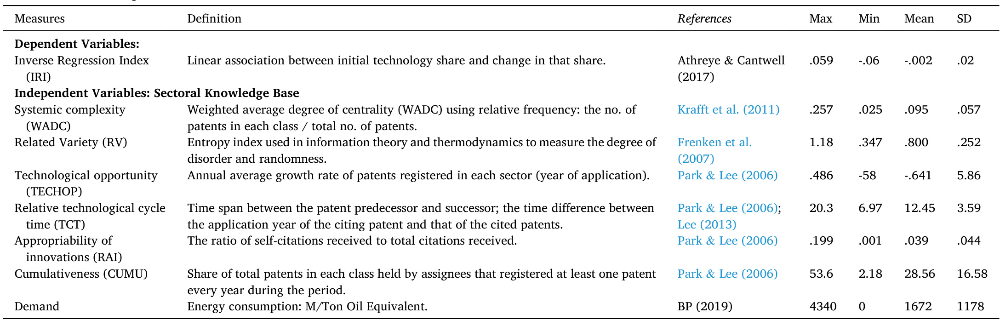
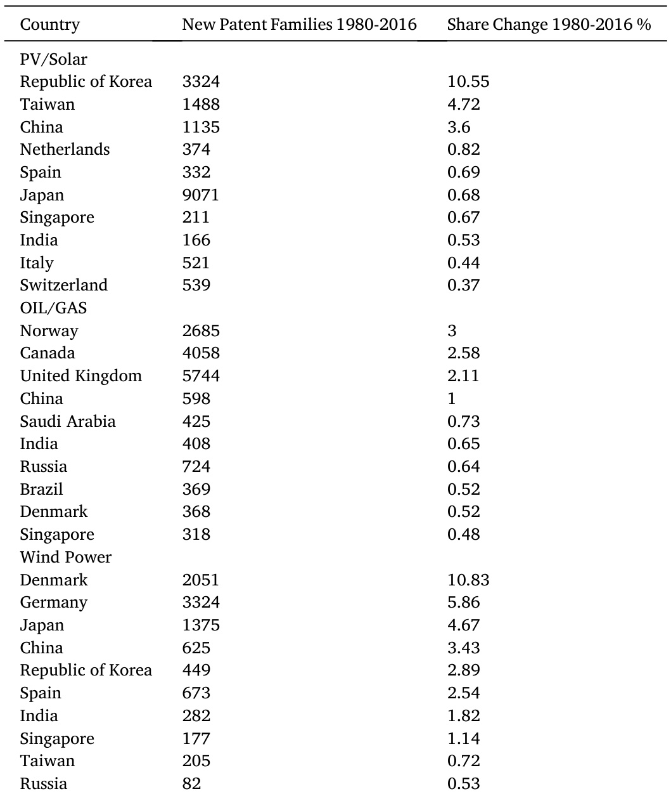
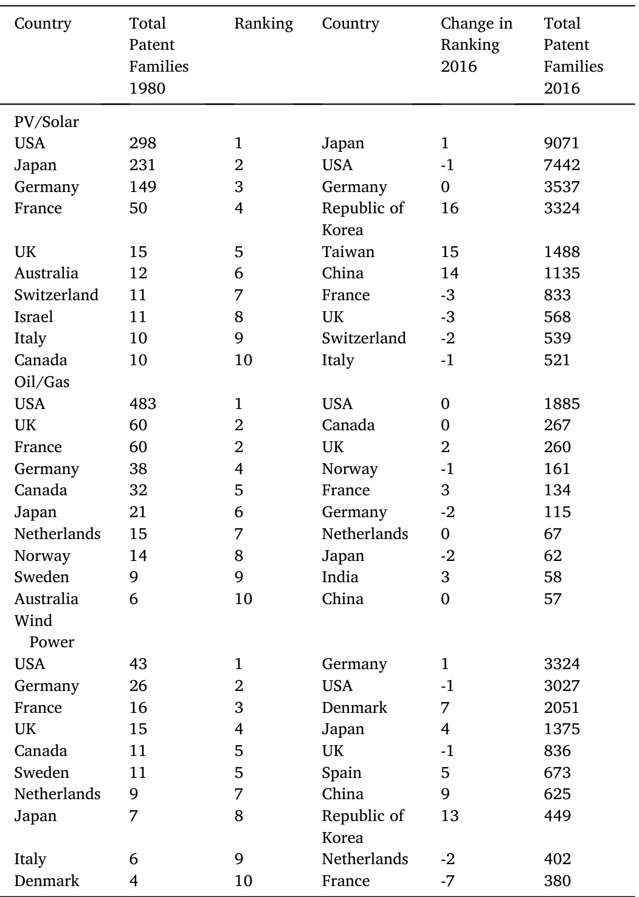
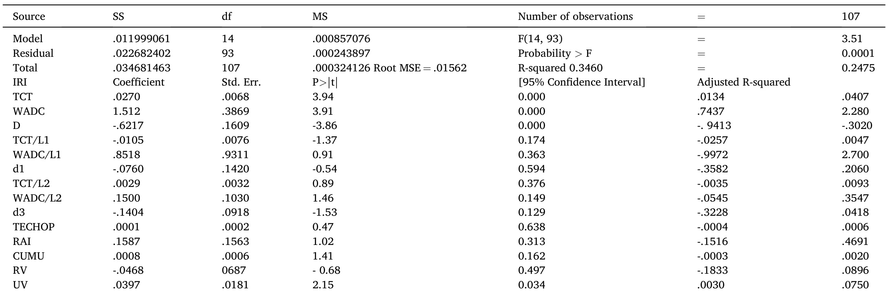
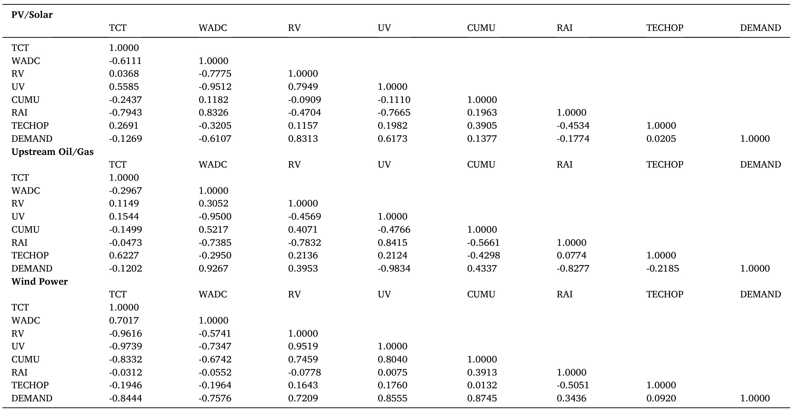
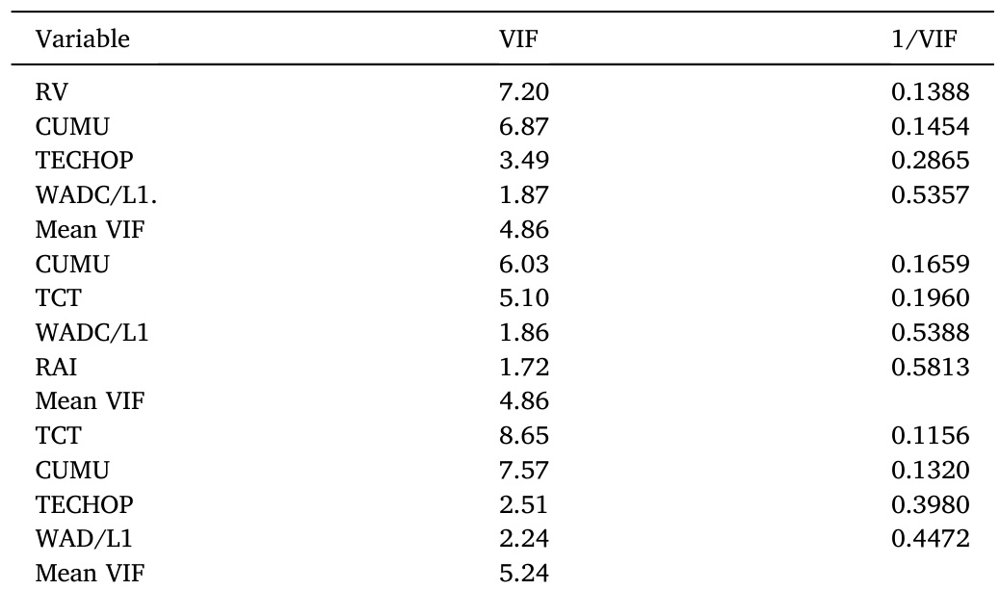
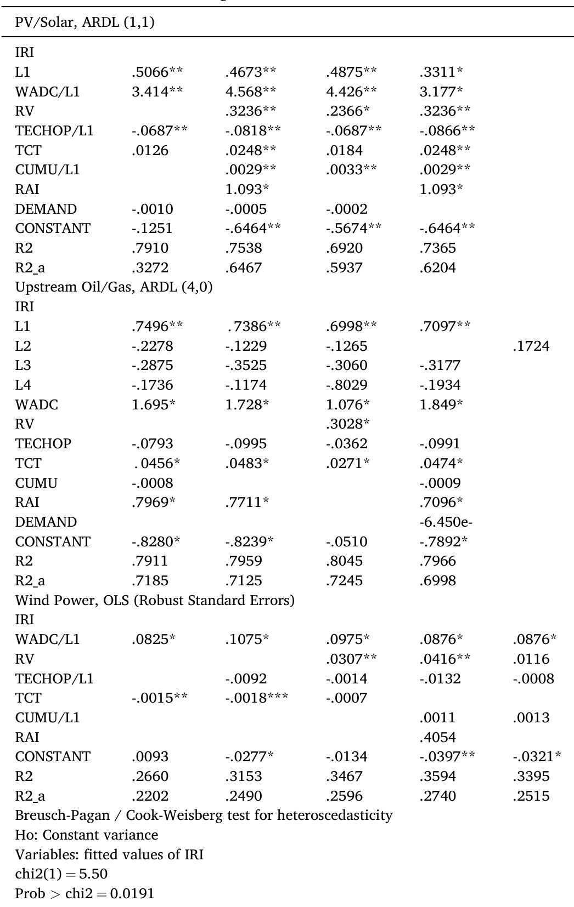
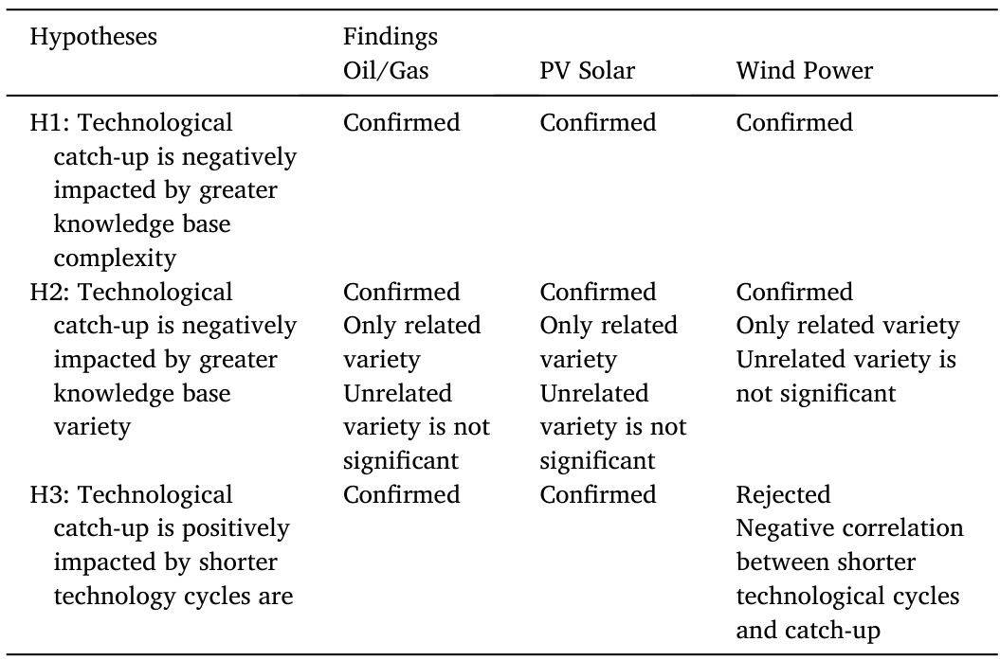

# A dynamic multi-sector analysis of technological catch-up: The impact of technology cycle times, knowledge base complexity and variety  

Alessandro Rosiello a \*, Ali Maleki b  

a University of Edinburgh Business School, UnitedKingdom ResearhIstiefScieceTechlonIdustrilPoli.aifUiversitfTechlan  

# ARTICLEINFO  

JEL Codes:   
F63   
013   
033   
057:Q35:Q42   
Keywords:   
Catch-Up   
Sectoral Systems   
Technological Regimes   
Complexity   
Variety  

# ABSTRACT  

This article contributes to the ongoing debate about whether, how, and under what conditions latecomer countries can become producers of new technology and innovation, thereby catching up with technological leaders. Recent work on sectoral systems of innovation and in the evolutionary economics literature suggests that successful latecomers can move into new technological or industrial domains. They specialise in domains that present more frequent windows of opportunity, shorter technological cycles, flatter learning curves and easier access to relevant knowledge than others. This study investigates the role and significance of two hitherto neglected dimensions of technological regimes that might influence technological catch-up, namely, the degree of complexity and variety of an industry's knowledge base.  

The impact of technological variety and complexity on catch-up dynamics is tested in three industries - upstream oil/gas, wind power and solar energy - over the period from 1980 to 2016. First, we find that increased knowledge base complexity and related (as opposed to unrelated) variety play a substantial role by hindering the latecomers' attempts to catch up with technological leaders within each industry. Second, we confirm that other dimensions of technological regime are relevant. Specifically, we find that the length of the technological cycle is important, although a nuanced picture emerges regarding the direction of its impact on catch-up when results are compared across the three industries. These results offer new insights into the technologies and industries in which latecomer countries can specialise in order to develop their innovation capacity.  

# 1.Introduction  

Over the past twenty years, research efforts have focused on whether, how, and under what conditions latecomers in an interconnected globalised economy can become significant producers of new technology and innovation. Various studies have provided evidence of technological catch-up in diverse industrial and geographical contexts (Kumar and Russel, 2002; Lee and Lim 2001; Mu and Lee, 2005; Lee, 2013). Technological catch-up has been defined as a process by which a latecomer country increases its innovation capacity vis-a-vis the technological leaders (Odagiri et al., 2010). Overall, this literature shows that various waves of technological catch-up have occurred worldwide over thepastfiftyyears.  

Other studies have emphasised the strategic approaches through which firms and industries in newly industrialised countries have succeeded in closing the technological gap with advanced ones. Petralia et al.(2017) show that catching-up countries diversify into technological domains that are proximate to the existing knowledge base, Meliciani (2002) hints at sectors that guarantee higher technological opportunities, and Park and Lee (2006) and Lee (2013) argue that catching-up economies benefit from expanding into domains characterised by shorter technological cycles, as they provide more frequent windows of opportunity and less challenging learning curves. In renewable energy industries, Lema et al. (2020) and Binz et al. (2020) claim that catching up is easier in technologically mature domains that have tradable knowledge and standardised products.  

The literature also discusses the conditions under which catch-up occurs. Lee and Malerba (2017) and Lema et al. (2020) adopt a sectoral systems of innovation (Ssl) perspective to argue that windows of opportunity are opened by technological changes, as well as variations in local and global demand conditions and institutional settings. Latecomers who seek to exploit new windows to catch up can follow different paths. They can overtake incumbent leaders in certain industrial domains, absorb existing knowledge and make progress without matching their innovative performance, build endogenous capacities to catch up with incumbents or fail despite sizeable efforts and investments. The interplay between innovation capacities and the characteristics of an SSI's technological regime, via organisational selection and competition between latecomers and incumbents (Malerba and Nelson, 2012; Lee, 2013, 2019), often proves to be the deciding factor.  

While these contributions are useful in explaining catch-up processes, our understanding of the role of two key dimensions of an SSI's technological regime, knowledge base complexity and variety, remains limited. The complexity of a technological domain has been interpreted in different ways by authors such as Sorenson et al. (2006) and Balland and Rigby (2017). We follow Saviotti (2011) and Krafft et al. (2011) and focus on two characteristics: first, the number of different elements making up the system (knowledge base variety), and, second, the number and strength of the interdependencies among its different elements (knowledge base complexity). Next, we ask how a country's ability to catch up technologically is impacted by the level of variety and complexity intheknowledgebase of thetechnologicaldomains inwhichit operates. Answering this question can offer important clues about the strategic choice of the technologies and industries in which a latecomer country should specialize to develop an innovation capacity.  

To answer the question above, we focus on three industries over thirty-seven years (1980-2016): the relatively older and energy-based industry of upstream oil/gas, and two newer renewable industries, namely wind power and photovoltaic (PV) solar. This is insightful because these three industries have experienced technological expansion as well as competition between new entrants and incumbents over the thirty-seven years, albeit following different technology life cycles and developing distinct innovation geographies. By 2050, renewables will be the largest source of energy accounting for 50 percent of global production (Bloomberg 2019). In PV/solar, countries such as Taiwan and China are already technological leaders (Han and Niosi, 2018; Shubbak,2019).  

Our dataset is rich, providing comprehensive information on patents, patent co-occurrences and patent citations. We construct quantitative indexes of technological catch-up as well as key dimensions of the knowledge base (variety and complexity) to assess their impact on catch-up dynamics. Moreover, we consider for the effect of other dimensions of the technological regime that have already been studied (technology cycle times, technological opportunities, appropriability and degree of cumulativeness) and for changes in global demand. Specifically, we test for Park and Lee's (2006) theory on the advantages of short cycles for catch-up, as Lema et al. (2020) argue it may not apply to all renewable energy industries.  

We provide two main contributions. First, we find that complexity and related (as opposed to unrelated) variety can hinder the catch-up process across different industries. Second, our results confirm the role of other dimensions of technological regime (technological opportunities, cumulativeness and appropriability conditions), except for technology cycle time, for which a more nuanced picture emerges compared to Park and Lee (2006) and Lee (2013, 2019). That is,we show that technology cycle time is a significant factor, but that variations are possible in the direction of its impact on catch-up across industrial sectors.  

The article proceeds as follows. Section 2 reviews the relevant literature on technological catch-up and formulates our research questions and hypotheses. Section 3 describes the industrial context of our research. Section 4 explains our methodological approach. Section 5 describes the evolution of the technological regimes and the catch-up trends in all three industries. Section 6 reports the results of the econometric analysis. Section 7 reflects on our empirical results. Section 8concludes.  

# 2.Theoretical Background and Hypotheses  

This section reviews the literature on technological catch-up, with an emphasis on the interplay between innovation capacities and sectoral conditions. Subsequently, we formulate three research hypotheses: first we posit that technological catch-up is negatively impacted by two key but unexplored dimensions of technological regime - knowledge base variety and complexity; second, we hypothesise that catch-up is positively related to shorter technological cycles (Park and Lee, 2006; Lee, 2013.2019).  

# 2.1.Innovation Systems and Catch-Up  

Since the 1980s, research efforts have focused on how firms, industrial sectors and newly industrialised countries can narrow the technological gap. Building on empirical evidence of technological catch-up (Abramovitz, 1986; Kumar and Russell, 2002), this research has exposed the increase in technological capacity in places like East Asia (Lee and Kim 2001; Mu and Lee, 2005; Hu and Mathews, 2005), Brazil (Figueiredo, 2010, 2014; Dantas and Bell, 2011), Chile (lizuka and Soete 2013; Iizuka and Soete 2013) and India (Awate et al. 2012). A key insight from these studies is that a country's failure to catch up is due to a paucity of advanced skills and innovation capacity rather than a lack of natural resources or labour force.  

Moreover, improved technological and innovation capacities are often the result of conscious strategic decisions to leverage the multiple learning opportunities that arise from being part of global value chains or networks. Mathews (2006) terms the ‘sustained and repeated practice’ of acquiring knowledge and technology using newly established global linkages as“industrial learning’ (p. 314). As domestic firms learn how to specialise in more sophisticated industrial activities, national and local governments can develop sounder institutional, educational and regulatory frameworks, supporting the establishment of innovation systems through time-consistent policies (Malerba and Lee, 2020).  

Prior research was partly conducted at the firm level, making extensive use of case studies (Dantas and Bell, 2011; Chuang and Hobday, 2013; Lee et al. 2015). Other empirical studies have centred on cross-country catch-up, examining the interplay between firm strategies, capabilities and national framework conditions (Lee and Yoon, 2010; Miao et al., 2018). Yet other studies focused on the distinctive features of industrial sectors, addressing disparities in terms of available resources, industry structures and knowledge bases (Malerba and Mani, 2009; Malerba and Nelson, 2011). Lee and Malerba (2017, 2018) propose a cycle of economic catch-up whereby latecomers enter and successfully compete in an industrial sector and, subsequently, are able to build innovation capacity. This can be achieved in market niches in which, given the sectoral conditions, they enjoy a comparative advantage, at a distance from the technological frontier. However, when positions within value chains are upgraded, innovation capacity can also be built and extended (Lee, 2013). Consequently, if windows of opportunity open, such as a new technological paradigm or a business cycle downturn that threatens incumbents (Lee et al., 2014), latecomers can exploit them.  

Malerba and Lee's (2020) evolutionary perspective on catch-up conceives it as a long-term process that unfolds in changing environments and depends on exogenous factors, such as new windows of opportunity, as well as endogenous responses by individual firms and nations. When discontinuities at the SSI level emerge, latecomers with a certain degree of innovation capacity can attempt to displace existing leaders or diversify into new domains. At a country level, catch-up is uneven across different industries as they entail different conditions to succeed. In particular, the characteristics of an industry's knowledge base help to determine which conduits, if any, are available to access the technological knowledge needed to build innovation capacity. Multinational companies (MNCs) are seen as a possible channel for knowledge transfer. Athreye and Cantwell (2007) highlight their internationally networked structures, whereas other authors argue that global production networks can lead to knowledge transfer (Ernst and Kim, 2002) in favour of new players (Saxenian, 2004), triggering catch-up  

# (Dantas and Bell 2012; Lema and Lema, 2012).  

The SSI literature addresses the sectoral conditions under which technological knowledge can be accessed and absorbed.Binz et al (2020) observe that global knowledge transfer is easier in mature renewable industries that rely on tradable knowledge. On the contrary, where large stocks of knowledge are tacit and cumulative, they are problematic to absorb through global networks (Park and Lee, 2006; Mani and Malerba, 2009). Moreover, the closer one gets to the technological frontier, the more difficult it becomes to understand, transform, and implement relevant knowledge (Criscuolo and Narula, 2008; Hu and Mathews, 2005). Intellectual property rights protect advanced codified knowledge, preventing access or making it costly (Jung and Lee, 2010). Besides, absorptive capacity exists in domains related to a country's existing capabilities. Only if advanced capacity already exists can a more complex technological mix be developed (Petralia et al., 2017).  

In summary, from an SSI perspective the dynamics of knowledge regimes interlink with those of the relevant actor-networks. These networks incorporate complementarities in terms of technological domains and forms of industrial specialisation, and their structural features can differ across SSIs (Malerba and Nelson, 2011). The speed and extent to which catching-up countries can access and absorb relevant knowledge will depend on the interplay amongst their existing innovation capacities, the available learning channels and the sector-specific barriers to learning they encounter along the way (Breschi and Malerba, 1997; Lee, 2013.2019).  

# 2.2. Sectoral Factors Influencing Technological Catch-up  

Not all SSIs are the same in terms of a country's ability to achieve technological catch-up, as they shape access to knowledge and technology and their use differently (Lee, 2013; Lee and Malerba, 2017). Nelson and Winter (1982) argued that patterns of innovation are shaped by technological opportunities and appropriability conditions. Breschi et al. (2000) and Malerba (2005) built on this and extended it to further dimensions of the SSI's knowledge base: cumulativeness; generic vs. specific nature with respect to industrial activities; and complexity as defined by two properties: (i) the mix of scientific and applied knowledge and (ii) degree of variety among the functional competences held by industrial firms, such as R&D, engineering or manufacturing. The characteristics of such a defined technological regime can determine the geographical location of the main actors and the spatial boundaries of their innovation activities (Breschi and Malerba, 1997).  

Subsequently, the range of relevant dimensions has been extended to predict catch-up trends. The length of a technological cycle reflects the speed at which technological knowledge becomes obsolete. Being at the front of the technological frontier in SSIs characterised by short cycles can be a short-lived advantage, as new windows of opportunity frequently open. Sectoral domains such as mobile phones, information technologies and semiconductors have these characteristics (Park and Lee, 2006; Lee et al., 2014; Han and Niosi, 2018). The tacit vs. codified nature of the knowledge embodied in new products and services has also been studied. For instance, the pharmaceutical industry is pervaded by codified knowledge which should be easier to access even at a distance. However, its knowledge base is also shaped by long cycles and strong property rights, which hinders catch-up (Malerba and Orsenigo, 2015). Conversely, in wind power the shortening of technological cycles has not yet triggered catch-up due to the high specificity of knowledge and the complexity of the current product architecture (Lema et al., 2020; Dai et al.,2020).  

Thus, technological regimes consist of idiosyncratic combinations of knowledge with distinctive features (Dai et al, 2020), interacting in ways that can make it difficult to predict their concomitant effects on catch-up dynamics (Malerba and Lee, 2020). Over the past three decades the accelerated diffusion of information and transportation technologies has led to the rearrangement of global innovation networks, opening opportunities for catch-up (Saxenian, 2004; Ernst, 2009) in industrial sectors that rely on modular and codified knowledge (Lee, 2019). However, when the expanding knowledge base of an industry is harder to access, decompose and transfer, it has been more difficult to absorb it either locally (Lema and Lema, 2012; Han and Niosi, 2018) or over global networks (Lee and Jung, 2010; Gosens et al., 2017, Binz et al., 2020).  

If an SSI's knowledge base is not only expanding, but also becoming more varied (new technological classes) and more complex (more interdependence between classes), ceteris paribus it can be even more dificult to rely on networks (Herstad et al., 2014), and a stronger innovation capacity will be required to exploit technological opportunities. First, if the variety of a knowledge base increases, a wider range of technological classes contributes to its evolution. Second, if the degree of interdependency between these classes increases, then changes in one component of the knowledge system can impact various other components of the same system (Antonelli, 2011). Thus, access to systemic knowledge is often required (Saviotti, 2011; Huenteler et al., 2016) and diffusion of knowledge over long distances is more challenging, requiring recipients with high absorptive capacity (Sorenson et al., 2006: Krafft et al., 2011: Petralia et al., 2017).  

Knowledge base complexity and variety are two critical dimensions of an industry's knowledge base whose effects on catch-up have, as far as we know, not yet been tested. We argue that technological catch-up can be negatively impacted by a greater level of complexity and variety in an industry's knowledge base. Greater complexity makes access to knowledge more difficult and dynamic coordination failures more likely to occur, requiring individual actors to be able to absorb as well as integrate interdependent bits of knowledge (Park, 2013) to innovate. Latecomers will find it more challenging to develop the learning channels and innovation ecosystems required to build their innovation capacity (Maleki and Rosiello, 2019) and exploit emerging windows of opportunity. By contrast, in the case of technological regimes whose knowledge bases have a less complex and more modular structure, we expect technology transfer to be easier and catch-up to occur more readily (Lee, 2019). Hence, our first hypothesis is:  

# H1. Technological catch-up is negatively impacted by greater knowledge based complexity.  

Latecomers will also find it harder to catch up if the variety of technological classes increases, especially if network relations between old and new classes intensify. Greater variety exemplifies a type of knowledge base evolution for which a higher degree of experimentation is frequently required (Malerba and Lee, 2020; Lema et al., 2020). Especially in industries where technological change is path-dependent, countries with less capacity will find it more difficult to develop the innovation capacity required to diversity into new domains (Mealy and Teytelboym, 2020). In these conditions, greater variety can slow catch-up by hindering the opening of new opportunities for leapfrogging and diversification. This is partly due to the tendency of developed countries to enforce their intellectual property rights in emerging ones (Lee, 2013), leading to less geographical mobility of innovative activities (Maleki and Rosiello, 2019). Hence, our second hypothesis is:  

# H2.  Technological catch-up is negatively impacted by greater knowledgebase variety.  

We also investigate how technology cycle times are related to catchup. Park and Lee (2006) and Lee (2013, 2019) posit that latecomers can seek opportunities for catch-up in new technological classes that are less reliant on existing knowledge bases, as these are most likely to be dominated by advanced countries. They further argue that shorter technology cycles are more likely to disrupt incumbents’ dominance due to their influence on how often new windows of opportunity emerge, if they depend on technological changes (Lee, 2019). Hence, we formalise the following hypothesis:  

H3. Technological catch-up is positively impacted by shorter technology cycle times.  

In testing these hypotheses, we control for the impact on catch up of the degree of knowledge base cumulativeness (Breschi et al. 2002), regime of appropriability (Lee and Kim, 2010) and degree of technological opportunities (Jung and Lee, 2010). Moreover, we test whether the growth of global demand opens new windows of opportunity for catch-up (Shubbak, 2019), as expected in industries such as PV solar with standardised market structures (Han and Niosi, 2018; Binz et al., 2020).  

Our investigation centres on three industries: upstream oil/gas, PV/ solar and wind power. These industries are geo-politically relevant and are often key to a country's ability to diversify its industrial base. Moreover, extraction of oil/gas, generation of renewable energies, and storage activities in all three industries require advanced technical and innovation capabilities (Beyazay-Odemis, 2016, Huenteler et al., 2016). Renewable energies offer increased technological opportunities (Figure 1) to catch up with advanced countries because of the latter's continued dependence on fossil energy systems (Mathews, 2017, Mathews et al., 2018; Lee, 2019). They are in technological ferment (Lema et al., 2020), offering scarce opportunities for path-following catch-up. However, some emerging countries have proven to be receptive to the generation and use of renewable sources, opening new windows of opportunities especially in PV/solar (Hu and Mathews 2012, Han and Niosi.，2018, Shubbak, 2019). By contrast, in countries endowed with abundant natural resources, direct access to these resources often explains their participation in global value chains (Lee and Malerba, 2017, 2018). But although it is based on the extraction and transformation of traditional energy sources, the upstream oil/gas industry also requires increasingly advanced (Figure 1) and context-specific technologies (Malerba and Lee, 2020).  

# 3. Research Context: Three Industrial Sectors  

In this section, we describe some relevant characteristics of the three industries, including distinct industry structures, technological cycles and knowledge bases.  

The oil/gas industry has a relatively long and complex value chain, from exploration and production of crude oil/gas (upstream), to transport and refining (midstream), and ending with refining and retail (downstream). The upstream industry comprises a set of complementary activities: oil and gas exploration, together with heavy oil, condensates and tar sands; developing reserves for extraction over an extended lifetime; and, finally, decommissioning. The industry includes business activities supporting and supplying these main activities. Its supply chain features multiple players, some of whom are vertically integrated, and others who concentrate on particular sub-segments, such as supply and service companies. In terms of innovation patterns, in the 1990s a new class of innovators - integrated service companies such as Schlumberger and Halliburton - emerged (Beyazay-Odemis, 2016) that can cope with increased knowledge base complexity (Maleki et al., 2018).  

Wind power reflects a similar level of complexity in terms of the supply chain structure and the configuration of the production network. Wind turbines are electro-mechanical devices that consist of a multitude of components. The design or physical characteristics of a turbine can often be adapted to the characteristics of the wind-farm site. A principal distinction is between onshore and offshore sites, but average wind speed, characteristics of the terrain and climate, and altitude of the site can also play a key role. The high number of moving components is reflected in very high costs of transportation, operation and maintenance. Production, construction and installation activities are organised as standard industrial processes that involve skilled manual labour and are executed using multi-purpose equipment. Specialist equipment can be employed in the blade manufacturing and installation processes (large moulds and cranes). A restricted number of Original Brand Manufacturers (OBMs) install wind-blades both offshore and onshore, dominating the global value chain. Original Equipment Manufacturers (OEMs) also play a significant role: some European OEMs have design capabilities, whereas the design and innovation capacity of OEMs in emerging markets remains limited (Awate et al., 2012; Schmitz and  

  
Figure 1. Trend of Technological Opportunities  

# Lema. 2015).  

Aside from the turbine and its components, innovation plays a key role in two other areas: wind farm and grid/network development. As new farms (both onshore and offshore) are being built in increasingly dispersed areas, more extensive and efficient grids are being developed, and further progress is anticipated in terms of high-voltage-directcurrent networks for long-distance transmission.Offshore innovation concerns the development of new support and installation structures in deep waters and installation vessels that operate in a wide range of conditions, often with knowledge transfer from the oil/gas industry.  

Over the past ten years, rapid technological development and market growth have contributed to a $50\%$ to $80\%$ decrease in the price of photovoltaic systems, opening the door for further industry growth without the public incentive schemes that were previously necessary. The photovoltaic industry value chain features three segments: 1) upstream - polysilicon materials and wafer production; 2) mid-stream - solar cells and PV module production; and 3) downstream - PV system and installation. PV/solar systems are small and relatively standardised artefacts combined with mounting and tracking structures, plus inverters and control systems, to transfer electricity to the grid (Huenteler et al., 2016). Their product architecture is not complex. They comprise only a few moving parts, which implies lower transportation and maintenance costs. Solar cells are produced in batches of thousands on long, specialised, automated production lines, which require high capital expenditures. The market for solar modules resembles that of mass manufactured commodities. The downstream segment features the top companies in terms of production volume.  

The spatial distribution of extraction and energy generation activities over the thirty-seven-year period is characterised by the search for new reservoirs and suitable sites to install wind farms and photovoltaic systems. New market opportunities have emerged in countries where energy consumption has increased alongside national income. Whilst from a technical standpoint specialised design and engineering capabilities have become necessary to address the heterogeneity of local conditions, distinct regulatory and policy frameworks have proliferated in each industry. In upstream oil/gas, the trend of redistribution of innovative activities can be described as a situation in which ‘exploration and production activities are best conceptualized as hollow or networked projects' (Bridge, 2008, p. 400). However, the spatiality of the global production network is shaped by the complex interplay between the geographical localization of knowledge-intensive activities and the concurrent delocalization of extractive ones (Maleki and Rosiello, 2019).  

In wind power and PV/solar energy, an increasing proportion of production and energy generation activities are located in newly industrialised countries. Supportive policy frameworks to develop local markets have been key, with the direct involvement of local players in both energy generation and distribution. In wind power, for instance, the wind turbine manufacturing market is currently dominated by four global OBMs, one of which is Chinese (GoldWind). If we consider their supply chain for components such as wind blades, over $40\%$ aresupplied by eighteen OEMs, eleven of which are based in Asia. Moreover, expanding opportunities in emerging markets have prompted turbine manufacturers to build production facilities near these markets.  

In recent years Europe's leading role in the photovoltaic market has diminished (Han and Niosi, 2018), falling from $74\%$ of theworld'snew photovoltaic installations in 2011 to $29\%$ in 2013. By contrast, some Asian countries have built significant innovation capacity. China, for instance, has established a whole value chain and now holds a leading position in the global markets (Binz and Anadon, 2018; Shubbak, 2019).  

# 4. Data and Method  

We begin this section by outlining our data, and subsequently address two areas of interest: the model specification in terms of the variables to be included, and the selection of an appropriate functional  

form.  

# 4.1. Data  

While the majority of enquiries into the catch-up process are static comparative analyses among certain countries, Nelson and Malerba (2012) and Lee and Malerba (2017, 2018) call for longitudinal studies across industrial sectors and the embracing of a multi-country perspective. We follow this approach and employ a regression equation to investigate the dynamic interaction between catch-up and technological regime over a thirty-seven-year period, with a focus on knowledge base variety and complexity and technology cycle times, in three distinct technological classes.  

To meet this challenge, we compiled a complete dataset of worldwide patenting in three technological classes from 1980 to 2016. Patent data were obtained from the proprietary Derwent World Patent Index (DWPl) database, which collects data from forty-eight patent offices. Technological classes are defined by DWIP codes: HO1 identifies ^crude Oil and natural Gas', X15A ‘Solar Energy’ and X15B “Wind Energy'. This classification system constitutes a hierarchical categorisation where broad technological areas are broken down into sub-classes. Our analysis is conducted at the 4-digit level, although data have also been disaggregated at the 7-digit level for some indicators (see Appendix 1). Our dataset comprises complete information for 414,130 patents issued between 1980 and 2016, as well as 934,242 citations made to and by these patents.i We use the inventor's country of residence as a proxy for the location where technology activity relating to the invention occurred. To avoid double counting, we exploit information concerning patent families.  

Some critics observe that patents are not always reliable indicators of innovation (Arundel and Kabla, 1998). For instance, they cannot reflect innovation that is not patentable because it consists of personal or organisational know-how. Nevertheless, they are commonly used as indicators of a country's (Griliches, 1998) or a firm's (Gittelman, 2008) innovation efforts. The international business, SSI and economic geography literatures use information about inventors to investigate R&D processes and retrace knowledge flows. In addition, patent citations are frequently employed as proxies for R&D outputs or innovation performance. Unlike a simple counting of patents, patent citations can reflect a patent's quality, as they predict its prominence in an industry's knowledge base. The catch-up literature has extensively used both patent counts and citations to trace knowledge flows (Hu and Jaffe, 2003; Lee and Yoon 2010), investigate catch-up strategies (Hu and Mathews, 2005) and to study the impact of technological regimes on catch-up (Park and Lee, 2006).  

# 4.2. Regression Model  

Here we clarify our model's structure. We start by describing the indexes used to render knowledge base dynamics, among other relevant dimensions of the technological regime, as well as the index used to define our measure of technological catch-up. For a detailed description of the properties of the indexes of variety and complexity, see Frenken et al. (2007) and Krafft et al. (2011), respectively.  

# 4.2.1. Knowledge Base Variety  

We focus on the dynamics of variety, as this is considered an important aspect of the sectoral knowledge base (Boschma and Iammarino, 2009), which provides a basis for inter-sectoral comparisons. Following Frenken et al. (2007), we employ the Entropy Index (Appendix 1) to measure the degree of disorder or randomness in a distribution, assigning higher values where the distribution is more balanced.  

We distinguish between related variety (RV) and unrelated variety (UV). UV is measured as the entropy of the distribution of patents at a four-digit level of disaggregation; its trend over time indicates how diversified each industry becomes across distinct technological classes. The recombination of unrelated knowledge components is considered the cause of radical innovation and long-term growth, especially at regional level (Antonelli, 2011). RV is the weighted sum of entropy for shares of seven-digit subclasses within each four-digit class, showing how diversified an industry becomes within the higher-level classes. Recombining more closely related knowledge is seen as a trigger for more incremental innovation, stimulating higher productivity and growth in the shorter term (Castaldi et al., 2015). In this study, we use the concept of variety to describe the knowledge base configuration of the three sectoral systems.  

# 4.2.2. Knowledge Base Complexity  

One main concern among scholars who employ the weighted average degree of centrality (WADC)(Appendix 2)is the volume of interdependencies and the degree of interaction between elements of a knowledge system (Saviotti, 2011). Connection between these elements is established through their joint utilisation (Krafft et al.,2011). In sectors with high levels of such complexity, new knowledge production depends on the identification and consolidation of complementary components. New functions cannot be served by individual components. Innovation and production activities depend on (i) access to and control of varied knowledge, and (ii) integrative coordination capacity. Successful innovation requires an understanding of the compatibilities among different technological classes within an industry's knowledge base.  

An index of complexity must consider the links and interactions between the different elements of the knowledge base and capture the recombinant nature of knowledge. This is key when an industry's knowledge base develops a co-relational structure composed of nodes and links between these nodes. Nodes are classes of technology and links represent the relationships between the technologies that connect the nodes The WADC index reflects the structure of relationships between different knowledge domains, as network analysis treats knowledge as an integrated system in which both the constituent elements of the system (nodes) and their interactions (links) are studied at the same time. When nodes are formed faster than links are made, the network becomes less connected and complex. Conversely, when the formation of new connections is faster than the appearance of new nodes in the knowledge network, the connectivity and the complexity of the knowledge network increase.  

# 4.2.3. Control Variables: Technological Regime and Global Demand  

Table 1 below describes the five additional variables capturing the characteristics and evolution of the three technological regimes under scrutiny. Following Breschi et al. (2000), Park and Lee (2006) and Lee (2013, 2019), we consider the trend of technological opportunities (TECHOP), the technology cycle times (TCT), the degree of cumulativeness (CUMU) of the technology base, and the regime of appropriability of innovations (RAl) in each class. In addition, we control for the role of global consumption (DEMAND) for each of the three different sources of energy, as authors such as Han and Niosi (2018) argue this is a major opener of windows of opportunity.  

# 4.2.4. Technological Catch-Up Index  

The emergence and rise of new technology producers should be reflected in a dispersion or lower concentration of innovative activities among technological leaders, as measured by indexes of concentration, such as the Herfindahl. As a result, following Athreye and Cantwell (2007), we compute the Herfindahl index as:  

$$
H_{t}=\sum S_{i t}^{2}
$$  

Where $s^{2}i t$ is the technology share of the ith country at time $t$ Change in the concentration index $\Delta H t$ can be decomposed as:  

$$
\Delta H_{t}=\sum_{i}(\Delta S_{i t})^{2}+\ 2\sum_{i}(S_{i t-1}\Delta S_{i t})
$$  

The term $\sum_{i}(\Delta S_{i t})^{2}$ measures the concentration of the change in shares of innovative activities conducted globally, whilst $\sum_{i}(S_{i t-1}\Delta S_{i t})$ measures the linear relationship between initial technology share and the change in that share over time, which is ideal for dynamic analysis. Athreye and Cantwell (2007) call $\sum_{i}(S_{i t-1}\Delta S_{i t})$ an inverse regression index (IRI), as negative values of this index imply a regression towards the sample's mean (i.e. catch-up). We use IRI to measure catch-up at the sectoral level as the sum of the changes in an individual country's technology share weighted by their initial technology share. Variations of IRI become significant particularly when countries whose technology shares change in a given period are also those with an initially large technology share. Countries are ranked on the basis of the change in their share of resident innovators $\left(\varDelta S_{i t}\right)$ between 1980 and 2016 in Table 2, as well as by total patent count (Table 3) in 1980 and 2016.  

# 4.3.Model Specification  

In order to specify the model, we assume that technological catch-up is a function of an industry's technological regime, as the dynamics of different dimensions of the technological regime can either enable the opening and/or exploitation of new windows of opportunity or create new barriers to catch-up. As noted above, our dependent variable for technological catch-up is $\mathrm{IRI}_{t},$ which we measure at the industrial sector level. Negative values of $\mathrm{IRI}_{t}$ signify catching-up periods and positive values reflect periods of consolidation when entry barriers for new countries increase. Our independent variables are technological variety and complexity, alongside other dimensions of technological regime (Table 1) and the change in global consumption. There is no conceptual reason to assume any form of interdependence between the time series of the dependent and any of the independent variables. Thus, given the autoregressive nature of both the dependent and some of the independent variables, we intended to employ a dynamic panel data model comprising three time series (H01, X15A and X15B) to run a GLS regression. However, such a model is not viable, as the results of a Chow test (Table 4) show how the data series in question are too heterogeneous to be pooled together in the same panel.i  

Consequently, we run three separate regressions. Our analysis is based on the results obtained from each regression, as well as a comparison among the three industries. In two of the three models (oil/gas and PV/solar) we lag both the dependent and the independent variables (equation 3).  

Indeed, not only is the $\mathrm{IRI}_{t}$ data series in these industries autoregressive, but we also find that changes in the technological regime's configuration can influence catch-up dynamics with some delay. Neither of the two series presents problems with stationarity, which means autoregressive distributed lag models (ARDL) can be used, with distinct lags depending on the behaviour of each series.  

$$
I R I_{t}=\alpha\ +\sum_{j=1}^{n}\beta_{j}\ I R I_{t-j}+\sum_{j=0}^{n}T e c h\ R e g i m e_{t-j}\ +\sum_{j=0}^{n}\varphi_{j}\ D e m a n d_{t-j}+\quad\mu_{t}
$$  

We study the wind industry using a standard OLS regression (equation 4), as the dependent variable $\mathrm{IRI}_{t}$ is not explained by any of its past lags.  

Table 1 List of Variables (simplified model)   

  

  

However, past lags of some independent variables are included in the regression equation.  

$$
I R I_{t}=\alpha+\sum_{j=0}^{n}\ T e c h\ R e g i m e_{t-j}\ +\ \ \sum_{j=0}^{n}\varphi_{j}\ D e m a n d_{t-j}+\ \ \mu_{t}
$$  

# Where:  

● t stands for time and $j$ for time lag. $I R I_{t}=\sum(S_{t-1}~\Delta S_{t})$   
· Tech $R e g i m e_{t\cdot j}=\lambda_{j}\ \ T E C H O P_{t\cdot j}+\eta_{j}\ \ R A I_{t\cdot j}+\sigma_{j}\ \ R V_{t\cdot j}+\rho_{j}\ \ C U M U_{t\cdot j}+\gamma_{j}$ $T C T_{t-j}+\nu_{j}\ W A C D_{t-j}$  

Table3 Global Ranking (Inventor Country) 1980-2016   

  

# 5. Results: Descriptive Analysis  

Using a longitudinal and multi-country perspective of the catch-up process across diverse industries, we present results concerning (i) the historical trend of the distinct dimensions of the three industries’ technological regime over a thirty-seven-year period, and (i) the trends of technological catch-up.  

Table 4 Chow Test   

  
test_b[TCTP1] $=$ b[TCTP2] $=$ b[TCTP3],notest test_b[wad1] $=$ b[wad2] $=$ b[wad3],accumnotest test _b[d1] $=.$ b[d2] $=$ b[d3], accum $\operatorname{F}(6,\,93)=5.24$ Probability $>\mathrm{F}\,{=}\,0.0001$  

# 5.1.Technological Regime and Global Demand  

Figure 1 shows that upstream oil/gas is a more mature industry, with a sustained trend of growth of technological opportunities. By contrast, for PV/solar and wind power, we observe a major upsurge of inventive activities around the turn of the century, largely due to process innovation in PV/solar and product-type innovation for wind power (Huenteler et al., 2016). Towards the end of the sample period, the growth rate stabilises, and in the case of PV/solar even decreases, a trend probably accentuated by the truncation of reported patent awards and citations.  

Figure 2a presents the trend of related variety, showing that the oil industry experiences an upward trend to the year 20oo, at which point a reverse trend begins that lasts until the end of the period, reflecting a move towards maturity. By contrast, PV/solar and wind power show a trajectory of expansion into technologies related to those already in use, especially since 20oo. This signifies a wave of new technologies being introduced into these industries, for which the existing cognitive bases are essential in terms of their generation and use. The trends of unrelated variety (Figure 2b) present a similar evolution, albeit remarkably different in terms of intensity. In oil/gas, expansion of the search space ends in the mid-1980s. After that, the trend becomes negative, confirming the industry had matured with respect to the range of technological classes it relies upon. By contrast, wind power and PV/solar display a sustained upward trend, showing their continued expansion into domains unconnected with their current technological bases.  

In upstream oil/gas, Figure 3 shows a decrease in the complexity index trend up to the late 1980s, followed by a constant increase until 2002, a subsequent moderate decline over roughly three years and, finally, a more pronounced increase starting in the mid-2o00s, which lasts until the end of the period. PV/solar energy follows a constant path of moderate decline: the expansion of the knowledge base became characterised by weakening systemic interdependence between technological sub-classes. The wind power SSI is characterised by a high level of knowledge base complexity throughout the whole period, an erratic historical trend and several points of discontinuity; a strong tendency to decline can be observed from the late 1990s until 2016.  

Figure 4 shows that the trend of technology cycle times is comparatively constant in oil/gas, while in PV/solar energy it features a marginal increase from a low position until the mid-20o0s and a moderate decrease thereafter. For wind power, we observe a rapidly decreasing trajectory since 1990, albeit starting from a very high position in the  

1980s. Regarding the regime of appropriability (Figure 5), patented knowledge in upstream oil/gas has remained relatively less accessible than in the other two industries. The overall trend in both oil/gas and PV/solar energy is one of increasing openness, whereas it has stayed constant in the wind power sector. The degree of cumulativeness (Figure 6) has increased constantly in all three industries since the mid2000s, with knowledge in upstream oil/gas displaying a consistently higher rate of accumulation during the sample period.  

Finally, consumption of oil/gas has steadily increased across the period, with a small reduction during the early 1980s and 2008-2010. Consumption of wind power and PV/solar energy became more material in the early 2oo0s and continued to increase since (Figure 7).  

This concise account of the evolution of the technological regime in the three industries suggests they have tended to follow idiosyncratic trajectories. Overall, change in the technological regimes is characterised by (i) a general increase in technological opportunities, which happens at a different pace and at different points in time in the three industries; (ii) moderate growth of the cumulativeness index from the mid-2oo0s, although each industry starts from a markedly different position; and (i) increasingly open regimes of appropriability, again starting from different positions and advancing at markedly different paces. We also observe a progressive increase in global energy consumption.  

We cannot identify any other clear element of similarity. However, we can make two further remarks. First, in both PV/solar and wind power we observe on the one hand steady or declining complexity starting in the mid-1990s, and, on the other hand, an increase in knowledge base variety over the whole period. The reverse is true for upstream oil/gas. Different phases can be observed in the trends of the two variables, but overall, complexity increases over the entire period, whereas related variety remains relatively stable. Second, the trend of the TCT index is similar and remarkably flat for both upstream oil/gas and PV/solar energy, in contrast with the stark decline seen in wind powersince1990.  

# 5.2. Assessing Periods of Technological Catch-Up  

While the trend of patenting rose significantly over the entire period (Figure 1), Figure 8 shows that the number of countries actively patenting in the dataset stabilised around the late 20oos in all three industries. The post-2012 decline in PV/solar is more difficult to interpret, as it may be partly due to the truncation of reported patent awards.  

  
Figure 2. a: Related Variety. b: Unrelated Variety  

Figure 9 shows the trend of the Herfindahl Index for international geographical concentration of patents in the three industries. In PV/ solar, consistent with an increase in the number of innovators, concentration decreases throughout the entire period. However, Figure 10 shows that a catch-up trend did not materialise until the mid-1990s. By 2016, clusters of innovators existed in various countries, with an expansion in the past twenty in Asia (South Korea, China and Taiwan; see Table 2), a decline in Europe and a tendency to stay resilient in the  

# US (Han and Niosi, 2018).  

In upstream oil/gas, concentration (Figure 9) constantly decreases until the end of the 1990s, when the trend briefly reverses, and then decreases again until 2016. The trend of technological catch-up (Figure 10) reflects that of concentration and, starting in 2010, it becomes almost neutral. On the one hand, the continuous search for new reservoirs led to the emergence of new innovators (Figure 8) and up to the late 1990s (Bridge, 2008) lower concentration. The reversed catch-up trend that followed reflects the consolidation of integrated service companies as technological leaders, with HQs in advanced countries (Beyazay-Odemis, 2016).  

  
Figure 4. Technological Cycle Time  

The trend of international concentration (Figure 9) is comparatively lower but more stable in wind power, with a period of moderate dispersal between 1985 and 1995, and a subsequent period of consolidation in terms of the share of patents assigned to different countries, as key technological leaders have maintained the bulk of their R&D activities in Europe. The trend of catch-up (Figure 10) is relatively stable but tendentially negative from the mid-1990s. Particularly when compared to their Asian counterparts, Europe's leading firms seem to have deeper and broader knowledge bases and technological capabilities, preserving their position as technological leaders (Zhou et al., 2015; Schmitz and Lema, 2015; Nordensvard et al., 2018).  

  
Figure 6. Cumulativeness  

In summary, the trend of $\mathrm{IRI}_{t}$ is related to that of concentration. For each technological class, $\mathrm{IRI}_{t}$ (Figure 10) shows periods of catch-up (negative values of IRl)followed by periods of more pronounced divergence. In upstream oil/gas, the intervals from the early 1980s to late 1990s and from 2007 to 2016 reflect a loss of patent shares by technological leaders in favour of new patentees. PV/solar presents a similar trend from the mid-90s until 2016, whereas the wind power SSI is characterised by a more stable trajectory with catch-up between 1985 and 1995, and a reverse tendency during the rest of the period. Overall, we could not identify any clear element of similarity or even regularity among the three catch-up trends based on the graphical inspection of  

  
Figure 8. Number of Countries Obtaining Patents  

# figure 10.  

# 6. Regression Results  

Tables 5 and 6 show the results for the correlation and multicollinearity tests. The PV/solar data series presents multicollinearity between RAI and WADC and between RAI and TCT. In wind power, we find the indexes of demand and TCT are strongly correlated with each other and three other variables: related variety, unrelated variety and cumulativeness. The sign of the correlation between TCT and WADC is negative in PV/solar energy and positive in wind power, confirming once again that different dynamics shape the technological regimes. The wind power OLS model utilises robust standard errors, as a Breush-Pagan test shows heteroscedasticity of residuals.  

  
Figure 9. International Geographical Concentration of Innovative Activities  

  
Figure 10. Inversed Regression Index  

Table 7 presents the results of an OLS model that explains catch-up in wind energy with one-period-lagged values of one explanatory variable (complexity), an ARDL model (4,0) for oil/gas and an ARDL model (1,1) for PV/solar. We report results separately for each industry in a matrix form, with column headings indicating the explanatory variables included in each regression. Results for unrelated variety are not shown as it is never statistically significant. Table 8 summarises our hypotheses and respective findings for each industry.  

Table 5 Correlation Table   

  

Table 6 VIF Test   

  

# 6.1. PV/Solar  

The results of the ARDL model (Table 7) reveal that $\mathrm{IRI}_{t}$ is affected by its own lagged values (one-year), suggesting that catch-up in this industry is a path-dependent process. In all tested models, both RV and WADC are significantly and positively correlated with $\mathrm{IRI}_{t},$ showing that a knowledge base that expands into new domains that are technologically related to existing classes $\left(\mathrm{RV}_{t}\right)$ and is characterised by increasing systemic complexity $(\mathsf{W A D C}_{t-l})$ hinders technological catch-up, the latter with a one-year lag. These results confirm H1 and H2 (Section 2.2).  

We also find that when the degree of cumulativeness increases $(\mathrm{CUMU}_{t-T}$ : positive and significant), a latecomer country will find it harder to close the technological gap. Shorter technological cycles (TCTt), a less stringent regime of appropriability $\mathrm{(RAI_{\mathrm{t}})}$ positive and significant) and higher technological opportunities $(\mathrm{TECHOP}_{t-1})$ appear to induce catch-up, the latter with a one-year lag.  

These results confirm the significance of barriers to catch-up. Catchup dynamics are negatively affected by complexity and path dependence. Looser appropriability conditions (Lee, 2013; Lee and Malerba, 2017) and shorter technological cycles (Park and Lee, 2006) favour catch-up (H3 is also confirmed). In line with Meliciani (2002) but contrary to Lee (2013), latecomers are found to benefit from increasing technological opportunities.  

# 6.2.Upstream Oil/Gas  

We find similar results to PV/solar regarding the role played by past lagsof $\mathrm{IRI}_{t}$ and the independent variables $W\mathbf{ADC}_{t}$ and $\mathrm{RV}_{t}.$ We find a oneyear-lagged value of the dependent variable $(\mathrm{IRI}_{t-l})$ to be significant, regardless of the model configuration selected. Both the degree of knowledge base complexity and variety time are positively correlated with $\mathrm{IRI}_{t},$ which means that increasing complexity and related variety are found to hinder technological catch-up.  

Regarding other dimensions of technological regime, $\mathrm{TCT}_{t}$ and ${\mathrm{RAI}}_{t}$ are both positive and significant, which means that shorter cycles favour catch-up whereas a stronger regime of appropriability hinders it. Overall, these results confirm our research hypotheses (Section 2.2) that complexity (H1) and related variety (H2) can hinder catch-up even in industries characterised by increasing technological opportunities. The degree of knowledge base cumulativeness does not play any significant role. Our third hypothesis (H3) that shorter technological cycles can favour catch-up is confirmed (Park and Lee, 2006).  

# 6.3.Wind Power  

Table7 Results of the Econometric Regressions   

  
\* ${\tt p}{<}0.05$ \*\* ${\tt p}{<}0.01$ ，\*\*\* ${\tt p}{<}0.001$  

Table 8 Summary of Hypotheses and Findings   

  

role played by increasing complexity: WADC is significantly and positively correlated  with $\mathrm{IRI}_{t},$ confirming  that  increasing systemic complexity $(\mathsf{W A D C}_{t-1})$ hinders technological catch-up with a one-year lag (Hl). We also confirm the difficulty of catching up in industries that expand into related technological classes $\left(\mathrm{RV}_{t}\right)$ positive and significant; H2).  

The rate of change of technological opportunities $(\mathrm{TECHOP}_{t-1})$ does not support the entry of new innovators; shorter technological cycles do not facilitate technological catch-up, as the coefficient of $\mathrm{TCT}_{t}$ is negative and becomes significant in an equation including $\mathrm{WADC}_{t-T}$ ,which means that H3 is rejected. While Lall (2000) and Lee et al. (2014) concur that technologies with shorter cycles can sometimes truncate learning processes, at an empirical level we explain this result by observing that a marked reduction in the length of technological cycles starting in 1990 (Figure 4) coincides with a consolidation of the dominant position of leading OBMs. Despite the entry of new actors (Figure 8; Table 2), in wind power the international spread of innovative activities has not accelerated (Figure 9; Table 3), starting from a relatively low position. Until 2012, systemic complexity remained higher than in PV/solar and upstream oil/gas (Figure 3); OBMs in advanced countries have maintained control over systemic patents that are connected with other sub-systems within the industry's knowledge base (Huenteler et al., 2016).  

# 7. Discussion  

Overall, the trend of patenting has increased significantly since the late 1980s. Despite the different trends of knowledge base complexity and related variety in the three sectors, both are shown to exert a significant influence on catch-up dynamics (Table 7). Such a result holds, despite the structural differences among the three knowledge systems and their distinct evolutionary trajectories. First, this confirms our first research hypothesis (Section 2.2) by providing the novel insight that complex interactions between technology classes in the context of an expanding knowledge base can hinder the catch-up process. When the technological frontier moves faster, catch-up in the presence of high technological complexity could be problematic. Second, the concurrent significance of related variety and cumulativeness shows they can also form strong barriers to catch-up, evoking path dependence in the evolution of the knowledge base. Catch-up is harder in industries where technological change builds on innovations closely related to existing classes, which confirms our second hypothesis, or innovators persist in registering patents within the same technological domains (Park and Lee, 2006: Petralia et al., 2017: Lee and Malerba, 2018).  

These results hold especially when a country moves closer to the technological frontier, where technological leaders assert their intellectual property rights more rigorously (Criscuolo and Narula, 2008; Awate et al., 2012; Lee, 2013). Indeed, although we generally observe an increasing openness of the appropriability regimes, the degree of appropriability is negatively correlated with technological catch-up. Our findings are less straightforward with regard to technology cycle times. In PV/solar and oil/gas they confirm Park and Lee's (2006) and Lee's (2013, 2019) theory that shorter cycles favour catch-up. Results of the econometric analysis in wind power, however, point in the opposite direction. Here, the shortening of technological cycles initiated in 1990 did not trigger technological catch-up, as the latter occurred only until 1994 (Figure 10). Such a result provides interesting empirical evidence to challenge the assumption that faster change in technological knowledge promotes the building up of innovation capacity by latecomers.  

As argued by Malerba and Nelson (2011), Lee and Malerba (2017) and Lee (2019), different kinds of actors, technological regime dimensions and institutions can affect the catch-up process in different sectors globally. Our results capture these cross-sectoral variations and specificity, whereas previous empirical analysis helps us explain the origins of such heterogeneity. In upstream oil/gas, up to the late 1990s inventive activities became increasingly spread as the geographic scope of the search for new reservoirs expanded, and new innovators emerged, such as Norway, Brazil, Russia, and Saudi Arabia (Figure 9; Tables 2,3). However, since the early 1990s, a prolonged period of low prices (which extended until the mid-2000s) coincided with the progressive exhaustion of easily accessible reservoirs. Innovative solutions around upstream operations had to be found (Hassani et al., 2017). Integrated service companies invested heavily to develop ‘highly specialized design and engineering capabilities to develop technological solutions capable of addressing the heterogeneity of exploration conditions and reservoir types’ (Bridge, 2008, p. 407). Consequently, while catch-up from the early 1980s had been the result of R&D internationalisation by ‘Oil Majors’ and the creation of state-owned MNCs with R&D capacity such Statoil, Petrobras or Rosneft, the reverse trend since the late 1990s coincided with the emergence of integrated service providers (Figure 10). With HQs in developed countries, they took control of the global R&D operations emerging from an increasingly complex knowledge base (Beyazay-Odemis,2016; Berenzoy,2019).  

The wind power sector is undergoing consolidation, driven by global wind turbine manufacturers acquiring existing OEMs. Up to 2016, Asian firms have been competitive in their domestic markets, but they have not succeeded in building sufficient innovation capacity to compete with global leaders (Lam et al.,2017). Wind turbines are complex and design-intensive products, which are now integrated with other sources of renewable energy, installed offshore, and employ advanced digital technologies (Dai et al,2020). OBMs in advanced countries control systemic patents and engineering know-how that are key for their development and installation (Huenteler et al., 2016; Haakonsson and Slepniov, 2018). Similar to oil/gas, knowledge development requires user-producer interaction to adapt wind farms to the morphology of local environments, which makes it less geographically mobile. European engineering service providers help Asian OEMs to bridge the technological gap, but do not possess systemic knowledge (Haakonsson et al.,2020).  

By contrast, in PV/solar energy we observe increased market adoption and diffusion of technological capacity in emerging countries thanks to a combination of successful innovation policies (Gosens et al., 2017） and technological upgrading in the local private sector (Binz et al., 2017; 2020). An increasingly varied knowledge base with weak interdependence among technological classes (Figures 2a,b and 3) has helped countries such as China, Taiwan and South Korea to catch up (Tables 2 and 3). New players have been able to intercept growth, first in global demand (Shubbak, 2019),and then in local markets (Han and Niosi, 2018). China, in particular, is a new technological leader (Table 3). In the 1990s, Chinese companies started to produce PV modules through technology acquisition from more advanced countries and favourable cost conditions. They then developed global competitiveness via vertical integration, thanks to flexibility of production and collaborations with global centres of excellence (Zhang and Gallagher 2015; Lacasa and Shubbak, 2018).  

When comparing the processes of technological transfer in PV/solar and wind power, especially in Asia, differences in trends of complexity and related variety contribute to their divergent patterns, resulting in distinct catch-up dynamics. Asian firms first entered PV module manufacturing through technology acquisition, and then progressively upgraded their strategic position. They initially relied on existing knowledge bases in lateral sectors but quickly acquired vital processrelated knowledge. Tacit knowledge transfer happened via relocation of human resources and direct cooperation with international partners. By contrast, catching up in wind power requires in-depth understanding of complex systems and products and the transfer of design- or productspecific knowledge. Intra-firm channels are the dominant mode of knowledge transfer, as MNCs built capacity in foreign markets by setting up wholly owned subsidiaries. Some knowledge has been transferred via providers of engineering services, but it has not been enough to catch up.  

Annual changes in global consumption do not significantly affect catch-up dynamics in any of the three industries. This result calls for further investigation, particularly in PV/solar, where catch-up by Asian firms is often explained in terms of their ability to link to expanding global markets as well as exploit domestic demand (Zhang and Gallagher, 2016; Han and Niosi, 2018).  

# 8. Concluding Remarks  

This paper adopts an SSI perspective to investigate the dynamics of technological catch-up in three industries. First, we describe the evolution of the three industries’ technological regime and assess past catch-up trends. Second, we assess whether and to what extent the evolution of the technological regime affects the catch-up process. Our novel approach uses a data series covering a thirty-seven-year period and compares results across three industries using a multi-country perspective. We focus on two dimensions of an SSI's technological regime that relate to its knowledge base, variety and complexity, although we also consider length of technological cycle, knowledge cumulativeness, the role of the regime of appropriability and change in energy consumption globally. Following Athreye and Cantwell (2007), catch-up trends have been measured as changes in the degree of geographical concentration (or dispersal) of a country's innovation capacity associated with its patent shares, which we then aggregate at the industrylevel.  

Regarding the evolution of the technological regime in each of the three industries, we observe elements of similarity as well as noticeable divergence. Although we employ different econometric models to study the effect of change in technological regime dimensions and demand conditions on catch-up in these industries, we find that increased knowledge base complexity and related variety represent a significant barrier to catch-up in each of them; whereas unrelated variety does not exert any significant influence. Other dimensions of technological regime can also hinder the catch-up process by reinforcing the position of technological leaders, although their significance varies depending on the industrial sector. Park and Lee's (2006) and Lee's (2013, 2019) theory that technological gaps can be reduced more quickly in sectors with shorter cycles is confirmed only in the upstream oil/gas and PV/ solar sectors; in wind power our findings point in the opposite direction. This reveals a more complex picture as compared with these theories of technological catch-up. The direction and intensity of the statistical relationship between technological catch-up and changes in some features of the learning environment can be industry specific.  

In oil/gas, the regime of appropriability has become progressively looser. However, we also observe increasing complexity and variety, longer technology cycle times and path dependency, which hindered catch-up (Maleki and Rosiello, 2019). PV solar, like other sectors such as biomass and hydropower, has evolved into a mature sector relying on tradable knowledge and established standards, in which technological upgrading was initially achieved through global knowledge transfer (Binz et al., 2017, 2020). Our results corroborate this theory, adding two factors that favoured catch-up: shorter technology cycle times than in the other two industries, which have been shortening since 2005; lower knowledge base complexity, decreasing across the whole period.  

In wind power, a regime of loose appropriability has coincided with a decline in technology cycle times over the entire period. However, cycle times stayed longer than in the other two industries for most of the thirty-seven-year period. In parallel, variety continued to increase and, until 2012, complexity remained higher (Hunteler et al., 2016). Specifically, the uptake of digital technologies (Dai et al.，2020） has contributed to shortening cycle times as well as increasing variety and complexity. The interplay between these variables explains why our results are at odds with Park and Lee (2006), showing that complex and varied knowledge bases can hinder catch-up even if technology cycles are shortening. This is plausible especially in sectors characterised by complex product architecture, user-producer interaction and context-specific knowledge, as technological upgrading requires more experimentation (Lema et al., 2020) and knowledge integration capacity (Park, 2013). Overall, our findings prove that studying the interaction between different dimensions of technological regime is crucial to explain catch-up dynamics (Malerba and Lee, 2020).  

Our analysis is conducted in the context of three energy industries, in which the extraction of oil/gas, generation of renewables, and storage activities often rely on advanced technologies. Even if advanced technologies are used in situ and adjustments to local circumstances are necessary, building capacity may be more difficult when targeting industries with complex interactions or a high level of relatedness among the technological classes forming their knowledge base. This has important implications for industrial strategy, as innovation policies and institutional changes must be efficiently timed to enable the exploitation of emerging windows of opportunity (Malerba and Lee, 2020). However, if a knowledge base is complex and context-specific and its frontier is constantly shifting, it can take longer for latecomers to build the innovation ecosystem required to skip developmental stages or to diversify into new technological domains. Research in industries other than those considered therein should be conducted before extending this conclusion.  

Like other studies that use longitudinal patent data, our study has some limitations. As noted earlier, patents are used in the literature as indicators of technological change and performance in terms of new technologies, processes and products. However, they cannot capture all forms of innovation, and systematic biases in data are possible. For instance, they cannot be used to study the evolution and diffusion of a tacit knowledge base. Furthermore, in the three industries under consideration, it is important to observe that a significant portion of the development occurs in the field. In particular, hydrocarbon reserves or wind-farm sites have distinctive characteristics. Although new technology is conceived in the lab,adaptations to local conditions are frequently needed. Moreover, the scope of a firm's patenting strategy may differ from country to country depending on the length of time and level of protection offered by patent law, which affects an innovator's incentive to rely on patents over other forms of safeguard. Finally, propensity to patent can also vary significantly across technological classes.  

Despite these potential problems, patents are frequently used in terms of technological catch-up, while our results are based on analysis of trends rather than absolute levels of specific variables, which reduces the risk of systematic errors. Lerner and Seru (2017) also remind us of the problem of truncation of reported patent awards and citations, affecting estimates of time trends and patterns across technology classes. To mitigate it, we only include in our dataset patents issued by the end of  

2016, but we use citations of these patents until the end of 2017.  

We see the potential to use a similar methodological approach in future research. One way to pursue this would be to link the sector-level analysis with firm-level observations, with a view to offer a multi-level perspective on technological catch-up using a value chain approach. Furthermore, we envisage the possibility of constructing new independent variables to produce a longitudinal and multinational fine-grained analysis that explains not only how latecomers catch up, but also why they become technological leaders. Finally, we posit that a similar methodological approach could be used to model the opening of new windows of opportunity and study their effects on catch-up dynamics, particularly due to changes in regulatory frameworks.  

# Author Statement  

Rosiello A and Maleki A worked together on the conceptualisation of this article, developing the main ideas, and defining the overarching research goals and aims. Rosiello was particularly active in reviewing the relevant literature and articulating the research question.  

Rosiello was responsible for managing and coordinating the overall research activity.  

Rosiello acquired the dataset.  

Maleki A was responsible for curing the patent data used in the analysis. The two authors jointly designed the methodological approach and collaborated in the determination of a suitable specification for the empirical model. Maleki conducted the econometric analysis with constantfeedbacksfromRosiello.  

Rosiello was responsible for the interpretation of the results; Maleki aided by reviewing the outcomes of the interpretation. Rosiello wrote the manuscript with inputs from Maleki and presented it at international conferences. Maleki designed figures and tables.  

# Declaration of Competing Interest  

The authors declare that they have no known competing financial interests or personal relationships that could have appeared to influence the work reported in this paper.  

# APPENDIX 1. Variety Index  

We refer to the concept of entropy to study the sources of dynamics in variety as measured by the total variety (TV) index. Let $C_{g}$ refer to technological classes at the $n$ digit level, where $g\!=\!1...0$ . All sub-classes i at disaggregated level (7-digit) fall under one 4-digit class, due to the structure of hierarchical classification systems. Therefore, the share of patents in 4-digit classes $P_{g}$ is given by the sum of $p_{i}$ shares of patents in the 7-digit subclasses:  

$$
P_{g}=\sum_{i\in C_{g}}p_{i}
$$  

Unrelated variety is obtained from the entropy index formula based on the shares at the 4-digit level $(P_{g})$  

$$
U V=\sum_{g=1}^{G}P_{g}\mathrm{ln}\biggl(\frac{1}{P_{g}}\biggr)
$$  

weighted sum of entropy for shares of 7-digit sub-classes $\left(p_{i}\right)$ within each 4-dig  

$$
R V=\sum_{g=1}^{G}P_{g}V_{g}
$$  

# Where:  

$$
V_{g}=\frac{p_{i}}{P_{g}}\mathrm{ln}\left(\frac{1}{p_{i}/P_{g}}\right)
$$  

# APPENDIX 2. WADC  

We employ social network analysis to measure complexity. A co-occurrence matrix of technological classes is formed to represent the knowledge network in which the value of each cell is the number of inventions for which two technological classes appear as joint (Krafft et al., 2011). The degree of centrality measures the strength of the level of connectivity of a node. Formally, degree of centrality (DC):  

$$
D C_{n}=\sum_{N\neq n}l_{n i}
$$  

Where $n$ represents the nodes and lrepresent the links. The degree of centrality is defined as the number of links between a node and other nodes in the network.Because $D C$ is affected by the network size, we construct a normalized proxy by dividing it by its maximum value:  

$N D C=\textit{D C}_{n}~/~\mathrm{~}(N-1)$  

In order to create a measure of connectivity at the level of a network, we rely on the average of the degree of centrality of all nodes in the network. Due to the highly unequal strength of the nodes in a network, Krafft et al. (2011) use the average measure of degree of centrality weighted by relative frequency, i.e. the number of patents in the class $n$ $[P_{n}]$ divided by the total number of patents:  

$$
W\!A C D=\sum_{n}\left[\!N\!D{\cal C}_{n}\ \times\left(P_{n}\,\middle/\ \sum_{n}\!P_{n}\right)\!\right]
$$  

# References  

Abramovitz, M., 1986. Catching up, forging ahead, and falling behind. The Journal of Economic History 46 (2), 385-406.   
Antonelli, C., 2011. Handbook on the economic complexity of technological change. Edward Elgar Publishing.   
Arundel, A., Kabla, I., 1998. What percentage of innovations are patented? Empirical estimates for European firms. Research Policy 27 (2), 127-141.   
Athreye, S., Cantwell, J., 2007. Creating competition? Globalisation and the emergence of new technology producers. Research Policy 36 (2), 209-226.   
Awate, S., Larsen, M.M., Mudambi, R., 2012. EMNE catch-up strategies in the wind turbine industry: Is there a trade-off between output and innovation capabilities? Global Strategy Journal 2 (3), 205-223.   
Balland, P.A., Rigby, D., 2017. The geography of complex knowledge. Economic Geography 93 (1), 1-23.   
Bereznoy, A., 2019. Catching-up with supermajors: the technology factor in building the competitive power of national oil companies from developing economies. Industry and Innovation 26 (2), 127-157.   
Beyazay-Odemis, B., 2016. The nature of the firm in the oil industry: International oil companies in global business. Routledge, NT-Oxford.   
Binz, C., Tang, T., Huenteler, J., 2017. Spatial lifecycles of cleantech industries-The global development history of solar photovoltaics. Energy Policy 101, 386-402.   
Binz, C., Anadon, L.D., 2018. Unrelated diversification in latecomer contexts: Emergence of the Chinese solar photovoltaics industry. Environmental Innovation and Societal Transitions 28, 14-34.   
Binz, C., Gosens, J., Yap, X.S. and Yu, Z., 2020. Catch-up dynamics in early industry lifecycle stagesa typology and comparative case studies in four clean-tech industries. Industrial and Corporate Change, forthcoming. htps:/www.bloomberg. com/news/articles/2019-06-18/the-world-will-get-half-its-power-from-wind-andsolar-by-2050 - accessed on 01-03-2020.   
Boschma, R., Iammarino, S., 2009. Related variety, trade linkages, and regional growth in Italy. Economic geography 85 (3), 289-311.   
Bridge, G., 2008. Global production networks and the extractive sector: governing resource-based development. Journal of Economic Geography 8 (3), 389-419.   
Breschi, S., Malerba, F., 1997. Sectoral innovation systems: technological regimes, Schumpeterian dynamics, and spatial boundaries. In: De la Mothe, J (Ed.), Systems of innovation: Technologies, institutions and organizations. Routledge, pp. 130-156.   
Breschi, S., Malerba, F., Orsenigo, L., 2000. Technological regimes and Schumpeterian patterns of innovation. The Economic Journal 110 (463), 388-410.   
Castaldi, C., Frenken, K., Los, B., 2015. Related variety, unrelated variety and technological breakthroughs: an analysis of US state-level patenting. Regional studies 49 (5), 767-781.   
Criscuolo, P., Narula, R., 2008. A novel approach to national technological accumulation and absorptive capacity:aggregating Cohen and Levinthal. The European Journal of Development Research 20 (1), 56-73.   
Chuang, Y.S., Hobday, M., 2013. Technological upgrading in Taiwan's TFT-LCD industry: signs of a deeper absorptive capacity. Technology Analysis & Strategic Management 25 (9), 1045-1066.   
Dai, X., Li, Y., Haakonsson, S, Oehler, L, 2020. Catching up through green windows of opportunity in an era of technological transformation: Empirical evidence from the Chinese wind energy sector. Industrial and Corporate Change. forthcoming.   
Dantas, E., Bell, M., 2011. The Co-Evolution of firm-cantered knowledge networks and capabilities in late industrializing countries: The case of Petrobras in the offshore oil innovation system in Brazil. World Development 39 (9), 570-1591.   
Ernst, D., Kim, L., 2002. Global production networks, knowledge diffusion, and local capability formation. Research Policy 31 (8-9), 1417-1429.   
Ernst, D., 2009. A new geography of knowledge in the electronics industry? Asia's role in global innovation networks. East-West Center Policy Studies series $\#54$   
Frenken, K., Van Oort, F., Verburg, T., 2007. Related variety, unrelated variety and regional economic growth. Regional studies 41 (5), 685-697.   
Gittelman, M., 2008. A note on the value of patents as indicators of innovation: implications for management research. The Academy of Management Perspectives 22 (3), 21-27.   
Gosens, J., Hedenus, F., Sandén, B.A., 2017. Faster market growth of wind and PV in late adopters due to global experience build-up. Energy 131, 267-278.   
Griliches, Z., 1998. Patent statistics as economic indicators: a survey. R&D and productivity: the econometric evidence. University of Chicago Press, pp. 287-343.   
Hakonsson, S.J., Slepniov, D., 2018. Technology transmission across national innovationsystms:TherlefDanishsuliersinupgrading thewindeney industry in China. The European Journal of Development Research 30 (3), 462-480.   
Haakonsson, S., Kirkegaard, J.K., Lema, R., 2020. The decomposition of innovation in Europe and China's catch-up in wind power technology: the role of KIBS. European Planning Studies 1-19.   
Han, X., Niosi, J, 2018. The revolution in energy technology: Innovation and the Economics of the Solar Photovoltaic Industry. Edward Elgar Publishing.   
Hassani, H., Silva, E.S., Kaabi, A.M., 2017. The role of innovation and technology in sustaining the petroleum and petrochemical industry. Technological Forecasting and Social Change 119, 1-17.   
Herstad, S.J., Aslesen, H.W., Ebersberger, B., 2014. On industrial knowledge bases, commercial opportunities and global innovation network linkages. Research Policy 43 (3), 495-504.   
Hu, M.C., Mathews, J.A., 2005. National innovative capacity in East Asia. Research Policy 34 (9), 1322-1349.   
Hu, A.G., Jaffe, A.B., 2003. Patent citations and international knowledge flow: the cases of Korea and Taiwan. International Journal of Industrial Organization 21 (6), 849-880.   
Huenteler, J., Schmidt, T.S., Ossenbrink, J., Hoffmann, V.H., 2016. Technology life cycles in the energy sector-Technological characteristics and the role of deployment for innovation. Technological Forecasting and Social Change 104, 102-121.   
Iizuka, M., Soete, L., 2013. Catching up in the 21st century: Globalization, knowledge and capabilities in Latin America, a case for natural resource-based activities. In: Dutrenit, G., Lee, K, Nelson, R., Vera-Cruz, A.O., Soete, L. (Eds.), Learning, Capability Building and Innovation for Development. Palgrave Macmillan, London.   
Jung, M., Lee, K, 2010. Sectoral systems of innovation and productivity catch-up: determinants of the productivity gap between Korean and Japanese firms. Industrial and Corporate Change 19 (4), 1037-1069.   
Krafft, J., Quatraro, F., Saviotti, P., 2011. The knowledge base evolution in biotechnology: a social network analysis. Economics of Innovation and New Technology 20 (5), 445-475.   
Kumar, S., Russell, R.R., 2002. Technological change, technological catch-up, and capital deepening relative contributions to growth and convergence. American Economic Review 92 (3), 527-548.   
Lacasa, I.D., Shubbak, M.H., 2018. Drifting towards innovation: The co-evolution of patent networks, policy, and institutions in China's solar photovoltaics industry. Energy Research & Social Science 38, 87-101.   
Lam, L.T., Branstetter, L., Azevedo, I.M., 2017. China's wind industry: Leading in deployment, lagging in innovation. Energy Policy 106, 588-599.   
Lee, K., 2013. Schumpeterian analysis of economic catch-up: Knowledge, path-creation, and the middle-income trap. Cambridge University Press.   
Lee, K., 2019. The art of economic catch-up: Barriers, detours and leapfrogging in innovation systems. Cambridge University Press.   
Lee, K., Kim, Y.K., 2010. IPR and technological catch-up in Korea. In: Odagiri, H., Goto, A., Sunami, A., Nelson, R.R. (Eds.), Intellectual Property Rights, Development, and Catch Up: An International Comparative Study. Oxford University Press.   
Lee, K., Park, T.Y., Krishnan, R.T., 2014. Catching-up or leapfrogging in the Indian IT service sector. Development Policy Review 32 (4), 495-518.   
Lee, K., Malerba, F., 2017. Catch-up cycles and changes in industrial leadership: Windows of opportunity and responses of firms and countries in the evolution of sectoral systems. Research Policy 46 (2), 338-351.   
Lee, K., Malerba, F., 2018. Economic catch up by latecomers as an evolutionary process. Cambridge University Press. R. Nelson Modern Evolutionary Economics.   
Lema, R., Lema, A., 2012. Technology transfer? The rise of China and India in green technology sectors. Innovation and Development 2 (1), 23-44.   
Lema, R., Fu, X., Rabellotti, R., 2020. Green windows of opportunity: latecomer development in the age of transformation toward sustainability. Industrial and Corporate Change. forthcoming.   
Lerner, J., Seru, A., 2017. The use and misuse of patent data: Issues for corporate finance and beyond (No. w24053). National Bureau of Economic Research.   
Maleki, A., Rosiello, A., Wield, D., 2018. The effect of the dynamics of knowledge base complexity on Schumpeterian patterns of innovation: the upstream petroleum industry. R&D Management 48 (4), 379-393.   
Maleki, A., Rosiello, A., 2019. Does knowledge base complexity affect spatial patterns of innovation? An empirical analysis in the upstream petroleum industry. Technological Forecasting and Social Change 143, 273-288.   
Malerba, F., 2005. Sectoral systems of innovation: a framework for linking innovation to the knowledge base, structure and dynamics of sectors. Economics of Innovation and New Technology 14 (1-2), 63-82.   
Malerba, F., Mani, S. (Eds.), 2009. Sectoral systems of innovation and production in developing countries: actors, structure and evolution. Edward Elgar Publishing.   
Malerba, F., Nelson, R., 2011. Learning and catching up in different sectoral systems: evidence from six industries. Industrial and corporate change 20 (6), 1645-1675.   
Malerba, F., Nelson, R.R., 2012. Economic development as a learning process: Variation across sectoral systems. Edward Elgar Publishing.   
Malerba, F., Orsenigo, L., 2015. The evolution of the pharmaceutical industry. Business History 57 (5), 664-687.   
Malerba, F., Lee, K., 2020. An evolutionary perspective on economic catch-up by latecomers. Industrial and Corporate Change. forthcoming.   
Mathews, J.A., 2017. Global Green Shift: When Ceres Meets Gaia. Anthem Press, London.   
Latecomer Industrialization Mathews, J.A., et al., 2018. In: Reinert, E., et al. (Eds.). Edward Elgar Publishing, Cheltenham, UK.   
Meliciani, V., 2002. The impact of technological specialisation on national performance in a balance-of-payments-constrained growth model. Structural Change and Economic Dynamics 13 (1), 101-118.   
Mealy, P., Teytelboym, A., 2020. Economic complexity and the green economy. Research Policy. https://doi.org/10.1016/j.respol.2020.103948.   
Miao, Y., Song, J., Lee, K., Jin, C., 2018. Technological catch-up by East Asian firms: Trends, issues, and future research agenda. Asia Pacific Journal of Management 1-31.   
Mu, Q., Lee, K., 2005. Knowledge diffusion, market segmentation and technological catch-up: The case of the telecom industry in China. Research policy 34 (6), 759-783.   
Nelson, R.R., 1982. Winter S. An evolutionary theory of economic change. Harvard University Press.   
Nordensvard, J., Zhou, Y., Zhang, X., 2018. Innovation core, innovation semi-periphery and technology transfer: The case of wind energy patents. Energy Policy 120, 213-227.   
Odagiri, H., Goto, A., Sunami, A., Nelson, R.R., 2010. Intellectual property rights, development, and catch up: An international comparative study. Oxford University Press.   
Park, K.H., Lee, K., 2006. Linking the technological regime to technological catch-up: analyzing Korea and Taiwan using the US patent data. Industrial and Corporate Change 15 (4), 715-753.   
Park, T.Y., 2013. How a latecomer succeeded in a complex product system industry: three case studies in the Korean telecommunication systems. Industrial and corporate change 22 (2), 363-396.   
Petralia, S., Balland, P.A., Morrison, A., 2017. Climbing the ladder of technological development. Research Policy 46 (5), 956-969.   
Saviotti, P.P., 2011. Knowledge, complexity and networks. In: Antonelli, C. (Ed.), Handbook on The Economic Complexity of Technological Change. Edward Elgar, Cheltenham.   
Saxenian, A., 2004. The Silicon Valley connection: transnational networks and regional development in Taiwan, China and India. India in the Global Software Industry. Palgrave Macmillan, London, pp. 164-192.   
Schmitz, H., Lema, R., 2015. The global green economy. The triple challenge for Europe 119-142.   
Shubbak, M.H., 2019. The technological system of production and innovation: The case of photovoltaic technology in China. Research Policy 48 (4), 993-1015.   
Sorenson, O., Rivkin, J.W., Fleming, L, 2006. Complexity, networks and knowledge flow. Research Policy 35 (7), 994-1017.   
Zhou, Y., Li, X., Lema, R., Urban, F., 2015. Comparing the knowledge bases of wind turbine firms in Asia and Europe: Patent trajectories, networks, and globalisation. Science and Public Policy 43 (4), 476-491.   
Zhang, F., Gallagher, K.S., 2016. Innovation and technology transfer through global value chains: Evidence from China's PV industry. Energy Policy 94, 191-203.  