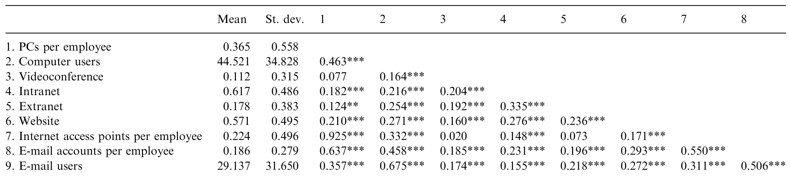
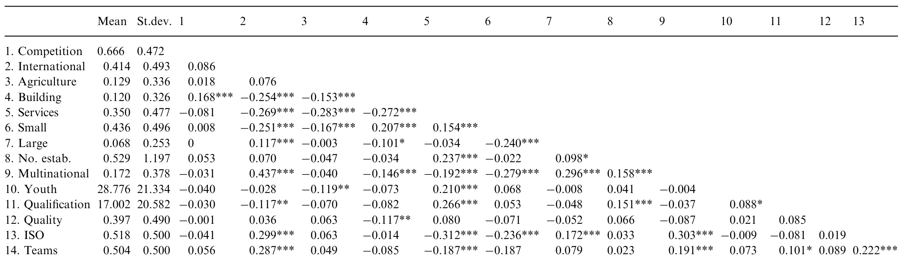
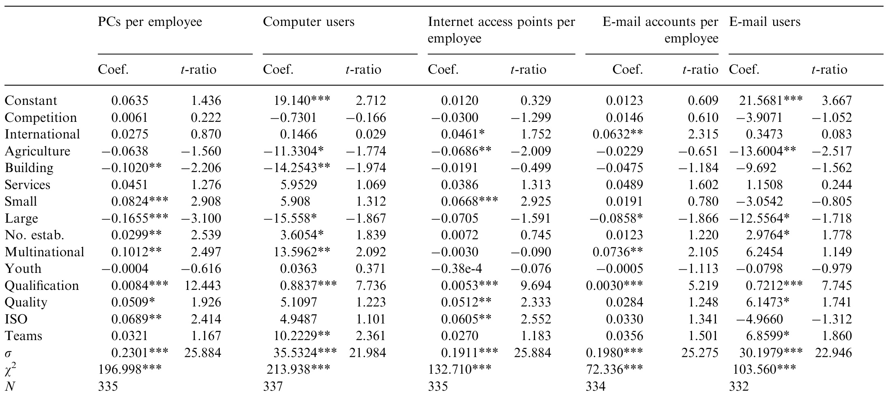
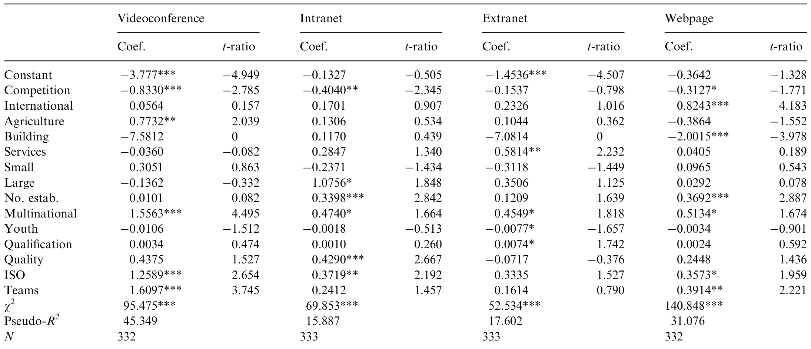

# A firm-level analysis of determinants of ICT adoption in Spain  

Alberto Bayo-Morionesa,\*, Fernando Lera-Lopezb  

Department of Business Administration, Public University of Navarra, Campus Arrosadia,31006 Pamplona, Spain bDepartment of Economics. Public Universitv of Navarra. Campus Arosadia. 31006 Pamlona. Spain  

# Abstract  

The purpose of this paper is to analyse the role played by five groups of factors in ICT adoption: environment, firm structural characteristics, human capital, competitive strategy, and internal organization. In order to achieve this goal, the data collected in a survey with a sample of 337 Spanish workplaces are used. The paper overcomes some of the limitations found in the empirical literature since it examines several ICT infrastructure and usage indicators at the same time, using a sample of workplaces of different sizes in all activity sectors in a context of a developed country with a low rate of ICT incidence. Results highlight the need to study the different ICT separately as well as the importance of establishment size, multinational ownership, and high-skilled workforce in ICT adoption. Quality control systems and team-based organization of work also play a relevant role in the diffusion of certain elements of ICT within firms. The need of reviewing the traditional public support for ICT implementation on small workplaces arises, together with the existence of complementarities with policies aimed to attract foreign investments and to increase the workforce education level as a way to spread ICT implementation. Results also show that managers need to align ICT adoption and the strategic focus of the firm more consistently. $\copyright$ 2007 Elsevier Ltd. All rights reserved.  

Keywords: ICT adoption; Human capital; Size; Multinational; ISO certification  

# 1. Introduction  

The most recent empirical evidence confirms the positive effect of information and communication  technologies (ICT) on firm performance not only in terms of productivity, profitability, market value, and market share, but also in intermediate performance measures, such as process efficiency, service quality, cost savings, organizational and process fexibility, and customer satisfaction (Bartelsman and Doms, 2000; Brynjolfsson and Yang, 1996; Dedrick et al., 2003; Kohli and Devaraj, 2003; Melville et al., 2004). ICT are enabling firm reorganization and major changes to be made in all the firm's functional areas (Falk, 2005). ICT adoption has drastically modified communication, sales, and information methods (Lapierre and Denier, 2005; Wang et al., 2006), thus enabling firms to achieve strong competitive advantage, in both production and other areas. ICT also helps companies to increase their potential for competitive advantage by enabling them to perform primary and support activities either at less cost or in a way that leads to differentiation and a premium price (Porter and Millar, 1985).  

Nowadays, the debate is focused on variables relating to ICT usage and ways of increasing the positive impact of ICT on firm performance (Arvanitis, 2005; Black and Lynch, 2004; Bresnahan et al., 2002; Brynjolfsson and Hitt, 2000; Dewett and Jones, 2001; Gretton et al., 2004). Knowledge about the relationship between ICT and firm characteristics, firm strategies, and the competitive environment can help firms to obtain greater benefits from ICT adoption. There is no doubt about the fact that, to obtain such benefits, it is absolutely essential to identify the variables that affect the decision of firms to adopt ICT. This concern has led in the last years to several studies analysing the drivers of ICT adoption and usage (Dubelaar et al., 2005; Ferneley and Bell, 2006; Lefebvre et al., 2005; Lucchetti and Sterlacchini, 2004; Mahmood et al., 2001; Soliman and Janz, 2004; Teo and Ranganathan, 2004; Zhu et al.,2003).  

In this context, this paper aims to analyse the role played in ICT adoption in a sample of Spanish firms by means of five groups of factors: environment,firm structural characteristics, human capital, competitive strategies, and internal organization. The paper does not, therefore, consider the variables influencing the adoption of ICT by users, on which there is a large body of academic research that focuses on the traditional technology acceptance models (TAM, see e.g., a critical review in Bhattacherjee and Premkumar, 2004). This study focuses its attention on the characteristics that identify the key driving forces of ICT adoption in Spanish firms. Attention is paid to such variables as age of workers, competitive pressure, international markets, competitive strategies based on low cost or differentiation. and ISO certification. among others.  

In this way, new conclusions can be drawn regarding the introduction of the new technologies into the firm. By developing a better understanding of the factors that influence ICT usage, policy makers should be able to design more accurate policies to efficiently promote ICT adoption and managers could take measures within their organizations to maximize the effectiveness of their efforts to stimulate ICT usage and increase organizational performance and productivity.  

Previous studies of the subject in this field have suffered from several important limitations, due to methodological issues and data collection problems. This paper contributes to increase and improve the empirical evidence on the adoption of ICT in firms in several aspects, by using a sample of 337 Spanish business establishments with 20 or more employees in all activity sectors. The analysis performed in this paper is complementary to the research made in this area so far and overcomes some of the limitations detected in this literature.  

In order to achieve this goal, this paper is not limited to examining just a single kind of ICT, but looks at variables which make reference to a wide array of them; at the same time it takes into account the infrastructures and the degree of use by employees. Moreover, the sample used considers firms of a great variety. It analyses firms from all activity sectors. This sample includes industries that have received much less attention, such as agriculture and building, together with the more widely studied manufacturing and services industries. The sample is also varied regarding firm size, as it includes units of large, medium, and small kind.  

Following this introduction, the remainder of this paper is organized as follows. In Section 2, we introduce the theoretical hypotheses. These are followed in Section 3 by a description of the methodology adopted in this study, including both the model and the data sources employed in the estimations. Some descriptive statistics and the results of the model estimations are presented and interpreted in the penultimate Section 4, and the paper concludes in Section 5 with some remarks on the findings and implications for ICT usage and adoption.  

# 2. Theoretical background  

As mentioned in the introduction, in the last few years, various studies have analysed ICT adoption within firms and the role played by different variables in such fact. The chosen model, which is shown in Fig. 1, is partially based on other existing models, such as that developed by Spanos et al. (2002). Our model categorizes the factors that contribute to explain ICT adoption into five categories: environment, firm structural characteristics, human capital, competitive strategies, and internal organization. These forces interplay and help to define the firm's approach to pursuing its objectives.  

# 2.1. Environment  

The environment within which the firm performs its activities has a strong influence on the decision to adopt ICT (Premkumar and Ramamurthy, 1995; Thong, 1999; Zhu et al., 2003). This factor has also been termed the institutional factor (Teo et al., 1997) or external pressure (Soliman and Janz, 2004). We consider three variables with respect to firm environment: competitive pressure, activity sector and the geographical market in which the firm sells its goods and services.  

# 2.1.1. Competitive pressure  

Competitive pressure  has long been recognized  in the innovation literature as a driver of ICT adoption (Gattignon and Robertson, 1989; Teo et al.,1997). The opportunity to exert market power is assumed to provide the potential innovator with the incentive to undertake the investments required by the innovation. Intense rivalry between firms also prompts them to keep a watch on one another's competitive moves, which makes them relatively quick to accept technological innovations (Gattignon and Robertson, 1989). However, it has also been pointed out that competition increases uncertainty about the consequences of innovation and can inhibit the decision to innovate (Fuentelsaz et al.,2003).  

These general reasons have also been applied to ICT: a firm in a competitive environment is more likely to invest in ICT, as a way of strengthening its performance and ensuring its survival, than a firm operating in a more sheltered environment (Kowtha and Choon, 2001). When faced with stronger competition, firms are more eager to obtain immediate information to enhance their decisions (Hwang et al., 2004). Therefore, firms facing more intense competition in the market tend to attach more value to ICT innovations, which are seen nowadays as a requisite to compete in the marketplace (Premkumar and Ramamurthy, 1995). Competitive pressure generates net effects or spillovers that soon promote the introduction of ICT into the firm (Hollenstein, 2002).  

Several authors have empirically considered competition as a core determinant of ICT adoption(Baldwin et al., 2004; Hollenstein, 2002, 2004; Premkumar and Roberts, 1999). For example, competitive pressure has been shown to play an important role in the degree of computerization (Dasgupta et al., 1999), in electronic data interchange (EDI) adoption (Premkumar and Ramamurthy,1995;  

  
Fig. 1. Theoretical model.  

Soliman and Janz, 2004), and in website development (Kowtha and Choon, 2001). Nevertheless, others papers find competitive pressure to be insignificant  in ICT adoption (Lee, 2004; Te0 et al., 1997; Thong, 1999).  

Generally speaking, ICT adoption should be positively influenced by competition. Thus the following hypothesis is proposed:  

H1. Higher competitive pressure is positively associated with ICT adoption.  

# 2.1.2. Industry sector  

The industry in which the firm operates may have an important influence on the ICT adoption process as long as differences in certain aspects are captured by it. Data processing requirements, for example, differ across sectors. Service industries, which are reliant on data processing, can be expected to depend more heavily on information systems (Goode and Stevens, 200o). In addition, firms in different industries have to deal with different types of business environment dynamics, which may affect ICT introduction (Hollenstein, 2004). The industry variable also reflects business environment factors such as heterogeneity and uncertainty, which are important in the adoption of new technologies.  

The impact of this variable in ICT adoption has been empirically analysed in several studies. In Love et al. (2005), it is shown that organizations from different sectors differ significantly in their level of IT investment, and that, after the ICT industry, the Health Services are the leaders in this respect. The above-average probability of adoption that clearly exists in some high-tech industries, both in the trading sector and in modern service industries, is  a reflection  of  different  technological  opportunities (Hollenstein, 2002, 2004). Cheung and Huang (2002) found major differences across industries in commercial Internet usage, the highest level of usage being found in the retail and wholesale trades. In Singapore, however, there was no significant difference in terms of industry type between adopters and non-adopters of Business-to-Business (B2B) electronic commerce (Teo and Ranganathan, 2004).  

Following the empirical evidence and the theory, we can therefore formulate the following hypothesis:  

H2. ICT adoption will be higher in manufacturing and services industries, compared to agriculture and building.  

# 2.1.3.International market  

A third environment variable that can affect firm behaviour with respect to ICT adoption is whether or not the firm operates in international markets. This firm decision may be linked to its efforts to explore new markets and products (Miles and Snow, 1978). This induces the firm to search for new opportunities and to use new technologies (Teo and Pian, 2003). The empirical literature on technological innovation reveals a positive relationship between exports and innovation (Braga and Willmore, 1991; Kumar and Saqib, 1996), due to the fact that internationalization implies growth in competitiveness and market size.  

When we focus our attention on ICT, for example, website development may be aimed at raising the firm's visibility and attracting new customers. This is especially relevant when customers are far away, as is the case in firms exporting a high percentage of their sales (Teo and Pian, 2003). New communication technologies reduce the impact of geographical locations and distances (Premkumar and Roberts, 1999). Also, the propensity to export strongly stimulates early adoption of the Internet (Hollenstein, 2004). We can therefore establish the next hypothesis:  

H3. Presence in international markets is positively associated with ICT adoption.  

# 2.2.Firm structural characteristics  

A firm's decisions are limited by its structural characteristics, which affect, among other things, its ability to adopt new innovations in accordance with the benefits and costs involved. The variables considered in this section are size of establishment, size of firm, and multinational ownership.  

# 2.2.1. Business unit and firm size  

Size is an explanatory variable that is used in most studies of firm behaviour with respect to the adoption of new technologies in firms. There is a variety of coexisting views and arguments concerning the role played by firm size in the innovation implementation process, particularly when it comes to ICT adoption.  

In support of the positive effect of size, it is claimed that larger firms are able to allocate more resources and capital to face the expenses involved in the adoption (Hwang et al., 2004), which is a key point, particularly in the initial stages. Also, their greater access to financial resources makes them better able to absorb the risks associated with the possible outcomes of ICT implementation (Premkumar and Roberts, 1999). In this context, it is also argued that they are able to reduce the costs involved in the adoption through economies of scale, by spreading the fixed cost invested in innovation over a higher number of sales (Cohen and Levin, 1989).  

It is also hypothesized that larger establishments generate more complex coordination problems and a greater need for information movement, which makes them more likely to use ICT-related tools (Dasgupta et al., 1999). This also applies to the size and number of establishments that make up the firm. When it has a number of units located in different places, the need for inter-unit coordination increases the likelihood of ICT adoption (Galliano et al., 2001). In addition, the relative size of firms is connected to the availability of ICT-related skills (Morgan et al., 2006).  

As an argument to support the negative effect of size, it is suggested that some Internet-based ICT applications may be viewed as tools to enable small firms to compete with larger ones. This relationship can be explained by the fact that small and medium-sized enterprises (SMEs) are more fexible and can adapt to a changing environment more quickly than larger companies are able to (Goode and Stevens, 2000).  

Overall, the empirical evidence shows that the adoption of ICT increases with the size of firms and plants (Baldwin et al., 2004; Delone, 1981; Fabiani et al., 2005; Morgan et al., 2006; Te0 and Tan, 1998; Thong, 1999). Nevertheless, it is also possible to find empirical evidence against this positive relationship. Lefebvre et al. (2005), Love et al. (2005) and Teo et al. (1997) found that organizational size had little significance as a factor affecting IT adoption. In others, the relationship is negative (Dewett and Jones, 2001; Harris and Katz, 1991).  

In other studies, the relationship, though positive, is non-linear. In Hollenstein (2004), for example, firm size is usually positively correlated with early, and intensive, use of ICT only up to a threshold of about 200 employees. For some specific ICT elements——the Internet, for example—-he finds that medium-sized companies are even more intensive users than large firms.  

Taking correlation by ICT type, computer use seems to be positively related to firm size (Delone, 1981; Gretton et al., 2004; Morikawa, 2004), website development is positively related to firm size in Kowtha and Choon (2001), while e-commerce adoption and use is negatively related in Teo and Ranganathan (2004). In a number of studies that consider different kinds of ICT, the results are not homogeneous. Premkumar and Roberts (1999) find organizational size to be a significant discriminator between adopters and non-adopters of online data access, e-mail, and EDI, but not in the case of the Internet. In Lucchetti and Sterlacchini (2004)，market-oriented ICT is not associated with size, whereas the adoption of productionintegrating ICT is positively related.  

Despite the fact that the theoretical and empirical literature has not reached full consensus about the relationship between size and ICT adoption in the firm, there is stronger evidence for a positive than for a negative relationship, suggesting the following hypothesis:  

H4. Establishment and firm size are positively related to ICT adoption.  

# 2.2.2.Multinational ownership  

Although the effect of corporate status is likely to be ambiguous and independent institutions may be better positioned to undertake implementation, once the decision to adopt has been taken, the majority of reasons cited in the literature support a positive relationship between multinational ownership and ICT adoption. Among the arguments, it is pointed out that firms forming part of a group are better informed and able to reduce the risk involved in adopting new technologies (Gourlay and Pentecost, 2002). The existence of a network external to the organization plays a substantial role in the adoption process, since networking heightens awareness of innovation and increases the likelihood of its adoption (Abrahamson and Rosenkopf, 1997). Multinational ownership also increases the probability of integration in a broader internal network, increasing the need for ICT adoption (Galliano et al., 2001). Globalization challenges multinational firms to coordinate their activities at international level, a task in which ICT can be very useful (Akmanligil and Palvia,2004)． According to Santangelo (2001), intensive use of ICT impacts on firm internationalization.  

ICT investment enables firms to develop the capability to expand their corporate activities to different countries.  

It is also necessary to remember that membership of an international group makes firms more open to external factors, which implies interaction in more specialized roles, through, say, attendance at meetings, and increased opportunity for learning and adopting innovations (Lai and Guynes, 1997). Nor should it be forgotten that multinational firms have more financial resources available for investment purposes. The pressure to conform that comes from parent organizations drives organizational action and may influence subsidiaries in their decision to adopt or otherwise (Westphal et al.. 1997).  

The literature has found unequivocal empirical evidence to support this positive relationship (Galliano et al., 2001; Premkumar and Roberts, 1999). Baldwin et al. (2004) also found that foreign-owned plants were more likely to adopt advanced technologies than domestic plants. Nevertheless, in some studies there is no difference in this respect between adopters and non-adopters of B2B electronic commerce (Teo and Ranganathan, 2004).  

Let us, then, assume the following hypothesis:  

H5. Multinational ownership is positively associated with ICT adoption.  

# 2.3.Human capital  

Numerous studies have verified that individual characteristics play a crucial role in the implementation of new technologies by influencing the user's views on adoption (Mahmood et al., 2001; Venkatesh and Morris, 2000).  

# 2.3.1. Education  

One of the main workforce variables taken into account is educational level. In the ICT adoption literature, it is often posited that qualified workers increase organizational readiness for innovation, because a higher educational level in potential adopters makes them more innovative. Plants using more advanced technologies require high-skilled workers (Doms et al., 1997). On the one hand, the benefits of ICT can be increased by training in problem-solving, statistical process controls and computer skills; on the other, highly computerized systems produce such a vast data output that workers need to be sufficiently skilled to use it adequately (Arvanitis, 2005).  

High-skilled workers can make ICT investment and adoption easier (Arvanitis, 2005; Bresnahan et al., 2002; Fabiani et al., 2005; Falk, 2005; Lucchetti and Sterlacchini, 2004; Morgan et al., 2006; Pérez et al., 2005; Powell and Dent-Micallef, 1997) because their higher educational level enhances ICT usage and impacts. There are no more than a few studies in which only a weak relationship (Maliranta and Rouvinen, 2004), or not at all (Rai and Patnayakuni, 1996), is found between educational level and ICT adoption. Computer use is the main variable related to the educational level, strong evidence of correlation between computerization and the educational composition of the firm having been found in many countries, such as Canada, the USA and France (Card et al., 1999), the UK (Machin, 1996), the USA (Doms et al., 1997), or Australia (Gretton et al., 2004).  

The following hypothesis can therefore be established:  

H6. A high-skilled workforce is positively related to ICT adoption.  

# 2.3.2. Workforce aqe  

One of the problems in the adoption of any innovation, including ICT, is the lack of full support from the workforce for the modifications that it requires in work practices. The introduction of innovations can be intimidating for employees, particularly if it requires them to change their current practices or acquire new skills (Beatty et al., 2001). As a consequence, existing inertia in work practices can provoke disagreement among the workforce with respect to innovation. Many employees see ICT adoption as a complication of their jobs, and this might deter their introduction.  

One of the most significant socio-demographic characteristics to explain worker disagreement over the introduction of new work practices is age. In organizations with a younger workforce, managers seem more enthusiastic towards ICT adoption. The opposite occurs in firms with older, more experienced workers, who are likely to be more reluctant to accept innovation because they are assumed to have more firmly established work practices. Nevertheless, in Maliranta and Rouvinen (2004) the relationship between workers’ age and ICT adoption is not significant.  

These arguments lead us to the next hypothesis:  

H7. The younger the workforce the greater the likelihood of ICT adoption.  

# 2.4. Competitive strategy  

Firm strategy reflects the objectives and actions selected by the firm in its attempt to adapt to the environment and gain a specific competitive advantage. According to Porter (1985), there are two different types of competitive strategies: differentiation strategy and low-cost strategy. Recent studies considering ICT adoption in SMEs have concluded that ICT adoption in them depends on their strategic focus (Ferneley and Bell, 2006; Levy et al., 2001).  

Some authors indicate that ICT adoption can contribute to either a quality strategy or a low-cost strategy (Spanos et al., 2002; Teo and Pian, 2003). On the one hand, ICT may allow firms to achieve a differentiation advantage by securing relationships with customers through better quality and greater ability to respond rapidly to market changes. On the other hand, a low cost strategy can be implemented at different points in the value chain, by using formal and analytical managerial practices that can be supported by management decision support (MDS)  

systems, which allow them to display and predict cost indicators.  

In relation to differentiation through innovation,the same authors claim that there is an international tendency towards the use of information access and analysis instruments that increase the firm's innovative capability. ICT usage can provide the means to increase product quality. Computer applications such as data access and analysis (DAA), enterprise resource planning (ERP) and process support and improvement (PSI), can dramatically improve a firm's capacity to sustain continuous high quality.  

Alegre-Vidal et al. (2004) point out that firms who prioritize quality are more innovative than those applying low-cost strategy. In some studies on strategies and ICT adoption, however, the results are not clear (Spanos et al., 2002). Craighead and Laforge (2003) find no relationship between ICT adoption at different stages of the supply chain and the competitive priorities of plants.  

Following the literature on the relationship between ICT adoption and strategies based on differentiation or low cost, the following hypothesis can be tested:  

H8. Competitive  strategy based on differentiation is positively associated with ICT adoption.  

# 2.5. Internal orqanization  

Firms have different ways of organizing their activities and resources, and their decisions with respect to ICT adoption vary accordingly. In fact, organizational factors influence not only the firm's innovative capability but also in the ICT contribution to the organizational principles followed by the firm.  

# 2.5.1. Quality assurance system  

A quality system generates, of itself, new needs that may induce a firm to invest in ICT. Thus, ICT can be a complementary and positive factor in the adoption of just in time (JIT) systems, in increasing customer proximity and in developing ways to integrate suppliers in product and process design (Galliano et al., 2001).  

Often, in order to monitor and analyse production processes, quality management systems require ICT usage. These managerial systems are known as computer-aided quality (CAQ) management. In spite of the fact that these instruments are in their early stages, and still limited to statistical process controls (such as quality function deployment and modal failure and effects analysis), inclusion of ICT in quality control systems is increasing their efficiency (Schiefer, 1999). Actually, in firms where quality control systems are fully developed, a very positive impact of computer systems can be found in various areas, such as process efficiency, worker satisfaction and service quality enhancement (Fok et al., 2001).  

The implementation of ISO 9000 leads to further changes in the firm's internal organization, which may require further ICT adoption. For example, knowledge codification and the formalization of practices required by the ISO 9oo0 may increase the firm's propensity to use internal and external computer networks as a means of communication and coordination among different departments (Galliano et al., 2001). Note also, however, that the degree to which an organization stresses rules and procedures in the role performance of its members has been posited to inhibit exploration and innovation (Lai and Guynes, 1997). However, the empirical evidence supports a positive association between ISO certification and ICT adoption (Galliano et al., 2001; Grover and Goslas, 1993).  

Therefore, the hypothesis to be tested is the following:  

H9. The implementation of quality control systems is positively related to ICT adoption.  

# 2.5.2. Decentralization  

The relationship between centralization and innovation adoption might be positive, because it favours management-promoted innovation, despite the resistance of lower level managers (Williams, 1994). However, this situation can lead to a negative correlation with the adoption of innovations that are more compatible with the interests of lower-level employees (Moch and Morse, 1977).  

It is generally accepted that ICT helps firms to decentralize and break down hierarchies, since it permits top management to communicate with bottom-tier workers without the need for mediation by middle managers (Pérez et al., 2005). Wherever there is decentralization, and employees are empowered to make their own decisions, there may be important synergies with ICT. People empowerment may benefit ICT implantation by allowing the delegation of responsibility for systems development to the lowest organizational levels.  

This leads to the following hypothesis:  

H10. Decentralization is positively related to ICT adoption.  

# 3. Methodology  

# 3.1. Data  

The data used in this paper come from the first 2002 wave of the Information Society Survey of business establishments conducted by the Statistical Institute of Navarre (Spain). The population scope of the survey is the total number of business units employing 20 or more workers and includes all sectors of the region's economic activity. The sample was stratified by size and sector. The data were collected in the months of April and May 2002 by means of a survey that was distributed by post and answered by telephone, fax or e-mail. Since it was conducted by the regional government, it obtained a very high response rate of 97.12 per cent. The final sample is made up of 337 establishments.  

The survey questionnaire, which  comprises mainly questions referring to ICT,is based on the OECD questionnaire to measure the business use of ICT (OECD, 2002). It also provides information about the main firm profile and firm environment characteristics. It also includes questions on issues relating to human capital, human resource management, the organization of work and firm strategy.  

# 3.2. Definition of the variables  

# 3.2.1. Dependent variables  

Given the amount and variety of the technologies comprised in ICT, and in order to improve the validity and scope of our results, we found it convenient to analyse the determinants of a number of the most representative technologies, instead of restricting the analysis to just one of them. We believe that this adds to the value of our paper in that it enables us to determine whether the various types of ICT exhibit different adoption patterns, as several articles have shown (Lucchetti and Sterlacchini, 2004; Premkumar and Roberts, 1999). Next, we define the dependent variables, which capture aspects relating to ICT infrastructure and the usage of some of them:  

·Personal computers $(P C s)$ per employee: This quantitative variable is defined as the number of computers divided by the number of employees. It has been used, among others, by Hollenstein (2002).   
● Computer users: This indicates the percentage of the workforce that use computers in their daily work. It is a very common variable in the literature on ICT adoption, since it is a particularly good measure of computer usage in the workplace (Delone, 1981; Gretton et al., 2004; Maliranta and Rouvinen, 2004).   
● Videoconference: This binary variable equals one if the firm has videoconferencing equipment. It has been used as a dependent variable in several papers on ICT (Zhu et al., 2003).   
● Intranet: This binary variable takes a value of one when there is an intranet at the workplace and zero when there is not.   
● Extranet: This binary variable takes a value of one when there is an extranet at the workplace and zero when there is not. This variable and Intranet have been used to evaluate ICT infrastructure at the firm level in several studies (Arvanitis, 2005; Galliano et al., 2001; Hollenstein, 2002; Spanos et al., 2002; Te0 and Tan, 1998; Zhu et al., 2003).   
● Website: The questionnaire includes two questions about the presence of this ICT tool in the workplace. The first inquired whether the establishment had its own web page. The second asked whether, if the establishment was part of a group of firms, there was a web page at the corporation level. In the estimations, we use a new qualitative variable that takes a value of one if the answer is yes in either case, and zero when it is negative in both cases. This variable has been tested in several articles (Beatty et al., 2001; Teo and Tan, 1998; Te0 et al., 1997).   
$E$ -mail users: This indicates the percentage of employees that have been assigned an e-mail account and use it. This variable has been frequently employed in the ICT adoption literature (Hollenstein, 2002, 2004; Teo and Tan, 1998; Zhu et al., 2003).  

Finally, we have included two additional variables to analyse ICT infrastructure within firms: Internet access points per employee and E-mail accounts per employee. Although, as far as we know, these two variables have not until now been used in the literature, we believe they might come in useful if we want to analyse the availability of Internet and e-mail infrastructure.  

Internet access points per employee: This variable is defined as the number of Internet access points divided by the number of employees.   
$E$ -mail accounts per employee: This is defined by the number of e-mail accounts divided by the number of employees.  

Table 1 reports the descriptive statistics of these variables, as well as the correlation matrix. From the data, we can infer that there are huge differences in the adoption rates of the different ICT applications considered. It is found, for example, that, while 61.7 per cent of the establishments have Intranet and 57.1 per cent have a Web page, only 11.2 per cent of the sample have Videoconferencing equipment and 17.8 per cent Extranet.  

Differences in the provision of ICT infrastructure are not as great. The number of Computers per employee is 0.36, the number of Internet access points per employee is 0.22, and the number of $E$ -mail accounts per employee is 0.19. As far as the percentage of users is concerned, an average of 44.52 per cent of the workforce handles a computer, whereas 29.14 per cent use e-mail.  

If we take a look at the correlation matrix, we can see that the correlations between the different ICT tools are quite high. In fact, there are only two pairs (PCs per employee and Videoconference, and Extranet and Internet access points per employee) that are not statistically meaningful. The highest correlations are found among the variables that capture ICT infrastructure (e.g., correlation between PCs per employee and Internet access points per employee is 0.92), among the different ICT user variables (e.g., correlation between Computer users and $E$ -mail users is 0.67), and between a given infrastructure and the percentage of employees that use it (e.g., correlation between $E$ -mailaccountsperemployeeand $E$ -mail users is 0.50).  

# 3.2.2. Independent variables  

Competition in the market, where the unit sells its goods and services, is frequently captured by the number of competitors. Following the article by Baldwin et al. (2004) for Canadian companies, we use a binary variable that takes a value of one when the number of competitors in the market is greater than five and zero otherwise.  

Table1 Descriptive statistics and correlation matrix of ICT variables   

  
$^{**}\!*\!*\!\!*\!\!*\!\!*0.01$ $^{\ast\ast}p\!<\!0.05$ $\ast_{p<0.10}$  

To measure the importance of industry in ICT adoption, we use three binary variables to show whether the establishment belongs to the agricultural industry, the building industry, or the services industry. The reference sector omitted in the subsequent estimations, therefore, is the manufacturing industry. A binary variable that differentiates between the international and regional or domestic market is used to capture the geographical scope of the market where the establishment operates.  

Establishment size is measured according to the number of workers employed. It is considered small if there are fewer than 50, and large if there are more than 250. The category omitted in the estimations is medium-sized establishments, that is, those with employees between 50 and 250 employees. The number of employees was selected as being representative of business size because of its generalized use in the literature (Hollenstein, 2002, 2004; Morikawa, 2004).  

Company size is measured by the logarithm of the number of establishments in which the firm carries out some part of its activity. Log transformations are usually taken in order to reduce data variance (Lucchetti and Sterlacchini, 2004; Thong, 1999; Zhu et al., 2003).  

A binary variable is employed to take into account membership of a higher-level organization with multinational ownership. It equals one if the firm belongs to a business group of this kind and zero otherwise (Lucchetti and Sterlacchini, 2004).  

As far as human capital is concerned, the youth of the workforce is represented by the percentage of employees below the age of 30, while the qualification level is measured by the fraction of employees with a university degree. This variable has been used in several studies (Arvanitis, 2005; Falk and Seim, 2001; Lucchetti and Sterlacchini, 2004).  

To examine the role played by strategy, the interviewees were requested to assess, on a scale of 0-10, the importance of cost and quality when defining the establishment's competitive strategy. In our analyses, we use a variable that takes a value of one when the respondent indicated quality to be more important than cost. As a consequence, the category that is omitted in the empirical estimations corresponds to establishments that assigned at least as many points to cost as to quality for its role in strategic market competition.  

In order to capture the implementation of a quality management system in the plant, it was asked whether or not the establishment was certified according to any of the ISO 90o0 standards. Finally, decentralization is measured by a dichotomous variable that indicates whether or not project development teams are used in the workplace. The use of such teams is usually associated with greater worker autonomy and, therefore, with more decentralized decision-making. This variable has been used in other research (Arvanitis, 2005: Hollenstein, 2002).  

Table 2 shows the mean, standard deviation and correlation matrix for these explanatory variables. As for relationships among the independent variables, it can be observed that there is no severe multicollinearity.  

Two-thirds of the establishments in the sample reported having more than five competitors in their market, whereas 41.4 per cent of them sell their goods or services in international markets.As far as sectoral distribution is concerned, the bulk of the sample is concentrated in the services industry $(35\%)$ , and the manufacturing industry $(40.1\%)$ . From Table 2, it can also be seen that 43.6 per cent of the whole sample employ fewer than 50 people and 6.8 per cent more than 250. Moreover, 17.2 per cent of the establishments belong to a multinational group. The average proportion of employees below the age of 30 is 28.8 per cent and the average proportion with a university degree is 17 per cent. Only 39.7 per cent of the establishments claimed that they compete mainly on quality. Slightly more than half are certified according to the ISO 9000 standard (51.8 per cent) and use project development teams (50.4 per cent).  

# 3.2.3.Estimation method  

The choice of method to test the hypotheses formulated in the theoretical section of the article depends on the type of dependent variable analysed (Maddala, 1983). Ordinary least squares (OLS) regression is the standard statistical procedure for explaining the variance in continuous dependent variables. In the case of censored variables, where values below or above a certain threshold—-typically zero—are not observed, OLS regression results in inconsistent estimators and predictive values that may fall below the threshold (Greene, 2002; McDonald and Moffit, 1980).  

Table2 Descriptive statistics and correlation matrix of the dependent variables   

  
$^{***}p\!<\!0.01$ $^{**}p\!<\!0.05$ $^{*}p\!<\!0.10$  

Then, as the dependent variables are in some cases nonnegative variables, left-censored at zero, we have estimated a series of Tobit regression models. The Tobit model (Tobin, 1958) is a censored regression model for leftcensored data, assuming a normally distributed error term.  

Defining $Y_{i}$ as the ith observation on the dependent variable  and $Y_{i}^{*}$ as its corresponding latent value, the Tobit model can be represented by the following censoring rule:  

$$
;\quad{\mathrm{if~}}Y_{i}^{*}\!>\!0,\,{\mathrm{then~}}Y_{i}=Y_{i}^{*},
$$  

where the latent dependent variable $Y_{i}^{*}$ is described by the regression equation  

$$
Y_{i}^{*}=x_{i}^{\prime}\beta+\mu_{i}\quad\mathrm{with}\ \mu_{i}{\sim}N(0,\sigma^{2}).
$$  

The same caveats for OLS regression apply, when the dependent variable is binary and can therefore take only one of two values. In these cases, we have estimated probit models. In these models:  

where the latent dependent variable $Y_{i}^{*}$ is described by the regression equation  

$$
Y_{i}^{*}=x_{i}^{\prime}\beta+\mu_{i}\quad\mathrm{with}\ \mu_{i}{\sim}N(0,\sigma^{2})
$$  

All our models are estimated with Limdep, version 8 (Greene, 2002).  

# 4. Results  

Table 3 presents the estimates of the tobit models for PCs per employee, Computer users, Internet access points peremployee, $E$ -mail accounts per employee,and $E$ -mail users. The five models are statistically significant at the one per cent level and all include a large number of variables with coefficients that are statistically significant different from zero.  

The number of PCs per employee is negatively influenced by the size of the establishment, as shown by the coefficients of large and small, which are significantly different from zero. From the negative sign of the coefficient of the first variable and the positive sign of the second, we can deduce that the larger the workplace, the lower the number of PCs per employee. The percentage of employees with a university degree is also observed to have a positive effect on the presence of this infrastructure. As far as industrial sector is concerned, only building industry units behave differently from those in other sectors. Firm ownership characteristics, such as multinational ownership and total number of business units, also encourage computer adoption. Finally, ISO 9000 certification and the pursuit of a quality strategy boost the number of PCs per employee.  

Coefficient estimates for  Computer users are fairly similar to those found for PCs per employee. Thus, employee qualification, multinational group membership, and total number of establishment show a strongly positive effect. Fewer ICT users are found in the building and agricultural industries. Establishment size also has a negative, though considerably weaker, effect. On the organizational side, the use of project teams has a positive impact on the level of Computer users.  

The coefficients on the number of Internet access points per employee are essentially expressions of the negative effect of size, together with the positive influence of employee qualification and presence in international markets. At the same time, firm strategy and ISO 9000 certification have considerable relevance. Finally, we should stress that correlation with the dependent variable is not as strong in agricultural business units.  

Table3 Tobit estimations for PCs per employee, Computer users, Internet access points per employee, E-mail accounts per employee and E-mail users   

  
$^{**}\!*\!*\!\!*\!\!*\!\!*0.01$ $^{\ast\ast}p\!<\!0.05$ $\ast_{p<0.10}$  

Table4 Probit estimations for Videoconference, Intranet, Extranet and Website   

  
$^{**}\!*\!*\!\!*\!\!*\!\!*0.01$ $^{\ast\ast}p\!<\!0.05$ $\ast_{p<0.10}$  

Thevariable $E\!\cdot$ -mail accounts per employeefollowsin this same direction in its correlation with employee qualification and international market presence. In this case, moreover, membership of a multinational group is seen to have a beneficial effect, while that of plant size is negative.  

The percentage of $E$ -mail users is  lower  in  agricultural establishments. Meanwhile, as in other dependent variables, a quality-based competitive strategy and a university-educated workforce lead to higher percentages  

Oof $E$ -mail users. With respect to the size variable, business unit size shows a slightly negative effect, while the effect of firm size is positive.  

Table 4 displays the estimated probit coefficients for the variables  that measure adoption of Videoconference, Intranet, Extranet, and a Webpage. As in the previous table, all the probit models are globally significant at the one per cent level.  

Videoconference is more likely in non-agricultural units and in those with fewer than five competitors in the main product. The effect of the multinational variable, meanwhile, is positive, as is the impact of project development teams and IsO certification.  

The Intranet adoption results indicate a similarly positive effect for competition, multinational ownership and ISO certification. They also show that the size of the business unit exerts a positive impact, as do the number of establishments in the firm and the pursuit of a qualitybased competitive strategy.  

The Extranet results reveal this technology to be more widely used in the services industry and in multinational firms. It is also necessary to stress the role played by workforce composition. The more university graduates and employees aged over 30 there are in the workforce, the more likely firms are to adopt extranet.  

Finally, the presence of a firm Webpage is more widespread in firms competing in an international market and facing less competition, while they are less common in the building industry. Membership of a multinational company and the number of business units again have a positive effect. Lastly, the presence of a Webpage is positively associated with IsO 90oo certification and with the use of project development teams.  

# 5. Discussion and conclusions  

# 5.1. Main findings  

In this article, we have analysed the role that is played in the adoption and usage of different ICT tools by five groups of factors: environment, structural firm characteristics, human capital, competitive strategy, and organizational structure. We have developed several hypotheses that have been empirically tested with data from a sample of 337 Spanish establishments from different sectors of economic activity.  

The research found that the hypotheses regarding the influence of firm environment have not been fully confirmed. Market competition is significantly associated to the adoption of a minority of the ICT analysed. In the case of firm presence in international markets, there are positive effects with regards to Internet and the implementation of other external communication technologies. There were no differences between the two most representative sectors of economic activity: manufacturing and services. However, the study detected that the incidence of some ICT is lower in the agriculture and building sectors.  

The results show a clear infuence of firm structural characteristics on the different types of ICT analysed. Of all the explanatory variables included in the paper, membership to a multinational group is the most powerful one to characterize organizations that have adopted ICT. The hypothesis advanced in support of a positive relationship between size and ICT incidence is only partially confirmed and it depends on whether we refer to establishment size or firm size. On the one hand, if we consider the number of employees in the establishment, the relationship between ICT adoption and the number of employees turns out to be negative in most cases. For example, ICT-uptake such as PCs, Internet access, and e-mail accounts per employee, and ICT use measured by the percentage of employees that are computer or e-mail users, are negatively related to the number of employees in a workplace. On the other hand, when we analyse the effects of firm size, considering size from the point of view of the number of establishments of the firm, the relationship is positive. This result shows the important role played by ICT when the firm has several separately geographical establishments.  

There is a contrast between the results for the two hypotheses formulated on human capital. Our results highlight, in particular, the positive and important association between the general level of employee qualification and their use of ICT. However, the workforce age profile lacks any relevance to the diffusion of ICT inside the firm.  

The observed association between strategy and ICT in this paper is not definitively clear. Nonetheless, a weak link between the adoption of some ICT and the search for competitive advantage through quality seems to have been detected. On the contrary, for none of the dependent variables a positive influence of the pursuing of a cost leadership strategy has been found.  

Regarding bonds with internal organization, the following findings should be underlined. On the one hand, the use of project development teams is closely linked to the two variables that measure the percentage of users (computer and e-mail users). This seems fairly logical, since these variables are directly linked to workers’ daily job reality. As in the case of ICT users, employees are the main elements around which organizational structures, such as project development teams, revolve. On the other hand, the certification of a quality assurance system is linked to the presence of several types of ICT infrastructure. Thus, the relationship that emerges is different from the one found with project teams.  

# 5.2.Contributions and implications to research  

This paper contributes to the literature on ICT adoption in firms by increasing the empirical evidence available, filling a gap in terms of the kind of firms analysed and incorporating some  methodological improvements. For these reasons, this paper helps to achieve a better understanding of the driving forces of ICT incidence. The empirical analyses made have faced some of the limitations present in previous research with the aim of obtaining a more complete picture of the factors behind ICT adoption in businesses.  

First of all, many studies have just focused on one kind of ICT, mainly computer use. In this paper, we have examined a wider array of ICT, considering also other usage indicators, such as the percentage of e-mail users or the number of e-mail accounts per employee, and infrastructure indicators, such as Internet, intranet, extranet, or website development.  

Secondly, previous studies on the adoption of ICT have primarily analysed  manufacturing companies and some subsectors of services. However, empirical evidence has neglected those firms devoted to activities such as agriculture and building. All of them have been included in this article.  

Thirdly, empirical research in this area has mainly focused in large frms. Although there is growing empirical evidence regarding the factors determining ICT adoption in SMEs, these have not been so widely analysed. One of the characteristics of our sample is that it includes business units of very different sizes.  

Fourthly, this paper provides empirical evidence regarding a country in which the determinants of ICT have hardly been analysed. Although the incidence of these technologies is a worldwide phenomenon, their degree of diffusion in a country can be conditioned by its specific cultural and economic characteristics. In this sense, it must be underlined that most of the analyses have been focused so far on the incidence of ICT in countries in which their adoption rate is very high. Spain, on the contrary, is characterized by much lower rates of ICT adoption than those found in other Western countries.  

Fifthly, the data used in this paper have been collected at establishments. Comparing to data collection at the firm level, this guarantees more adequately that the person providing the information has a better knowledge of the variables, since it is at the establishment level where ICT are implemented and used.  

The findings of the paper provide important insights for theoretical as well as empirical research on ICT adoption at firms. Our results highlight the convenience of investigating separately the determinants of the incidence of ICT in business. These separate analyses of ICT should be preferably conducted with the same sample to allow more reliable comparisons. Although there are high correlations between the presence and the degree of use of the different ICT examined, results show that there are differences in the factors that explain the adoption of the several ICT studied. This is an indication of heterogeneity within ICT that could be caused by differences in role played, complexity, resources needed, or obstacles for implementation.  

In this sense, it is necessary to integrate analyses such as the one described in this paper with others investigating the factors that influence ICT adoption. Among the literature, there are many articles that study the influence of aspects such as costs, complexity, compatibility, external support, and perceived ease of use or perceived usefulness, on the decision to incorporate this type of technology. However, the importance of these factors is usually argued in general terms, without taking specific organizational characteristics into account. It therefore seems important to find out to what extent the contribution of these aspects depends on organizational dimensions such as those considered in this study  (e.g.,  organizational structure, competitive strategy, etc.).  

The paper also emphasizes the need to tackle investigation of the implementation and use of ICT from different perspectives. The achieved findings show that, in order to get a complete picture of the subject, variables referred to very different aspects inside and outside the firm should be considered. ICT diffusion and its implications in firm management are so complex that different features such as firm characteristics or workers profile have a deep impact On them.  

# 5.3. Contributions and implications to public policy and manaqerialpractice  

Several public policy implications might derive from this paper. Provided that the positive impact of ICT on productivity has been largely demonstrated (Dedrick et al., 2003; Kohli and Devaraj, 2003), one of the main lines of government action in search of improvement of the competitiveness of their economies has been the promotion of these technologies among firms. The outcomes of this paper offer public policy makers some suggestions about the design, scope, and integration with other policies of this kind of programmes.  

Our results regarding industry show  that building establishments are behind the rest of sectors in the adoption rate of several ICT. This would call for the need to help firms in this industry to adopt them. However, we consider that this recommendation should be taken with caution before being accomplished. Building is a sector in which the impact of ICT on productivity has not been properly analysed yet. Before policy actions are taken, the positive effects found in other sectors should be confirmed for the building industry. It is necessary to corroborate that low incidence is due to the presence of market failures that avoid the adoption of these technologies by building firms and not to their lack of impact on performance (Swamidass,2003).  

The findings regarding size have also important implications for public policies that support ICT adoption. Traditionally, government policies have focused support for ICT implementation on small size establishments since they are supposed to have more problems in order to access these technologies. The results obtained in this paper recommend a review of this policy, however, since small workplaces do not currently appear to be at a disadvantage; in fact the opposite is found to be true.  

Complementarities with other public policies have also been detected. This is the case of education. This paper highlights the strong positive link between workforce education and ICT adoption. This means that one of the most effective ways of supporting ICT acceptance in firms is to increase people's qualification. Here we should mention the disappointing position of Spain in terms of educational results, compared to other similar economies. This is surely one of the explanations of the low ICT adoption in Spain, since due to deficiencies in education workers lack the skills needed to cope with these new technologies.  

As happens in areas outside technology management, foreign investment appears to be a strong driver of ICT adoption. It is therefore worth underlining its contribution as a generator of productive improvements in business management in a given geographical region. Therefore, public administrations have an additional reason to devote resources to the attraction of foreign investments. As a consequence, these policies should also be understood as a key element in ICT promotion.  

The paper also offers some practical implications for firm managers. The lack of relevance revealed by this research regarding workforce age proves that, even in an environment such as Spain where the introduction of ICT is more recent, age is not an obstacle to their diffusion among firms. This should encourage managers with an old workforce to overcome possible reluctances to introduce ICT in their firms due to their employees age.  

The little clear association between strategy and ICT found should be interpreted as a consequence of the weak incorporation of strategy in decision-making across the different departments of firms. This has already been detected in research dealing with innovation in Spanish firms (Huerta et al., 2003), which is the reason to start from the beginning with a special effort to align ICT tools with the company's competitive priorities, in order to fully exploit the potential benefits.  

In spite of the existence of a positive relationship between the implementation of a quality assurance system and the adoption of some ICT infrastructures, no association with ICT usage has been detected. This could happen because  the implementation of these quality systems usually comes from the top management, and does not necessarily take into account the employees. In consequence, although firms have understood the importance of ICT infrastructure for ISO 9o00 certification, they still have some distance to cover in terms of its application in the daily routine of their employees.  

# 5.4. Limitations  

The main limitations of the study lie in the nature of the information used. Firstly, they are data for a single region, which may limit the potential generalization of the results. However, we consider they are especially useful for countries, like Spain, with great opportunities to improve  

ICT diffusion rates. The second limitation has to do with the cross-sectional nature of the data. The use of this kind of data hinders the unambiguous detection of causality relationships. As a result, the findings are confined to the confirmation or otherwise of associations between ICT adoption and other firm related variables.  

Future research should be aimed at conducting a dynamic analysis of the subject, incorporating longitudinal information that could lead to a more accurate assessment of the nature of the relationship between ICT and other firm management variables. In this way, it would be possible not only to determine the impact that different variables exert on ICT adoption, but also to analyse the infuence of ICT as a driver of change in other areas of management.  

# Acknowledgements  

The authors wish to acknowledge the support received from the Navarrese Statistical Institute for the exploitation of the data used in the empirical analysis in the paper. The authors take full responsibility for any mistake in data treatment. The authors wish to acknowledge the financial support from the Government of Navarre within her call for research projects. The first author would also like to thank the Spanish Ministry of Science and Technology (SEJ2004-07530) for the funding received.  

# References  

Abrahamson, E., Rosenkopf, L., 1997. Social network effects on the extent of innovation diffusion: a computer simulation. Organization Science 8 (3), 289-309.   
Akmanligil, M., Palvia, P., 2004. Strategies for global information systems development. Information and Management 42 (1), 45-59.   
Alegre-Vidal, J., Lapiedra-Alcami, R., Chiva-Gomez, R., 2004. Linking operations strategy and product innovation: an empirical study of Spanish ceramic tile producers. Research Policy 33 (5), 829-839.   
Arvanitis, S., 2005. Computerization, workplace organization, skilled labour and firm productivity: evidence for the Swiss business sector. Economic of Innovation and New Technology 14 (4), 225-249.   
Baldwin, J.R., Sabourin, D., Smith, D., 2004. Firm performance in the Canadian food processing sector: the interaction between ICT, advanced technology use and human resource competencies. In: OECD (Ed.), The Economic Impact of ICT. Measurement, Evidence and Implications. OECD, Paris, pp. 153-181.   
Bartelsman, E.J., Doms, M., 200o. Understanding productivity: lessons from longitudinal microdata. Journal of Economic Literature 38 (3), 569-594.   
Beatty, R., Shim, J.P., Jones, M.C., 2001. Factors influencing corporate web site adoption: a time-based assessment. Information and Management 38 (6), 337-354.   
Bhattacherjee, A., Premkumar, G., 2004. Understanding changes in belief and attitude toward information technology usage: a theoretical model and longitudinal test. MIS Quarterly 28 (29), 229-254.   
Black, S.E., Lynch, L.M., 2004. What's driving the new economy? The benefits of workplace innovation. The Economic Journal 114 (493), 97-116.   
Braga, H., Willmore, L., 1991. Technological imports and technological effort: an analysis of their determinants in Brazilian firms. Journal of Industrial Economics 39 (4), 421-432.   
Bresnahan, T., Brynjolfson, E., Hitt L.M., 2002 Information techlogy workplace organization, and the demand for skilled labor: firm-level evidence. Quarterly Journal of Economics 117 (1), 339-376.   
Brynjolfsson, E., Hitt, L.M., 2000. Beyond computation: information technology, organizational transformation and busines practices. Journal of Economic Perspectives 14 (4), 23-48.   
Brynjolfsson, E., Yang, S., 1996. Information technology and productivity: a review of the literature. Advances in Computers 43, 179-214.   
Card, D., Kramarz, F., Lemieux, T., 1999. Changes in the relative structure of wages and employment: a comparison of the United States, Canada and France. Canadian Journal of Economics 32 (4), 843-877.   
Cheung, W.M., Huang, W., 2002. An investigation of commercial usage of the World Wide Web: a picture from Singapore International Journal of Information Management 22 (5), 377-388.   
Cohen, W., Levin, R., 1989. Empirical studies of innovation and market structure. In: Schmalensee, R., Willing, R. (Eds.), Handbook of Industrial Organization, Vol. Il. North Holland, Amsterdam, pp. 1059-1107.   
Craighead, C.W., Laforge, R.L., 2003. Taxonomy of information technology adoption patterns in manufacturing frms. International Journal of Production Research 41 (11), 2431-2449.   
Dasgupta, S., Agarwal, D., Ioannidis, A., Gopalakrishnan, S., 1999. Determinants of information technology adoption: an extension of existing models to firms in a developing country. Journal of Global Information Management 7 (3), 30-40.   
Dedrick, J, Gurbaxani, V., Kraemer, K.L., 2003. Information technology and economic performance: a critical review of the empirical evidence. ACM Computing Surveys 35 (1), 1-28.   
Delone, W.H., 1981. Firm size and characteristics of computer use. MIS Quarterly 5 (4), 65-77.   
Dewett, T., Jones, G.R., 2001. The role of information technology in the organization: a review, model, and assessment. Journal of Management 27 (3), 313-346.   
Doms, M, Dune, T., Troske, K., 1997.Workers, wages and techlg. The Quarterly Journal of Economics 112 (1), 253-290.   
Dubelar, C., Sohal, A., Savic, V., 2005. Benefits, impediments and critical success factors in B2C E-business adoption. Technovation 25 (11), 1251-1262.   
Fabiani, S., Schivardi, F., Trento, S., 2005. ICT adoption in Italian manufacturing: frm-level evidence. Industrial and Corporate Change 14 (2), 225-249.   
Falk, M., 2005. ICT-linked frm reorganisation and productivity gains. Technovation 25 (11), 1229-1250.   
Falk, M, Sem, K., 001. Wrkers skillevel and information technology: a censored regression model. International Journal of Manpower 22 (1-2), 98-120.   
Ferneley, E., Bell, F., 2006. Using bricolage to integrate business and information technology innovation in SMEs. Technovation 26 (2), 232-241.   
Fok, L., Fok, W., Hartman, S., 2001. Exploring the relationship between total quality management and information systems development. Information and Management 38 (6), 355-371.   
Fuentelsaz, L., Gomez, J., Polo, Y., 2003. Intrafirm difusion of new technologies: an empirical application. Research Policy 32 (4), 533-551.   
Galliano, D., Roux, P., Filippi, M., 2001. Organizational and spatial determinants of ICT adoption: the case of French industrial frms. Environment and Planning 33 (9), 1643-1663.   
Gattignon, H., Robertson, T.S., 1989. Technology diffusion: an empirical test of competitive effects. Journal of Marketing 53 (1), 3549.   
Goode, S., Stevens, K., 2000. An analysis of the business characteristics of adopters and non-adopters of world wide web technology. Information Technology and Management 1 (1), 129-154.   
Gourlay,APentostE202Th deteminants of tecology diffusion: evidence from the UK financial sector. Manchester School 70 (2), 185-203.   
Greene, W.H., 2002. LIMDEP Version 8.0 User's Manual. Econometric Software, New York.   
Gretton, P., Gali, J., Parham, D., 2004. The effects of ICTs and complementary innovations on Australian productivity growth. In: OECD (Ed.), The Economic Impact of ICT. Measurement, Evidence and Implications. OECD, Paris, pp. 105-130.   
Grover, V., Goslas, MD., 1993. The initiation, adoption, and imlemntation of telecommunications technologies in US organizations. Journal of Management Information Systems 10 (1), 141-163.   
Harris, S.E., Katz, J.L., 1991. Firm size and the information technology investment intensity of life insurers. MIS Quarterly 15 (3), 333-352.   
Hollenstein, H., 2002. Determinants of the adoption of information and communication technologies. An empirical analysis based on firm-level data for the Swiss business sector. Working Paper 60, Swiss Institute for Business Cycle Research, Zurich.   
Hollenstein, H., 2004. The decision to adopt information and communication technologies (ICT): frm-level evidence for Switzerland. In: OECD (Ed.), The Economic Impact of ICT. Measurement, Evidence and Implications. OECD, Paris, pp. 37-60.   
Huerta, E., Bayo, A., Garcia, C., Merino, J., 2003. Los desafios de la competitividad. La innovacion organizativa y tecnologica en la empresa espanola, Fundacion BBVA, Madrid.   
Hwang, H.S., Ku, C.Y., Yen, D.C., Cheng, C.C., 2004. Critical factors inffuencing the adoption of data warehouse technology: a study of the banking industry in Taiwan. Decision Support Systems 37 (1), 1-21.   
Kohli, R., Devaraj, S., 2003. Measuring information technology payoff: a meta-analysis of structural variables in firm-level empirical research. Information System Research 14 (2), 127-145.   
Kowtha, N.R., Choon, T.W., 2001. Determinants of website development: a study of electronic commerce in Singapore. Information and Management 39 (3), 227-242.   
Kumar, N., Saqib, N., 1996. Firm size, opportunities for adaptation and in-house R&D activity in developing countries: the case of Indian manufacturing. Research Policy 25 (5), 713-722.   
Lai, V.S., Guynes, J.L., 1997. An assessment of the infuence of organizational characteristics on information technology adoption decision: a discriminative approach. IEEE Transactions on Engineering Management 44 (2), 146-157.   
Lapierre, J., Denier, A., 2005. ICT adoption and moderating effects of institutional factors on salesperson's communication effctiveness: a contingency study in high-tech industries. Technovation 25 (8), 909-927.   
Lee, J., 2004. Discriminant analysis of technology adoption behavior: a case of Internet technologies in small businesses. Journal of Computer Information Systems 44 (2), 57-66.   
Lefebvre, L., Lefebvre, E., Elia, E., Boeck, H, 2005. Exploring B-to-B ecommerce adoption trajectories in manufacturing SMEs. Technovation 25 (12), 1443-1456.   
Levy, M, Powell, P, Yetton, P,200. SMEs: aligning IS and the stratgic context. Journal of Information Technology 16 (3), 133-144.   
Love, P.E.D., Irani, Z., Standing, C., Lin, C., Burn, J.M., 2005. The enigma of evaluation: benefits, cost and risks of IT in Australian smallmedium-sized enterprises. Information and Management 42 (7), 947-964.   
Lucchett, R., Sterlacchini, A., 2004. The adoption of ICT among SMEs: evidence from an Italian Survey. Small Business Economics 23 (2), 151-168.   
Machin, S., 1996. Changes in the relative demand for skills in the UK labour market. In: Booth, A., Snower, D. (Eds.), Adquiring Skills. Cambridge University Press, New York, pp. 129-146.   
Maddala, G.S., 1983. Limited-dependent Variables in Economics. Prentice Hall, New York.   
Mahmood, M.A., Hall, L., Swanberg, D.L., 2001. Factors affeting information technology usage: a meta-analysis of the empirical literature. Journal of Organizational Computing and Electronic Commerce 11 (2), 107-130.   
Maliranta, M., Rouvinen, P, 2004. ICT and business productivity: Finnish micro-level evidence. In: OECD (Ed.), The Economic Impact of ICT. Measurement, Evidence and Implications. OECD, Paris, pp.213-239.   
McDonald, J., Mofft, R., 1980. The uses of Tobit analyses. Review of Economics and Statistics 62 (2), 318-321.   
Melville, N., Kraemer, K.L., Gurbaxani, V., 2004. Information technology and organizational performance: an integrative model of IT business value. MIS Quarterly 28 (22), 283-322.   
Miles, R.E., Snow, C.C., 1978. Organizational Strategy, Structure, and Process. McGraw-Hill, New York.   
Moch, M.K., Morse, E.V., 1977. Size, centralization, and organizational adoption of innovations. American Sociological Review 42 (5), 716-725.   
Morgan, A., Colebourne, D., Thomas, B., 2006. The development of ICT advisors for SME businesses: an innovative approach. Technovation 26 (8), 980-987.   
Morikawa, M., 2004. Information technology and the performance of Japanese SMEs. Small Business Economics 23 (3), 171-177.   
OECD, 2002. Measuring the Information Economy. OECD, Paris.   
Perez, M., Martinez, A., de Luis, P., Vela, M.J., 2005. The differences of firm resources and the adoption of teleworking. Technovation 25 (12), 1476-1483.   
Porter, M., 1985. Competitive Advantage. Free Press, New York.   
Porter, M., Millar, V., 1985. How information gives you competitive advantage. Harvard Business Review 63 (4), 149-160.   
Powell, T.C., Dent-Micallef, A., 1997. Information tecnology as competitive advantage: the role of human, business and technology resources. Strategic Management Journal 18 (5), 375-405.   
Premkumar, G., Ramamurthy, D., 1995. The role of interorganizational and organizational factors on the decision mode for adoption on interorganizational systems. Decision Sciences 26 (3), 303-336.   
Premkumar, G., Roberts, M., 1999. Adoption of new information technologies in rural small business. OMEGA, International Journal of Management Science 27 (4), 467-484.   
Rai, A., Patnayakuni, R., 1996. A structural model for CASE adoption behavior. Journal of Management Information Systems 13 (2), 205-234.   
Santangelo, G., 2001. The impact of the information and communications technology revolution on the internationalisation of corporate technology. International Business Review 10 (6), 701-726.   
Schiefer, G., 199. ICT and quality management. Computers and Electronics in Agriculture 22 (2-3), 85-95.   
Soliman, K.H., Janz, B.D., 2004. An exploratory study to identify the critical factors affecting the decision to establish Internet-based interorganizational information systems. Information and Management 41 (6), 697-706.   
Spanos, Y., Prastacos, G., Poulymenakou, A., 2002. The relationship between information and communication technologies adoption and management. Information and Management 39 (8), 659-675.   
Swamidass, P.M., 2003. Modeling the adoption rates of manufacturing technology innovations by small US manufacturers: a longitudinal investigation. Research Policy 32 (3), 351-366.   
Teo, T.S.H., Pian, Y., 2003. A contingency perspective on Internet adoption and competitive advantage. European Journal of Information Systems 12 (2), 78-92.   
Teo, T.S.H., Ranganathan, C., 2004. Adopters and non-adopters of business-to-business eletronic commerce in Singapore. Information and Management 42 (1), 89-102.   
Teo, T.S.H., Tan, M., 1998. An empirical study of adopters and nonadopters of the Internet in Singapore. Information and Management 34 (6), 339-345.   
Teo, T.S.H., Tan, M., Buk, W.K., 1997. A contingency model of Internet adoption in Singapore. International Journal of Electronic Commerce 2 (2), 95-118.   
Thong, J.Y.L., 1999. An integrated model of information systems adoption in small businesses. Journal of Management Information Systems 4 (15), 187-214.   
Tobin, J., 1958. Estimations of relationship for limited dependent variables. Econometrica 26 (1), 24-36.   
Venkatesh, V., Morris, M., 200o. Why don't men ever stop to ask for directions? Gender, social infuence, and their role in technology acceptance and usage behavior. MIS Quarterly 24 (1), 115-139.   
Wang, H.C., Pallister, J.G., Foxall, G.R., 2006. Innovativeness and involvement as determinants of website loyalty: IHl. Theoretical and managerial contributions. Technovation 26 (12), 1374-1383.   
Westphal, J.D., Gulati, R., Shortell, S.M., 1997. Customization or conformity? An institutional and network perspective on the content and consequences of TQM adoption. Administrative Science Quarterly 42 (2), 366-394.   
Williams, L.-R., 1994. Understanding distribution channels: an interorganizational study of EDI adoption. Journal of Business Logistics 15 (2), 173-203.   
Zhu, K., Kraemer, K.L., Xu, S., 2003. E-business adoption by European firms: a cross-country assessment of the facilitators and inhibitors. European Journal of Information Systems 12 (4), 251-268.  

AlbertoBayo-MorionesisAssociate Professor of Managerial Economics at the Business  Administration  Department of Public University of Navarre, where he earned his Ph.D. in Business Administration. His main research interests are the determinants and effects of organizational innovation and its relationship with technical change in the firm. His research has been published in journals such as Human Factors and Ergonomics in Manufacturing,Industrial and Labour Relations Review or InternationalJournalofProductionEconomics.  

  

  

Fernando Lera-Lopez is Associate Professor of Applied Economics at the Public University of Navarra (Spain) where he lectures on European Economy, Spanish Industry, and Strategies and decisions within e-Enterprises. He holds a bachelor's and doctoral degree in Economics and Business Administration from the Navarra University. His current research focuses primarily on the ICT adoption and the role played by ICT at national and firm levels. He is author of several articles related to the New Economy and ICT adoption. He has also been involved in  various projects sponsored by Spanish foundations and ministers.  