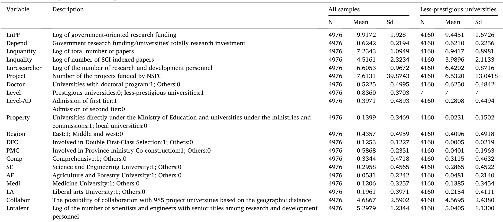
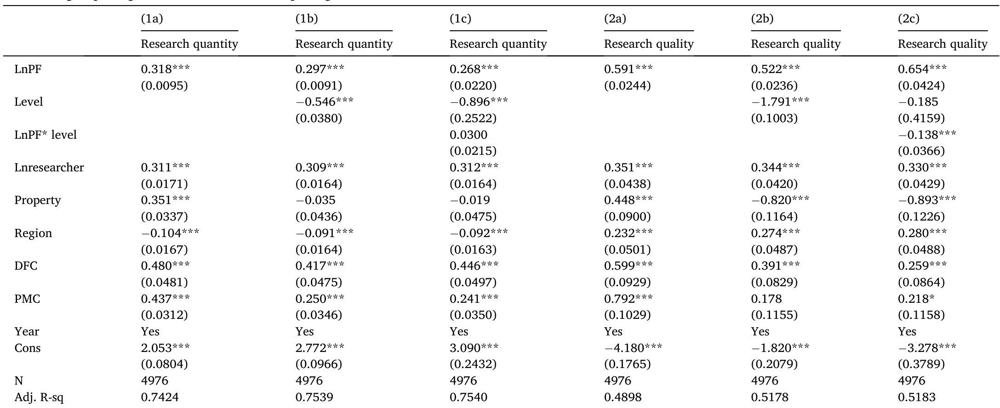
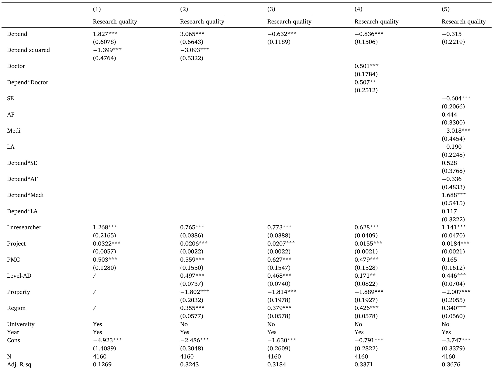
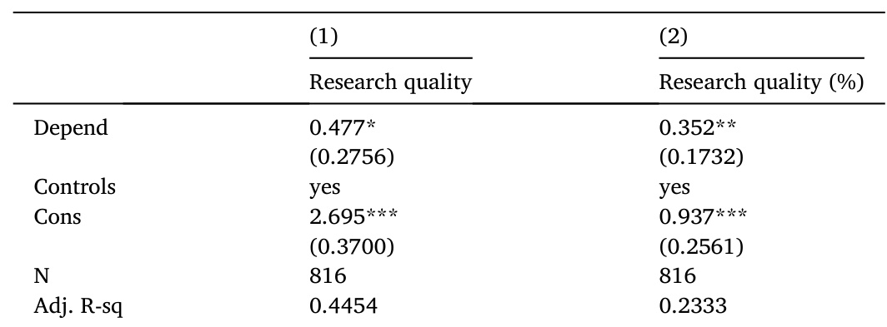
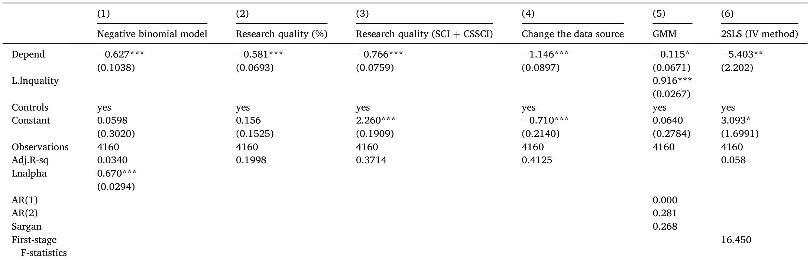
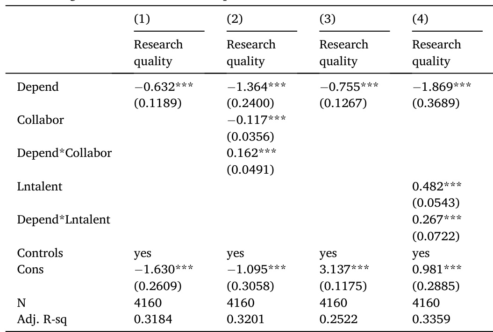

# A helping hand from the government? How public research funding affects academic output in less-prestigious universities in China\*  

Nannan $\mathrm{Yu}^{\,\mathrm{a},\,^{\ast}}$ , Yueyan Dong ?, Martin de Jong  

ScholofManagement,HarbinInstitute ofTehnology13FayuanStreet,Nangangistrict,Harbin5001,h b Rotterdam School of Management.Erasmus Universt Rotterdam. Postbus 1738. 3000DR Rotterdam. Netherlands  

# ARTICLEINFO  

# ABSTRACT  

Keywords:   
Public research funding   
Academic output   
Research quality   
Less-prestigious universities   
Research policy  

Universities play animportant rolein anyscientific andtechnological innovation system.Previous studieshave indicated that more generous public research funding resulted in higher research output in universities. Our study, however, proposes that the positive impact of public funds is much weaker in less-prestigious universities than in prestigious ones, and that overdependence on public research funding in fact even hurts academic output quality in less-prestigious universities. We find evidence for this claim in a dataset from among Chinese 622 universities in the period 2010-2017. The negative correlation between high dependence on public research funding and academic output quality is not uniform but depends on specific conditions. It is likely to be weaker in less-prestigious research-oriented universities and in less prestigious universities dedicated to fundamental research. Moreover, we find that for them collaboration with top universities and a high proportion of senior scientists can mitigate the negative impact that high dependence on public research funding has on academic output quality and improve the efficiency in the spending of public funds. Our study contributes to the literature by highlighting differences between prestigious and less-prestigious universities in terms of how public funds affect academic output and by evaluating the impact of government involvement in scientific research at the university-level and it is the first study globally to do so.  

# 1.Introduction  

Scientific research activity is of considerable significance to competitiveness, technological progress and economic development in countries (Muscio et al., 2013). Existing research mainly focuses on R&D activities undertaken by universities and how this is disseminated to the public through academic publications. As one of the places with the best scientific and technological resources in each country, universities play a key role in the national scientific and technological innovation system with excellent scientists and propitious research environments. The research capabilities of its universities are an important indicator for a country's opportunities to operate at the frontier of innovation. The academic output of universities is pivotal for a country's economic development and social progress (Sengupta and Ray, 2017).  

In recent decades, the structure of research funding in universities has changed in many countries. The share of direct research funding supported by the government has gradually decreased, while the share of private research funding has increased (Auranen and Nieminen, 2010). At the same time, many countries have embraced a performancebased funding approach to allocate government research funding to universities (Bratti et al., 2004). Nonetheless, government-oriented research funding is still the dominant source of scientific research funding in universities. Numerous studies provide empirical evidence that public research funding has a positive and significant impact on academic output in terms of publications, patents or other forms of scientific innovation (Adams et al., 2005; Beaudry and Allaoui, 2012; Gush et al., 2018; Payne and Siow, 2003). Public research funding appears to be an important guarantee for research output by universities in any nation.  

As Shibayama (2011） has argued, equal distribution of funding among all institutions has always been an issue of great interest. Since the 1990s, China planned to sponsor top Chinese universities to further their position in international rankings and launched the 211 Project and the 985 Project. The 211 Project was initiated in 1995 and entitled “High-Level Universities and Key Disciplinary Fields Project', which involved 116 universities. And then the 985 Project began in 1998 and aimed to develop world-class universities.Some 39 top universities were on the 985 list. Universities listed as 985 or 211 projects enjoy higher policy priority and obtain large amounts of research funding from the government. They have developed quickly and created a large gap in quality of education and research vis-a-vis other universities in a period of two decades (Zhang, 2013). Thus 985 & 211 Projects universities can be called ‘prestigious universities’ because of their augmented research capabilities and enhanced reputations. In recent years, in order to prevent the “Matthew effect” in Chinese universities (Tang and Miao, 2014), the state has also invested plenty of scientific research funding in less-prestigious universities for reasons of equity. This study defines “less-prestigious universities’ as ones excluded from China's 985 Project and 211 Project. According to official data issued by the Chinese government, research funding supported by public bodies spent in lessprestigious universities rose from 2003 million US dollars in 2010 to 5565 million US dollars in 2017, an increase of $178~\%$ 2Sincethe number of less-prestigious universities has increased in the period 2010-2017, we calculated the average government-oriented research funding received by each university, which was at 3.63 million US dollars in 2010 and at 6.13 million US dollars in 2017 as shown in Fig. 1. The increase in average funding of less-prestigious universities is consistent with the total funding. Undoubtedly, the rapid increase in funding for scientific research helps these less-prestigious universities conduct more research and generate more academic output, with an increaseof $35.3~\%$ in the total number of publications from 2010 to 2017,3 but the question remains whether government-oriented research funding for less-prestigious universities really helps them to improve their research capability. Some analysts also argue that targeting public funding to suitable universities and scientific fields is crucial to accelerating scientific innovation (Wu, 2015). Thus, an intriguing trade-off between equity and efficiency seems to emerge. Indeed, China's system for funding scientific research has been controversial in its way of allocating funds (Hu, 2020; Shi and Rao, 2010). That is why we propose to evaluate the impact of public funding on the research capacity of less prestigious universities. Specifically, we aim to identify if more generous funding from public sources leads to better research and output, and if the helping hand of the government effectively moderates the Matthew effect among Chinese universities.  

  
Fig. 1. Public research funding in less-prestigious universities. Data source: The Compilation of scientific and technical statistics of Chinese higher education.  

To address these questions, we compare the benefits derived from public funds in less-prestigious universities to those obtained by prestigious universities from their respective allocations and put forward the concept ^dependence on public research funding’ to measure the level of government involvement in a university's scientific research. Here, ‘dependence on public research funding’ is defined as the extent to which a university's total research funding depends on public funding. Since the total research funds in universities are composed by two main parts: public research funding from the government and private research funding from private players, we measure ‘dependence on public research funding’ by ‘public research funding/total research funding', which is a ratio. This indicator serves for us as an important proxy for governmental intervention - the higher the ratio, the stronger the dependence on government funds a university's research activity is presumed to be. Specifically, we investigate whether the availability of public funding has led to higher research capacity in less-prestigious universities by taking the research output quality as the proxy variable of research capability. We manually collected the publications data of 622universitiesforthetimeframe2010-2017fromtheWebofScience (WoS). Based on the literature and interviewees we consulted, we believe the number of WoS publications accurately reflects academic output quality4 (Auranen and Nieminen, 2010).  

Our study makes several significant contributions to the literature. First, an analysis of direct public financial support for scientific research sheds light on the role of the government in research competence among universities. The effect of governmental support for scientific research in universities, especially in less-prestigious universities for reasons of equity, gives rise to important dilemmas. However, despite its importance, to the best of our knowledge, few empirical studies have touched on the extent of government-involvement on funding and academic competence in universities. This contribution fills this gap in the literature. Second, our study contributes to existing literature by distinguishing prestigious universities and less-prestigious universities in their reaction to public research funds. Academics working in prestigious universities and less-prestigious universities may well adopt different strategies to deal with public resources. This distinction is of great significance to the evaluation of the effectiveness of direct financial support provided by governments on scientific research. Third, going beyond prior studies that adopted macro data to investigate the impact of public research funds, this study offers a powerful analysis adopting university-level data and individual interviews. Universitylevel analysis is essential because most public scientific funds are allocated directly to universities in China and first-hand data from interviews are precious for empirical analysis. Last, the heterogeneity analysis on public funding depending on various attributes provides broader insight on issues of public funding for research in China and other emerging economies with limited resources for research.  

The rest of the paper is structured as follows: Section 2 presents the literature and proposes the hypotheses. In Section 3 we describe how we selected our data and introduce the variables and the methodology used in this empirical study. Results are reported and discussed in Section 4. Section 5 concludes the paper.  

# 2. Literature and hypotheses  

# 2.1. Public research funding and academic output  

Public funding for research is one of the most significant factors influencing academic output in universities (Wang, 2019; Wang and Huang, 2007). Some scholars have found a positive impact of research funding on the output of universities (Beaudry and Allaoui, 2012; Gush et al., 2018). In China, scholars have also conducted empirical analyses and argued that research funding provided by the government increases the output in universities (Chen et al., 2020; Zhang et al.,2013). Research and teaching are both core activities within universities, but research competence is what separates prestigious universities from their less prestigious cousins (Goodall, 2009). Although public research funding is positively related to academic output, less-prestigious universities may not make full use of public research funding in creating valuable output when compared with prestigious universities. We explain this conjecture by highlighting differences in research capability among universities.  

The research capability of a university determines the utilization efficiency of scientific research funds. The accumulation of resources, material and symbolic, is crucial for researchers to establish their academic careers (Oleksiyenko and Sa, 2010), and the same applies to universities. Universities with high prestige have more funding, better equipment and facilities, qualified researchers and talented students, which jointly establish a strong guarantee for academic output. Educational resource asymmetries and cumulative advantages lead prestigious universities develop higher levels of efficiency in scientific research. After decade-long implementation of China's 985 & 211 projects, those prestigious universities have cumulated much improved research capabilities and academic reputations (Zhang et al., 2013). The prestigious universities involved in the projects therefore enjoy higher trust levels in education quality, research capability and so on in the eyes of its various publics (Collins and Park, 2016). In contrast, the research input-output ratio among less-prestigious universities still appears less than satisfactory because of their underdeveloped research capability. Differences in current research capability lead to divergent utilization efficiency of scientific research funds between prestigious universities and lessprestigious universities.  

So, we conjectured that prestigious universities take more advantage of public research funding than less-prestigious universities to promote their research capability due to circular and cumulative causation effects. Prestigious universities may have a more efficient performance in terms of their research funds input. Based on these discussions, we propose hypothesis 1:  

Hypothesis 1. Given the same public scientific research funds, lessprestigious universities are associated with lower academic output than prestigious universities.  

# 2.2.Dependence on public research funds and academic output quality  

Generous public research funding for academic institutions is necessary for a nation's scientific advancement and technological progress (Hu, 2020). In China, public funds are the main source of scientific research funding for universities (Chen et al., 2020). Since most Chinese universities are public institutes, government-oriented research funding is essential to supporting their research activities. Basic research poses relatively high requirements on infrastructure conditions and laboratory settings, and these facilities are strongly dependent on government funding. Therefore, rising public funds will contribute to higher scientific research output when universities are in the stage of accumulating scientific and technological infrastructure (Zhang et al., 2021). Stable long-term funding offers a guarantee for the continuation of research activities in universities, especially universities with fundamental research with low levels of immediate profitability. As a result, the impact of appropriate governmental intervention on research output shouldbepositive.  

However, public research funding has potential disadvantages because of its low flexibility (Heinze et al., 2009). For instance, the National Institutes of Health (NIH) tend to be extremely risk-averse and their peer reviews are too conservative, putting higher weight on the likelihood of success rather than the potential impact of the output (Park et al., 2015). In contrast, privately funded research can be used more flexibly because they are not earmarked for specific purposes; scientists have discretion as to when and how to spend it and can use it for highly innovative projects with higher levels of risk (Heinze et al., 2009). Thus, private research funding may allow for the possibility of serendipitous results and propose unorthodox ideas, thereby achieving academic breakthroughs with higher output quality while public funds may result in more publications but compromising research quality because of their low flexibility (Payne and Siow, 2003). Thus, as dependence of public funds moves from low to high levels, universities will obtain necessary support from government but the disadvantages of governmental intervention rise rather incrementally with the increasing dependence.  

In reality, prestigious universities and less prestigious universities may respond to disadvantages of public funding in very different ways. Researchers in prestigious universities may use public funds for more challenging research projects because they are less susceptible to risk, participate in better experimental platforms and have a sounder research basis (Huang, 2015; Wang et al., 2018). Academics working in less prestigious universities could shy away from risk and complexity and conduct safer, less creative and more mediocre forms of research (Jung and Lee, 2014; Park et al., 2015). Meanwhile, governments lack adequate mechanisms to measure ex-post academic output in universities due to information asymmetry (Goldfarb, 2008; Raudla et al., 2015). The researchers in prestigious university could easily satisfy the lowest standard because of their solid academic accumulation. They always try to involve some innovative work no matter if the government will have the enough regulatory information. However, researchers at less-prestigious universities tend be more conservative and give priority to meeting the strict requirements regarding publication numbers in evaluation standards (Payne and Siow, 2003). As a result, lessprestigious universities publish more, but might compromise research quality.  

In China, high dependence on public funds for scientific research is particularly high among less prestigious universities. Governments, especially local government, will provide specific financial support for scientific research for reasons of distribution and fairness. Meanwhile, less-prestigious universities are weak in attracting private research funds and hence focus predominantly on government support. This can be expected to hurt academic output quality.  

To conclude, academic output quality will first improve with increasing dependence on public research funds, but over-dependence on public research funds is negatively associated with academic output quality after a certain peak has been reached in less-prestigious universities. Accordingly, we propose hypothesis 2:  

Hypothesis 2. Dependence of less-prestigious universities on public research funding has the impact of an inverted U-shape (first increasing and then decreasing) on its academic output quality, such that overdependency hurts research output quality.  

Distinguishing universities with various missions is important when we evaluate research productivity because universities with different missions may make strategic planning aligned with their missions. As Schubert (2009) pointed out, when discussing performance incentives and the allocation efficiency of resource expenditures, it is necessary to control the mission of the university and choose the appropriate mechanism according to different missions. Previous empirical studies have controlled for the types of universities (research-oriented/teaching-oriented/professional) when analyzing the impact of factors of academic output (Banal-Estanol et al., 2015; Kang and Liu, 2021).  

Some less-prestigious universities position themselves as teachingoriented or professional universities while others regard themselves as research-oriented ones. These universities urgently need to improve their research capabilities and pay special attention to scientific research. That means, the research-oriented less-prestigious universities may take better advantage of public funds than other less-prestigious universities with teaching or professional missions. Some highly innovative projects may be encouraged by the universities to achieve academic breakthroughs in these research-oriented less-prestigious universities. However, the teaching-oriented or professional lessprestigious universities would rather emphasize campus-construction and student training targets (Huang, 2015). A serious conflict of interest between government and these teaching-oriented (or professional) universities may constrain the effectiveness in their use of public funds (Bolli and Somogyi, 2011). Based on the discussions above, we propose Hypothesis 3:  

Hypothesis 3. The negative nexus between over-dependence on public funds and research output quality could be weaker for researchoriented less-prestigious universities than teaching-oriented or professional less-prestigious universities.  

Basic research, or research undertaken to gain an understanding of natural phenomena and regularities for its own sake, is the source of applied research and development, which has a significant knowledge spillover effect and can obtain higher excess social returns. Consequently, basic research primarily depends on public funds because of its quasi-public goods attributes (Xia et al., 2020). Contrary to applied research which has a stronger commercial orientation, basic research is focused on the observation of phenomena, i.e. it barely helps practitioners to obtain direct economic benefits (Czarnitzki and Thorwarth, 2012). Prettner and Werner (2016) even argued that basic research institutions are barely able to reap any financial benefits. Basic research thus attracts little private sector funding because the knowledge is nonexcludable and generates low private returns. Moreover, it has the characteristics of long cycles, high costs and unpredictability. Meanwhile, the total investment in basic research is still large, and it faces a higher risk of failure. By implication, risky, fundamental and disinterested basic research with single sources of funding may be more likely to flourish in countries with more generous and predictable public research funding (Bentley et al., 2015). For example, Jacob and Lefgren (2011) have suggested that the impact of government-oriented funding (NIH) is larger among researchers based in hospitals relative to researchers in universities or research institutes who arguably have greater sources of funding outside of the NIH.  

Universities which have a larger proportion of fundamental research will have a strong demand for public research funds (Muscio et al., 2013). Financial support from the government is essential to them. Thus, we speculate that less-prestigious universities dedicated to fundamental research may make better use of public funds. So, we propose Hypothesis4:  

Hypothesis 4. The negative nexus between over-dependence on public funding and research output quality could be weaker for lessprestigious universities dedicated to basic research than for other types of less-prestigious universities.  

# 3. Data and methodology  

# 3.1.Data  

To test these hypotheses, we compiled a unique university-level dataset in China. First of all, we manually collected the number of the publications indexed by Web of Science (WoS) and Chinese National Knowledge Infrastructure (CNKI) of 622 schools in the period 2010-2017.5 International publication data were gathered from the Web of Science (WoS) databases provided by Thomson Reuters. The core collection in WoS publications consists of the Science Citation Index Expanded (SCIE), the Social Sciences Citation Index (SSCI), the Arts & Humanities Citation Index (AHCI) and the Emerging Sources Citation Index (EsCl). To ensure data accuracy, we manually collected the addresses of the scholars in the WoS publications in recent years based on the universities' official website. We chose the publications in the WoS core data set to denote high research quality. Meanwhile, we collected the data of publications from CNKI indexed by all journals. Since the SCI and CNKI publications and the WoS core data set show partial overlap, we also collected the SCI sources data in CNKI to avoid double-counting.  

Secondly, we combined Statistical Yearbooks and bibliometric data on a large sample of Chinese universities. The Compilation of Scientific and Technical Statistics of Chinese Higher Education specifically records information about research funding, personnel and scientific activities within each university. Most previous studies analyzing educational funding and research output use data at the provincial level, but there is still a huge gap among different universities within the same province in China. We expected that this data set would allow for investigation of each university in different years. After dropping some universities that were split or merged during our period of observation, 622 universities were included in our sample for subsequent empirical analysis. In addition, since some data of R&D activities are omitted in this Compilation, we also supplement them by collecting information from the official website of universities. Moreover, we collected the number of Natural Science Foundation of China (NSFC) projects for each university from the official website of Natural Science Foundation of China.6  

Thirdly, we manually collected the universities' characteristic data from each university's official website. We matched the three main sources of data to conduct our empirical study. Moreover, we lagged our independent variables by one year considering that R&D output usually shows a certain delay. Hence, the year window for the dependent variables was 2010-2017. Our final sample consisted of 4976 universityyear observations (622 universities over eight years). We winsorized all the continuousvariables at the $1\ \%$ and $99\,\%$ levels tomakesure the sample followed a normal distribution.  

More importantly, in order to best engage in the empirical investigations,we conducted a series of semi-structured interviews with researchers and staff working at universities in China and around the world. We selected the interviewees from among universities at different levels and among different disciplines for the purpose of divergent perceptions. Each interview took from 0.5 to $^{1\mathrm{~h~}}$ .Among the 15 semistructured interviews conducted, six were with researchers from Chinese prestigious universities, six were with researchers from Chinese less-prestigious universities, one was with researcher from Hongkong and two were with researchers from universities outside mainland China. These interviews provided an in-depth understanding of how the researchers have the perceptions on the government-funded research project's application, process and performance.  

# 3.2.1. Dependent variables  

According to the previous studies, two factors are usually be adopted to reflect scientific research output for research institutions: quantity of academic output and quality of academic output (Adams et al., 2005; Payne and Siow, 2003: Wang, 2019).  

3.2.1.1. Research output quantity. Following previous studies, we measured research output through total numbers of publications in journals (Wang, 2019; Wang and Huang, 2007; Gonzalez-Brambila and Veloso, 2007). We calculated the number of papers indexed by all CNKI journals subtracting SCI sources and then added the papers obtained from the WoS core dataset. And we measured research quantity calculating the logarithm of the total number of papers a university has published each year.  

3.2.1.2. Research output quality. We measured research output quality by the total numbers of WoS publications. We chose this measurement for two reasons: First, previous literature has pointed out that since international publishing is both considered a necessary target for highlevel research and emphasized in science policy agendas, Web of Science (SCI-indexed) can be regarded as reflecting the high-level academic output of a university (Auranen and Nieminen, 2010). Second, researchers and staff working at Science and Technology Departments of different universities have confirmed to us in interviews that papers indexed in SCI tend to be more innovative than average. The research output quality is calculated as the logarithm of the total number of articles included in the WoS core dataset in each year of a given university.  

Moreover, we also chose the proportion of high quality (WoS) publications to all publications as an alternative measure of research quality. We use this measure for the robustness checks later.  

# 3.2.2.Independent variables  

3.2.2.1. Public research funding. Public research funding refers to the scientific research funds provided by governments at the various levels and aims at supporting research activities in universities. It has two forms: direct funding and research project-led funding. The project-led funds can be supported by central or local governments. For instance, the National Natural Science Foundation (NSFC), the National Social Science Foundation and National Key Research and Development Program are supported by the central government, while the lion's share of research projects are supported by provincial or municipal governments. Normally, the research project-led funds from the central government as NSFC are highly competitive while the direct funding and the project-led funds provided by local governments are mainly awarded on the basis of fairness and distribution? (Gonzalez-Brambila and Veloso, 2007). In this study, we describe public research funding by employing the total number of research funding provided by governments for each university.The currency used in this study is Chinese yuan (CNY) and we convert the public research funds from nominal prices to constant prices for the Year 2009.  

3.2.2.2. Dependence on public research funding. Universities are very dependent on government's support. Governments delegate research in varying degrees to universities which would otherwise lack the financial support to carry out this research (Sanz-Menéndez and Cruz-Castro, 2003). In order to measure the extent of government involvement in a university's scientific research activities, we propose the concept 'dependence on public research funding'. We calculate dependence on public research funding by ‘public research funding/total research funding'. Hence this dependence is the ratio of government research funding to all research funding that a university receives during the year. This ratio ranges from $0\,\%$ to $100\,\%$ . When a university has public research funds only, the ratio of that university would be $100~\%$ indicating that the research activities in that university completely depend on governments. From the international evidence, Geuna and Piolatto (2016) came up with similar indicator to measure the involvement of government and they argued that the UK has a more competitive system involving more private funding (the dependence on public funding is about $50\ \%)$ ，while Italy depends mostly on public funding (the dependence on public funding is about $75\ \%$ 0.For Chinese lessprestigious universities, the average dependence on public funding is $62\;\%$ in the year of 2016.  

Fig. 2 plots the frequency distribution of the dependence of public funds in less-prestigious universities in China: $70\;\%$ oftheuniversities exceedthe $50\;\%$ dependence level on public research funds in the last observationyear of our study.  

# 3.2.3. Moderating variables  

3.2.3.1. Doctoral program. We chose the doctoral program as a proxy variable to measure whether a university is research-oriented or not. If a university has a doctoral program in any discipline, we classify it as a research-oriented university. In fact, there is no uniform standard in recognizing whether universities are research-oriented or educationoriented in China. Consequently, we are forced to employ a proxy variable to denote whether universities are research-oriented or not. According to respondents we consulted, we found that the doctoral program was an important indicator of a university's commitment to current and future research development. PhD programs of a university can be expected to capture higher research productivity (Cattaneo et al., 2016). PhD candidates are key drivers through which research-oriented universities strive to improve their research capacity and academic achievements.  

3.2.3.2. Type of university. This study chooses types of university as a proxy variable of their fundamental research. We suppose different types have different shares of fundamental research (fundamental research projects / total projects). All universities are divided into five types: comprehensive universities, science and engineering universities, agriculture & forestry universities, medicine universities and liberal arts universities. Based on a segment of university data,? a gap of up to 25.66 $\%$ in fundamental research's share between these five types provides sufficient variability to explore the difference induced by fundamental research. We have to point out that real data regarding the share of fundamental research would be more accurate for indexation purposes. However, we simply don't have these data for all universities in our samples. We therefore adopt this proxy variable to measure the proportion of fundamental research in a university with reasonable accuracy.  

  
Fig. 2. Frequency distribution of dependence of public research funding in lessprestigious universities in 2016. Data source: Compilation of scientific and technical statistics of Chinese highereducation.  

# 3.2.4. Control variables  

We control for other potential factors that may affect also a university's academic output, including admission levels of college entrance examination (Level-AD), research and development personnel (Lnresearcher), numbers of research projects funded by NSFC (Project), Ministry affiliation (Property) and location (Region) of the university, reforms (DFC, PMC).  

First, we control for the research gap between universities at different levels. Specifically, we use the admission level of college entrance examination as a proxy to separate the less-prestigious universities with different research capabilities. Level-AD is a dummy variable that equals 1 if college entrance examination admission of the universities is first tier in a province and 0 if otherwise. The admission standards of universities vary across disciplines and provinces.9 We define a first-tier admission university as a university that must admit science students in first-tier admission in more than half of the provinces (except for the province in which the university is located). Second, we further control the difference in research capacity among lessprestigious universities by research scale and research projects. We use the number of R&D researchers to denote the research scale of a university. Meanwhile, the number of approved projects be funded by the NSFC can represent a university's scientific research competitiveness well. Third, we add the variable Property, measured as the lessprestigious universities with different affiliations. We control for the situation when universities are directly under the Ministry of Education and under the ministries and commissions or not ( $\mathbf{\hat{1}}=\mathbf{if}$ yes, $0=\mathrm{if}$ not). Fourth, we control for the location effect whether universities are located in an Eastern province or not ( $^{1=}$ if yes, $0=\mathrm{i}$ f not) since universities in eastern provinces can more easily acquire human capital and knowledge spillovers, resulting in higher academic output than universities located in the central and western provinces, given similar levels of university R&D investment. Finally, we control for the impact of China's higher education reforms on research quality by constructing a Time dummy variable, which describes in which year universities were involved in Double First-Class Selection and Province-ministry Co-construction reforms.  

# 3.3.Descriptive statistics  

Table 1 reports the description of all variables in this paper, based on a dataset consisting of the records of 622 universities in China  

(2010-2017). 4976 observation units are available for hypothesis 1, and 4160 observation units are available for hypotheses 2-4.  

# 3.4. Analytical approach  

# 3.4.1. Overall samples  

Fig. 3 plots the relationship between public research funds and academic output quality adopting all samples. As it shows, most prestigious universities are associated with higher academic output quality, given the same level of public research funding. We use the number of the WoS papers to measure the research quality in Panel A and use the percentage of WoS papers to the total publications to measure research quality in Panel B. The prestigious universities appear to be more productive than the less-prestigious ones by both measures of research quality. However, the extent of the differences in public funding's utility efficiency between prestigious and less-prestigious universities remains unclear.  

Here, we construct an interaction term between public research funds and the level of universities to estimate whether the impact of public research funding on academic output is different between prestigious universities and less-prestigious universities based on Model 1.  

$$
\begin{array}{r l}&{O u t p u t_{i,t+1}=\beta_{0}+\beta_{1}L n P F_{i,t}+\beta_{2}L n P F_{i,t}^{\phantom{\mathrm{~*~}}}L e\nu e l+\beta_{3}L e\nu e l+\beta_{4}C o n t r o l s+\gamma_{t}}\\ &{\qquad\qquad+\varepsilon_{i,t}}\end{array}
$$  

Where Outputi, $t\,+\,1$ represents the research quantity and research quality separately; $L n P F i$ . tdenotes the total research funding provided by the government (public research funding). Because of the time lag in university scientific research output and in order to avoid endogeneity, the dependent variable is lagged forward by one year. The interaction term LnPFi, $t^{*}$ Level aims to measure whether the impact of different levels of universities on public research funding and academic output is different. Here Controls refers to the R&D researchers, reforms (including the Double First-Class Selection Plan and Province-ministry Co-construction Policy), property and region of each university. yt is the year fixed effect; ei, t is a random error term.  

# 3.4.2. Subsamples of less-prestigious universities  

In this study, we use research output quality to index research competence in line with previous literature (Banal-Estanol et al., 2015; Zhang et al., 2011). Then we construct Model 2-1 to identify the impact of dependence of public funds on a less-prestigious university's research competence.  

$$
Q u a l i t y_{i,t+1}=\beta_{0}+\beta_{1}D e p e n d_{i,t}+\beta_{2}D e p e n d_{\ i,t}^{2}+\beta_{3}C o n t r o l s+\delta_{i}+\gamma_{t}+\varepsilon_{i,t}
$$  

Here,Qualityi, $t\,+\,1$ represents research output quality; where Dependi, t denotes the dependence of university research funding on government, and we add Depend’i, t to check if the effect of the dependence of public research funding on academic output quality has a threshold. Controls refers to the admission level, R&D researchers, reforms, approval projects funded by NSFC, property and region of each university. di is the university fixed effect; $\gamma t$ is the year fixed effect; εi, t is a random error term.  

Based on Model 2-1,we construct Model 2-2 to observe the heterogeneous impact of dependence on public funds.  

$$
\begin{array}{r l}&{Q u a l i t y_{i,t+1}=\beta_{0}+\beta_{1}D e p e n d_{i,t}+\beta_{2}D o c t o r+\beta_{3}D e p e n d_{i,t}{^{*}D o c t o r}}\\ &{+\beta_{4}T y p e+\beta_{5}D e p e n d_{i,t}{^{*}T y p e}+\beta_{6}C o n t r o l s+\gamma_{t}+\varepsilon_{i,t}}\end{array}
$$  

In the heterogeneity analysis, we use Dependi, t\*Doctor to measure whether the relationship between the dependence on public research funding and research quality correlates with universities having a doctoral program in place or not. Meanwhile, we test whether different types of universities will have different relationships between the overdependence on public research funding and research quality by Dependi, t\* Type. Since the type of less-prestigious universities is a five categorical variable, we then set four dummy variables based on the comprehensive universities to estimate the heterogeneity across various types of lessprestigious universities. Following previous studies on similar topics, we choose to control just for admission level, Property and Region of universities instead of university fixed effect in Model 2-2, in order to estimate the moderating but time-invariant variables (Muscio et al., 2016; Scandura, 2016; Xie et al., 2020).  

Table1 Overview of descriptive statistics on pooled data.   

  

  
Fig. 3. Link between prestigious universities and less-prestigious universities: research quality (Number) in Panel A; research quality (Percentage) in Panel B.  

# 4. Results  

# 4.1.Regression results in all universities  

The estimation results of Model 1 are shown in Table 2. The coefficients for public research funding are significant and positive in both cases. It shows that research funding of government is strongly and positively related to academic output, both in terms of output quantity and output quality. In other words, the more public research funding was poured into universities, the better its output is. $A1~\%$ increase in public research funding is associated with a $0.318\,\%$ increase in research quantity and a $0.591\,\%$ increase in research quality as shown in Column la and 2a of Table 2. This is in line with previous studies (Adams et al., 2005;Gush et al.,2018),which found thatlarger amounts of research funding result in more academic output.  

Our main concern is the interaction between the dependence of public research funding and academic output quality. Column 2c of Table 2 displays that the interaction term is significantly negative $(p<$ 0.01), indicating that the less-prestigious universities are associated with lower research quality given the same amount of research funds than prestigious universities. Prestigious universities derive more advantages from public funds to improve their research quality than lessprestigious ones, which supports our hypothesis 1. However, Column 1c in Table 2 shows that the interaction term between public research funding and the level of universities is not significant. This means that prestigious and less-prestigious universities do not show significant differences in their research output quantity when they take the same amount of public funds. This is also consistent with our hypothesis 2. Based on the information from our interviews, the researchers in lessprestigious universities will complete their proposed project sponsored by government in the lowest standard rather than to pursue innovation. Thus, in less-prestigious universities, more publications can be expected than in prestigious universities, but their contribution to research quality remains very limited. These findings indicate that the impact of financial support from the government will vary among universities at different levels: given the same level of public funding, less-prestigious universities are associated with lower academic output quality than prestigious universities. In this case, would more governmental involvement really help to improve the research capacity of lessprestigious universities? We address this question in further estimations.  

Table2 Moderating in prestigious universities and less-prestigious universities.   

  
Notes: 1. Standard errors are reported in parentheses; 2. $\ddot{\boldsymbol{p}}<0.10$ $^{**}p<0.05$ $^{*}{}^{*}{}^{*}{}^{*}{}p<0.01$  

Table3 Dependence on public research funding and academic output.   

  
Notes: 1. Standard errors are reported in parentheses; 2. $\ddot{\boldsymbol{p}}<0.10$ $^{**}p<0.05$ $^{*}{}^{*}{}^{*}{}^{*}{}p<0.01$  

# 4.2. Regression results for less-prestigious universities  

Column 1 of Table 3 shows the results of the estimation of Model 2-1, which indicates there is an inverted U-shaped relationship between dependence on public research funds and academic output quality: (1) the coefficient of Depend Squared is significantly negative $(p\,<\,0.01)$ and (2) the turning point is well located within the data range. In order to observe the impact of the time-invariant variables such as Region, Property and Level-Admission Tier, we re-run Model 2-1 without controlling the university-fixed effect. Column 2 of Table 3 reports the results, confirming the inverted U-shaped relationship between dependence on public research funds and academic output quality, with a peak point at $49.55~\%$ . These findings support our hypothesis 2. We simulate the inverted U-shaped link in Fig. 4. As the curve shows, the research output quality will first improve with increasing dependence on public research funds, but over-dependence on public research funds is negatively associated with research quality after a certain peak has beenreached.  

In our samples, the dependence on public funds in $70\;\%$ of thelessprestigious universities surpasses $50\,\%$ in the latest observation year. So, we have reasons to argue that the over-dependency has hurt academic output quality in less-prestigious universities. We subsequently estimate Model 2-2. Column 3 of Table 3 suggests a significant reduction on research quality with the increasing degree of dependence in lessprestigious universities. For Chinese less-prestigious university, a $1~\%$ increase in the dependence on public research funding could lead to a $0.632\,\%$ decrease in its research quality. These findings suggest that too much reliance on public funding will hurt academic output quality in less-prestigious universities. The lower flexibility of public research funding is the main reason of the academic output quality reduction based on the previous discussion in Section 2.2. Contrary to the public research funding, private research funding gives scientists greater freedom and allows them to shift research funds in the research direction that seems (to them) most innovative. This flexibility allows private research funding to encourage a bias toward truly novel but riskier research over incremental publications with high levels of certainty. The complementarity of public funds and private funds cannot be ignored. A higher share of private research funds is essential for a less-prestigious university's academic output quality. The helping hand from the government alone will not work well. Indeed, in the USA, Japan, Germany, France, Canada, and the UK, government intervention in universities' research activities has been reduced, thus favoring the action of market forces (Steil et al..2002).  

  
Fig. 4. The linkage between dependence of public research funds and academic output quality.  

Column 4 of Table 3 reports that the interaction term between Depend and Doctor is positive at $5~\%$ significance level $(p\,<\,0.05)$ indicating that the negative nexus between the dependence and research quality could be weaker for less-prestigious universities which have doctoral programs, which supports hypothesis 3. We interpret this result as suggesting that the less-prestigious universities with a doctoral program position themselves as research-oriented universities which stimulate highly innovative projects more, which is beneficial to academic breakthroughs and better research output quality. Thus, academic operations in these research-oriented less-prestigious universities may take more advantage of public research funds compared with teachingoriented or professional universities.  

Column 5 of Table 3 shows the results of the estimation with a heterogeneous analysis based on university type. It shows that in comparison with comprehensive less-prestigious universities, only the coefficient of interaction term for medical universities is significantly positive $(p\ <\ 0.01)$ .In other words, the negative effect of overdependence could be weaker in less-prestigious medical universities. Medical universities always have the largest proportion of fundamental research compared to other types of universities, as discussed before. We can therefore conclude that universities dedicated to fundamental research are able to moderate the negative link between dependence on public funds and research quality, supporting our hypothesis 4. This finding makes sense since fundamental research demands more government financial support. Private funds spent on fundamental research are limited because the uncertainty of obtaining commercial outcomes is too high, and the prospects of application unknown. As Goldstein and Narayanamurti (2018) argue, technological advancement in areas such as healthcare require higher levels of public support.  

To summarize, we argue that there is a negative impact of high dependence on public research funds in less-prestigious universities. But it would be equally intriguing if there is a negative relationship between high dependence on public funds and academic output in prestigious universities. Thus, in order to underline the difference in the public funds-academic output link between prestigious and less-prestigious universities, we conducted a test on the samples of 102 prestigious universities in the same observation period based on Model 2-2. The results differ markedly from those for less-prestigious universities. The link between dependence on public funds and research quality is significantly positive no matter how we measure research quality: by numbers of WoS papers $(p<0.10)$ or proportion of WoS papers $(p<$ 0.05). A significantly positive nexus between dependence and research quality exists for the prestigious universities, as shown in Column 1 and 2 of Table 4. These findings indicate that the governmental support on scientific research is more effective for prestigious universities while the less prestigious universities appear to be more sensitive to the drawbacks of public research funds.  

As explained in Section 2.2, prestigious and less-prestigious universities respond differently to lower flexibility of public funding. Researchers at top universities are quite able to use public research funding for novel and riskier research because of their stronger research basis (Wang et al., 2018), in contrast to researchers at less-prestigious universities (Park et al., 2015). Interviews with researchers working at lessprestigious universities provide evidence that even if sponsored by governments, they still experienced high pressure to deliver exactly what they promised in their proposal. In order to maintain good track records, they would rather complete their project at lower but promised standards than pursue innovation.  

Table4 Dependence of public research funding and research quality in prestigious universities.   

  
Notes: 1. Standard errors are reported in parentheses; 2. $^{\ast}p<0.10$ $^{**}p<0.05$  

# 4.3. Robustness check  

To ensure the robustness of our results, we perform several different variations of the analysis. First, we changed the regression method to estimate the benchmark model again. We began with the negative binomial model to estimate the relationship between dependence on public research funding and research quality. The results are reported in Column 1 of Table 5, and consistent with the findings of the benchmark regression mentioned above. Second, we reformulated the dependent variables to check for robustness. We used the percentage of the number of articles included in the WoS core dataset as compared to the total number of published articles as an alternative dependent variable. The result in Column 2 of Table 5 indicates that negative and significant effects of the dependence on government research funding on academic output remain unchanged. Third, considering that there are some highquality papers from CNKI sources, for instance CSsCI-indexed1° papers, we employed the sum number of SCI and CssCI as another measure of research quality to estimate the benchmark model. Column 3 of Table 5 shows the that results still remain unchanged. Forth, we changed the data source to measure the research quality. We used the numbers of the articlespublishedindomesticandinternationaljournalstodenote research quality through the Compilation of Scientific and Technical Statistics of Chinese Higher Education and the significant and negative relationship was consistent with the benchmark model. Last but not least, there is possible endogeneity in our models since weaker academic performance could also lead to higher dependence on public funds. In order to avoid the endogeneity problem, we adopted GMM to reestimate the model. And we chose the economic vitalityll of the city where a university locates as our instrumental variable (IV) to reestimate the impact of Dependence in a 2SLS regression model as well. The results still proved robust after the possible endogeneity problem has been resolved, as shown in Column 5-6 of Table 5.  

# 4.4.Further analvsis  

Our empirical examination above verified whether high dependence on public research funds hurt academic output quality in less-prestigious universities, and this indeed appeared to be the case. But the question is what these universities can do to reduce the negative impact of high dependence of public funds? Below we conduct a further analysis to addressthis question.  

# 4.4.1. Collaboration with top universities  

Collaboration among universities provides a possibility to enhance research competence through knowledge agglomeration and the sharing of laboratory equipment. Some scholars also point out that research output of universities is increasingly seen as the result of collaborative effort (Scellato et al.,2015), because academic activity is in fact collaborative “team sport" (Azoulay et al., 2017). China's 985 project universities have strong financial support, complete laboratory equipment, and high numbers of high-level researchers. Less-prestigious universities can use the advantages of these universities through collaboration to make up for their own limitations and lack of experimental platforms. Our interviews indicate that researchers from lessprestigious universities are interested in collaboration with 985 project universities if this is made possible. Thus, we checked if collaboration with top universities could help less-prestigious universities take more advantage of public funds, reducing the negative impact of high dependence on governments on research output.  

In accordance with the distance assignment method,12 we used the number of 985 project universities in cities near the city where the lessprestigious university was located to calculate the possibility of collaboration between less-prestigious universities and 985 project universities as a proxy variable for collaboration. The collaboration routes between less-prestigious universities and top universities are mapped in Fig.5.  

In Column 2 of Table 6,we read that the interaction between the dependence on public research funding and collaboration is positively related to research quality $(p<0.01)$ , which implies that the negative relationship between the dependence on public research funding and academic output quality is indeed mitigated through collaboration. This appears to be consistent with the general thrust of findings on collaboration so far: scientific collaboration is increasingly important (D'Ippolito and Riling, 2019), and academic researchers can seek broader collaboration beyond geographical boundaries. Thus, our empirical findings tell us that in the trade-off between geographical distance and collaboration, less-prestigious universities can actively choose to collaborate with top universities regardless of transportation costs, thereby improving their own academic output quality.  

# 4.4.2.Advanced human capital  

As for the factors influencing research output, in addition to research expenditure, the contribution of researchers cannot be ignored. In the competitive higher education system, universities are in constant competition to attract the best R&D personnel both globally and locally. The most important distinctive competence of world-class universities is probably their ability to attract and retain outstanding professors (Mohrman et al., 2008). Senior researchers are an essential ingredient supporting research output universities generate. Top scientists publish high-quality articles not only because of their research capability but also because their academic reputation prevents them from churning out low-quality output. We therefore conjecture that senior-scientists can increase research capability tremendously in less-prestigious universities and thus mitigate the negative effect dependence on public funding has on academic output quality.  

12 The calculation processis omitted for reasons of space but available upon request.  

Table 5 Robustness test.   

  
e reported in parentheses; 2. $\dot{\mathrm{~p~}}<0.10$ ，\*\* ${\tt p}<0.05$ ， $\ast\ast\ast\mathrm{p}<0.01$ ; AR(1),AR(2) and Sa  

  
Fig. 5. Collaboration route between less prestigious universities with top universities  

Table6 Moderating in collaboration and top scientists.   

  
Notes: 1. Standard errors are reported in parentheses; 2. $\ddot{\mathrm{~p~}}{<}0.10$ $^{**}p<0.05$ $\mathsf{p}<0.01$  

Table 6 displays the estimation results, where Column 4 reveals that senior scientists can mitigate the negative effect of dependence on public research funding on academic output quality: the interaction between the Depend and Lntalent is significant and positive. This result indicates that top scientists can moderate the negative impact of dependence on public research funds on academic output quality and improve the efficiency in the use of public funding in less-prestigious universities.  

# 5. Conclusions  

This study has explored the relationship between publicly funded research and academic output realized by universities in two stages. In the first stage we demonstrated that more generous public research funding resulted in higher academic output but that this positive link between government funds and academic output is much weaker in lessprestigious universities. The results draw our attention to existing mechanisms for improving research competence to utilize public research funding by less-prestigious universities. In the second stage, our evidence showed the existence of an inverted U-shaped link between the dependence on public research funding and academic output in lessprestigious universities in China: over-dependence on public research funds even hurts academic output quality. The attributes of public research funding and characteristics of less-prestigious universities jointly result in poor research quality. Differentiating less-prestigious universities according to their different missions, we found that the negative relationship between dependence on public funds and research output quality was weaker for research-oriented less-prestigious universities. Moreover, less-prestigious universities dedicated to fundamental research actually made better use of government funds. Finally, we made it clear that collaborating with 985 project universities and attracting senior scientists are crucial ingredients for improving research competence amongless-prestigious universities when the samelevel of financial support is provided by the government.  

Our findings have important implications for policymaking. Conventional academic literature and the popular press tend to appeal to governments to skew education resources toward less-prestigious universities in order to avoid the Matthew effect among Chinese universities, but our findings suggest that efficiency across universities is different, and governments cannot simply increase the level of funding for everybody in order to boost scientific output. In fact, too much government intervention is likely to hurt academic output quality in less renowned universities, at least in China. Policymakers need to recognize that China's system for funding scientific research may have inefficiency problems. However, we wish to emphasize that we are not making a plea for the government to stop supporting less-prestigious universities. Rather, we suggest that policies of national and local governments should promote diversity within higher education and change the mode through which research in less-prestigious universities is promoted. Policymakers should re-examine current funding principles.  For instance, is it a wise choice to encourage all the universities (including teaching-oriented less-prestigious ones) to engage in scientific research work? How can the way in which funds are allocated in China's R&D funding system be improved? All these issues should be further understood.  

This study has its limitations. First, although we provide evidence that government funds in China did not help less-prestigious universities improve their competence in research by throwing research funding at them, we did not explore how the funding mechanisms can be improved. Indeed, against a background of university-based research around the world generally depending on public appropriations for scientific research, the questions how this financial support can best be used, how allocation of government funds can be optimized and how public research funds can be deployed in the most efficient ways are all worthy of further study. Additionally, although we show that collaboration with top universities and attracting senior scientists can mitigate the negative impact dependence on public research funding has on academic output quality, we have not offered specific empirical tests indicating how lessprestigious universities can be supported in effectively improving their scientific research capabilities, a research direction we warmly recommend for further study.  

# CRediT authorship contribution statement  

Nannan Yu: Conceptualization, Methodology, Writing - original draft, Investigation, Funding acquisition, Project administration. Yueyan Dong: Data curation, Writing - original draft, Software, Formal analysis. Martin de Jong: Supervision, Writing - review & editing.  

# Declaration of competing interest  

The author(s) declared no potential conflicts of interest with respect to the research, authorship, and/or publication of this article.  

# References  

Adams, J.D., Black, G.C., Clemmons, J.R., Stephan, P.E., 2005. Scientific teams and institutional collaborations: evidence from U.S. Universities, 1981-1999. Res. Policy 34,259-285.   
Auranen, O., Nieminen, M., 2010. University research funding and publication performance—an international comparison. Res. Policy 39, 822-834.   
Azoulay, P., Ganguli, 1., Graff Zivin, J., 2017. The mobility of elite life scientists: professional and personal determinants. Res. Policy 46, 573-590.   
Banal-Estanol, A., Jofre-Bonet, M., Lawson, C., 2015. The double-edged sword of industry collaboration: evidence from engineering academics in the UK. Res. Policy 44, 1160-1175.   
Beaudry, C., Allaoui, S., 2012. Impact of public and private research funding on scientific production: the case of nanotechnology. Res. Policy 41, 1589-1606.   
Bentley, P.J., Gulbrandsen, M., Kyvik, S., 2015. The relationship between basic and applied research in universities. High. Educ. 70, 689-709.   
Bolli, T., Somogyi, F., 2011. Do competitively acquired funds induce universities to increase productivity? Res. Policy 40, 136-147.   
Bratti, M., McKnight, A., Naylor, R., Smith, J., 2004. Higher education outcomes, graduate employment and university performance indicators. J. RStat. Soc. Ser. A Stat. Soc. 167,475-496.   
Cattaneo, M., Meoli, M., Signori, A., 2016. Performance-based funding and university research productivity: the moderating effect of university legitimacy. J. Technol. Transf. 41, 85-104.   
Chen, Z., Yang, Z., Yang, L., 2020. How to optimize the allocation of research resources? An empirical study based on output and substitution elasticities of universities in Chinese provincial level. Socio Econ. Plan. Sci. 69, 100707.   
Collins, F.L., Park, G.-S., 2016. Ranking and the multiplication of reputation: reflections from the frontier of globalizing higher education. High. Educ. 72, 115-129.   
Czarnitzki, D., Thorwarth, S., 2012. Productivity effects of basic research in low-tech and high-tech industries. Res. Policy 41, 1555-1564.   
D'Ippolito, B., Riling, C.-C., 2019. Research collaboration in large scale research infrastructures: collaboration types and policy implications. Res. Policy 48, 1282-1296.   
Geuna, A., Piolatto, M., 2016. Research assessment in the UK and Italy: costly and difficult, but probably worth it (at least for a while). Res. Policy 45, 260-271.   
Goldfarb, B., 2008. The effect of government contracting on academic research: does the source of funding affect scientific output? Res. Policy 37, 41-58.   
Goldstein, A.P., Narayanamurti, V., 2018. Simultaneous pursuit of discovery and invention in the US Department of Energy. Res. Policy 47, 1505-1512.   
Gonzalez-Brambila, C., Veloso, F.M., 2007. The determinants of research output and impact: a study of Mexican researchers. Res. Policy 36, 1035-1051.   
Goodall, A.H., 2009. Highly cited leaders and the performance of research universities. Res. Policy 38, 1079-1092.   
Gush, J., Jaffe, A., Larsen, $\mathrm{V},$ Laws, A., 2018. The effect of public funding on research output: the New Zealand Marsden fund. N. Z. Econ. Pap. 52, 227-248.   
Heinze, T., Shapira, P., Rogers, J.D., Senker, J.M., 2009. Organizational and institutional influences on creativity in scientific research. Res. Policy 38, 610-623.   
Hu, A.G.Z., 2020. Public funding and the ascent of chinese science: evidence from the National Natural Science Foundation of China. Res. Policy 49, 103983.   
Huang, F., 2015. Building the world-class research universities: a case study of China. High.Educ. 70, 203-215.   
Jacob, B.A., Lefgren, L., 2011. The impact of research grant funding on scientific productivity. J. Public Econ. 95, 1168-1177.   
Jung, H.J., Lee, J."Jay", 2014. The impacts of science and technology policy interventions on university research: evidence from the U.S. National Nanotechnology Initiative. Res. Policy 43, 74-91.   
Kang, Y., Liu, R., 2021. Does the merger of universities promote their scientific research performance?Evidence from China. Res. Policy 50, 104098.   
Mohrman, K., Ma, W., Baker, D., 2008. The research university in transition: the emerging global model. High. Educ. Policy 21, 5-27.   
Muscio, A., Quaglione, D., Vallanti, G., 2013. Does government funding complement or substitute private research funding to universities? Res. Policy 42, 63-75.   
Muscio, A., Quaglione, D., Ramaciotti, L., 2016. The effects of university rules on spinoff creation: the case of academia in Italy. Res. Policy 45, 1386-1396.   
Oleksiyenko, A., Sa, C.M., 2010. Resource asymmetries and cumulative advantages: Canadian and US research universities and the field of global health. High. Educ. 59, 367-385.   
Park, H., Lee, J."Jay", Kim, B.-C., 2015. Project selection in NIH: A natural experiment from ARRA. Res. Policy 44, 1145-1159.   
Payne, A.A., Siow, A., 2003. Does federal research funding increase university research output? Adv. Econ. Anal. Policy 3.   
Prettner, K., Werner, K., 2016. Why it pays off to pay us well: the impact of basic research on economic growth and welfare. Res. Policy 45, 1075-1090.   
Raudla, R., Karo, E., Valdmaa, K., Kattel, R., 2015. Implications of project-based funding of research on budgeting and financial management in public universities. High. Educ. 70, 957-971.   
Sanz-Menéndez, L., Cruz-Castro, L., 2003. Coping with environmental pressures: public research organisations responses to funding crises. Res. Policy 32, 1293-1308.   
Scandura, A., 2016. University-industry collaboration and firms' R&D effort. Res. Policy 45,1907-1922.   
Scellato, G., Franzoni, C., Stephan, P., 2015. Migrant scientists and international networks. Res. Policy 44, 108-120.   
Schubert, T., 2009. Empirical observations on new public management to increase efficiency in public research—boon or bane? Res. Policy 38, 1225-1234.   
Sengupta, A., Ray, A.S., 2017. University research and knowledge transfer: a dynamic view of ambidexterity in British universities. Res. Policy 46, 881-897.   
Shi, Y., Rao, Y., 2010. China's research culture. Science 329, 1128-1128.   
Shibayama, S., 2011. Distribution of academic research funds: a case of Japanese national research grant. Scientometrics 88, 43-60.   
Steil, B., Victor, D.G., Nelson, R.R. (Eds.), 2002. Technological Innovation and Economic Performance. Princeton University Press, Princeton, Oxford.   
Tang, Y., Miao, X., 2014. Shift aims of China's poorer universities. Nature 505, 291-291.   
Wang, D.D., 2019. Performance-based resource allocation for higher education institutions in China. Socio Econ. Plan. Sci. 65, 66-75.   
Wang, E.C., Huang, W., 2007. Relative efficiency of R&D activities: a cross-country study accounting for environmental factors in the DEA approach. Res. Policy 36, 260-273.   
Wang, J., Lee, Y.-N., Walsh, J.P., 2018. Funding model and creativity in science: competitive versus block funding and status contingency effects. Res. Policy 47, 1070-1083.   
Wu, J., 2015. Distributions of scientific funding across universities and research disciplines. J. Informetr. 9, 183-196.   
Xia, Q., Cao, Q., Tan, M., 2020. Basic research intensity and diversified performance: the moderating role of government support intensity. Scientometrics 125, 577-605.   
Xie, L., Zhou, J., Zong, Q., Lu, Q., 2020. Gender diversity in R&D teams and innovation efficiency: role of the innovation context. Res. Policy 49, 103885.   
Zhang, D., Banker, R.D., Li, X., Liu, W., 2011. Performance impact of research policy at the Chinese Academy of Sciences. Res. Policy 40, 875-885.   
Zhang, H., Patton, D., Kenney, M., 2013. Building global-class universities: assessing the impact of the 985 project. Res. Policy 42, 765-775.   
Zhang, B., Wang, T., Wang, X., 2021. The relationship between government investment and the basic research in universities. In: China Science and Technology Forum, 04, pp. 55-63 (In Chinese).  