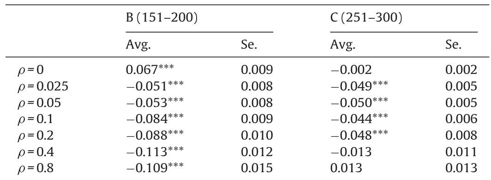

# A history-friendly model of the successive changes in industrial leadership and the catch-up by latecomers  

Fabio Landini a,b,\*, Keun Lee , Franco Malerba b,d a LUISS University,School of European Political Economy,Italy bBocconi University,ICRIOS,Italy cSeoulNational University,Department of EconomicsRepublic of Kored dBocconi University,Department of Management and Technology,Italy  

# ARTICLEINFO  

# ABSTRACT  

Articlehistory:   
Received15March2014   
Received inrevised form 25 March 2015   
Accepted6November2015   
Available online 5 October 2016  

JEL Code:   
030   
010   
L10   
Keywords:   
Catch-up cycles   
Leadership change   
Technology   
Shocks   
History-friendly   
Industrial dynamics   
Simulations  

Successive changes in industrial leadership between both firms and countries (described here as catch-up cycles) have been common in several sectors. This article develops a history-friendly model to explore the role played by technological conditions in the emergence of such leadership changes. The model is inspired by two cases where the emergence of disruptively novel technology played an important role: mobile phones and semiconductors. In the baseline setting the model is able to generate the benchmark case of three cycles with two leadership changes. In particular, the simulation analysis reveals that: (a) the more disruptive the new technology and the lower the incumbents' capabilities, the greater the shake-up of market shares between incumbents and latecomers; (b) leadership change is more likely to occur when it coincides with certain responses by the actors to the technological disruption, such as a high lock-in behaviour on the part of incumbents; and (c) a technology-driven change of industrial leadership is more likely to occur in the presence of increasing returns to technological investments. The counterfactual experiments show that different catch-up dynamics can emerge depending on the magnitude of technological disruption, the degree of lock-ins, the shape of technological landscape, and incumbents' initial capabilities. In particular, four other types of catch-up cycle are generated - the aborted cycle, persistent leadership, return of the old leadership, and coexistence in leadership between latecomers and incumbents. Each of these cycles is identified with a specific historical case of catch-up.  

$\circledcirc$ 2016 Elsevier B.V. All rights reserved.  

# 1. Introduction  

As noted by Schumpeter, one of the essential aspects of capitalism is creative destruction, often leading to changes in industrial leadership between firms both within and across countries. The extensive literature about this kind of change includes studies using differing levels of analysis. Some (e.g., Tushman and Anderson, 1986; Christensen, 1997) concentrate on shifts in leadership at the level of firms within national economies - in those cases focusing on advanced industrial economies. Others, in contrast, while recognising the importance of leadership change at the firm level, subordinate that dimension beneath a primary interest in shifts of leadership at the level of national economies,as in the classic studies by Gerschenkron (1962) and Abramovitz (1986), as well as Mowery and Nelson (1999).  

Building on those themes, a large literature now exists about the rise of industrial leadership in emerging economies in industries like mobile phones, shipbuilding, automobiles and steel. Again the levels of analysis vary widely. Some studies concentrate on the rise of individual firms (Kim, 1997; Lee and Lim, 2001; Amann and Cantwell, 2012), while others give primary attention to leadership shifts between national economies, but at the level of specific sectors (Malerba and Nelson, 2012).  

A third perspective seeks to connect those different levels of analysis.A pioneer in this is Amsden (2001), whose examination of the rise of late-industrialising economies is deeply rooted in the analysis of firm-level behaviour. More recently, Lee (2013) explicitly integrates his primary focus on country-level economic growth with analysis at the level of both sectors and firms. This article also adopts that perspective. Like most of the other articles in this Special Issue, it is primarily concerned with shifts in industrial leadershipbetween firmslocated in different nationaleconomies,mainly involving shifts between advanced and emerging (latecomer) economies; but this analysis is rooted in the micro-level behaviour ofindividual firms and the characteristics of specific sectors.  

One feature of such leadership change is that, within a considerable number of industries, change seems to have occurred repeatedly. Christensen (1997), for example, note this pattern in the history of several industries in the US, most strikingly in the hard disk drive industry where four changes in leadership occurred in only about three or four decades. This occurrence of successive inter-firm leadership changes has also been observed in cases that have simultaneously involved shifts in leadership from advanced to latecomer economies. This is evident, for example, in two cases that were especially important in inspiring the development of this article: in mobile phones where leadership shifted from the US to Europe, and then from Europe to Korea and (partly) back again to the US (Giachetti and Marchi, 2017), and in memory chips where it moved from the Us to Japan and from Japan to Korea (Shin, 2017). However, not much has been written specifically about these paths of successive change in industrial leadership across countries within particularindustries.This article expressly aims at filling that gap.  

We start by following Lee and Malerba (2017) in using the term 'catch-up cycles' to refer to successive changes in industrial leadership with each cycle consisting of entry, gradual rise, forging ahead and decline of a leader, followed by the rise of next leader with its own cycle. Then, influenced by the cases noted above and along with those examined in the other articles in this Special Issue, we ask the following question: under what conditions do catch-up cycles occur in industries and why do they often occur more than once in the same industry?  

In addressing this question, we do not present new empirical observations. Instead we develop a formal model to explore the conditions within which catch-up cycles are more likely to emerge. In doing so, we draw on the case studies mentioned above. In particular, we note that the emergence of novel technologies (sometimes combined with government interventions and demand shocks) played an important role in opening opportunities for leadership change in all these cases, including the studies of leadership change within industries in the advanced economies (e.g. Tushman and Anderson, 1986; Christensen, 1997). This opportunity-opening role of technological discontinuities is therefore the main focus of the present article,following the argument of Perez and Soete (1988) that radical technological discontinuities often create‘windows of opportunity' for latecomer firms and economies. We extend that core idea further in two ways. First, we envisage that the 'size' of technology-driven windows of opportunity may vary, as reflected in the magnitude of the technological discontinuity,with corresponding variability in the consequent disruption to existing markets and capabilities.Second,we envisage thatthe extent to which leadership change depends not only on the size of the technological windows of opportunity, but also on how the incumbents andlatecomersrespond to theopening of thewindows.  

We elaborate on these and other detailed aspects of the model in Sections 2 and 3. However, we highlight here two of its more general features: (i) the scope of the questions it addresses, and (ii) severalbroad aspects of the approachwetake.  

The scope of our exploration overlaps with, but is nevertheless distinct from, several other strands of research concerned with late industrialisation and the underlying dynamics of technological change. At one level our study relates to previous work in this area by economic historians, as in the pioneering contributions of Gerschenkron (1962） and Abramovitz (1986) as well as Chang (2002). However, our exploration of catch-up cycles is more narrowly focused than such broad-ranging studies. It is centred specifically on shifts in industrial leadership - in terms of latecomers overtaking the incumbents in terms of global market shares, or at least closing the gap in market shares to the extent that they acquire similar shares to the global market leaders.  

At another level, the focus on shifts in industrial leadership means that our model-based exploration differs from other related studies that also focus on how innovation and technological change influence shifts of industrial activity to late industrialising economies. This merits clarification in three areas.  

First, in his analysis of the product life cycle, Vernon (1966) argues that the maturation of product technologies after the initial innovation in the US contributes to shifting the geographical location of those productions, first to other advanced economies and then later to developing economies. However, Vernon concentrates on the patterns ofinternational investment thatlaunch new lines of production in those follower economies, and he is not concerned with questions about whether and how the global geography of leadership in those industries might subsequently also shift. Moreover, his discussion is entirely about how the location of production is shifted via foreign direct investments by multinational corporations based in advanced economies. Perhaps not surprisingly, there are no questions about whether this incumbent-driven process of international investment might somehow evolve into change in industrial leadership involving not only production but also R&D andbrands.  

Similarly,although we draw directlyonPerez and Soete's(1988) insights about technological windows of opportunity, we use their idea to address a different question. They are primarily concerned with entry into new industries by firms in late industrialising economies, and they focus on ways in which some of the entry barriers might be lower during phases of radical technological discontinuity.In contrast,our focus is on events occurring two,three or more decades after initial entry - on questions about whether technological discontinuities provide opportunities at that later stage for latecomers to catch up or even forge ahead into globally leading positions in the industry, overtaking the incumbents.  

The same distinction between industry entry and subsequent change in industrial leadership applies with respect to the connection between this study and the literature on 'product space' (Hidalgo et al.,2007). As with our study, this strand of work addresses questions about technology and late industrialisation, arguing that the structure of capability distances in the product space in which firms are embedded shapes the rate and direction of change in the structure of industrial production and exports. However, this argument is again about start-up steps in entering new-to-the-economy lines of business, and no questions are raised about whether or how global changes in industrialleadership might subsequentlyfollowon.  

While concentrating on the incidence of leadership change within catch-up cycles in industries, we focus on catching-up by firms in latecomer countries. However, our model is quite general and it can be used to explain catching-up by firms in an advanced country that starts from a position of late entry into a specific industry compared to firms of another advanced country.  

The model is developed along the lines of the evolutionary models of Nelson and Winter (1982) and the history-friendly tradition (Malerba et al., 1999, 2016). History-friendly models are evolutionary models in which aggregate behaviours emerge out of the repeated interaction among agents. These models were used to examine the evolution of several industries, such as computers, semiconductors, pharmaceuticals, and memory chips (for a review, see Garavaglia, 2010). In those cases, a specific industry is the object of analysis and the actors and mechanisms that characterize that single industry are explicitly modelled. In this article we adopt a slightly different approach. Our model is not restricted to the specifics of one industry. Although it was inspired by the cases of mobile phones and memory chips, we build a simulation model that is general enough to capture the gist of catch-up cycles in more than one industry. We do this in stages. Initially, the model focuses on the commonalities that characterize the standard catch-up cycles in mobile phones and memory chips, with a specific focus on the role of technological discontinuities. Then, once the benchmark cases have been successfully generated, we rely on counterfactual theory-driven experiments to check whether the model can replicate the differing forms of catch-up cycle observed in other industries.  

Overall, our model-based exploration achieves two main results. First, it shows that the probability of leadership change varies with the ‘size' of the windows of opportunity as well as with differing patterns of behaviour by both incumbents and latecomers. Second, it shows that the model can replicate the 'non-standard' types of catch-up cycle that are identified in other case studies in this Special Issue. These other scenarios include: (i) aborted catch-up cycles in which firms fail to complete the forging-ahead stage of the cycle and fall back, (ii) persistent leadership paths in which incumbent firms retain their leadership positions despite the existence of windows of opportunity for latecomers to forge ahead, (i) return ofthe old leadership patterns in which leading incumbents fall behind in earlier cycle but then return to leadership positions in a new cycle, and (iv) patterns of co-leadership in which incumbents still remain as major players in the industry even with the substantial rise of latecomers as market leaders.  

The article is organized as follows. In the next section we outline the standard framework regarding the stages in a catch-up cycle, and we also indicate several variants of the standard cycle that we explorelaterinthemodel.Wethenbrieflydiscussthe twohistorical cases ofthe'standard cycle'that we aim to model,i.e. mobile phones and memory chips. In Section 3 we present and discuss the basic features of the model. Section 4, the core of the article, reports the results of the simulation runs. Finally, Section 5 summarizes the main conclusions of the article.  

# 2. Catch-up cycles and their determinants  

As mentioned in the Introduction, the history of capitalism is marked by several successive catch-up cycles in industries. Following Lee and Malerba (2017), and using the terms first coined by Abramovitz(1986),we define each cycle as consisting of four stages, namely: entry, gradual catching-up, forging ahead, and falling behind. The first stage is the entry stage, where the latecomers start production and try to overcome initial disadvantages with respect to incumbents. The second stage is that of gradual catchingup in terms of market shares and/or productivity. The third stage is that of forging ahead based either on initial adoption and followoninnovations or onradicalinnovationsinorganizations,products, processes and/or markets. The fourth and final stage is that of falling behind where the newly emerged leaders decline because of the rise of new challengers. We call this type of cycle the standard catch-upcycle.1  

In some industries, however, the catch-up cycle can take other forms. From the cases described in this Special Issue, one can identify several relevant ones.In some cases the incumbent has managed to maintain the leadership over several waves of new generations of technology. This is the case, for instance, of the camera industry where, after the first change from Germany to Japan, Japan succeeded in maintainingitsleadership,notwithstanding the arrival of the new SLR digital camera (Kang and Song, 2017). A similar case is memory chips where the leadership has firmly remained for more than two decades in the hands of the Korean company, Samsung, once it took over in the 1990s from Japan (which had earlier toppled the US in the 1980s - see Shin, 2017). In these cases we have persistent leadership cycles. In other cases, latecomers mayjoin incumbents in a leadership position, so that we may have a coexistence of leadership, as in the case of the wine industry (Morrison and Rabellotti, 2017). There may also exist cases where incumbents are abletoregainleadershipafterpreviouslylosingittosomelatecomers, which we refer to as the return of the old leadership, as in the case of Italy in wine in the first decade of the 2oo0s (Morrison and Rabellotti, 2017). Finally, there can be cases of aborted catchup, where the catching-up effort fails to generate a forging ahead but stays stuck at the stage of gradual catch-up. Actually, many late entrant countries fall into this category of aborted catch-up: the critical barrier against the forging-ahead stage is the capability to upgradeintohighervalue-added products.  

These contrasting experiences prompt interesting questions about thefactorsthateffectivelyleadsomeindustriestobecharacterized by one specific pattern of catch-up as opposed to another. Related research has placed considerable emphasis on the concept of windows of opportunities. The literature, in particular, suggests that different types of windows of opportunity for catch-up may open during the evolution of an industry (Lee and Malerba, 2017): they include major innovations or drastic technological change (Perez and Soete,1988), changes in market demand and consumer preferences and business cycles (Mathews, 2005), and changes in institutions and public policy (Guennif and Ramani, 2012; Chang 2002). In addition, companies and national or sectoral systems may respond in different ways to windows of opportunities depending on whether they are the existing leaders or the challengers: responsesinclude variousformsof‘incumbent traps'orotherlockin behaviour (Chandy and Tellis, 2000; Henderson and Clark, 1990) and exploiting latecomer advantages. For a more general discussion not related to catching-up, see Tushman and Anderson (1986), Christensen (1997,2002） Adner (2002） and Adner and Zemsky (2006).2 As we will show in our model, the combination of windows of opportunity and the responses by both incumbents and latecomers can explainwhichpattern of catch-up ismost likely to emerge.  

In this article we focus on one key driver of catch-up cycles: technological change. The rise of new technologies, pursuing the insights of Perez and Soete (1988) who discussed the emergence of new techno-economic paradigms, can create windows of opportunity for latecomers.  

In developing our model we take as a reference two industries in which radical changes in technologies played a major role in changing the leadership across firms and countries: mobile phones and memory chips. We briefly present the two historical cases here. A more detailed analysis can be found in Giachetti and Marchi (2017) and in Shin (2017).  

The evolution of the mobile phone industry is a combination of three standard catch-up cycles, where two technological discontinuities led to two successive leadership changes. Motorola was the company that actually invented the analogue-based cell phone and thus created the sector. During the early 1990s, however, the introduction of the GSM digital standard by EU and US regulators created a technological discontinuity, which enabled the production and commercialization of a new generation of digital mobile phones. While Nokia was quick to switch to this new generation, Motorola stayed too long with the old one.As a result, Nokia took over from Motorola and became the new market leader. Such leadership,however, did not last for long. In the second half of 1990s and early 2o00s, a new series of innovations associated with developments in wireless data communication (e.g. Wi-Fi) and web 2.0, as well as the improvement of multi-touch technologies, enabled a new type of mobile phone to be designed and produced: the so-called “smartphone". Most of these innovations took place outside of the mobile phone industry and created a discontinuity that mobile phone vendors could exploit. While Nokia was relatively slow to move to the new paradigm and eventually fell behind, other companies such as Samsung and Apple were comparatively fast. As a result, a further change of industrial leadership occurred with Samsung and Apple becoming the new leaders. The overall pattern of catch-up was therefore characterized by two successive changes in leadership: first, from the US to Finland, and then from Finland toKorea and (partly)theUS(Giachetti and Marchi,2017).  

The history of memory chips is in many respects similar to the one of mobile phones. In this case also, frequent changes in technology (i.e.new sizes of chips and silicon wafers) served as windows of opportunity for latecomers. In particular, the industry experienced two successive leadership changes: initially, from the US to Japan, and then from Japan to Korea. Frequent shifts in the generations of technologies (from 1 K to 16 K, 64 K, and 128 K bit memory chips), played an important role in these changes, as the latecomers often made aggressive investments in next generation technologies to wrest the leadership away from the incumbents: this can be termed ‘dynamic catch-up' (Shin, 2017) or a ‘stage-skipping' strategy (Lee and Lim, 2001). These changes were also favoured by the presence of technological discontinuities in the production of silicon wafers, the size of which increased from 3 to 5-inches and then from 6 to 8-inches. A larger size of wafers brings about significant productivity increases, but it requires memory chip producers to confront high uncertainty in technologies and market demand. While industry leaders proved not to be ready to take such risk, latecomers successfully exploited the discontinuities and obtained important increases in competitiveness. In contrast, the most recent case of Samsung continuing to keep the leadership in memory chips since thelate 1990scanbeexplained by the narrowing of the window: the new technology (flash memory) replacing the DRAMs is competence-enhancing in the sense that the existing manufacturing facilities in DRAM do not have to be scrapped but can be used to produce flash memories (Shin, 2017).  

Inspired by these two cases, our history friendly model aims at generating the evolutionary path of an industry with three cycles. The first involves the initial establishment of the industry and the emergence of the first leader(s). The other two involve subsequent changes in leadership. The logic of the model rests on the combination of three main components: technological change, firm capabilities and country innovation systems. The nature of these components evolves following a stochastic process, which means that the model is not deterministic. Rather, the emphasis is placed on the complex relationship between technology, actors' decisions and countryinstitutional settings. We propose that successive changes inindustrialleadership can be explained by a combination of the arrival of windows of opportunities and the response by firms and the (national and sectoral) system in which they operate. The next section reviews the basic structure of the model.  

# 3. The model  

The model is an extended version of Capone et al. (2013). Like them we consider an industry where technological and demand conditions shape the competitive dynamics among firms. Differently from their model, however, we consider the existence of firms that may belong to different countries and focus on the shift of industrial leadership among them.  

The model also shares some similarity with Brezis et al. (1993), who develop a macroeconomic model to study patterns of ‘leapfrogging' among countries as a response to occasional major changes in technology. In our case, however, the model is microfounded and the catch-up dynamics emerges from the interaction among competing firms.  

# 3.1. The topography  

We consider an industry with two components: the market space and the technology space. The former is a characterization of consumers' preferences for the products and their characteristics. Products differ along one dimension, their perceived quality. Demand is vertically fragmented (Shaked and Sutton, 1982), with consumers having heterogeneous minimum quality thresholds. Products that do not meet these minimum requirements are not considered for purchase.  

The technology space is a characterization of the technological and innovation opportunities available to firms. Following the literature on technological paradigms and trajectories (Dosi, 1982), we account for both continuous changes and discontinuities in technological innovation. Continuous changes are technical improvements along the trajectory defined by a given technological paradigm, while discontinuities are associated with the emergence of a new paradigm. Within a given paradigm, R&D activities carried out by firms are the main drivers of innovation (Freeman, 1974; Pavitt and Wald, 1971; Pavitt and Soete,1980).A change of paradigm is modelled as a shift of the technological frontier, which enables new (and superior) technological alternatives to be pursued. Firms face the opportunity to exploit these alternatives and follow a new technological trajectory. The extent to which this will happen is endogenously determined by the firms' decisions and depends on several factors,such as firm-level capabilities,the'competence destroying' effect of the discontinuity, the lock-in effects associated with the old paradigm, and the sector-specific shape of the technology landscape.  

The link between market space and technology space is established by firms' activities. Firms search the technology space to improve the techniques used in production and develop products that generate utility for consumers. Firms are heterogeneous: in particular, they may differ either because they discover different techniques or because they do not have the same capabilities to servethe market.  

The industry is populated by firms of three competing countries. Firms in all countries have access to the same technology space and can serve three distinct markets: one national market and two foreign markets. At the beginning the industry (and the related market) starts only in one country, which we call A, or the incumbent (with $t_{A}$ being A's time of entry). After some periods an embryonic industry is born also in the other countries,which we call B and C,or latecomers (with $t_{\mathsf{B}}$ and $t_{C}$ being $B^{\prime}s$ and $C s$ time of entry). From that period onward, firms of countries A, B and C compete to gain market shares.The country in which firms serve the largest portion of the market is defined as the “leader country".  

In line with the appreciative theory of catch-up cycles and the literature on national and sectoral systems of innovation, firms’ innovative performance depends on a set of countrylevel effects: (i) an ‘information effect' associated with the role that country-specific organizations and institutions play in orienting firm searching (Mazzoleni and Nelson, 2007); (ii) a 'complementarity/lock-in effect' related to the impact that interactions within a country's sectoral system have on the perception of new technologies (Malerba, 2002, 2004); and (i) a learning effect' associated with the support of national systems of innovation to the accumulation of firm-level capabilities (Lundvall, 1992).  

Fig. 1 reports a graphical representation of the model. The following sections present a detailed description of each of the model's components.  

# 3.2. Technology space  

The technology space consists of an ordered vector of $J\!>\!0$ techniques. Firms search the technology space to find new techniques. Every period, firms can use only one technique and develop a single product.  

The “merit" of a technique is captured by coefficient $r_{j}\,\in\,[0,1]$ with $j\,\in\,[0,J]$ being the technique's position within the landscape.Technical meritis distributed accordingtoabetacumulative distribution function, with shape parameters $\alpha_{r}$ and $\beta_{r}$ .Bysetting $\alpha_{r}=1$ and $\beta_{r}>1$ we obtain a concave landscape,where the marginal increase in technical merit reduces along the landscape (i.e. decreasing returns to technological investments). This shape suits a traditional industry where technical improvements along a given trajectory get smaller at the margin. On the contrary, by setting $\alpha_{r}>1$ and $\beta_{r}=1$ we obtain a convex landscape, where the marginal increase in technical merit is larger the more we move up the technology space (i.e. increasing returns to technological investments). In this case the landscape suits a high-tech sector. Fig. 2 offers a graphical representation of these two landscapes.  

When the industry is born, the technology space is bounded by an initial frontier $\zeta_{1}\,\in\,[0,J]$ (see Fig. 2). Firms can pick any technique $j$ such that $r_{j}\leq r_{\zeta_{1}}$ . This frontier corresponds to the best technique that can be picked given the initial technological paradigm (first-generation technology). Following a technological discontinuity, i.e., a change of technological paradigm, this frontier can shift, opening a window ofopportunity. Firms adopting the new technology can pick any techniques such that $r_{\zeta_{1}}\leq r_{j}\leq r_{\zeta_{2}}$ , where $\zeta_{2}\,\in\,[0,J]$ is the new frontier. The number and merit of the techniques included in the interval $[\zeta_{1},\zeta_{2}]$ determine whether such a window is valuable for firms. Shifts in the technological frontier can occur repeatedly during the industry's life. We denote with $t_{n}$ the period in which the $n_{\mathrm{~\rightmoon~}}$ -th shift occurs,with $n>1$  

Firms have limited information on the shape and composition of the technology landscape. In particular, they don't know ex-ante the merit and position of potential techniques. Firms randomly search the technology space and if they find a technique with higher merit than the one they are currently adopting they switch to the new technique. We denote with $r_{f,t}$ the merit of the technique adopted by firm $f$ at time t. The searching procedure is described in greater detail below.  

# 3.3. Market activities  

Firms can serve both the national and the foreign markets, even though they are born with the propensity to serve the national market first. To serve foreign markets, firms face a sunk cost $c_{E}>0$ which is paid out of the resources accumulated in a'export account' (see below). In addition, firms serving their national market enjoy a market advantage over foreign firms, which can be interpreted both as a bias of the national demand in favour of local products and/or as the existence of market restrictions.3  

The propensity for the product of $\operatorname{flrm}f$ to be sold depends on three components: technical merit $(r_{f,t})$ , capabilities $(\theta_{f,t}\,\in\,[0,1])$ and price $(p_{f,t}>0)$ , together with the price advantage discussed above. To lend some credibility to the model, $r_{f,t}$ captures technical and objective features of the product and $\theta_{f,t}$ managerial and organizational routines related to how the product is produced, marketed and distributed. The combination of $r_{f,t}$ and $\theta_{f,t}$ determines the perceived quality of the product. Let consumers be uniformly distributed along the real unit segment. As discussed above, demand is vertically fragmented and thus, depending on the quality thresholds of consumers, distinct market segments exist. In any of such segment, the propensity for the product of $\operatorname{firm}f$ coming from country $k\,\in\,\{A,\bar{B},\bar{C}\}$ to be sold to a consumer $i\in[0,1]$ in country $l\,\in\,\{A,B,C\}$ is:  

$$
U(i)_{f,s,t}^{k,l}=\left\{\begin{array}{c c c}{0}&{,i f}&{q_{f,t}<Q(i)}\\ {\displaystyle\frac{q_{f,t}}{(1-\sigma)p_{f,t}}}&{,i f}&{q_{f,t}\geq Q(i)\wedge k=l}\\ {\displaystyle\frac{q_{f,t}}{p_{f,t}}}&{,i f}&{q_{f,t}\geq Q(i)\wedge k\neq l}\end{array}\right.
$$  

where $s$ is the market segment (see below), $\sigma\,\in\,[0,1]$ is the price advantage when serving the national market, $q_{f,t}=\theta_{f,t}\cdot r_{f,t}$ is the perceived quality of the product, and Q(-) is a beta cumulative distribution (with shape parameters $\alpha_{d}$ and $\beta_{d}$ )that assigns to each consumer i a minimum perceived quality requirement $Q(i)$ By changing $\alpha_{d}$ and $\beta_{d}$ we can obtain different degree of vertical fragmentation (see Capone et al., 2013). For the sake of simplicity the degree of vertical fragmentation is the same in all markets.  

For any degree of vertical fragmentation, market shares are computed as follows.Consider country l and denote $F^{l}$ as the set of firms that in any period sell in that country a product with strictly positive perceived quality. Assuming quality is observable, we can arrange firms in a non-descending order by quality, in such a way that $q_{1,t}\leq q_{f,t}\leq q_{F^{l},t}$ for all $f\,\in\,F^{l}$ . Let $Q^{-1}(q_{f,t})$ be the fraction of consumers whose quality threshold is no higher than $q_{f,t}$ . On this basis, we can define $S^{l}=|F^{l}|$ market segments such that $S_{1}^{l}=Q^{-1}(q_{1,t})$ and $S_{s}^{l}=Q^{-1}(q_{f=s,t})-Q^{-1}(q_{f=s-1,t})$ Then, the market share of firm $f$ from country $k$ in segment s is:  

$$
m_{f,s,t}^{l}=\frac{U_{f,s,t}^{k,l}}{\sum_{f=s}^{S^{l}}\!U_{f,s,t}^{k,l}}
$$  

On this basis, the market share of $\operatorname{flrm}f$ in the whole country $l$ is simply the sum of its shares in the segments weighted by the segment's relative size:  

$$
m_{f,t}^{l}=\sum_{s=1}^{S^{l}}m_{f,s,t}^{l}\cdot\frac{S_{s}^{l}}{Q^{-1}(q_{F^{l},t})}
$$  

$\operatorname{Firm}f^{\prime}$ s market share in the whole industry can be thus written as:  

$$
m_{f,t}=\frac{m_{f,t}^{A}\chi_{t}^{A}+m_{f,t}^{B}\chi_{t}^{B}+m_{f,t}^{C}\chi_{t}^{C}}{\chi_{t}^{A}+\chi_{t}^{B}+\chi_{t}^{C}}
$$  

where $\chi_{t}^{l}>0$ is the number of consumers in country l. It follows that the total portion of the market covered by the firms of country $k$ atime $t$ is:  

$$
m_{t}^{k}=\sum_{f\in F_{k,t}}m_{f,t}
$$  

  
Fig. 2. Shape of the technology landscape.  

where $F_{k,t}$ is the set of firms that belong to country $k$ and are alive at time t. Whenever $m_{t}^{k}$ is greater than the market share of allthe other countries,we say that country $k$ is the “leader country". Similarly, when $m_{f,t}$ is greater than the market share of all other firms, we call firm $f$ the “leader firm".  

# 3.4. Price, profit and industry dynamics  

Firms serving the market in country I set prices according to the mark-up rule:  

$$
P_{f,t}^{l}=c\cdot(1+w_{~f,t}^{l})
$$  

where $c$ is the marginal cost of production, which is equal across all firms and countries, and constant over time.4 At time t firms choose themark-up $w_{f,t}^{l}$ to maximize profit, given the elasticity of demand  

$\eta>1^{5}$ and the local competitive pressure at $t-1$ as expressed by market share:  

$$
w_{f,t}^{l}=\frac{m_{f,t-1}^{l}}{\eta-m_{f,t-1}^{l}}
$$  

The profit of firm $f$ at time $t$ is thus the sum of the profits obtained in the three countries:  

$$
\pi_{f,t}=(p_{f,t}^{A}-c)\cdot\chi_{f,t}^{A}+(p_{f,t}^{B}-c)\cdot\chi_{f,t}^{B}+(p_{f,t}^{C}-c)\cdot\chi_{f,t}^{C}
$$  

where $\chi_{f,t}^{l}=m_{f,t}^{l}\cdot\chi_{t}^{l}$ is $f$ 's number of consumers in country l.  

Firms enter and exit the industry depending on their performance. Every period there is a probability $\omega\,\in\,[0,1]$ thatanew firm is selected for entry. This probability is the same in all countries. A new entrant starts by searching the technology space, and if she finds an available technique (i.e., a technique that is not yet patented, see below) she can serve the market. Firms that do not find any available technique or that at the end of the period have a total market share lower than the exit threshold $m^{e}\,\in\,[0,1]$ exit the industry. This exit threshold is the same in all countries. It follows that while the probability $\omega$ does not depend on the structure of the industry, the actual rate of entry does: the higher the degree of industry concentration and the lower the number of available techniques, the smaller the chances that a selected new firm can effectively enter the industrv.  

The total number of consumers in the three countries changes over time, due to causes not explicitly modelled such as technology adoption and product diffusion. In particular, the number of consumers follows the logistic growth path:  

$$
\chi_{t}^{l}=\frac{\phi\chi_{0}^{l}e^{g t}}{\phi+\chi_{0}^{l}(e^{g t}-1)}
$$  

where $\varPhi>0$ is the carrying capacity, $\boldsymbol{\chi}_{0}^{l}$ is the initial number of consumers in country $l$ and $g$ is the growth rate.To economize on parameters we assume that theinitial number of consumers in latecomers is always smaller than the initial number of consumers in the incumbent and the relative size is fixed (i.e., $\chi_{0}^{A}=\chi_{0}$ and $\chi_{0}^{B}=\chi_{0}^{C}=\chi_{0}/2)$ . We run some simulations and checked that the results are robust to changes in the relative size.  

# 3.5.Innovation activities  

Firms invest the profit earned in the previous period in two distinct accounts: an R&D account, $R_{f,t}$ , which is used to finance innovation activities; and an export account, $E_{f,t}$ , which is used to finance exports,i.e., to cover the sunk cost $c_{E}$ . Firms invest a fixed fraction $\tau\,\in\,[0,1]$ of their profit in $R_{f,t}$ . while the remaining part $1-\tau$ is accumulated in $E_{f,t}$ . This fraction is the same across all firms and does not vary over time. Once $E_{f,t}$ is sufficiently large to cover $c_{E}$ , firms gain access to one of the foreign markets. Firms start by serving the foreign market that, in the given period, has the greatest numberofconsumers.From thatperiod onward theexport account is set to zero and firms start to accumulate new resources to gain access to the other foreign market.  

Innovation activities consist of searching procedures within the technology landscape. Every period, firms can extract a number of new techniques. The number of tries available is floor $\left(R_{f,t}/c_{R}\right)$ where $c_{R}>0$ is the unit cost of search. Once a new technique is found, it is allocated a patent and no other firm can use it. If more than one new technique is found in the same period, firms adopt the one with the highest merit.  

Although the technology space is common to all countries, the searching process is not. In particular, there exists a countryspecific‘information effect' that determines the pace and direction of searching. Firms that have the opportunity to innovate within paradigm $h$ (i.e. using the $h$ -th generation technology) do not know their actual position in the technology space and randomly search over the support $[\zeta_{h-1},\zeta_{h}],$ where $\zeta_{h-1}$ and $\zeta_{h}$ are the technological frontiers of the previous and present paradigm respectively. If no firm in the country has picked any of the techniques included between $\zeta_{h-1}$ and $\zeta_{h}$ (i.e. the searching firm is a pioneer), the search is driven by a uniform distribution. Once a new technique is found, however, all firms ofthat country start searching using a Beta cumulative distribution the shape of which changes depending on the quality of the new techniques discovered in the country. The larger the latter's average merit, the higher the probability that good techniques (i.e. techniques that are close to frontier $\zeta_{h}$ )are drawn.This endogenous change in the shape of the Beta cumulative distri  

# 3.6.Discontinuities  

Industry evolution is marked by technological discontinuities. At certain periods, for reasons not explicitly modelled (e.g., innovations taking place in other sectors of the economy), a new technology emerges, which shifts the technological frontier rightwards. Firms adopting the new technology can extract techniques with greater technical merit. Parameter $\psi_{t}\,\in\,[0,1]$ measuresthe percentage shift in the technological frontier that occurs at period t and it is thus a proxv of the size of the discontinuity.6  

The probability that the firm of a given country perceives the existence of the new technology depends on two components: individual capabilities (positively) and the country's performance while using the old technology (negatively). The first component operates at the firm level and captures the role of learning by doing and absorptive capacity in favouring the understanding of new technologies (Cohen and Levinthal, 1990). The second component operates at the country level and captures the effects of technological complementarities and path dependency in delaying the perception of the new technology (Perez and Soete, 1988). Formally,we write the probability that $\operatorname{flrm}f$ ofcountry $k$ perceives the new technology as:  

$$
a_{f,t}^{k}=\theta_{f,t}\left(1-\lambda m_{o l d,t}^{k}\right)
$$  

Where $m_{o l d,t}^{k}$ is thecountry'smarlketshae using theold technology and $\lambda\,\in\,[0,1]$ is a parameter reflecting the strength of path dependency. If a new entrant enters the industry once the new technology has already been adopted by at least one firm in the country of origin, the new entrant perceives the existence of the new technology with probability one.  

If a firm perceives the existence of the new technology, the choice to adopt depends on two components: the expected gain in technical merit; and the impact that the new technology has on the capabilities accumulated within the old paradigm. In this setting, we consider a competence-destroying discontinuity, which makes firms that use the old technology relatively unfit to take advantage of the new one. In particular, $\operatorname{flrm}f$ will choose to adopt at time $t$ whenever the following inequality satisfies:  

$$
q_{f,t}<(1-\phi)\theta_{f,t}\cdot\bar{r}
$$  

where $\phi\,\in\,[0,1]$ is the competence-destroying effect (the greater $\phi$ , the greater the capability loss if adopting) and $\bar{r}$ is the expected technical merit over the support $[\zeta_{o l d},\zeta_{n e w}]$ , with $\zeta_{o l d}$ and $\zeta_{n e w}$ being the old and new technological frontier.7  

# 3.7.Learning  

Firms are born with a set of heterogeneous capabilities. Capabilities accumulate over time following a learning path that combines increasing returns and long-run saturation. The latter, in particular, reflects the fact that, being developed within a given paradigm, capabilities run into diminishing return as the innovative potential of a technology gets exhausted. At the same time, firms' learning benefits from systemic interactions with other firms, organizations and institutions, especially when they belong to the same country. In particular, the capabilities of $\operatorname{flrm}f$ from country $k$ evolve following the logistic process:  

$$
\theta_{f,t}=\frac{\theta_{f,0}e^{\gamma\overline{{\theta}}_{t}^{k}t}}{1+\theta_{f,0}(e^{\gamma\overline{{\theta}}_{t}^{k}t}-1)}
$$  

where $\theta_{f,0}$ , i.e., the firm's initial capabilities, is a random draw from a uniform distribution over the support $\left[0,\theta_{m a x}^{k}\right]$ with $\theta_{\mathrm{max}}^{k}$ being the maximum level of initial capabilities in country $k$ $\bar{\theta}_{t}^{k}$ is the average level of capabilities in country kat time $t$ , and yis a parameter that captures the strength of country-level effect on learning.  

# 4. The simulations runs  

The above model does not allow for analytical, closed-form solutions. Therefore, we rely on simulations to analyse its behaviour. We proceed in two steps. First, we calibrate the model so as to generate a stylized episode of successive catch-up, such as the one observed in the mobile phone and memory chip industries (historyfriendly runs). Second, we carry out theory-driven counterfactual experiments. In particular, we ask whether the identified patterns of catch-up could have been different had some key parameters - as suggested by the appreciative theory of catch-up cycles - taken alternativevalues.  

It is important to notice that the dynamic patterns shown below are emergent properties of the model. To eliminate across-runs variability due to stochastic components we perform extensive Monte Carlo analyses. Consequently, all results refer to across-run averages over 6o0replications.  

# 4.1. History-friendly runs  

Our history-friendly simulations(for theparameterization see online Appendix) portray a typical episode of industry evolution. Country A enters the industry first and soon becomes the leader. After 50 periods (one period is approximately one month） an embryonic industry is born also in country $B$ ,which then becomes the follower. Later, at period 150, firms of country $C$ also enter the industry. Firms of all countries enjoy a symmetric advantage in serving their national market, which gives to latecomers the opportunity to grow. At the same time, firms of country B and C face an initial capability gap with respect to the incumbent. Moreover, the initial market size of country B and $C$ is smaller than country A: it achieves the same size only by the end of the simulation. This makes industrial leadership difficult to change. The industry lasts 300 periods, i.e. approximatelv 25 vears.  

Starting from this setting, two technological discontinuities arise, one at period 1o0-i.e. after the entry of $B-$ and the other at period 2o0-i.e., after the entry of C. Initially, firms are born with a technology that allowssearchingoverthe first $40\%$ of the landscape. At period 1o0 a second-generation technology emerges, which makes it possible to search $70\%$ of the landscape (i.e. $\psi_{100}=30\%$ .At period 200, then, a third-generation technology becomes available, which enable searching within the remaining $30\%$ (i.e. $\psi_{200}=30\%$ Under a wide range of parameter settings, such discontinuities will open windows of opportunities for latecomers. In our historyfriendly simulations we set parameters so as to generate a case of successive catch-up where industrial leadership shifts first from the incumbent to one of the latecomers,and then from this latecomer to another latecomer. To facilitate the reader we report in the main text only a graphical representation of results. Tables with the complete output of the simulations and the related statistical tests are in the online Appendix.  

  
Fig. 3. Evolution of market shares in the history-friendly runs.  

Fig. 3 reports the evolution of the country market shares. Three standard cycles with two instances of leadership change are generated. Initially, A-firms control $100\%$ of the market. Such monopoly persists until period 50 when, following the entry of country B, A's market share quickly reduces by one fifth (from $100\%$ to $80\%$ 0.At period 1oo, however, A-firms still control more than $73\%$ of the market.  

The competitive structure of the industry changes when the second-generation technology emerges, at period 1oo. Despite the high capabilities, A-firms adopt the new generation technology with some delay (see Fig. 4), which gives to $B$ -firms an advantage that translates into an increased market share. In less than 40 periods country B goes from $26\%$ to nearly $60\%$ market share, becoming the new leader. Following the entry of country C, bothA and $B$ experience a reduction in market shares. Nevertheless, country B retains the leadership. Between periods 151 and $200\,B$ controls $59\%$ of the market (on average) while A only $34\%$ .The difference is statistically significant ( $p$ -value $<0.01$  

The leadership of B, however, does not last for long. When the third-generation technology emerges, a new change of industrial leadership occurs. In this case $C_{}$ -firmsfacerelativelylowcosts to adopt the new technology compared to $A$ -firms and B-firms. As a result, they adopt early (see Fig. 4) and improve their market positions. In few periods the market share of country $C$ goes from less than $12\%$ to nearly $30\%$ : at around period $230~C$ takes industrial leadership away from B. During the last 50 periods $C$ firmly remains the leader country with $39\%$ of market share (on average), followed byA with $33\%$ In this case too, the difference is statistically significant $(p\!<\!0.01)$  

The impact of technological discontinuities on the evolution of market shares raises some questions concerning the firm-level competitive dynamics. Since discontinuities lead to successive changes of industrial leadership among countries, it is interesting to investigate whether a similar process also characterizes the competition among firms. The latter is indeed a key feature of the historical episodes that inspired our model (e.g. mobile phones).  

Although our simulations make it difficult to track the behaviour of individual firms across runs, we can get some insights on the firm-level competitive dynamics by looking at the probability of firm leadership, which is computed by counting the average number of times a firm of a given country is the leader firm across runs. Fig. 5 shows these results. While after the first discontinuity (periods 151-200) a $B$ -firm is more likely to be the leader firm than an A-firm ( $p$ -value $<0.01$ ), after the second discontinuity (periods 251-300) the highest chances are for a C-firm ( $\boldsymbol{p}$ -value $<\!0.05$  

  
Fig. 4. Technology adoption in the history-friendly runs.  

  
Fig. 5. Firm-level competition dynamics in the history-friendly runs.  

Therefore, similarly to the country-level competitive dynamics, also firm leadership is likely to shift.  

Overall, the history-friendly runs do a good job in reproducing a stylized case of three standard catch-up cycles, with two instances of leadership change. The latter occur both at firm level and at country level. From the historical point of view the simulation closely replicates the cases of mobile phones and memory chips, where a series of technological discontinuities favored the cyclical shift of industrial leadership among a few global players.  

# 4.2. Sensitivity analysis  

Before proceeding with counterfactual experiments, we check the robustness of the history-friendly runs through sensitivity analysis. The latter is based on a local exploration of parameters via Latin hypercube sampling (for more details see online Appendix). In selecting the sample points we pay attention not to alter the parametric asymmetries existing among countries, which are specific to the historical episodes that we want to interpret (e.g. different initial size of the market in the three countries). Moreover, we make sure that under all combinations of parameters the viability of the industry ispreserved.  

The results of the sensitivity analysis are encouraging. After having sampled an enlarged portion of the parameter space, we are still able to reproduce three standard cycles with two instances of leadership change: first from country A to B, and then from B to C. This is true both at the country level and at the firm level. These results suggest that the history-friendly parameterization is robust, i.e. the outcome does not depend on ad hoc parameter conditions.  

# 4.3. Counterfactuals:theory-driven experiments  

Once a set of robust history-friendly parameters is identified, we check how the catch-up dynamics change when certain key parameters vary. In particular, we focus on parameters that Lee and Malerba (2017) identify as causal factors behind the emergence of catch-upcycles.  

We run four distinct experiments. First,we reduce the size of thewindows $(\psi)$ associated with the discontinuities.Second,we reduce both the strength of path dependency $(\lambda)$ and the size of capability loss after adoption $(\phi)$ . Third, we change the shape of the technology landscape and compare one with increasing returns (as in the baseline) with one with decreasing returns. Finally, we increase the average level of capabilities incumbent firms are endowedwith attheirbirth.In allcaseswewanttoevaluate the extent to which such changes alter the emerging catch-up dynamics among countries.  

In all experiments we gradually vary the size of the related parameters, taking the history-friendly calibration as the benchmark. In particular, we call $\rho\ge0$ the experimental operator and compute the value to be tested in experiments by multiplying the history-friendly value by $\rho$ . It follows that $\rho$ represents a proxy of the parametric deviation with respect to the baseline (where $\rho=1$ corresponds to the baseline value). To facilitate things for the reader and to make results comparable across experiments, we refer to $\rho$ as the value of parameters while commenting on the results.  

Experiment 1: changing the size of the windows. According to the appreciative theory of catch-up cycles, the opening of windows of opportunity is a major driver of catch-up. If adequately exploited, such windows allow latecomers to improve their competitiveness and gain market shares. Obviously, this view implies that, whenever these windows are absent or too small, catch-up is less likely tooccur.  

To test this prediction we run a set of simulations where we change the value of parameters $\psi_{100}$ and $\psi_{200}$ , i.e., the size of the windows opening at period 100 and 200. We start by considering a setting where no window opens at all ( $\dot{\psi}_{100}=\psi_{200}=0_{.}$ 0.Then, we gradually increase the size of both windows. All the other parameters are left unchanged.  

Our main result can be summarized as follow:  

  
Fig. 7. Average market shares and size of the windows.  

Result 1:In the presenceoftechnologicaldiscontinuities,thelarger the windows of opportunity (ie. the more disruptive the discontinuities),the greater the chances that a technology-driven change of industrialleadershipoccurs.  

Fig. 6 provides preliminary evidence in support of Result 1. The graphs show the evolution of the country market shares for different size of the windows. When the windows are absent (panel I) or too small (panel Il), the leader country is always A. In both scenarios successful entry takes place and latecomers (especially country B) can gain significant shares of the market. However, no change of industrial leadership occurs and the dynamics converge towards an aborted catch-up. The result is different for a larger size of the windows (panels Ill and IV), when latecomers enjoy greater advantages from early adoption. This leads country $B$ to take industrial leadership away from A and makes it possible for C to close the gap with the other two countries.  

Fig. 7 provides a systematic test of the role played by the size of the windows. Starting from $\rho=0.025$ we repeatedly double its value up to $\rho=0.8$ . For each value of $\rho$ we plot the countries' average market shares for $151\leq t\leq200$ and $251\leq t\leq300$ i.e., the time intervals during which we observe a leadership change in the history-friendly runs (see above). Both figures suggest that the larger the size of the windows, the greater the market share of the catching-up country and thus the more likely a change of industrial leadership. In particular, during interval $151\leq t\leq200$ the market share of country B increases on average by $6\%$ .Moreover, for $\rho\ge0.1$ B's market share becomes the greatest ( $\boldsymbol{p}$ -value $<\!0.01$ ).8 In the interval $251\leq t\leq300$ the effect of an increase in the size of the windows is even stronger in that it produces a $12\%$ increase (on average)in the market share of country C. In this case C becomes the leader countrv onlv for $\rho\ge0.4$ （ $p$ -value $<0.01$  

Experiment 2: lock-in effect. The second experiment looks at the role of technological lock-in.As noted above,one ofthe factors that provided latecomers in the mobile phone and memory chip industry with a better position to exploit the windows of opportunities compared to incumbents was the latter's difficulty in perceiving the discontinuities. This, together with the competence destroying effect of the new technology, delayed the incumbent's technological upgrading. Similar processes of technological lock-in played an important role in other cases of catch-up (see Lee and Malerba, 2017).  

To test the importance of technological lock-in, we run a set of simulations where we gradually reduce both the strength of path dependency (^) and the size of capability loss after adoption $(\phi)$ .All other parameters are the same as in the history-friendly calibration. We expect these changes to provide the incumbent with a better position to perceive and exploit the technological discontinuities. This should, in turn, make a change of industrial leadership less likely to occur.  

In particular, we find that:  

Result 2: In the presence of technological discontinuities,a suffciently high degree of technological lock-in is a necessary condition for a technology-drivenchangeofindustrial leadershiptooccur.  

In the first set of simulations we set $\rho=0.6$ for both $\lambda$ and $\phi$ ，so that $\lambda$ is reduced from 1 to 0.6 and $\phi$ from 0.9 to 0.54. Figs. 8 and 9 shows the evolution of the country market shares and rate of technology adoption for this parameterization. In line with our expectations, no change of industrial leadership occurs. Due to the reduced path dependency and competence destruction, country A perceives and adopts the new technologies faster than in the history-friendly runs, especially after the first discontinuity (for a comparison see Fig. 4). For all periods the average market share ofA remainshigher than thatofbothcountries $B$ and C( $p$ -value $<0.01$ The overall cycle is thus characterized by the persistent leadership of the incumbent.  

Similarly to Experiment 1 we systematically vary the strength of technological lock-in and explore the correspondent effect on the aggregate catch-up dynamics.We start from $\rho=1$ and reduce its value by 0.1 until $\rho=0.6$ .Fig. 10 shows the results of these simulations. There is a threshold on the value of lock-ins for which a change of leadership occurs. Such threshold is different depending on the time interval that we consider. In particular, if the strength of lock-ins is too low (i.e. $\rho\leq0.8$ for $151\leq t\leq200$ and $\rho\leq0.9$ for $251\leq t\leq300_{.}$ ), then country A's average market share is always higher than $B^{\prime}s$ market share ( $\boldsymbol{p}$ -value $<0.01$ ）and no change of leadership occurs. On the contrary, if the strength of lock-ins is sufficiently high (i.e. $\rho>0.8$ and $\rho>0.9$ ), then industrial leadership shifts from $A$ to $B$ after the first discontinuity( $p$ -value $<0.01$ and from A to C after the second discontinuity ( $p$ -value $<0.01$ ). This resultsuggests that the existence ofpositive degree of technological lock-ins is indeed a necessary condition for a technology-driven change of industrial leadership to occur. When lock-in is weak (or even absent), the emergence of a discontinuity is per se not sufficient toinduce a change of leadership.  

  
Fig. 8. Evolution of market shares and reduced degree of lock-in.  

Experiment 3: shape of the technology landscape.The third experiment tests the effect of a change in the shape of the technology landscape. As previously noted, such a shape reflects certain assumptions about the nature of technical change. A concave landscape is best suited to represent traditional industries because it implies the existence of decreasing returns to technological investments.A convex landscape,in contrast,is best suited to represent high-tech industries because it allows firms to gain a substantial advantage frominnovation.Sinceinthehistory-friendly calibration we took mobile phone and memory chips as reference cases, we assumed aconvexlandscape.Nowwe checkwhathappenswhen the shape of the technologv landscape changes.  

We run two distinct sets of simulations. In the first one (Experiment 3.1) we repeat Experiment 1 assuming that the technology landscape is concave rather than convex. In particular, we set $\alpha_{r}=1$ and $\beta_{r}=3$ (instead of $\alpha_{r}=3$ and $\beta_{r}=1$ as in the baseline) and test the impact of different sizes of the windows. Our main result can be summarized as follows:  

Result 3: in the presence of technological discontinuities, a technology-driven change of industrial leadershipis more likely to occurinhigh-techsectors thanintraditional sectors.  

Fig.11 provides preliminary evidence in support of Result 3. It shows the evolution of the country market shares in the presence ofaconcavelandscape andforareducedsizeofthewindows of opportunities (i.e. $\rho=0.4)$ .The presence of decreasing returns to technological investments generates much smoother catch-up dynamics compared to the baseline (for a comparison see Fig. 6, panel IV). After the first discontinuity, country $B$ takes more than 50 periods to achieve the same market share as A.Eventually,it obtains industrial leadership but the distance from A remains limited. As the second discontinuity opens, country $C$ is also able to increase its market share, although this time no change of industrial leadership occurs. Overall, the dynamics converges towards a regime of substantial co-existence among the three countries.  

Fig. 12 presents a deeper investigation of the relationship between the shape of the landscape and the possibility of a technology-driven change of industrial leadership. The comparison with the results obtained above (Fig. 7) suggests that in presence of a concave landscape a change of industrial leadership occurs for relatively larger windows. In particular, while in the baseline setting a change of leadership in interval $151\leq t\leq200$ occursfor $\rho>0.05$ , when the landscape is concave it occurs only for $\rho>0.4$ $p$ -value $<0.01$ ). A similar result holds for $251\leq t\leq300$ .This suggests that, everything else being equal, a technology-based window of opportunities is more likely to generate a change of industrial leadership in high-tech sectors than in traditional sectors.  

  
Fig. 9. Technology adoption and reduced degree of lock-in  

  
Fig. 10. Average market shares and strength of lock-in.  

  
Fig. 11. Evolution of market shares and size of the windows in traditional sectors  

To provide additional evidence in support of Result 3 we compute, for every size of the windows, the difference between the average market shares of countries $B$ and $C$ in the two landscape conditions. Results are reported in Table 1. In the presence of technological discontinuities (i.e. $\rho>0$ ), a concave landscape significantly reduces the average market share of the catching-up country (except when $\rho>0.4$ for $251\leq t\leq300\}$ ). Moreover, when technological discontinuities are absent (i.e. $\rho=0$ ), the presence of a concave landscapeimproves(or at least it does not worsen)the performance of the catching-up country. In particular, for $151\leq$ $t\leq200$ a concave landscape allows country $B$ to obtain a higher market share than the one obtained in presence of a convex landscape. No significant result obtains instead for country C.Altogether these results suggest that, although technological discontinuities can indeed be less effective as triggers of catching-up in traditional sectors,thesesectorscanberelativelyfavourableenvironmentsfor latecomers when discontinuities are absent (or at least small).  

The evidence derived from Experiment 3.1 suggests the possibility that the size of the windows and the shape of technology landscape exhibit some degree of complementarity: the larger the size of the windows and the stronger increasing returns (i.e. the more convex the technologylandscape),the greater the shake-up of market shares between incumbents and latecomers, and therefore the more likely that the leadership shifts. To test this prediction we run another set of simulations (Experiment 3.2) where we simultaneously vary both the size of the windows and the shape of the technology landscape. We obtain the following result:  

  
Fig. 12. Average market shares and size of the windows in traditional sectors.  

  
Fig.13.Average market shares,shape of the landscape and size of the windows.  

Table1 Shape of technology landscape and performance of catch-up countries.   

  
Note:for each country the results refer to the difference between the country's average market share in presence of a concave landscape and the country's average market sharein presence of a convex landscape. $\mathsf{p}<0.01$ $^{\ast}\,{\sf p}<0.05$ $\mathrm{~\hat{p}<0.1}$  

Result4:inthepresence oftechnological discontinuities,thelarger the windows of opportunity and the stronger increasing returns, the greaterthechancesthatatechnology-drivenchangeofindustrialleadershipoccurs.  

Fig. 13 reports the country average market shares for $151\leq t\leq$ 200 and $251\leq t\leq300$ whenboth the sizeof thewindows and the strength of increasing return are gradually varied.9In line with our prediction, the market share of latecomers tends to increase with positive changes in $\rho$ . In particular, for $151\leq t\leq200$ a $10\%$ increase in both size of the windows and strength of increasing returns produces an average increase of $1.8\%$ in country B's market share - notice that by varying only the size of the windows while keeping increasing returns at their baseline value $B^{\prime}s$ market share increases only by $0.7\%$ (the difference is statistically significant, $p.$ value $<\!0.01$ ). For $251\leq t\leq300$ the effect is weaker as the average increase in the market share of country $C$ is only about the $0.8\%$ However, there is a threshold value at $\rho=0.7$ beyond which the relationship becomes stronger. For $\rho>0.7$ a $10\%$ increase in both size of the windows and strength of increasing returns produces an average increase of $1.6\%$ in the market share of C. Such value is significantly greater than the one obtained when varying the size of the windows alone( $p$ -value $<0.01$ ). These results suggest that a positive complementarity exists between the size of the windows and the strength of increasing returns.  

  
Fig. 14. Evolution of market shares and incumbent capabilities.  

Experiment 4: Incumbent's capabilities. In the fourth and last experiment we explore the role of firm's capabilities. The appreciative theory of the catch-up cycles sees capabilities as a major driver of firm's competitiveness. The larger the capabilities, the more firms are able to seize the opportunities available in the surrounding environment and the better their performance. In this sense capabilities can play a role both as entry barriers that favour incumbents and as drivers of catch-up for latecomers. In the present article we focus on incumbent capabilities, leaving the analysis of latecomercapabilitiesforfutureresearch.  

To test the role of incumbent capabilities we run a set of simulations where we increase the maximum level of capabilities A-firms can be endowed with at their birth (i.e. $\theta_{\mathrm{max}}^{A}$ ). Compared to our history-friendly runs this amounts to assuming that on average firms of the incumbent country enjoy a favourable capabilities gap with respect to latecomers, which can be due, for instance, to a more effective national system of innovation. The main result of this experiment can be summarized as follows:  

Result5:inthepresence oftechnological discontinuities,the better the incumbent'sinitial capabilities,thelowerthe chancesforlatecomerstoachieveandretainindustrialleadership.  

Figs. 14 and 15 shows the evolution of country market shares and rates of technology adoption when the value of $\theta_{\mathrm{max}}^{A}$ is increased by one half (i.e. $\rho=1.5.$ 0. Unlike in the baseline case, only one change of industrial leadership occurs. After the second discontinuity, in fact, the improved level of initial capabilities allows country $A$ to adopt early and eventually regain industrial leadership. The overall dynamics exhibit a return of the old leader where the incumbent first loses leadership to one of the latecomers and then comes back again as the leader country.  

Fig.16 shows the results for gradual changes in the value of $\rho$ . There is a positive relationship between the incumbent's initial capabilities and its average market share. For $151\leq t\leq200$ a $20\%$ increase in country A's initial capabilities produces, on average, $\pm{}\,^{3\%}$ increase in its market share. In this case, however, such an increase is never sufficient to prevent country $B$ from taking over the leadership ( $p$ -value $<0.01$ ). For $251\leq t\leq300$ the effect is even stronger: a $20\%$ increase in initial capabilities allows country A to increase its market share by $6\%$ (on average) and when $\rho>1.2A$ gets industrial leadership back( $p$ -value $<0.01$ ). Therefore, as A's initial capabilities increase,it becomes more difficult for latecomers to achieve and retain leadership.  

# 5. Discussion and concluding remarks  

Inspired by the case studies of successive catch-up cycles in mobile phones and memory chips, this article has developed a history-friendly model to study how and why industrial leadership changes cyclically, what gives latecomers an opportunity to catch up and then take over industrial leadership from incumbents, and why such new incumbents often fail to maintain their leadership relative to subsequent latecomers.  

The model has been able to generate the benchmark scenario of three standard cycles with two leadership changes when disruptive new technologies emerge. The simulation analysis with (counterfactual) experiments has shown that the more disruptive is the new technology, the greater is the shake-up of market shares between the incumbents and latecomers. In our model, a more disruptive technology is captured by a large shift of the technological frontier. The model also shows that a leadership change is more likely to occur when it coincides with particular types of response by the actors, such as a high lock-in behaviour on the part of incumbents. The possibility of leadership change is also offered by the combination of large discontinuities with increasing returns to technological investments, which implies that in high-tech sectors technology-based windows are more effective drivers of catch-up andleadership change thanin traditional sectors.Alloftheseresults are consistent with the appreciative theory of catch-up cycles.  

In addition, depending on the size of the windows, the degree of lock-in, the shape of technological landscape, and the incumbent capabilities, the model has been able to propose and explain different catch-up dynamics. In particular, five distinct types of catch-up cycles have been generated. First, three standard cycles with clear leadership changes, which are our benchmark cases of mobile phones and semiconductors. Second, an aborted cycle of catch-up with only a limited rise in the market shares of latecomers,which is the most common pattern among late entrants: in our model such a case is associated with windows of limited size, which do not allow the latecomers to gain momentum and reach the leaders (see in particular Panel II of Fig. 6). Third, a case of persistent leadershipwhere theincumbent maintains theleadership.This can be related to the case of the Japanese firms Canon in the camera industry (Kang and Song, 2017) or the Korean firm Samsung in memory chips. (Shin, 2017). In our model, the persistence of leadership is given by the presence of relatively low technological lock-in so that incumbents respond rapidly to the discontinuities (see Fig. 8). Fourth, a return of the old leadership, which corresponds to the case of wine in the 2000s (Morrison and Rabellotti, 2017). In our model the return of the old leader results from an increase in the incumbent capabilities, which can be associated with the strengthening of national systems of innovation (see Fig. 14). Finally, a coexistence ofleadershipbetweenlatecomers andincumbents,which is also represented by the case of wine (Morrison and Rabellotti, 2017). In our model, coexistence is obtained by combining a concave technical landscape (that introduces decreasing returns to technologicalinvestments)withdiscontinuities ofrelatively small size (see Fig. 11).  

Overall, this article contributes to the literature on development, catch-up and innovation. In particular, it sheds light on technologyrelated aspects of late industrialization that contrast sharply with the aspects that have been the main focus of several previous studies. Instead of concentrating on the initial entry into industries that are new to the latecomer economy, the article explores the longterm path of subsequent developments of industries over several decades. During this long period these latecomer industries may, or may not, forge ahead to join, or eventually overtake, the global industry leaders. Although initial entry in new industries is indeed important for the dynamism of the economy, the real impact on growth and structural change of latecomer countries often comes from thoseindustries that over several decades move beyond the early start-up phase and are able to forge ahead in later stages of catch-up. Thus a key contribution of the article is to provide new insights on those technological and capability factors that favour (or limit) the transition from an initial start-up to the forging ahead stage and that eventuallylead to therepetition of this cycle again during the subsequent evolution of an industrv.  

  
Fig. 16. Average market shares and incumbent capabilities  

Obviously, the study can be improved in several ways, opening avenues for future research.While this article has focused onwindows of opportunity that are associatedwithtechnological discontinuities, future research may incorporate other types of window such as demand or institutional change and government intervention. Similarly, additional responses by latecomers, such as stage-skipping or path-creating strategies, can be considered. Another route is to make the technological windows responsive to the efforts of either the latecomers or the incumbents. As discussed above, in the cases of mobile phones and memory chips technological discontinuities emerged either as a consequence of institutional change andgovernmentinterventionsor astheresult ofinnovation activities undertaken in other sectors of the economy. However, in other contexts incumbents and/or latecomers may have an active role in the creation of the discontinuity. This may have an impact on the overall catch-up dynamics.  

# Acknowledgment  

We thank Martin Bell and three anonymous referees for very useful comments. Gianluca Capone has provided invaluable major inputs to the model. We thank the participants at the 2013 Globelics Conference, the 2013 MEDAlics Academy, the 2013 Seoul Conference on Changes in Industrial Leadership and Successive Catch-Up Cycles, the 2014 International Schumpeter Society Conference, and 2015C. Met Worksop for helpful comments.  

# References  

Abramovitz, M., 1986. Catching-up, forging ahead, and falling behind. J. Econ. Hist. 46(2),385-406.   
Adner, R.,Zemsky, P., 2006. A demand-based perspective on sustainable competitive advantage. Strateg. Manage. J. 27 (3), 215-239.   
Adner, R., 2002. When are technologies disruptive? A demand-based view of the emergence of competition. Strateg. Manage. J. 23 (8), 667-688.   
Amann, E., Cantwell, J., 2012. Innovative Firms in the Emerging Market Countries. Oxford University Press, Oxford.   
Amsden, A.H.,2001. The Rise of the Rest: Challenges to the West from Late-Industrializing Economies. Oxford University Press, New York.   
Balabanis, G., Adamantios, D., 2004. Domestic country bias, country-of-origin effects, and consumer ethnocentrism: a multidimensional unfolding approach. J. Acad. Mark. Sci. 32 (1), 80-95.   
Brezis, E.S., Krugman, P.R., Tsiddon, D., 1993. Leapfrogging in international competition: a theory of cycles in national technological leadership. Am. Econ. Rev. 83 (5), 1211-1219.   
Capone, G., Malerba, F., Orsenigo, L., 2013. Are switching costs always effective? The moderating role of technological and demand regimes. Long Range Plann. 46 (4-5), 348-368.   
Chandy, R.K., Tellis, G.J., 2ooo. The incumbent's curse? Incumbency, size, and radical product innovation. J. Mark. 64, 1-17.   
Chang, H.J., 2002. Kicking Away the Ladder: Development Strategy in Historical Perspective. Anthem Press, London.   
Christensen, C.M., 1997. The Innovator's Dilemma: When New Technologies Cause Great Firms to Fail. Harvard Business Review Press.   
Christensen, J.F., 2002. Incongruities as a source of organizational renewal in corporate management of R&D. Res. Policy 31 (8-9), 1317-1332.   
Cohen, W.M., Levinthal, D.A, 1990. Absorptive capacity: a new perspective on learning and innovation. Adm. Sci. Q. 35 (1), 128-152.   
Dosi, G., 1982. Technological paradigms and technological trajectories: a suggested interpretation of the determinants and direction of technical change. Res. Policy 11, 147-162.   
Freeman, C., 1974. The Economics of Industrial Innovation. Penguin, Harmondsworth.   
Garavaglia, C., 2010. Modelling industrial dynamics with history-friendly simulations. Struct. Change Econ. Dyn. 21 (4), 258-275.   
Gerschenkron, A., 1962. Economic Backwardness in Historical Perspective. Harvard University Press, Cambridge, MA.   
Giachetti, C., Marchi, G., 2017. Successive changes in leadership in the worldwide mobile phone industry: the role of windows of opportunity and firms' competitive action. Res. Policy 46, 352-364.   
Guennif, S., Ramani, V.S., 2012. Explaining divergence in catching-up in pharma between India and Brazil using the NSI framework. Res. Policy 41 (2), 430-441.   
Henderson, R.M., Clark, K.B., 1990. Architectural innovation: the reconfiguration of existing product technologies and the failure of established firms. Adm. Sci. Q. 35 (1), 9-30.   
Hidalgo, C.A., Klinger, B., Barabasi, A.L., Hausmann, R., 2007. The product space conditions the development of nations. Science 317 (5837), 482-487.   
Kang, H., Song, J., 2017. Innovation and recurring shifts in industrial leadership: three phases of change and persistence in the camera industry. Res. Policy 46, 376-387.   
Kim, L., 1997. Imitation to Innovation: the Dynamics of Korea's Technological Learning. Harvard Business School Press, Boston.   
Lee, K., Lim, C., 2001. Technological regimes, catching-up and leapfrogging: findings from the Korean industries. Res. Policy 30 (3), 459-483.   
Lee, K., Malerba, F., 2017. Catch-up cycles and changes in industrial leadership. Res. Policy 46,338-351.   
Lee, K., 2013. Schumpeterian Analysis of Economic Catch-up. Cambridge University Press, New York.   
Lundvall, B., 1992. National Systems of Innovation: Toward a Theory of Innovation and Interactive Learning. Printer, London.   
Malerba, F., Nelson, R., 2012. Economic Development as a Learning Process. Edward Elgar, Cheltenham.   
Malerba, F., Nelson, R., Orsenigo, L., Winter, S., 1999.'History-friendly' models of industry evolution: the computer industry. Ind. Corporate Change 8 (1), 3-40.   
Malerba, F., Nelson, R., Orsenigo, L., Winter, S., 2016. Innovation and Industry Evolution: History-Friendly Models. Cambridge University Press, Cambridge UK.   
Malerba, F., 2002. Sectoral systems of innovation and production. Res. Policy 31 (2), 247-264.   
Malerba, F., 2004. Sectoral Systems of Innovation: Concepts, Issues and Analyses of Six Major Sectors in Europe. Cambridge University Press, New York, NY.   
Mathews, J.A., 2005. Strategy and the crystal cycle. Calif. Manage. Rev. 47 (2), 6-32.   
Mazzoleni, R., Nelson, R., 2007. Public research institutions and economic catch-up. Res. Policy 36 (10), 1512-1528.   
Morrison, A., Rabellotti, R., 2017. Gradual catch up and enduring leadership in the global wine industry. Res. Policy 46, 417-430.   
Mowery, D.C., Nelson, R., 1999. Sources of Industrial Leadership: Studies on Seven Industries. Cambridge University Press Cambridge, Cambridge, UK.   
Nelson, R., Winter, S., 1982. An Evolutionary Theory of Economic Change. Harvard University Press, Cambridge, MA.   
Pavitt, K., Soete, L., 1980. Innovative activities and export shares: some comparisons between industries and countries. In: Pavitt, K. (Ed.), Technical Innovation and British Economic Performance. Macmillan, London.   
Pavitt, K., Wald, S., 1971. The Conditions for Success in Technological Innovation. OECD, Paris.   
Perez, C., Soete, L., 1988. Catching-up in technology: entry barriers and windows of Opportunity. In: Dosi, G., Freeman, C., Nelson, R., Silverberg, G., Soete, L. (Eds.), Technical Change and Economic Theory. Pinter Publishers, London.   
Shaked, A, Sutton, J., 1982. Relaxing price competition through product differentiation. Rev. Econ. Stud. 49 (1), 3-13.   
Shin, J.S., 2017. Dynamic catch-up strategy, capability expansion and changing windows of opportunity in the memory industry. Res. Policy 46, 404-416.   
Tushman, M., Anderson, P., 1986. Technological discontinuities and organizational environments. Adm. Sci. Q. 31 (3), 439-465.   
Vernon, R., 1966. International investment and international trade in the product cycle.Q. J. Econ.80, 190-207.  