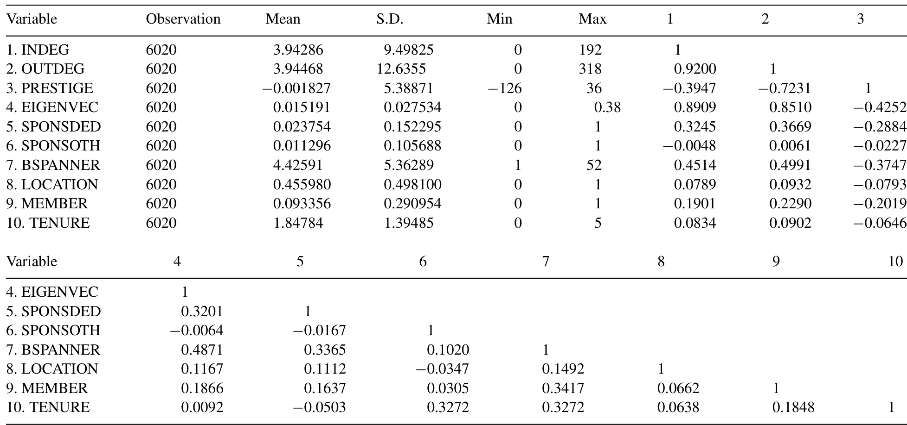
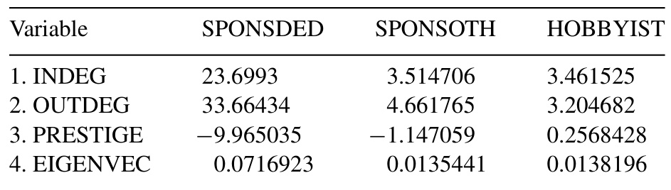

# A man on the inside: Unlocking communities as complementary assets  

Linus Dahlandera, Martin W. Wallin b,\*  

a Innovation Studies Centre,Tanaka Business School, Imperial College London, South Kensington Campus, London SW7 2AZ,UK b Department of Technology Management and Economics, Chalmers University of Technology, 412 96 Gothenburg, Sweden  

Available online 20 October 2006  

# Abstract  

Since Teece's seminal paper explaining who were the gainers from technological innovation, increased globalization and the information and communication technology revolution have brought new ways for firms to organize and appropriate from innovation. A new more open model of innovation suggests that firms can benefit from sources of innovation that stem from outside the firm. The central theme of this paper is how firms try to unlock communities as complementary assets. These communities exist outside firm boundaries beyond ownership or hierarchical control. Because of practices developed by communities to protect their work, firms need to assign individuals to work in these communities in order to gain access to developments and, to an extent, influence the direction of the community. Using network analysis we show that some software firms sponsor individuals to act strategically within a free and open source software (FOsS) community. Firm sponsored individuals interact with more individuals than interact with them, and also they seek to interact with central individuals in the community. However, we can see differences in how individuals interact, depending on whether their affiliation is with a dedicated FOsS firm or an incumbent in the software industry. Apparently, some firm managers believe they need ‘a man on the inside' to be able to gain access to communities.  

$\copyright$ 2006 Elsevier B. V. All rights reserved.  

Keywords: Complementary assets; Open innovation; Free and open source software; Social network theory  

# 1. Introduction  

The original aim of Teece's (1986) paper was to explain why some firms fail to appropriate returns from innovation while others succeed. Teece uses three conceptual building blocks: the appropriability regime, complementary assets, and the dominant design paradigm. We maintain that these building blocks are central to the analysis of innovation in the 21st century. However, over the years increased globalization and the information and communication technology (ICT) revolution has changed how managers need to think about these concepts. We will make use of two of these concepts: the appropriability regime and complementary assets.  

The developments over the last two decades provide for simultaneous connect and disconnect between firms, bringing about new ways for firms to organize and appropriate from innovation. In this paper we explain how the introduction of new ICTs can change the organization of innovation in the software industry through the use of free and open source software (FOSS). FOSS is an extreme case of open innovation (Chesbrough, 2003), developed by geographically dispersed communities that consist of individuals who typically receive no financial compensation. Although FOSS can be used as inputs in embedded devices to develop various kinds of products (Henkel, 2006), it can also be used to develop new software or services. The new organization of innovation in this part of the software industry calls for a questioning of the dichotomy between core and complementary assets, which was fundamental in Teece's seminal paper.  

In this paper we analyze how firms manage innovation across firm borders without ownership of key resources. We propose that some firms act strategically by claiming favourable network positions in a FOSS community. Drawing on social network theory (Burt, 1992; Wasserman and Faust, 1994), we argue that these network positions enable firms to manage key resources without ownership in the legal sense.  

In the corporate governance literature it is often argued that separation of ownership from control is an efficient means to run corporations because it enables mutual specialization of duties between risk-bearers and managers. In other words, ownership does not necessarily indicate control. Similarly, we argue that control does not necessarily indicate ownership. There are other ways in which firms can orchestrate resources in addition to legal ownership, or hierarchy in the firm. Conventional wisdom, heavily influenced by the legal perspectives of the firm, is to internalize critical resources, i.e. to control by ownership. Today, innovation is seen as the prime determinant of competitive advantage, which suggests the need for control of critical aspects of the innovation process. However, recent developments along the open innovation paradigm (Chesbrough, 2003) suggest that firms need to reject the idea that control implies ownership and open themselves up to the broad array of resources available to the firm. To do this, we argue, managers must find new ways to conceptualize the ^postChandlerian firm’ where innovation proceeds along less hierarchical lines (Langlois, 2003) since “the network of relationships between the firm and its external environment can play an important role in shaping performance" (Laursen and Salter, 2006: 132). This raises important questions about what is the core of the firm in a relational sense (Dyer and Singh, 1998; Lorenzoni and Lipparini, 1999; Dyer and Nobeoka, 2000; Gulati et al., 2000). Dyer and Singh (1998) contend that firms can generate relational rents by leveraging the complementary assets of alliance partners. We take their suggestion as a springboard to investigate FOsS communities as a potential complementary asset that firms can use in the innovation processes.  

The literature on alliances abounds with reasons for collaboration, e.g. reduced cost and risks of technological development or market entry, scale economies in production, reduced time to market, network effects, and opportunities for organizational learning (Gulati, 1998). The phenomenon under study here is different, though;  

we do not analyze relationships between firms (which is the unit of analysis in the alliance literature), but rather we look at relationships between different individuals. However, we are interested in the role of firms in participating in a specific kind of network structure——-a user community. These communities, though, have developed practices that prevent firms from claiming ownership, but enable firms to sponsor peers or allow personnel to work in the community. This is a key characteristic of FOsS and an important determinant of how firms can interact and draw on resources developed within these communities.  

Our aim in this paper is to investigate sponsorship as an alternative way of organizing innovation in FOsS software development. We do this by looking at the individuals affiliated to certain firms (i.e. being sponsored) and examining how these individuals act in a user community, working on developing a particular software solution—GNOME. Our main data source consists of 1659 individuals who sent 14,644 emails in a mailing list over a 6 year period. We gathered information from the emails about who sent them and to whom. From this unique data set we were able to reconstruct the social networks by year, and to analyze the role that firm sponsored individuals play in the community.  

The paper is structured as follows. Section 2 outlines the conceptual background to how we can think about communities as a complementary asset. Viewing communities in this way helps to uncover how firms participate in them. In Section 3 we develop a set of hypotheses related to how the communication patterns differ between firm sponsored individuals and hobbyists. Section 4 describes the research setting and the data and Section 5 presents the results of firms’ participation in the community under study. Finally, we discuss our findings and draw conclusions from the study.  

# 2. Conceptual background  

Teece's (1986) seminal paper on profiting from technological innovation provided a framework for analyzing the rents accruing from innovation in terms of the appropriability regime, complementary assets and dominant design. Since Teece published this paper several new trends have emerged, the outcome of which has become what we now term open innovation. Chesbrough (2006: 2) defines open innovation as:  

the use of purposive inflows and outflows of knowledge to accelerate internal innovation, and expand the markets for external use of innovation respectively. Open innovation is a paradigm that assumes that firms can and should use external ideas as well as internal ideas, and internal and external paths to market, as they look to advance their technology.  

The key drivers of open innovation are: (1) globalization, i.e. the extension of geographical markets that enables an increased division of labour and specialization; (2) improved market institutions, e.g. intellectual property rights (IPR), venture capital (VC), and technology standards that enable resources to more easily transcend firm boundaries; (3) technological change which reduces the minimum efficient scale of production that fuels increased specialization; (4) increased labour market mobility, especially for specialist personnel. In addition, technological change, such as the ICT revolution, has affected the way firms communicate, collaborate and coordinate. It is no surprise that the software industry itself has been greatly affected by ICT developments because: (1) product duplication can be made electronically at marginal costs, i.e. there are almost no production costs; (2) transportation of products can be achieved by electronic transmission at marginal costs, i.e. there are almost no logistical costs; (3) there is an installed base of generic hardware that can run the new software, which results in fewer compatibility problems. As a consequence, new forms of organizing innovative work are possible, with a greater division of labour. Hand in hand with increased division of labour comes the need for new mechanisms to integrate tasks and responsibilities (Lawrence and Lorsch, 1967). The incentive to draw from external knowledge sources is particularly high when the industry is characterized by high levels of technological opportunity and there are extensive investments in searches by other firms (Klevorick et al., 1995), which is the case in the software industry.  

Implicit in Teece's framework is the divide between development and production. There is a notion that inventions (ideas) are turned into innovations by their being funnelled through the value chain from product development, production and marketing. During this process, complementary assets become key assets in weak appropriability regimes. Traditionally, complementary assets are distinct firm level assets with welldefined positions in the value chain. In the case of FOSS development the value chain is disintegrated. Individuals can be contributors of code as well as early adopters of downstream products. In that sense, the community as a complementary asset spans input to output. Teece argued that in industries with weak appropriability regimes ownership of complementary assets (in particular specialized complementary assets) determined profit. Fully integrated firms, then, should be the best positioned to benefit from existing complementary assets.  

The highly infuential resource-based view in strategic management contends that the firm consists of a bundle of resources, which are commonly defined as the stock of available factors that the firm owns and controls (Amit and Schoemaker, 1993; Wernerfelt, 1984). Resources can be tangible - e.g. plants, equipment, natural resources, raw materials, finished goods - or intangible, e.g. knowledge, patents, brand names. In this view, the firm's rationale is to use these resources, combining them into products and services, to maximize returns over time (Barney, 1986). This overly internal perspective of the firm is somewhat mitigated by Dyer and Singh's (1998: 680) argument that critical resources may span firm boundaries and may be “embedded in interfirm resources and routines". To be successful, the firm needs to generate relational rents. Interestingly, Dyer and Singh propose that one way for firms to generate relational rents is to leverage the complementary assets of their alliance partners. That is, firm resources need to be combined with complementary assets from outside the firm to yield rents. Teece et al. (1997) propose a similar argument about the role of dynamic capabilities to build, integrate and reconfigure internal and external competencies.  

In this paper we put forward the idea that a user community can be seen as a complementary asset. The work developed in the community can be used in conjunction with the firm's internal expertise to develop competitive products and services. Firms that engage in these communities, therefore, have a certain type of business model (Chesbrough and Rosenbloom, 2002; Chesbrough, 2003), which works as a cognitive script and shapes the mindset of the firm towards looking for ideas in the community. Although this engagement in the community creates value for the firm, it is more difficult to appropriate because competitors may interfere. Because of the strong norms and mechanisms against institutional protection in FOsS it is not possible to utilize secondary markets for technology to gain access and control. Business models are essentially systems for turning investments into revenue streams, but due to the mechanisms against strong institutional protection in FOsS communities direct profiting is probably not a viable strategy. Firms need to find means of getting access to the developments in the community and need to take indirect measures to convert the knowledge created in a FOsS community into a complementary asset. We argue that deploying resources, in the form of employees, to participate in FOsS communities is one way of gaining access to developments. It is impossible tofend off competitors by traditional means,but because of the relational advantages to firms from a position in the network (Dyer and Singh, 1998), participation is justified. Building on a long tradition of scholarship in how social networks influence innovativeness and performance (Baum et al., 2000; Burt, 2004; Powell et al., 1996; Shan et al., 1994; Stuart, 2000), we develop an argument about how firm sponsored individuals participate in a user community.  

von Hippel (1988) adopted a strategy to look at the functional source of innovation, and discovered that innovators are many times users that benefit from the innovation by using it, rather than selling it in the market place. User innovators are central to the development effort in being proactive and develop solutions to their problems themselves, which firms can then, to varying degrees, access and use in their internal processes. Such user innovations have been identified as frequent by various researchers in different empirical settings (Freeman, 1968; Rothwell et al., 1974; Rosenberg, 1976; von Hippel, 1976, 1988). Sometimes users voluntarily reveal their innovations and build on the work of others in a community in a democratic and cooperative manner (von Hippel, 2005). A user community is thus defined as distributed groups of individuals focused on solving a general problem and/or developing a new solution supported by computer mediated communication. These communities many times safeguard their work from being appropriated by firms. By definition, to be able to utilize FOsS communities as a complementary asset requires firms to themselves posses a substantial amount of other resources that could be complementary. In our own study, the ‘FOSS user community’ is referred to as the ‘FOsS community'. At some points we use the epithet ‘GNOME’ to point to the specific data set developed for this study. “User community' is used to refer to papers that use this term but that do not necessarily deal with FOsS. A single ^community’ will be used in general discussion and in relation to claims not necessarily limited to user innovation or FOSS.  

# 3. Hypotheses  

A growing stream of research has analyzed the incentives for participating in FOSS. Lerner and Tirole (2002) address some of the economics behind the reasons that individuals and firms engage in FOsS with seemingly no direct financial reward. Using the idea of signal incentives (Holmstrom, 1999), they propose that individuals are active in communities to increase future career opportunities. Through their work in a community a firm may recognize their potential and make them a job offer. Individuals are also driven by peer recognition: other individuals in the community may value their work.  

Lerner and Tirole also address the question of why firms are involved in FOSS development. They offer the economic rationale of free riding, arguing that firms "expect to benefit from their expertise in some segment whose demand is boosted by the success of a complementary open source program' (Lerner and Tirole, 2002: 224). They also point out that firms may engage in FOSS for reasons not associated with revenue streams, such as public relations and gaining legitimacy, or for reasons of learning-programmers who are employees of a firm participate to learn about their characteristics. In sum, Lerner and Tirole see the situation as involving passive firms that try to appropriate from spill-overs.  

In another paper, Lee and Cole (2003) point to the differences between firm-based and communitybased models of knowledge creation, using the case of the Linux kernel. Several authors (Dahlander and Magnusson, 2005; Lerner and Tirole, 2002; O'Mahony, 2003) have recognized that these models have become increasingly  intertwined.  In  the  community-based model, firms become gradually more active through various means. Thus, when Lee and Cole argue for "a firm-based to a community-based model of knowledge creation", we would rephrase this to “a firm and community-based model of knowledge creation". Similarly, von Hippel and von Krogh (2003) suggest that FOSS is characterized by successfully merging “private investment”and“collective action"into a“best of both worlds". In fact, empirical research has provided evidence of how firms allow employees to work on FOsS on company time, and that as many as $50\%$ of developers earn income from their engagement in FOsS (David et al.,2003; Ghosh et al., 2002; Mitsubishi Research Institute, 2004).  

Relationships between firms have often been analyzed from a contractual point of view (Ahuja, 2000; Baum et al., 2000; Gulati, 1998; Powell et al., 1996). But in the case of FOsS, firms cannot be represented as the legal units of accrual if they want to participate in a community. FOsS communities have strong interests in ensuring that source codes remain free, and have wellestablished practices to defend the shared achievements of developers. These practices include both social norms for source code remaining free, as well as legal mechanisms such as reverse copyright schemes (copyleft) and non-profit organizations that make it impossible for firms to acquire source code and close it to future users. Firms that want to participate in communities therefore must do so as peers (i.e. they must allow their employees to work in these communities as peers). Access to communities allows firms to get access to resources that cannot be bought in the market.  

Much of the research on user communities focuses on hobbyists who develop and customize software in their spare-time with no direct monetary compensation, i.e. hobbyists innovate outside their main fields of occupation (Jeppesen and Frederiksen, 2006). Given the altruistic story of FOsS communities (Kogut and Metiu, 2001; Lee and Cole, 2003) we would expect the vast majority of users to work for the common cause and to receive no financial compensation for their involvement in the community. However, although from this reasoning we would expect the number of hobbyists to be greater than the number of individuals with affliations to firms, we believe that the latter are more active.  

Firm sponsored individuals are defined as individuals whose work in a community is part of their employment with and affiliation to a commercial company. Individuals with a firm affiliation should have certain advantages over non-sponsored individuals, i.e. hobbyists working in their spare time. A firm sponsored individual can devote all of his or her time to working in the community. Hobbyists, on the other hand, assuming they need to make a living elsewhere, cannot devote all of their time to the community. This is not to say that hobbyists do not make critical contributions. On the contrary, we expect both hobbyists and firm sponsored individuals to make critical contributions to FOsS development projects. Nevertheless, on average, we would expect that developers that are sponsored by a firm would devote more time, and to interact to a greater extent, in the FOSS community.  

Individuals sponsored by firms should have a deeper and more diverse knowledge base due to their resource advantages. They have financial resources and can access the results and developments from inhouse investments. Thus, they can combine the best of both worlds and act as technological brokers (Hargadon and Sutton, 1997) between the community and the firm, which is crucial if the community is to function as a complementary asset of the firm. It can therefore be expected that firm sponsored individuals will be able to participate more actively in the functioning of the community.  

Social network theory deals with how the structural properties of the network influence the behaviour of the nodes in the network. Network benefits can be both information and control type (Burt, 1992). Benefits arise because valuable information is not evenly distributed in the network. More central network individuals will be the first to recognize new opportunities as they have a more diverse set of ideas and resources they can access. Central actors therefore have a more possibilities to combine and exchange resources and exploit information to their advantage. Conversely, less central actors will find it more difficult to syndicate assets and orchestrate responses in a competitive environment (Gnyawali and Madhavan, 2001).  

Based on the above reasoning we can summarize why sponsored individuals are more active in FOsS. First, because they can be; they have a resource advantage over hobbyists; they can commit time and other resource to participate in FOSS problem-solving as part of their salaried work. Second, because they have to be. Individuals within a FOSS community may be suspicious of a strong corporate agenda pushed by sponsored individuals. To break through the institutional protection against firm intervention, sponsored individuals need to build legitimacy. Legitimacy in a professional network is achieved through proof of skillfulness, and providing help to other individuals in the community.  

# Hypothesis 1. Being sponsored by a firm increases the likelihood that an individual seek to form ties with other participants in the community.  

There are two reasons why firm sponsored individuals receive more help than hobbyists. First there is their resource advantage, which enables them to formulate interesting questions, which are easy to understand, and answer. Second, providing help to a firm sponsored individual is perhaps seen as signalling and may be thought to increase the chances of being offered employment.  

Although conceptually distinct measures, due to reciprocity, interacting with other individuals and being contacted are usually highly correlated. Because we expect sponsored individuals to interact frequently with others, they are also likely to have more individuals contacting them. On the other hand, because of suspicions about firms’ commercial interests, and the altruism of FOsS community members, hobbyists could be less keen to interact with firms. Too flagrant attempts by firms to outsource simple and non-challenging programming tasks will be recognized as such and ignored. Thus we propose that:  

Hypothesis 2a. Being sponsored by a firm increases the likelihood that participants in the community seek to form ties with the individual.  

Hypothesis 2b. Being sponsored by a firm decreases the likelihood that participants in the community seek to form ties with the individual.  

Individuals with multiple relationships with other participants in the community can make their views known to more people and benefit from exchanges with them. Individuals that are ‘receivers’ can be considered to be prominent participants of the community because other individuals seek to form ties with them (Wasserman and Faust, 1994). The individuals who are most sought after in the community can thus be said to be prestigious. Firm sponsored individuals achieve credibility in the community and legitimize their commercial endeavours by interacting extensively with other individuals of the community, both to give and to receive help. That is, they have to invest in the community to gain access and are thus less prestigious.\*  

# Hypothesis 3. Being sponsored by a firm decreases the likelihood that an individual is prestigious in the community.  

Heterogeneity in network centrality measures equips individuals with unique opportunities (Freeman, 1979), which allow sponsoring firms to act strategically in the network. Sponsored individuals make frequent contributions in order to enhance their reputation within the community and are therefore better placed to watch developments. These individuals represent themselves in the community, but are able to bring expertise to the firm. Although the community has rules that do not allow firms to become formalized leaders in the project, and licensing practices that prevent firms from closing the source code, sponsored individuals are still able to achieve favourable positions. Network analysis provides more evidence of how FOsS communities give space to firms. In our research setting, for example, RedHat, Sun Microsystems and Ximian (former Helix Code) devote full-time paid employees to work on the project (German, 2003). Some of these people are responsible for maintaining critical modules: e.g. RedHat for gtk+ and CORBA and Ximian for Evolution.  

The number of relationships firm sponsored individuals have with other developers in a community is interesting in that individuals who interact frequently with other individuals may occupy unique and advantaged positions in the community. Individuals with many ties have access to many more parts of the network than individuals with fewer ties. But the number of ties in itself does not necessarily translate into competitive advantage. It is also to whom you connect. A tie to an individual who is well-connected is more valuable than a tie to an individual with no contacts (Bonacich, 1972, 1987; Friedkin, 1991). Firm sponsored individuals may seek to interact with well-connected individuals to gain knowledge about critical developments and push their agenda.  

Hypothesis 4. Being sponsored by a firm increases the likelihood that an individual is tied to well-connected participants in the community.  

# 4. Methods  

# 4.1. Research setting  

We chose for our research setting a large FOsS community to analyze the role of individuals that have affiliations with firms that actively participate. Hobbyists that engage in FOsS communities are volunteers that are outside the hierarchical realm of firms. These communities can encompass thousands of individuals who co-ordinate their tasks world-wide to produce high quality products primarily through computer mediated communication and receive no direct financial compensation for sharing their achievements with others (Lee and Cole, 2003; von Hippel and von Krogh, 2003). These participants are often regarded as being driven by ideological rather than economic motives (Hertel et al., 2003). Although these community participants do not have the organizational structure of a firm to work within, the community has various mechanisms for governing decisions about releases, co-ordinating work within the community and presenting the community to external parties (Fleming and Waguespack, 2005; Lee and Cole, 2003; O'Mahony, 2003; O'Mahony and Ferraro, 2004). The principles of governance adopted vary across different FOsS communities. For instance, the founder of Linux, Linus Torvalds, is responsible for the development of the Linux kernel and is helped by a number of “lieutenants'. Torvalds is a ‘wise man' and he relies upon the trust from the individuals in the community. Other FOSS communities, such as GNOME, have a more formalized governance structure.  

All software is written in a programming language incorporating commands to enable it to work. When writing software programs, programmers can add explanations and clarifications to make it easier for other developers to interpret the code. In FOsS, this code is open for anyone to screen, interpret, and evaluate. If a user or developer experiences a programming error (a so-called bug), they have the opportunity of either fixing it themselves, or sending a detailed bug-report to the software's author. FOSS is coordinated through the Linux-kernel, which enables numerous projects to be developed with the objective of producing a solution to a given problem through cooperative working. Each project comprises a number of modules to which developers contribute code. FOsS communities vary in size from one person to a few thousand who share and coordinate their work. Many communities document their endeavours online, producing a chronology of events to avoid any reinvention of the wheel.  

In our study we analyze the GNOME project between 1999 and 2004. The GNOME environment is a Windows-like desktop, and the GNOME development platform is a framework for building applications that integrate with the rest of the desktop. In the effort to produce a user-friendly desktop and development tools, GNOME has become a community where individuals interact to solve problems and help each other. GNOME is an example of a FOsS community developed collectively by several thousands of individuals who, to different degrees, participate and help each other.  

GNOME was set up in 1996 by Miguel de Icaza to create a collection of free libraries and applications designed to make Linux a user-friendly desktop.2 de Icaza and a few of his initial collaborators had had licensing concerns about KDE, a similar FOSS desktop environment that relied on the Qt widget Toolkit developed by the Norwegian firm Trolltech. Trolltech's licence, however, did not comply with established FOsS practice and prevented users from modifying, distributing and redistributing copies of the code and therefore violated the terms of the General Public Licence (GPL). de Icaza contacted Trolltech to urge them to change their practices:  

Being a free software entusiast, Icontacted Troll Tech, the authors of Qt to propose an alternate licensing scheme for Qt that would still allow them to build a company while empowering users but got no reply. The Troll Tech FAQ at the time also contained significant errors regarding the GPL and ignored duallicensing schemes   
http://primates.ximian.com/ $\eqsim$ miguel/gnome  
history.html  

When Trolltech refused to adopt a different practice that would be compatible with FOsS norms, de Icaza initiated GNOME to provide similar functionality to KDE, but operating under GPL. GNOME is therefore available in the public domain for anyone to use, develop and diffuse.? de Icaza sent a draft announcement about GNOME to several friends and mailing lists where he expected to find individuals who would be interested in his idea. GNOME rapidly gained momentum and de Icaza and the other original participants focused more and more on its development.  

In January 1998, the firm Red Hat initiated its Advanced Development Labs, establishing the first funded team of developers to work on GNOME. Several notable individuals in the GNOME community took up employment with Red Hat. In October 1999, two GNOME-based companies were incorporated in the United States, namely Eazel and Helix Code.4 There are other examples of corporations that have grown out of individuals’ participation in GNOME, including Henza and Gnumatic which were incorporated in 2000.  

The code remains under a GPL and the community continues to work collectively, although many individuals receive financial compensation for their engagement in GNOME. Because in many ways GNOME is one of the more hacker-oriented open source initiatives which was founded as a reaction to less-open licensing practices in another community, it is a good case for our study. GNOME, as a result, is an example of an extreme case of open innovation. Despite being hacker oriented, the number of individuals who have affiliations with firms and receive compensation for their involvement has increased since the community was founded. As illustrated by the following quote, GNOME is a research setting in which hobbyists and firm sponsored individuals jointly work on developing the project:  

Since the project was started in 1998, GNOME has grown tremendously. The technology has started to mature, the amount of code contributed has exploded, the number of developers (also known as GNOME hackers) who are contributing to GNOME has more than doubled. With the emergence of a GNOME industry, and as corporate partners are embracing GNOME, the number of hackers who are paid to work full-time on GNOME has grown dramatically, in addition to the hundreds of volunteer hackers in the community. http://foundation.gnome.org/about/charter/  

Because of its rapid growth, the community incorporated a formal structure and a foundation. As already described GNOME is not a collection of wise men who make decisions, but has a more formal organizational structure. While the foundation is not directly involved in technical decisions, it does coordinate releases and decide which projects will be part of GNOME. Individuals who have made significant contributions can apply for membership of the foundation, which needs to be renewed every 2 years. Thus, total number of members changes every year. The condition for membership is providing contributions:  

Contributions may be code, documentation, translations, maintenance of project-wide resources, or other non-trivial activities which benefit the GNOME Project.  

http://foundation.gnome.org/membership/  

Members are responsible for electing a Board of Directors, and can ask for referenda over any issues under the jurisdiction of the foundation. Members are eligible to vote in elections or become elected to the Board of Directors. Individuals with leadership aspiration can announce their candidacy by sending a message to the foundation's mailing list with their full name, e-mail, corporate affiliation if such is applicable, and reasons for wanting to serve as a director. Declaring corporate affiliations is important. Although the 11 candidates that receive the most votes will be elected to the Board,5 with the rider that no more than four individuals from the same company can be included on the board. In the case that there are more than 4 from the same company, the four with the most votes will be elected. The elected Board of Directors is the primary decision-making body of the GNOME foundation and is responsible for ratifying all the foundation's decisions. Board decisions can be overturned by referendum. Referenda must be endorsed by $10\%$ -of the members to be accepted.  

# 4.2. Data and variables  

Our focus on the GNOME project and the role of firms in the community allows us to analyze how individuals interact to solve problems. They use several means such as Internet Relay Chat, private emails, and correspondence in mailing lists. Participants in the community see mailing lists as a vital means of communicating (Lee and Cole, 2003). This was confirmed in interviews and from secondary data available at the GNOME web site. This influenced our methodology and confirms that analyzing activity on mailing lists identifies activity and relationships among the individuals subscribing to them. Mailing lists provide a simple communication technology that broadcasts to a list of subscribers via email. When a subscriber receives an email, he or she can choose whether or not to reply to a request. This makes it possible to keep track of the developments that the subscribers to the mailing lists discuss. We used longitudinal data relating to a key mailing list in the GNOME community.  

The development mailing list (http://mail.gnome. org/archives/gnome-devel-list/) is our measure of the network, and contains discussions about future releases, design, architecture and other technical aspects and problem solving. GNOME has several other mailing lists devoted to various topics. From its beginnings in 1999 to December 2004 we identified in the mailing list 14,644 mails on various topics. We cleaned out spam and anonymous messages. Authors with multiple identities were reconciled through examination of names and emails, and 1659 unique individuals were identified.  

Some research has used mailing lists to follow activity over time and to track major events (Lee and Cole, 2003; von Krogh et al., 2003); we extended this by using the data to build social networks where a tie is represented by an email sent to a given person. Our data are unique in this regard, because the few analyses that exist on other data sources in FOsS communities treat ties symmetrically (O'Mahony and Ferraro, 2004; Fleming and Waguespack, 2005). In addition to addressing the neglected issue of how individuals construct affiliations with firms, our directional data allow us to enquire whether individuals receive more help than they give. Relationship data can be directed and undirected, the difference being that in undirected data individuals differ only in the number of ties they have, whereas in directed data it is possible to distinguish for example between the person that initiates a contact and the one that receives an invitation, or the person that asks a question and the one that answers it. In other words, more information is conveyed in a directed than an undirected relation.  

We define ties as the relationships among the individuals interacting. The network is constructed per year, with a 3 year window of prior ties. In other words, a tie disappears from the analysis if individuals cease to interact.6 Using these data on interactions among individuals combined with a range of information on the attributes of the individuals as described below, we were able to analyze our hypotheses.  

# 4.2.1. Dependent variables  

Using the mailing list data we obtained, we derived various measures describing individuals′ interaction patterns for the 1659 individuals responsible for a total of 14,644 mails, using UCINET 6 (Borgatti et al., 2002) and Pajek (de No0y et al., 2005) for the years 1999-2004. We use four dependent variables to test our hypotheses: (1) out-degree; (2) in-degree; (3) prestige; (4) eigenvector. Below we explain our choice of measures.  

The number of relations with other individuals is measured by degree centrality, which calculates the total number of ties with other individuals (Freeman, 1979). Central to the analysis is the difference between sending an email to one individual and receiving a reply from someone else. Our network is therefore constructed to grasp directionality. An individual's prominence, or the degree to which others seek to interact with a particular individual, is measured through in-degree (INDEG) centrality (Wasserman and Faust, 1994). In-degree centrality measures the number of ties that an individual has with other individuals.  

The extent to which individuals help others and contribute to the development of the community is measured through out-degree (OUTDEG) centrality. This measures the total number of ties that an individual has with other individuals (Wasserman and Faust, 1994). Indegree is thus the number of individuals that respond to a given individual's emails, and out-degree is the number of responses an individual makes to others.  

The degree to which individuals interact with more individuals than interact with them is measured as the difference between in-degree and out-degree centrality. Individuals that have more individuals that seek to interact with them than they seek to interact with are said to be prestigious (PRESTIGE) (de Nooy et al., 2005).  

Following Bonacich (1972), we measure the extent to which an individual is connected to central individuals by eigenvector (EIGENVEC) centrality. Eigenvector centrality can be understood as a variant of degree, where the importance of the nodes to which an individual is connected is taken into account, conceptualized through the principal eigenvector of the adjacency matrix.  

# 4.2.2. Independent variables  

The independent variables are whether or not individuals have affiliations with firms that engage in the GNOME community. Because we could not find any available secondary data, we developed our own coding scheme. We test for whether an individual has an affiliation with a firm, with the variable taking the value 1 if the individual is coded as having an affiliation with a firm that engages in the community a given year. Our data account for that the affiliations of individuals might change over the study period. Individuals may change to a competitor firm, or take up employment with a firm not engaged in the GNOME community.  

We used a combination of methods to retrieve affiliations. Using the information in the emails themselves, wewere abletoretrieve the domainnames of thefirms. We coded whether an individual had sent at least one email from one of the firms that sponsored individuals in the community in a given year. For the individuals coded as having affiliations with firms, we also examineddocumentation available attheGNOMEwebsiteto cross-check our results.  

As already mentioned, many individuals involved in the GNOME project are employed by firms specifically to work on the development of the project. Many individuals have gone on to found firms based on the expertise gained in the GNOME project. We categorized affiliations depending on the type of firm: (1) SPONSDED representing firms with a business model attuned to the GNOME project (Helix Code, Red Hat, Eazel, Gnumatic and Henzai) and (2) SPONSOTH representing incumbents in the software industry that participate in the GNOME community. By distinguishing between these two types of affiliations, it is possible to observe differences in firms’ strategies depending on whether they are explicitly focused on FOSS, or whether FOSS working is only a small part of their business. This allows us to capture the effect of these different focuses on the dependent variables. It also revealed that no individuals had sent emails from two different organizations in the same year, which supports our choice of method. By coding the data annually, we can track mobility between different firms, and the move from hobbyist to firm employee, and vice versa.  

# 4.2.3. Control variables  

A wide range of the social network and innovation literature proposes that individuals that are boundary spanners (Allen, 1977; Tushman, 1977) and brokers (Burt,  

1992) have more diverse mindsets, opinions and knowledge bases, which allow them to be more creative. Individuals that are able to integrate disparate parts of large communities, such as GNOME, are arguably more able to interact with a wider range of individuals. Boundary spanners, for instance, are more likely to be aware that a problem has been discussed in another part of the community, and can use that information to solve the current problem. Communities such as GNOME typically have different mailing lists depending on the topic. Individuals that are active in several mailing lists will have more diverse knowledge bases, which will increase their likelihood of being able to solve problems and of being attractive to interact with. We therefore control for boundary spanning (BSPANNING) by measuring the number of mailing lists by year that an individual contributes to. After excluding mailing lists containing only spam or announcements of releases in the community, we were left with 137 possible lists. An individual's boundary spanning measure, therefore, can be an integer between 1 and 137. It is should be noted that the development mailing  list  (http://mail.gnome.org/archives/gnome-devellist/) is one of the most active (as measured in the number of emails relative to the total number of emails contributed to mailing lists) and most important in the community (subjective statements from participants and information about what the mailing lists deals with from the community's website).  

The experience of participating in the community it can be argued will influence an individual's interaction pattern. We therefore measure TENURE by the numbers of years an individual has participated on any of the GNOME mailing lists. This is a more accurate measure than using only the mailing list under study (the development mailing list) because individuals might have been active in another mailing list before diversifying into development activities. More experienced individuals might have better knowledge about the latest developments in the project, which might have allowed them to be more active and to send more mails.  

As pointed out in the description of the research setting, GNOME has a formalized hierarchy in which critical contributors can become members of the community. Because members are considered to be critical contributors they may feel they have an obligation to help resolve problems. Conversely, individuals who are not members may feel that interacting with members will increase their chances of becoming part of the hierarchy, which positively influences the degree to which members have a high in-degree centrality. We therefore control for whether the individual is a MEMBER according to the community's website.7 The practice of having members was incorporated in 2000, so we only track membership for the 5 years between 2000 and 2004.  

FOSS brings an open and distributed model of innovation that transcends geographical boundaries. Yet, as shown by O'Mahony and Ferraro (2004), face-to-face interaction is sometimes important in the governance of the community. We control for whether LOCATION infuences communication patterns by coding whether an individual is geographically located in the US. This was identified by the time zone from which the mail was sent (obviously by controlling for discrepancies from the same individual) and the domain of the emails. We also checked various secondary data on the GNOME web site to develop this measure and distinguish between individuals from South America versus North America. In the fixed effects regression, this variable was dropped from the analyses because of no variation within one panel. We also decided to drop this from the random effects regressions as it had no effect on the results.  

As shown by a number of writers (Hertel et al., 2003), FOSS communities are dominated by men. We control for GENDER by coding a dummy variable taking the value 1 if an individual is male. We discovered that $98\%$ of the individuals in our analysis had male names and only $1\%$ female names. The remaining $1\%$ had gender neutral names and were impossible to code. We therefore dropped this variable from the analyses.8  

# 4.3. Analysis of the data  

The data are panel or cross-sectional time series data, giving multiple measures per year. Our analyses focus on 1659 individuals and 6020 individual years. In some regressions we lose some observations due to the nature of the method. We used cross-sectional time series ordinary least square (OLS) to predict EIGENVEC and PRESTIGE, and cross-sectional time series negative binomial regressions to predict INDEG and OUTDEG. To control for unobserved heterogeneity, we used fixed individual effects. This was confirmed by the Hausman test of the null hypothesis that the coefficients estimated by the efficient random effects estimator are the same as those estimated by the consistent fixed effects estimator (Hausman et al., 1984). However, we decided to show the results using both random and fixed effects as the fixed effects regressions drop observations from the analyses.  

Table 1 Descriptive statistics   

  

We adopted various ways of analyzing the data to achieve robust findings. Several analyses were run including one variable at a time to test for the effects of the independent variables. To control for robustness, we ran separate analyses for individuals who had written more than 5 and more than 10 mails, as it could be argued that the findings are due to ^casual observers’ who only occasionally contribute a mail, but cannot be said to be active in the community. We discovered no differences in the results and, for reasons of space, we report here only the analyses of the full sample.9 We also experimented with different decay times (1, 2, 3 and 4 years) and similar to other research (Fleming and Waguespack, 2005) opted for 3 years. We analysed a random sample of 100 individuals to check whether our coding scheme wasrobust.  

The method in this paper avoids three problems inherent in social network analysis. First, we avoid selection bias as we are using a complete network and not a restricted and non-random sample. Second, because of the completeness of the data, there is no problem with response bias. Third, we have combined existing data sources available online, to circumvent any common method bias.  

# 5. Results  

Fig. 1 illustrates the network during 1999 of the GNOME project mailing list that we analyzed. The nodes represent individuals that posted an email to the development mailing list. Nodes that are boxes are individuals with a firm affiliation and ellipses are hobbyists. The size of the node indicates the degree of activity. The arcs connecting the nodes are mailing list interactions.  

  
Fig. 1. Mllustration of interactions in a GNOME mailing list in 1999. Note: Illustration made with Pajek's Fruchterman Reingold 2D algorithm which minimises stress in the network (de Nooy et al., 2005). The nodes illustrate individuals and the arcs the interactions among the individuals. Boxes are individuals with affiliations with firms and ellipses hobbyist. The sizes of the individuals represent the degree of activity.  

Table 2 The effect of sponsoring   

  
Note: Standard errors in parentheses.\*Significant at $10\%$ \*\* Significant at $5\%$ \*\*\* Significant at $1\%$  

Table3 Comparing means of dependent variables in the three groups   

  
Note: Mean values reported, $N\!=\!6020$  

Individuals at the centre of the network areseen to be more connected than those near the periphery. The figure shows that the distribution is heavily skewed. There is a handful of individuals that are responsible for the majority of contributions, and there are isolates on the fringe that never receive responses.10  

Table 1 presents the descriptive statistics. There is a high correlation between the dependent variables. Multicollinearity is not a problem because these are the dependent variables and are treated separately.  

Table 2 presents the results from eight models predicting INDEG, OUTDEG, PRESTIGE, and EIGENVEC. Each hypothesis is tested first by including only the control variables, and then including the independent variable to illustrate the difference in the full model, from the baseline. The models with A as an extension refer to results from the random effects, and those with B refer to fixed effects.  

Models 1A-1B, respectively, predict INDEG using only the control variables with random and fixed effects. Models2A-2Badd theSPONSDEDandSPONSOTH variables. They show that SPONSDED is positively associated with INDEG and is significant. Models 3A-3B show the OUTDEG baseline model.Models 4A-4B include the independent variables and again show that only SPONSDED is significant. Models 5A-5B are the baseline models for PRESTIGE. Models 6A-6B show that SPONSDED are less prestigious in network terms, suggesting that they interact with more individuals than interact with them. Models 7A-7B are the baseline models for EIGENVEC. Models 8A-8B include the independent variables and show that SPONSDED are connected to more infuential persons in the community and SPONSOTH to less important ones.  

To show the differences between SPONSOTH and SPONSDED and the other individuals in the community, we report the mean values of the dependent variables in Table 3. This clearly illustrates how extreme SPONS  

DED are compared to SPONSOTH and hobbyists in the community.  

# 6. Discussion  

The open innovation literature has provoked numerous interesting questions about how firms can benefit from innovations emerging from outside firm boundaries (Chesbrough, 2003; Chesbrough et al., 2006). The central theme in this paper is how firms try to unlock communities which for them are a complementary asset that exists outside firm boundaries and outside their ownership or hierarchical control. As explained in the conceptual framework, firms participate in FOsS communities because they feel that they can influence the direction of development, gain legitimacy to use the software, and benefit from the expertise of a large base of skilled users. Because of licensing practices in the FOsS community that protect the software from being appropriated by organizations, firms allow dedicated personnelto work in these communities. Despite the fact that competitors will also likely be involved, firms are keen for their employees to occupy critical positions in the project in order to keep track of developments in the FOsS community. Prior research on open source communities has typically depicted this collective participation as altruistic and collaborative (Lee and Cole, 2003; von Hippel and von Krogh, 2003), but we show how firms participate in seemingly open user communities. Thus we contribute to a more complete understanding about how these communities operate and the role of individuals with affiliations to firms.  

The empirical findings that can be drawn directly from the dataset derive from the differences in various measures of firm sponsored individuals and hobbyists. We observed a heavily skewed distribution where a few individuals, who could be seen as a group of experts, are responsible for the majority of the emails. Although the largest proportion of the GNOME community is made up of hobbyists working in their spare time and receiving no direct financial compensation, firm sponsored individuals are very important. Firm sponsored individuals have certain resource advantages which can help them gain favourable network positions; however how firms actively make use of such advantage in FOsS communities has not previously been investigated. Because of their resource advantage, firm sponsored individuals can interact with many different individuals for the good of the project, which enhances their reputation and legitimizes their commercial use of the project. Our results suggest that individuals sponsored by firms working exclusively on the GNOME project interact with a greater number of individuals and that more individuals seek to interact with them. At the same time the number of individuals they interact with is greater than the num-- ber of individuals who contact them. This can probably be explained by the fact that these sponsored individuals are keen to establish their legitimacy in the community and also that other community participants may be suspicious about their corporate agenda.  

In spite of the resources invested by companies to become active members in FOsS communities, there is no clear evidence that firm sponsored individuals are able to orchestrate or stimulate debate within these communities. To make a first analysis of how firms take part in thesecommunitieswemakea distinctionbetweenFOsS companies that have incorporated open source in their business models, and other firms in the software industry that have devoted personnel to working in a community. This distinction is shown to be quite important. Individuals with affiliations with large incumbents in the software industry have no significant effect in the community. The influence of SPONSDED (individuals sponsored by dedicated FOSS firms) however, was shown to be significant in the models, and the findings suggest that the employees of firms who set out to draw from these communities are likely to be more active and important in the community. Other software companies may not devote their best employees to working in the community or may only passively screen developments. Firm sponsored individuals with an affiliation to dedicated firms are also likely to be associated with well-connected individuals, while the reverse is true for individuals affiliated to incumbents.  

We suggest that firms use communities as complementary assets. To gain access and legitimacy firms must deploy employees to interact with other participants in the community. The community as a complementary asset cannot be acquired through the market, but requires participation, interaction and learning. Firm sponsored individuals are to a greater extent than hobbyists connected to influential individuals in the community measured in social network terms, which lends support to the thesis that firms to some extent can influence the direction of development in these communities. From a broader perspective, our analysis raises a number of important questions concerning core and complementary assets, as well as ownership and control. First, it informs us about a general difficulty in the software industry to distinguish between core and complementary assets. Second, it informs us of a specific difficulty about ownership and control when private ownership of important assets is banned.  

Obviously, as the alliance literature has taught us, critical resources are to be found outside the legal reach of the firm. Some firms have developed practices to manage these resources by investing in community activities. These practices, in turn, result in a blurring of the concepts of core and complementary assets. According to Teece (1986) a complementary asset is an asset which is needed in conjunction with the invention to make sure it is possible to appropriate from the invention, e.g. where markets do not or cannot exist. Under weak intellectual property protection, i.e. when there is a risk of knowledge spillovers to competitors, Teece argued that the complementary assets of the firm are crucial for appropriating the benefits from its innovations. He provided a few examples of complementary assets such as specialist manufacturing, access to distribution channels, service networks and complementary technologies. Firms can thus deploy complementary assets and combine them with knowledge under weak appropriability regimes to create successful and appropriable innovation. Teece suggested that firms supply the missing pieces through their competencies. Firms start from what is there and identify what is missing. As the invention is channelled through complementary activities the inventor can adjust its business model and profit from its invention even under a weak appropriability regime. The distinction between core versus complementary assets, however, assumes that the activities leveraged by these assets can in fact be separated in practice. From a theoretical perspective, the distinction requires some kind of atomistic perspective of knowledge. This is perhaps particularly significant in the software industry, which is characterized by the difficulty of separating development from production, and users from producers; thus a clear separation of complementary from core assets is challenging.  

Should a clear separation between core and complementary assets emerge, the question of control through ownership remains. We speculate that more attention needs to be paid to the managing of the key functions in the firm that are necessary to appropriate returns from innovation, as opposed to questions of ownership of certain resources, be they core or complementary. This is of particular importance under situations beyond what was covered by Teece (1986), i.e. situations where neither integration strategies nor contractual strategies are possible as is the case in FOsS. The challenge for management is not in deciding which part of the integrated value chain to own or not to own but to decide which resources in a dissolving value chain it is necessary to own in order to be able to manipulate internal resources to perform functions that will gain it access to the external world. This facilitates access to crucial complementary assets while at the same time providing gains in the form of increased division of labour and increased specialization. In the spirit of Teece (1986) we have analyzed complementary assets as a means to appropriate from innovation. But there are also risks associated with innovation. In a recent paper, Hopkins and Nightingale (2006) argue that firms can use complementary assets to disappropriate the risks of technical change. Firms can position themselves in networks and “disappropriate some of the uncertain or undesirable consequences of innovation onto third parties"” (Hopkins and Nightingale, 2006: 361). In other words, firms can employ active (appropriation) and passive (disappropriation) strategies. Potentially, this can help explain the different strategies employed by dedicated and incumbent firms in the FOsS community. It might be the case that for SPONSOTH, being part of a community like GNOME allows the firms to disappropriate and transform risk, while for SPONSDED it is a means of appropriating benefits.  

Our study has some limitations, and there are many opportunities for further research on this topic. We set out to explore an area that in the past has been rather superficially examined. Much effort went to coding individuals’ affiliations with firms. A problem that emerges from our study is that of endogeneity. The hypotheses are such that affiliations with firms influence the dependent variables. In practice, one should also assume that central individuals are employed by firms because they have shown that they have the skills necessary to influence a community. Much of this problem was overcome by analyzing how positions in the network and affiliations with firms are associated, using panel data covering 6 years in the GNOME project. Yet, this supports the main underlying argument that even though hobbyists are greater in number than sponsored individuals, they are on average less important to the community.  

Lerner and Tirole's (2002) argument is that individuals participate in FOsS communities to enhance their career opportunities. In other words, important individuals may become hired by firms. We believe that there are other ways in which affiliation with firms and positions in networks come about. First, individuals that become critical contributors in the community can see the commercial value of their endeavours and may establish their own firms. These individuals can both draw on their considerable human capital in terms programming skills, and also on their relational capital knowing whom to contact or whom to hire. Second, already established firms can dedicate individuals to work on projects in communities to trace their developments. By making critical contributions to the FOsS community firm sponsored individuals can catalyze the development processes in these communities. Firms’ involvement in FOSS may raise quality standards and create commitment incentives for developers not interested in the commercial aspects of programming. As a result virtuous circles are formed. However, it is a delicate balance. Through their active participation, firm sponsored individuals gain central network positions in the FOSS community. And FOSS communities have safeguards against direct firm control. The question of to what degree firms can make use of this advantage to orchestrate the community remains to be answered.  

To summarize, we have demonstrated how firms work in a seemingly open and collective development process illustrating an extreme case of open innovation distributed across time and space. But, more importantly, we have also provided evidence of how firms deploy resources in the form of experts to get critical access to developments in the community. Apparently firm managers believe they need ‘a man on the inside' to get the jobdone.  

# Acknowledgements  

Comments from Paola Criscuolo, Simone Ferriani, Toke Reichstein, Ammon Salter and workshop participants at Cass Business School and Chalmers University of Technology are greatly acknowledged. The advice and encouraging words from the Editor Henry Chesbrough are appreciated. Three anonymous referees provided excellent feedback on earlier versions of the paper. Dahlander's research was carried out in the Innovation and Productivity Grand Challenge with financial support from the Engineering and Physical Sciences Research Council and the Economic and Social Research Council through the AIM initiative. Wallin acknowledges financial support from RIDE research centre at Chalmers University of Technology and from the European Commission (FP6) Project KEINS - KnowledgeBased Entrepreneurship: Innovation, Networks and Systems, contract number: CT2-CT-2004-506022. Errors and omissions remain our own.  

# References  

Ahuja, G., 200o. Collaboration networks, structural holes and innovation: a longitudinal study. Administrative Science Quarterly 45, 425-455.   
Allen, T., 1977. Managing the Flow of Technology: Technology Transfer and the Dissemination of Technological Information within the R and D Organisation. The MIT Press, Cambridge, MA.   
Amit, R., Schoemaker, P.J.H., 1993. Strategic assets and organizational rent. Strategic Management Journal 14 (1), 33-46.   
Barney, J., 1986. Strategic factor markets: expectations, luck, and business strategy. Management Science 32, 1231-1241.   
Baum, J.A.C., Calabrese, T., Silverman, B.S., 2000. Don't go it alone: alliance network composition and startups performance in Canadian biotechnology. Strategic Management Journal 21 (3), 267-294.   
Bonacich, P., 1972. Factoring and weighting approaches to status scores and clique identification. Journal of Mathematical Sociology 2, 113-120.   
Bonacich, P., 1987. Power and centrality: a family of measures. American Journal of Sociology 92, 1170-1182.   
Borgatti, S.P, Everet, M.G., Freeman, L.C., 2002. UCINET for Windows: Software for Social Network Analysis. Analytical Technologies, Harvard.   
Burt, R.S., 1992. Structural Holes: The Social Structure of Competition. Harvard University Press, Cambridge, MA.   
Burt, R.S., 2004. Structural holes and good ideas. American Journal of Sociology 110 (2), 349-399.   
Chesbrough, H., 2003. Open Innovation: The New Imperative for Creating and Profiting from Technology. Harvard Business School Press, Boston, MA.   
Chesbrough, H., 2006. Open innovation: a new paradigm for understanding industrial innovation. In: Chesbrough, H., Vanhaverbeke, W., West, J. (Eds),Open innovation: a new paradigm for uerstanding industrial innovation. Open Innovation: Researching a New Paradigm. Oxford University Press, Oxford.   
Chesbrough, H., Vanhaverbeke, W., West, J., 2006. Open Innovation: Researching a New Paradigm. Oxford University Press, Oxford.   
Chesbrough, H., Rosenbloom, R.S., 2002. The role of the business model in capturing value from inovation: evidence from Xerox Corporation's tecology spin-offcompanies. Industrial and Corporate Change 11 (3), 529-555.   
Dahlander, L., Magnusson, M.G., 2005. Relationships between open source software companies and communities: observations from Nordic firms. Research Policy 34 (4), 481-493.   
David, PA., Waterman, A.H., Arora, S., 2003. First full findings from FLOSS-US: The free/libre and open source developer survey for 2003. SIEPR working paper. Available at: http://wwwcepr.stanford.edu/programs/OpenSoftware David/DavidWaterman-Arora(2003)-abs.html.   
de Icaza, M., 2005. The Story of the GNOME project. Available at: http://primates.ximian.com/\~miguel/gnome-history.html.   
de Nooy,W., Mrvar, ABatagelj, , 2005.Exloratory cialNeork Analysis with Pajek. Cambridge University Press, New York.   
Dyer, H., Singh, H., 1998. The relational view: cooperative advantage and sources of interorganizational compettive advantage. Academy of Management Review 23, 660-679.   
Dyer, J.H., Nobeoka, K., 2000. Creating and managing a highperformance knowledge-sharing network: the Toyota case. Strategic Management Journal 21, 345-367.   
Fleming, L., Waguespack, B., 2005. Penguins, camels, and other birds ofafeatadpale innovation communities. Working Paper.   
Freeman, C., 1968. Chemical process plant: innovation and the world market. National Institute Economic Review 45, 29-57.   
Freeman, L.C., 1979. Centrality in social networks: conceptual clarification. Social Networks 1, 215-240.   
Friedkin, N.E., 1991. Theoretical foundations for centrality measures. American Journal of Sociology 96, 1478-1504.   
German, D.M., 2003. The GNOME project: a case study of open source, global software development. Software Process Improvement and Practice 8, 201-215.   
Ghosh, R.A., Glott, R., Krieger, B., Robles, G., 2002. Free/libre and Open Source Software: Survey and Study. Part IV: Survey of Developers. International Institute of Infonomics/Merit, Maastricht, http:/fossproject.org/report.   
Gnyawali, D.R., Madhavan, R., 2001. Cooperative networks and competitive dynamics: a structural embeddedness perspective. Academy of Management Review 26 (3), 431-445.   
Gulati, R., 1998. Alliances and networks. Strategic Management Journal 19, 293-317.   
Gulati, R., hra, ,Za, A, 200Stratgic tork Stt Management Journal 21, 203-215.   
Hargadon, A., Sutton, R.1., 1997. Technology brokering and innovation in a product development firm. Administrative Science Quarterly 42 (4), 716-749.   
Hausman, J., Hall, B.H., Griliches, Z., 1984. Econometric models for count data with an application to the patents R&D relationshp. Econometrica 52, 909-938.   
Henkel, J., 2006. Selective revealing in open inovation processes: the case of embedded Linux. Research Policy 35 (7), 953-969.   
Hertel, G., Niedner, S., Herrmann, S., 2003. Motivation of software developers in open source projects: an internet-based survey of contributors to the Linux kernel. Research Policy 32, 1159- 1177.   
Holmstrom, B., 199. Managerial incentive problms: a dynamic erspective. Review of Economic Studies 66, 169-182.   
Hopkins, M.M, Nightingale, P, 2006. Strategic risk management using complementary assets: organizational capabilities and the commercialization of human genetic testing in the UK. Research Policy 35, 355-374.   
Jeppesen, L.B., Frederiksen, L., 2006. Why dousers contribute to frmhosted user communities? The case of computer-controlled music instruments. Organization Science 17 (1), 45-63.   
Klevorick, A.K., Levin, R.C., Nelson, R.R., Winter, S.G., 1995. On the sources and signifcance of interindustry diffrences in tecological opportunities. Research Policy 24, 185-205.   
Kogut, B., Metiu, A., 2001. Open-source software development and distributed innovation. Oxford Review of Economic Policy 17 (2), 248-264.   
Langlois, R.N., 2003. The vanishing hand: the changing dynamics of industrial capitalism. Industrial and Corporate Change 12 (2), 351-385.   
Laursen, K., Salter, A.J., 2006. Open for innovation: the role of openness in explaining innovation performance among UK manufacturing firms. Strategic Management Journal 27, 131- 150.   
Lawrence, PR., Lorsch, JW, 1967. Differentiation and integration in complex organization. Administrative Science Quarterly 12 (1), 1-47.   
Lee, G.K., Cole, R.E., 2003. From a firm-based to a community-based model of knowledge creation: the case of the Linux kernel development. Organization Science 14 (6), 633-649.   
Lerner, J., Tirole, J., 2002. Some simple economics of open source. Journal of Industrial Economics 50 (2), 197-234.   
Lorenzoni, G., Lipparini, A., 1999. The leveraging of interfirm relationships as a distinctive organizational capability: a longitudinal study. Strategic Management Journal 20, 317-338.   
Mitsubishi Research Institute, 2004. Free/libre/open source software Japanese developers online survey (FLOSS-JP). Available at: htt://ss.mri.co.jp/fos-jp/report.en.html.   
O'Mahony, S., 2003. Guarding the commons: how community managed software projects protect their work. Research Policy 32, 1179-1198.   
O'Mahony, S., Ferraro, F., 2004. Hacking alone? The effects of online and offine participation on open source community leadership. Working Paper.   
Powell, W.W., Koput, K.W., Smith-Doerr, L., 1996. Interorganizational collaboration and the locus of innovation: Networks of learning in biotechnology. Administrative Science Quarterly 41 (1), 116- 145.   
Rosenberg, N., 1976. Perspectives on Technology. Cambridge University Press, New York, NY.   
Rothwell, R., Freeman, C., Horlsey, A., Jervis, V.T.P., Robertson, A.B., Townsend, J., 1974. SAPPHO updated—project SAPPHO phase II. Research Policy 3, 258-291.   
Shan, W., Walker, G., Kogut, B., 1994. Interfirm cooperation and startup innovation in the biotechnology industry. Strategic Management Journal 15,387-394.   
Stuart, T.E., 200o. Interorganizational alliances and the performance of firms: A study of growth and innovation rates in high-technology industry. Strategic Management Journal 21 (8), 791-811.   
Teece, D.J., 1986. Profiting from technological innovation: implications for integration, collaboration, licensing and public policy. Research Policy 15 (6), 285-305.   
Teece, D.J., Pisano, G., Shuen, A., 1997. Dynamic capabilities and strategic management. Strategic Management Journal 18 (7), 509-533.   
Tushman, M.L., 1977. Special boundary roles in the innovation process. Administrative Science Quarterly 22, 587-605.   
von Hippel, E., 1976. The dominant role of users in the scientific instrument innovation process. Research Policy 5, 212-239.   
von Hippel, E., 1988. The Sources of Innovation. Oxford University Press, New York, NY.   
von Hippel, E., 2005. Democratizing Innovation. The MIT Press, Cambridge, MA.   
von Hippel, E., von Krogh, G., 2003. Open source software and the ‘private-collective’ innovation model: issues for organization science. Organization Science 14 (2), 209-223.   
von Krogh, G., Spaeth, S., Lakhani, K.R., 2003. Community, joining, and specialization in open source software innovation: a case study. Research Policy 32, 1217-1241.   
Wasserman, S., Faust, K., 1994. Social Networks: Methods and Applications. Cambridge University Press, Cambridge.   
Wernerfelt, B., 1984. A resource-based view of the firm. Strategic Management Journal 5 (2), 171-180.  