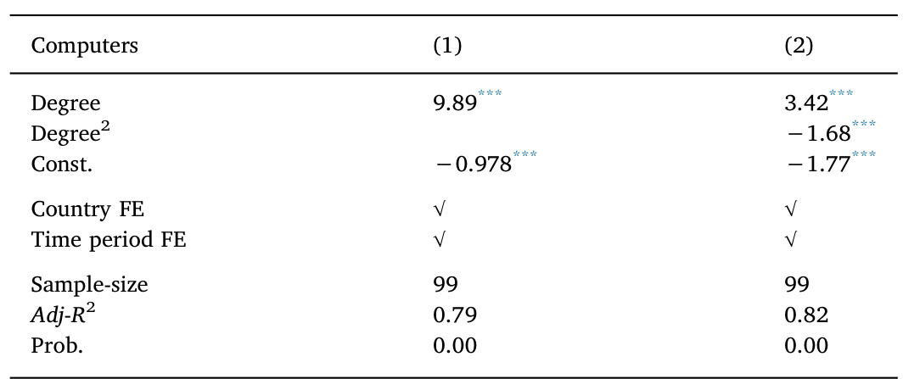
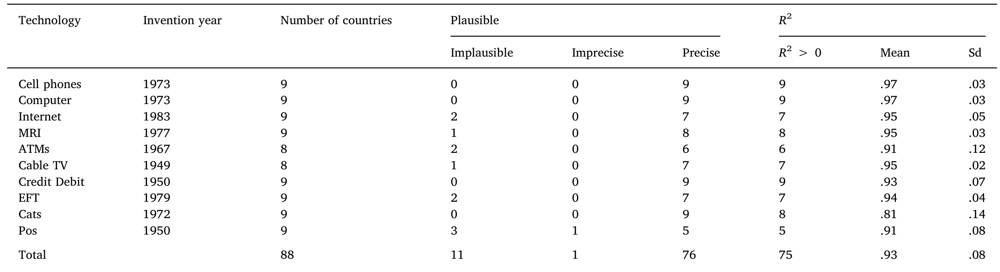
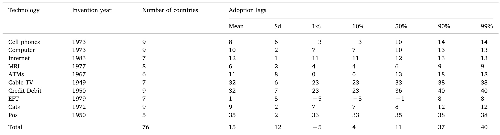
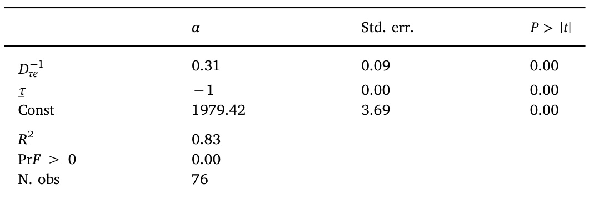
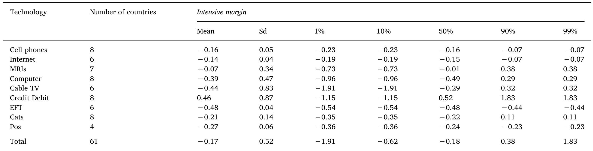
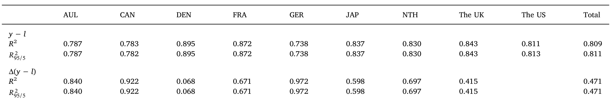
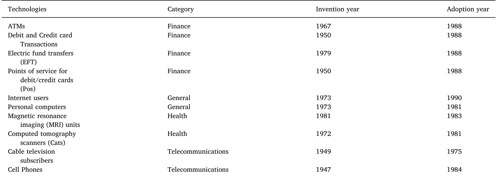
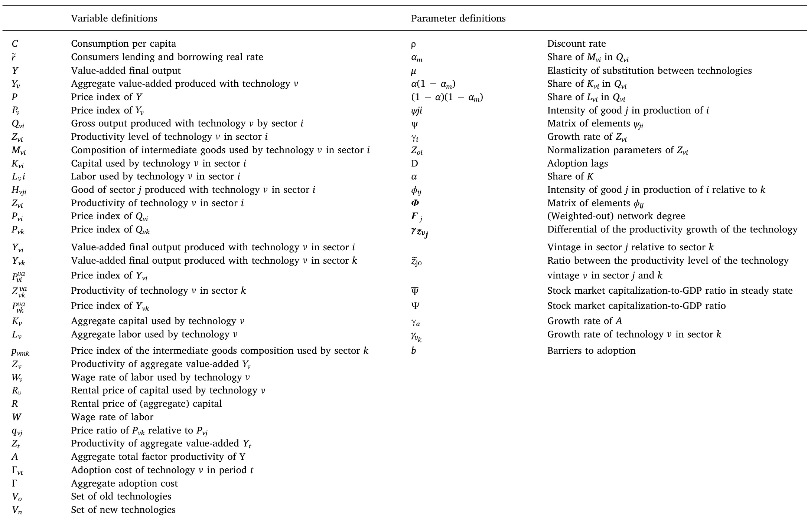

# A multi-sector growth model with technology diffusion and networks  

Manuela Magalhaesa,b,\*, Oscar Afonsoc,1  

aUniversty of Alicante,Department of Economics,Spain   
bCEFAGE-UBI and OBEGEF,Portugal   
C University of Porto,Faculty of Economics,CEFAGE-UBI and OBEGEF,Rua Dr Roberto Frias,4200-464Porto,Portugal  

# ARTICLEINFO  

# ABSTRACT  

JEL classification:   
033   
041   
047   
Keywords:   
Income differences   
Production network   
Technology diffusion  

This paper adds the standard input-output linkages into a multi-sector endogenous growth model to study the interaction effects between linkages and technology adoption for aggregate productivity and for income per capita. We show that the greater the intensity with which a good is used as input by other sectors, the smaller are the technology adoption lags and the greater is the technology adoption intensity, and thus the greater are the increases of the Total Factor Productivity and of economic growth. Therefore, distinct input-output relationships between sectors explain inter-country income differences. By using OECD data, we then estimate the model for nine developed countries and ten technologies, and confirm our theoretical findings.  

# 1. Introduction  

The core of the endogenous growth theory should not be only the production of knowledge but also its diffusion, which is responsible for Total Factor Productivity (TFP) and explains the majority of intercountry differences in per capita output (e.g., Hall and Jones, 1999; Jerzmanowski, 2007). However, since the initial seminal endogenous growth models (Romer, 1990; Grossman and Helpman, 1991; Aghion and Howitt, 1992) until the semi-endogenous growth models (Jones, 1995), the focus of the literature has been on only the production of knowledge. Given that over time the empirical literature has presented evidence more supportive of the endogenous growth models than of semi-endogenous growth (e.g., Dinopoulos and Thompson, 2o00; Laincz and Peretto, 2006; Madsen, 2008; Ang and Madsen, 2015), a new wave of theoretical models has recovered the endogeneous growth result (e.g., Peretto, 1998; Howitt, 1999; Acemoglu, 1998, 2002), and these increasingly highlight knowledge diffusion (e.g., Parente and Prescott, 1994; Basu and Weil, 1998; Comin and Hobijn, 2010).  

Concomitantly, an increasing intensification of inter-sector and inter-firm relationships is also observed over time (e.g., Hirschman, 1958; Bartelme and Gorodnichenko, 2015), and this intensification of linkages, reflected in the increased complexity of the production network structure (i.e., in the input-output relationships), was initially neglected by the theoretical growth models. However, some recent studies have shown that: (i) social networks affect the diffusion of communication technologies (e.g., Jackson, 2011); and (i) the network structure significantly affects the propagation of idiosyncratic shocks (e.g., Acemoglu et al., 2012). Therefore, we can expect that inter-sector network affects the technology diffusion and, consequently, the economicgrowth.  

In fact, the productivity gains reached by modern economies are intrinsically connected with the input-output linkages through convoluted networks, as a result of increasing specialization. The increasing linkages favor learning and knowledge diffusion, reducing the adoption costs and accelerating technology diffusion. For example, the learning and knowledge effects permitted by the input-output linkages were determinant intheaccelerationof thediffusion ofInformation and Communication Technologies (ICT), which, in turn, were important to increase the aggregate productivity. In addition to the previous learning channel, the input-output linkages also allow productivity gains in one sector to spread to other sectors due to multiplier effect, which relies on both the supply-side connections of the sector and the intensity with which its output is used as intermediate input in the other sectors (multiplier channel). Hence, due to the size of the multiplier, the same productivity increase in different sectors will have distinct effects on aggregate productivity, and on the acceleration and the intensity of the technology adoption.  

It is not surprising that the literature in development economics, initiated by Hirschman (1958), has highlighted that inter-sector linkages were crucial for economic development since, in the last instance, they explain cross-country income differences and, consequently, this literature has suggested investments in sectors with the strongest linkages. More recently, there has been a spirited literature on the subject (e.g.,Ciccone, 2002; Acemoglu et al.， 2007; Jones, 2011, 2013; Bartelme and Gorodnichenko, 2015; Fadinger et al., 2016) that reinforces the role of economic structure for aggregate productivity/income since it studies the relationship between input-output linkages, sectoral productivities, and aggregate productivity/income, by considering intermediate goods and, in the latter two works, also tools from networktheory.  

Our research is thus motivated by a desire to reconcile the endogenous growth literature with the evidence on the intensification of inter-sector and inter-firm relationships in recent years. Our contribution is part of the new wave of theoretical growth models and emphasizes the inter-sector production linkage effects on technology adoption and the resulting impacts on productivity and income differences across countries. That is, we take advantage of the network concept to propose a model that accommodates the core of endogenous growth models in order to examine how the linkages reflected on the production network affect technology diffusion decisions, which, in turn, help to explain inter-country differences in TFP.  

To be more precise, we ask how the production network structure or, in other words, the input-output relationships, explain the intercountry differences in adoption lags, adoption intensity, and income per capita. The adoption lags, usually called extensive margin, can be decomposed into the embodiment effect and the variety effect. The former is related to the time of adopting a new technology: the lower the adoption lags, the higher the increase in productivity since the technology embodied in new production methods is more productive. The latter effect is connected with the increase in the range of production methods (i.e., technology varieties) used: when the adoption lag is large (small), the range of technology varieties used is small (large) and, thus, an increase in the range has a strong (weak) effect on productivity - i.e., there is a diminishing return to the range of technology varieties used. Hence, adoption lags affect the curvature of the path of embodied productivity (e.g., Comin and Hobijn, 2010). In turn, the adoption intensity, usually called intensive margin, is associated with the number of units demanded for each technology that depends on its productivity.  

To summarize, input-output linkages through convoluted networks favor learning and knowledge diffusion (learning channel), reducing the adoption costs and in turn the adoption lags (extensive margin). As a result, input-output linkages bring forward the adoption of new technologies, which raises TFP. Furthermore, the adoption of a new technology by a specific sector generates network externalities on TFP through multiplier effects (multiplier channel). These externalities are internalized by firms in the sector, raising the profitability of the technology and, thereby, intensify its adoption (intensive margin) and reduce its adoption lag (extensive margin).  

By incorporating the input-output linkages in the endogenous growth literature, we fill a gap in the literature with the argument that inter-sector buyer-supply relationships act, via convoluted networks, as an important role in technology diffusion through the learning channel, via the extensive margin, and through the multiplier channel, via the extensivemargin andtheintensivemargin.  

To answer our research question, we extend the technology diffusion model of Comin and Hobijn (2010), considering the idea present in Long and Plosser (1983) and Jones (2011,2013) to model the input-output linkages, and following the approach present in Acemoglu et al.(2012) and Fadinger et al.(2016) to model the input-output structure as a network. Thus, in the endogenous economic growth literature tradition, we assume that each intermediate good can be consumed or used by other sectors as a production input. In this way, we account for the inter-connections/linkages between sectors in the input-output matrix, which, using a network approach, we map into a weighted directed network in order to capture the features of the production network structure. As argued above, the network structure establishes links between sectors at the micro level, which, according to empirical evidence, seems to have effects at the macro level.  

Traditionally the aggregation of a multi-sector growth model into one sector does not take into account the difference between gross output and value-added output.2 However, when we correctly find the equivalent one-sector value-added model, the network externalities, dependent on input-output linkages associated with the intermediategoods composition used by sectors, are reflected in the level of TFP. In this way, as argued above, the more the linkages, the higher the positive effects in TFP due to both the learning and the multiplier channels. In addition, as our model will demonstrate, the linkage effects on TFP can be described by the production network properties. By further detailing the recent literature relevant to our work, which thus analyzes input-output linkages using a network perspective, we find investigations over effects of the production network structure on aggregate fluctuations (Carvalho, 2014; Acemoglu et al., 2012; Kelly et al., 2013), aggregate productivity (Oberfield, 2013; Bartelme and Gorodnichenko, 2015), sector productivities and country income per worker differences (Fadinger et al., 2016), and international trade (Chaney, 2014). Using a network theory perspective, Carvalho (2014) and Acemoglu et al. (2012) analyze the role of sectoral and idiosyncratic shocks in generating aggregate fluctuations. Oberfield (2013) demonstrates that when the ratio of intermediate goods relative to labor in production is high, star suppliers appear? endogenously and aggregate productivity increases. Bartelme and Gorodnichenko (2015) reach an econometric specification from a theoretical model, and find a robust relationship between the strength of sectoral linkages and aggregate productivity. Fadinger et al. (2016) set a multi-sector general equilibrium model to analyze the input-output structure effects on sectoral productivities to explain inter-country aggregate income per worker differences. Finally, Chaney (2014) proposes a model to explain the international network of exporters, showing that the existing network of contacts is crucial to find new partners.  

Concerning the theoretical results, we observe that indeed the production network structure explains the cross-country differences in the extensive margin (adoption lags), the intensive margin (adoption intensity), and income per capita. The effects on the extensive margin, which aggregates the embodiment and the variety effects, comes from both the learning and the multiplier channels. The effects of these channels, in turn, are governed by the input-output linkages through the network structure. The role of multiplier channel is also prominent in the adoption intensity (intensive margin) due to the firms’ internalization of the input-output linkages through the network structure. Finally, the effects on income per capita can be decomposed into three factors: (i) differences in the intensive margin, (i) differences in the time of technology adoption, and (i) differences in the production network structure. Since the time of adoption is endogenous, it is also influenced by the production network structure.  

In practice, to measure the effects of linkages (or production network structure) we use the network theory and show that the quantification of these effects is captured by the network degree. This degree reflects the intensity with which a sectoral good is used as input by other sectors; usually, the literature calls this definition of network degree “(weighted) outdegree” (e.g., Jackson, 2008), i.e., the average number of trade partners in an economy and the strength of their trade flows, by which the network degree, together with the optimal adoption time, affects the embodiment and the variety effects, which consequently determine the growth rate of the TFP. Likewise, the input-output linkage effects via the multiplier channel on the intensive margin can be also evaluated by the network degree.  

In relation to the technology diffusion model of Comin and Hobijn (2010), for example, we: (i) correct the extensive margin by a term reflecting the intermediate-goods composition or input-output linkages; (i) explain and endogenize the intensive margin; and (i) include and treat the income differences.4 The growth rate of aggregate productivity is higher in economies in which the average number of input-output trade partners and the intensity of intermediate goods used as input are also higher. Thus, the growth rate of the aggregate productivity depends on the time of technology adoption, on whether the new technologies are more productive, and also on the input-output network degree due to linkage and peer effects.5  

To test the model we use data from two databases: the OECD harmonized input-output dataset (1995 and 2002 editions) and the CHAT database. We use input-output matrices to characterize the production network. Each sector of the OECD input-output tables is an input supplier to all sectors and represents a network node, and between any two pairs of nodes there is a direct arc. Thus, we can map the input-output relationships as a complete and weighted directed network. This methodology allows us to study the main features of the input-output relationships and their evolution over time. From the CHAT dataset we collect data about technology adoption. We select data for 10 technologies that cover different sectors of the economy such as finance, health, telecommunications, and general sectors. For example, computers and the Internet are technologies used by all sectors of the economy. The technology selection criterion is its invention year. As the input-output tables computation started in the 1960s, we can investigate the effects of the input-output relationships on technology (lags and intensity) adoption and on income per capita only for technologieswhoseinventionvear occurs after the1960s.  

Our main finding is that all theoretical results are confirmed by the empirical test. In summary, the model provides precise estimates of the adoption lags for $86\%$ of our technology-country pairs. Additionally, $83\%$ of the adoption lag variability is explained by the variability of both the technology invention year and the inverse of the network degree.6 Secondly, we estimate that the level of the adoption intensity is, on average, $84\%$ of the US level and that the production network structure accountsfor $4\%$ of its variability. Finally, the model fits the variability of the income per capita and income per capita differences quite well.  

To sum up, our paper takes advantage of a parsimonious analytical structure to contribute to the growth literature by identifying the input-output network structure effect in TFP. We combine the Comin and Hobijn (2010) model with a standard input-output linkages model to study the interaction effects between linkages and technology (lags and intensity) adoption for aggregate productivity and for income per capita. We use trade flows between sectors to set up the production network. The interpretation of sectors/firms as nodes and the trade flows between them as linkages seems normal. This network interpretation allows us to use analytical methods from the network literature and network measures as proxies for the synergies between sectors and the aggregate productivity level. Moreover, by using available data, we show that the theoretical network “operator” approximates the estimated series for the technological diffusion very well.  

The rest of the paper is organized as follows. Section 2 summarizes the inter-sector network properties and introduces the case of computer diffusion. Section 3 describes the data used in this paper. Section 4 defines a multi-sector growth model with input-output relationships between sectors. This section also derives the equivalent value-added and one-sector aggregate model. Section 5 basically derives technology diffusion measures. Section 6 essentially presents the estimation results. Section 7 analyzes inter-sector networks effects in the evolution of income per capita and cross-country income differences. Section 8 concludes the paper.  

# 2. Network properties and computer diffusion  

The network concept, consisting of two or more entities sharing resources and information, has been adapted and extended by many fields of study, including Economics. The importance of some network properties,7 such as network density, shortest distance, network size, and strong or weak ties have been examined by industrial economics and social network theory as factors responsible for the propagation of network effects (Suarez, 2005; Jackson, 2011; Bertolotti et al.,2015; Guan et al., 2016). In aggregate terms, we follow Ciccone and Matsuyama (1996) and consider that economies at earlier stages of development are characterized by relatively low diversity of economic activities and of network effects, but when the economy develops and increases the diversity of economic activities, the network effects become increasingly more important and a roughly proportional diffusion ofknowledgeis expected.  

In a context of an economy the input-output relationships between different sectors can be represented as a weighted and directed graph or network, which allows us to study the properties of the network structure - see, e.g., Jackson (2008) as a pioneering study on this subject. We conjecture that the input-output relationships between sectors of the economy $E_{n}=({\mathcal{J}}_{n},\ {\mathcal{W}}_{n})$ , where ${\mathcal{J}}_{n}$ is the set of sectors and $\mathcal{W}_{n}$ is the input-output matrix, can be represented by the graph $\mathcal{G}_{n}=(\mathcal{V}_{n},\,E_{n},\,\mathcal{W}_{n})$ with vertex set $\psi_{n}$ ,edge set $E_{n},$ and edge weighted matrix $\mathcal{W}_{n}$ . Each vertex in $\mathcal{V}_{n}$ corresponds to an economic sector; i.e., $\mathcal{V}_{n}=\mathcal{J}_{n}$ . Moreover, $(i,j)\in E_{n}$ takes the value of 1 if sector i is an input supplier to sector $j$ and O otherwise, and the weight of edge $(i,j)\in E_{n}$ is equal to $w_{\mathrm{ij}},$ i.e., the input intensity of sector i in sector j's production.8  

Fig. 1 depicts the US input-output relationships between sectors as a graph. It confirms that the diversity of economic activities - i.e., the linkages - increases with economic development and, therefore, the learning and multiplier channels are expected to be more influential. This observation is confirmed, for instance, by the (weighted-out) network degree, the value of which was 0.48 in 1945 and 0.60 in 1995. The existence of a small group of sectors connected by a large number of links is also observed, which, thus, magnifies the learning and multiplier channels.  

Let us now examine the effects of network (out) degree on technology diffusion by considering computer diffusion as the example for the technology diffusion process. Table 1 presents the impact of network (out) degree on the computer diffusion for a set of nine countries.9 As expected, there is a strong, positive, and statistically significant effect of network degree on computer units adopted. Additionally, there is also evidence of diminishing marginal returns to the network degree, which is in line with our argument that the increment on the TFP becomes increasingly smaller with a new variety. As stated, the more the linkages, the greater the positive effects in the TFP due to the learning and multiplier channels. Thus, the higher the network degree, the higher is the TFP and, consequently, the adoption of technology. However, as new varieties have lower increments in the TFP, the network degree presents diminishing marginal returns, as is confirmed by the squared term of the network degree in Table 1. At a higher level of desegregation, the relationship is also positive and statistically significant.10  

  
Fig. 1. The US network for the input-output relationships between sectors. The network corresponds to the US input-output matrix in 1945 left) and 1995 (right) for every input-output transactionbetweensectorsiandjabove $2\%$ of the total input purchase.Each vertex (dot) corresponds to an economic sector defined in the North American Industry Classification System (NAICS) two-digit-leveldesegregationintheBureauof EconomicAnalysis(BEA)use tablesfora totalof78sectors.Theinput-output datafor1945areextrapolated fromthe1947benchmark input-output tables and are based on the 1957 Standard Industrial Clasification (SIC) system, whereas the data for 1995 were prepared to fit the 1957 SIC system. Each link is shaded by the corresponding weight,withdarkershadesindicatinghighervalues.  

Table1 Networks degree impact on computer adoption.   

  
Notes: For visualisation proposes, the estimates of model 1 and 2 are rescaled. $p\leq0.01$  

However, our purpose is to go further than simply investigate the technology diffusion process. Comin and Mestieri (2014) identified two differences in the technology diffusion path between countries: adoption lags (extensive margin) and adoption intensity (intensive margin). These margins are illustrated in Fig. 2. Recall that adoption lags are related to the adoption time, which is affected by the learning and multiplier channels, whereas adoption intensity is related to the number of units adopted and is influenced by the multiplier channel. As countries adopt various technologies at different periods of time and different numbers of units per capita, we investigate how the production networks explain these two differences. The adoption lags and intensity of adoption are reflected in the aggregate productivity of each country. When a country adopts new (and more productive) technologies, its productivity growth rate increases. Similarly, when a country buys more technology units, its productivity also increases.  

# 3. Data  

The data used in this study come from two databases:l1 (i) Technology, income, and population data come from the CHAT database,12 collected by Comin and Hobijn (2009), which covers the diffusion of 104 technologies from 161 countries over the last 200 years; (i) the production network data come from the OECD input-output edition 1995 (ISIC Rev. 2) and edition 2002 (ISIC Rev. 3).  

Since the input-output tables started to be computed only in the 1960s, our analysis focuses on the technologies invented after that period until 1998. We select 10 technologies from several economic sectors, such as communication and information technologies, services, medical, and other general sectors; as shown in Table 9 in the Appendix, the sectors considered were ATMs, credit and debit transactions, electronic funds transfers (EFT), points of services for debit and credit cards (POs), Internet, computers, magnetic resonance imaging (MRI), computer tomography scanners (CATs), cable TV, and cell phones. The technology measure in the CHAT database can be either the amount of output produced with the technology (e.g., number of transactions using payment cards at points of service) or the number of units of capital embodying the technology (e.g., number of computers).  

Historical input-output tables are available for nine countries (those in footnote 8) at the two-digit level. The 1995 edition considers 35 industries and the 2002 edition considers 41 industries. To homogenize these editions, we aggregate some sectors to end up with 35 sectors. Next, as the input-output tables are collected every five years, we compute the yearly input-output tables. We use the linear interpolation procedure following the BEA and OECD methodology. We discard very small transactions between the sectors and consider only input transactionsatleast $1\%$ above the total input purchase.  

To set the production network structure, we use the input-output table, in which each sector is a node and each input-supply relationship is a weighted directed arc linking two nodes. The input-output matrix is, by definition therefore, a weighted directed network.  

  
Fig.2.Personalcomputers.otes:Thisfigure,adaptedfromComin andFerrer 23),shows, ontheleft-hand side,thelogf personalcomputeradption,and ontheright-hand sidethe same dat for the USA (hereinafter the US) and the UNK (hereinafter the UK), revealing adoption lag and penetration rate differences between the two countries.  

# 4. Model  

Next, in order to analyze the effects on technology adoption and economic growth, we present a multi-sector endogenous growth model in which we extend the Comin and Hobijn (2010) model following Long and Plosser (1983) and Jones (2011, 2013) to model the input-output linkages and Acemoglu et al. (2012) and Fadinger et al. (2016) to model the input-output structure as a network. In addition to the importance of innovation in growth, empirically emphasized by, for instance, Hasan and Tucci (2010), technology diffusion also plays an important role in economic growth. We are especially interested in the input-output linkage effects on technology adoption and, consequently, on economic growth.  

Goods produced by each sector are used as intermediate goods by different sectors of the economy, and the intermediate goods composition differs across sectors, as revealed by the input-output data. Firstly, our goal is to demonstrate that input-output linkages affect the productivity indices. Secondly, using the network theory perspective, we show that the impact on TFP relies on the production networks' properties and, in particular, the network degree.  

Since the model requires considerable notation, and some derivations are included in Appendixes B-D, Table 10 in Appendix E summarizes the notation and the definition of variables and parameters.  

# 4.1. Preferences  

A representative household exists in the economy. It consumes and supplies inelastically one unit of labor at the wage rate W. The household utility is given by  

$$
\begin{array}{r}{U=\int_{t_{0}}^{\infty}\;e^{-\rho t}\log(C_{t})\mathrm{d}t,}\end{array}
$$  

where ${\uprho}$ denotes the discount rate and $C_{t}$ denotes the consumption per capita at time t. Capital markets are perfectly competitive and consumers can lend and borrow at the real rate $\widetilde{r}$ 13 The household maximizes the inter-temporal utility (1) subject to the budget constraint and the transversality condition. From the first-order conditions (FOC) the consumption Euler equation is $\begin{array}{r}{\frac{\dot{C}}{C}=\tilde{r}-\rho}\end{array}$  

# 4.2.Production  

# 4.2.1. Final output  

The aggregate value-added final output (GDP), Y, is competitively produced by a constant elasticity of substitution (CES) production function  

$$
Y=\left(\int_{-\infty}^{t-D}\Upsilon_{\nu}^{\frac{1}{\mu}}\,\mathrm{d}\nu\right)^{\mu}\equiv\left(\sum_{\tau\in\{o,n\}}\,Y_{\tau}^{\frac{1}{\mu}}\right)^{\mu},
$$  

where $\left(\mathrm{i}\right)\mu\mathrm{~>~}1$ denotes the elasticity of substitution between technologies; (ii) $Y_{\nu}$ denotes the aggregate value-added final output produced with technology vintage $\nu$ , which, by simplification, we group into two technologies, the old and the new, denoted respectively by $o$ and $n$ . The final output producers’ optimization problem subject to the production function (2) is max $\begin{array}{r}{P Y-\int_{\nu}P_{\nu}Y_{\nu}\,\mathrm{d}\nu}\end{array}$ and from the FOCs result  

$$
Y_{\nu}=\left(\frac{P_{\nu}}{P}\right)^{-\frac{\mu}{\mu-1}}Y,
$$  

and $\begin{array}{r}{P=\left[\int_{\underline{{\nu}}}^{\overline{{\nu}}}\,(P_{\nu})^{-\frac{1}{\mu-1}}\mathrm{d}\nu\right]^{-(\mu-1)}}\end{array}$ for the price index, where $P\left(P_{\nu}\right)$ is the price index of $\overbar{Y}\left(Y_{\nu}\right)$  

# 4.2.2.Intermediate sectors  

The economy consists of $N$ productive units or sectors, each producing a different good i, $i=1$ $N$ .The perfect competitive gross output produced under a Cobb-Douglas technology vintage $\nu$ in sector $i,$ $Q_{w i},$ is given by:  

$$
\begin{array}{r}{Q_{\mathrm{vi}}=Z_{\mathrm{vi}}(K_{\mathrm{vi}}^{\alpha}L_{\mathrm{vi}}^{1-\alpha})^{1-\alpha_{m}}M_{\mathrm{vi}}^{\alpha_{m}},}\end{array}
$$  

where $Z_{\nu i}$ is the productivity level of technology vintage $\nu$ in sector $i,$ which is likely to change over time; $K_{\nu i}$ and $L_{v i}$ represent the amount of capital and labor used by technology vintage $\nu$ in sector $i;$ $M_{v i}$ is the composition of the intermediate goods used by technology vintage $\nu$ in sector $i_{\!\!\!\:}^{{14}}\ a_{m},\ \alpha(1\,-\,\alpha_{m})$ and $(1\,-\,\alpha)(1\,-\,\alpha_{m})$ are, respectively, the shares of $M_{\nu i},\,K_{\nu i}$ and $L_{v i}$ in production. In turn, the composition of the intermediategoodsusedby technology $\nu$ in sector iis  

$$
M_{\mathrm{vi}}=\prod_{j}{\left(\frac{H_{\mathrm{vji}}}{\psi_{\mathrm{ji}}}\right)}^{\psi_{\mathrm{ji}}},
$$  

where $H_{\nu j i}$ is the good of sector $j$ produced with technology $\nu$ that is demanded to be used as intermediate good by technology $\nu$ in sector $i,$ and the matrix $\psi$ with the elements $\psi_{j i}\geq0$ ， $\Sigma_{j}\psi_{j i}=1$ , can be mapped into the input-output table linking the flow of intermediate goods across sectors. As will be clear below, it is through this matrix that the learning andmultiplier channels operate.  

Hence, the gross output produced with technology vintage $\nu$ in sector i, $Q_{w i},$ combines labor $L_{v i},$ capital $K_{\nu i},$ and intermediate goods $M_{\nu i}.$ It can be used either as a final good, $Y_{\nu i},$ or as an intermediate good, $H_{\nu i}$ thus, the market clearing for each sector requires $Q_{\nu i}=\,Y_{\nu i}\,+\,H_{\nu i},$ where $H_{\nu i}=\Sigma_{j}H_{\nu i j}$  

# 4.2.3. Technology  

At each instant $t,$ . a new, more productive production method or technology vintage appears exogenously. Technology vintages are capital embodied, and are indexed by the time they appear. The set of technology vintages available at period $t$ is givenby $V=(-\infty\mathrm{~,~}t)$ .The productivity of new technology vintages is sector-specific and grows constantly over time at the rate of $\gamma_{i},$  

$$
Z_{\nu_{i}}=Z_{0_{i}}e^{\gamma_{i}\nu},
$$  

where (as stated above) subscript i denotes a sector, $i=1,...,N;$ and $Z_{0_{i}}$ is a normalization parameter that gives the productivity level of technology vintage y, such that $Z_{0_{i}}=Z_{\underline{{{\nu}}}_{i}}e^{-\gamma_{i}\underline{{{\nu}}}}$  

As shown below, not all technology vintages available in the world are used, since making technology vintages available for production is costly. The set of technology vintages actually used is given by $V=(-\infty\mathrm{~,~}t-D],$ where $D\geq0$ denotes the adoption lag (extensive margin), that is, the amount of time taken by a country to adopt the best technology from the time such technology was invented. Following Comin and Hobijn (2010), we assume that a technology, denoted by $\tau_{.}$ is a set of production methods used to produce closely related intermediate goods. By assuming two technologies, o and $n$ the set of production  methods $V_{o}$ includes those introduced until time $\underline{{\nu}}_{i}$ $V_{o}=(-\infty\ ,\underline{{{\nu}}}];$ .while the set of production methods $V_{n}$ includes methods invented after $\underline{{\nu}}$ $V_{n}=\left[{\underline{{\nu}}},\,t-D\right]$  

# 4.3.Factor demand, prices,and aggregation  

We have technology vintages, sectors, and consumption of intermediate goods. To compute a balanced growth equilibrium we need to carry out several aggregations in order to end up with the equivalent one-sector growth model. The procedure is as follows. Firstly, we find the equivalent multi-sector model in terms of value added; that is, without intermediate goods. Otherwise, the effects of the intermediate goods composition on the aggregate productivity index are neglected (Greenwood and Yorukoglu, 1997). This first step is detailed in Appendix B since, by considering a Cobb-Douglas input-output model, it is lengthy but standard. Secondly, we aggregate the value-added multi-sector model in the one-sector model; that is, we aggregate the output produced by each sector. At this point, we have the aggregate output for each vintage $\nu$  

Thus, we aggregate the $N$ sectors, $i=1,...,N_{:}$ value-added models into a one-sector value-added model for each technology vintage $\nu$ .We aggregate the valued added in terms of the generic good $k$ as  

$$
Y_{\nu}=\sum_{i}\frac{P_{\nu i}^{\nu a}Y_{\nu i}}{P_{\nu k}},
$$  

where $P_{\nu i}^{\nu a}$ and $P_{\nu k}$ are the price of $Y_{v i}$ and $Q_{\nu k}$ , respectively. By dividing and multiplying the previous equation with $P_{\nu k}^{\nu a}$ , and using (54) and (53) in Appendix B, we obtain  

$$
P_{\mathrm{vk}}\,Y_{\nu}=Z_{\mathrm{vk}}^{\mathrm{va}}P_{\mathrm{vk}}^{\mathrm{va}}\,K_{\nu}^{\alpha}\,L_{\nu}^{1-\alpha},
$$  

where $\begin{array}{r}{K_{\nu}=\sum_{i}\,K_{\mathrm{vi}},\ L_{\nu}=\sum_{i}\,L_{\mathrm{vi}}}\end{array}$ and $P_{\nu k}^{\nu a}$ is the price of $Y_{\nu k}$ Next,by substituting (51) in Appendix B into (8), we find the aggregate value added,  

$$
Y_{\nu}=Z_{\mathrm{vk}}^{\mathrm{va}}\left(\frac{P_{\mathrm{vk}}}{p_{\mathrm{vmk}}}\right)^{\frac{\alpha_{m}}{1-\alpha_{m}}}K_{\nu}^{\alpha}L_{\nu}^{1-\alpha},
$$  

where $p_{v m k}$ is the price index of the intermediate goods composition usedbysector $k$  

Finally, by substituting (46) and (52) in Appendix B into (9), we obtain the aggregate value added for each technology vintage $\nu$ in terms  

of good $k$ $Y_{\nu}=Z_{\nu}K_{\nu}^{\alpha}L_{\nu}^{1-\alpha}$ , where  

$$
Z_{\nu}=(1-\alpha_{m})\alpha_{m}^{\frac{\alpha_{m}}{1-\alpha_{m}}}Z_{\mathrm{vk}}^{\frac{1}{1-\alpha_{m}}}\left[\prod_{j}\left(\frac{P_{\mathrm{vk}}}{P_{\mathrm{vj}}}\right)^{\psi_{\mathrm{vjk}}}\right]^{\frac{\alpha_{m}}{1-\alpha_{m}}},
$$  

is the productivity of the aggregate value added for $Y_{\nu}$ which is affected by: (i) the share of intermediate goods in production; (i) the relative prices of the economy; and (ii) the input-output linkages through the elements $\psi_{j k}$ . It is clear from Eq. (10) that the aggregate productivity of $Y_{\nu}$ is affected by all structures of the input-output linkages of the economy, through which the learning and multiplier channels operate.  

As $Y_{\nu}$ is produced under perfect competition and by a Cobb-Douglas production function, its price is given by  

$$
P_{\nu}=\frac{1}{Z_{\nu}}\bigg(\frac{W}{1-\alpha}\bigg)^{1-\alpha}\bigg(\frac{R_{\nu}}{\alpha}\bigg)^{\alpha},
$$  

where $W$ and $R_{\nu}$ are the wage rate of labor and the rental price of capital usedby technologv $\nu$ ,respectively.  

Let $F$ be a matrix $(n\times n)$ with  elements $f_{j i}$ such  that ${\pmb F}=({\pmb I}-\alpha_{m}{\pmb\Phi})^{-1}$ ， $\boldsymbol{F}_{j}$ the row vector with the elements $f_{j i},j=1,\,...,\,n,$ $\forall i=1$ , .., n and $\pmb{\phi}$ the matrix $(n\times n)$ with the elements $\phi_{\nu j i}.^{15}$ .15 Thus, from Eeq. (47) in Appendix B, the relative price ratio gy = Fx canbe written as $q_{\nu_{j}}=\tilde{z}_{\mathrm{jo}}e^{F_{j}\gamma\tilde{z}_{\nu_{j}}\nu}$ ,where $\gamma_{\widetilde{z}_{\nu_{j}}}$ is a vector column with elements $(\gamma_{j}-\gamma_{k})$ , which measures the differential of the productivity growth of thetechnologyvintage in sector $j$ relative to sector $k$ and $\widetilde{z}_{j o}$ is the ratio between the productivity level of the technology vintage $\underline{{\nu}}$ in sector $j$ and $k,$ that is, the normalization ratio $\frac{Z_{0j}}{Z_{0k}}$  

Therefore, we can rewrite the product of the relative prices as  

$$
\prod_{j}\bigg(\frac{P_{\nu k}}{P_{\nu j}}\bigg)^{\psi_{\nu j k}}=\prod_{j}\big(\widetilde{\mathcal{Z}}_{j o}^{\psi_{\nu j k}}\big)^{e^{\sum_{j}\widetilde{F_{j}}\gamma_{\widetilde{z}_{\nu j}}\nu}},
$$  

where $\widetilde{F}_{j}$ is a row vector $(1\times m)$ such that $\widetilde{F_{j}}=\psi_{\nu_{j k}}F_{j};\,\widetilde{z}_{j o}$ is the ratio between the productivity level of the technology vintage $\nu$ in sector $j$ and $k_{i}$ and $\gamma_{\widetilde{z}\nu_{j}}$ is the differential of the productivity growth of the technology vintage in sector $j$ relative to sector $k$  

Notice that from Eq. (12) and matrix (48) in Appendix B, we conclude that the growth rate of relative prices depends on: (i) the (differentials of) productivity growth of the technology vintage in the different sectors of the economy, and (i) the influence of each sector on the inter-sector network through the Leontief inverse, which can be expressed in terms of the input-output matrix and has a straightforward relationship to the sector's centrality or degree. As shown by Acemoglu et al. (2012) and Fadinger et al. (2016), the Leontief inverse and the vector of multipliers can be written as a convergent power series, $\begin{array}{r}{\mathbf{\nabla\cdot1}=(I-\alpha_{m}\Phi)^{-1}\mathbf{1}=(\sum_{k=0}^{+\infty}{(\alpha_{m}\Phi)^{k}})\mathbf{1}\approx\mathbf{1}+\alpha_{m}\Phi\mathbf{1}.}\end{array}$ which can be approximated by the sum of the first terms, since the elements of $\Phi$ are sufficiently small. In turn, $\pmb{\phi1}=\pmb{\mathrm{d}}^{\bf o u t}$ ,where ${\bf d}^{\bf o u t}$ is a column vector with elements $\mathbf{d}_{j}^{\mathbf{out}}$ ; i.e., $\mathbf{d}_{j}^{\mathbf{out}}$ is the out-degree of sector $j$ and $\textstyle\sum_{j}\mathbf{d}_{j}^{\mathbf{out}}$ is the average out-degree of the inter-sector network, which, for simplicity, we call degree. The degree is the share of its output in the input supply of each sector of the economy and is equal to the sum of the corresponding row elements of matrix $\Phi$ , such that $\begin{array}{r}{\mathbf{d}_{j}^{\mathrm{out}}=\sum_{i}^{m}\Phi_{i j},}\end{array}$ thus, $F_{j}\approx1+\alpha_{m}\mathbf{d}_{j}^{\mathbf{out}}$ . In Economics, ${\bf d}^{\bf o u t}$ represents the vector with the sectoral multipliers of the economy, which give us the impact of each sector on aggregate value added of the economy. Thus, the larger is the $\mathbf{d}_{j}^{\mathbf{out}}$ , the larger is the impact of sector $j$ in the aggregate value added of the economy.  

# 4.4. Capital goods: production, demand, and prices  

Each capital good producer must invest an up-front fixed cost in order to be monopolist, protected by a patent, which represents the  

adoption cost of either the production method or technology vintage $\nu$ Following Comin and Hobijn (2010), the adopting cost of vintage $\nu$ at time $t$ is givenby  

$$
\Gamma_{\mathrm{vt}}=\overline{{{\Psi}}}(1\,+\,b)\bigg(\frac{Z_{\nu}}{Z_{t}}\bigg)^{\frac{1+\nu}{\mu-1}}\bigg(\frac{Z_{t}}{A_{t}}\bigg)^{\frac{1}{\mu-1}}Y_{t},
$$  

where $\nu~>~0;\,\overline{{\Psi}}$ is the steady-state stock market capitalization-to-GDP ratio, which is included for normalization purposes; $b$ indicates the barriers to adoption; $A_{t}$ denotes the aggregate TFP associated with the final aggregate output $Y_{t}$ set out below; and $Z_{t}$ denotes the productivity of technology vintage $t.$ The term $\left({\frac{Z_{\nu}}{Z_{t}}}\right)^{\frac{1+\nu}{\mu-1}}$ ()-1 illustrates that it is costly to adopt technologies closer to the technology frontier. Finally, the last two terms; i.e., the term $\left({\frac{Z_{t}}{A_{t}}}\right)^{\frac{1}{\mu-1}}$ multiplied by the term $\boldsymbol{Y}_{t},$ show that the adoption cost increases with the market size (e.g., Comin and Hobijn, 2010; Parente and Prescott, 1994; Afonso, 2012) due to complexity costs (e.g., costs pertaining to the construction of prototypes and samples, new assembly lines, training of workers, coordination, organization, transportation, processing of ideas, information, and marketing costs). That is, the gap between the productivity of technology vintage and the aggregate TFP, evaluated by the term $\left({\frac{Z_{t}}{A_{t}}}\right)^{\frac{1}{\mu-1}}$ measures the complexity costs that firms have to support to reach the stateof-the-art technology, possibly too far (i.e., several quality rungs above) and thus more complex than their own experience level. By multiplying this term by the aggregate output $Y_{t}$ the complexity cost is then weighted by the scale of the economy associated with the market size. As shown by Comin and Hobijn (201o) and Parente and Prescott (1994), this cost formulation ensures the existence of an aggregate balanced growth path.  

To produce one unit of any capital good only one unit of the final output Y is required and the production process is fully reversible. Since the final good is chosen as numeraire, the marginal production cost of capital goods is equal to unity. For simplicity we assume no physical capital depreciation. Capital good supplier of technology vintage $\nu$ rents its good at the rate $R_{\nu}$  

The demand for technology vintage $\nu$ faced by the monopolist is the demand for capital by all sectors of the economy given that technology vintages are capital embodied. Thus, from the aggregation model for each sector i, we obtain the capital demand and prices for each technologyvintage $\nu$ .The supplier of each technology vintage $\nu$ charges the rental price $R_{\nu}$ , and the revenue share of capital is $\alpha$ that is, the demand for capital of a vintage $\nu$ by all sectors $i=1$ $N$ is given by $R_{\nu}K_{\nu}=\alpha P_{\nu}Y_{\nu}$ , where $\begin{array}{r}{\bar{K_{\nu}}=\sum_{i=1}^{N}{K_{\mathrm{vi}}}}\end{array}$ The revenue generated from the output produced with the vintage $\nu$ is determined by the demand function and we can rewrite it as $\begin{array}{r}{\bar{R_{\nu}}K_{\nu}=\alpha P_{\nu}\Big(\frac{P_{\nu}}{P}\Big)^{-\frac{\mu}{\mu-1}}Y=\alpha P_{\nu}^{-\frac{1}{\mu-1}}P^{\frac{\mu}{\mu-1}}Y}\end{array}$ Then, replacing $P_{\nu}$ by Eq. (11) and solving with respect to $K_{\nu}$ the demand curve faced by the capital good supplier is  

$$
K_{\nu}=\Bigg(\frac{1}{Z_{\nu}}\Bigg)^{-\frac{1}{\mu-1}}\Bigg(\frac{1-\alpha}{W}\Bigg)^{\frac{1-\alpha}{\mu-1}}\Bigg(\frac{\alpha}{R_{\nu}}\Bigg)^{\!\!\!\xi}Y,
$$  

where $\epsilon=1+\frac{\alpha}{\mu-1}$ isthe price elasticity of demand, which is constant. Capital suppliers maximize their profit at time $t$ equals $\begin{array}{r}{\bar{\mathcal{L}}=\int_{0}^{+\infty}\bar{\mathcal{H}}_{\mathrm{vs}}\,e^{-\int_{t}^{s}r_{s}\,\mathrm{d}s^{\prime}}\,\mathrm{d}s,}\end{array}$ where $\mathcal{H}_{\mathrm{vs}}$ is the current Hamiltonian. $^{16}\mathrm{As}$ a result, the flow profit is π, = α- $\begin{array}{r}{\pi_{\nu}=\frac{1}{\epsilon-1}\tilde{r}K_{\nu}=\frac{1}{\epsilon}R_{\nu}K_{\nu}}\end{array}$ Thus,the otimal rental price equals the mark-up times the marginal cost of a unit of capital. Given the durability and reversibility of capital, the marginal production cost is the user-cost of capital. Hence, the optimal rental price is  

$$
R_{\nu}=R={\frac{\epsilon}{\epsilon-1}}\tilde{r}.
$$  

# 4.5.Technology aggregation:factor demands and prices  

In this section we aggregate the model for all technology vintages $\nu$ existing in the economy in order to obtain the aggregate final (valueadded) output Y. To aggregate the model we use the demand for the output produced by technology vintage v, Eq. (3), with the purpose of obtaining the optimal price $P_{\nu}$ and substituting it in the demand for the productive factor $K_{\nu}$ and $L_{\nu}$ .17 In this way, by integrating over technologies the demand for the productive factor $K_{\nu}$ and $L_{\nu}$ and recalling that there is no restriction on movements of labor and capital; i.e., $W_{\nu}=W$ and $R_{\nu}=R$ . we obtain the optimal condition for the aggregate productive factor $L$ and $K$ such that $\begin{array}{r}{{\overbar{W}}L=(1-\alpha)\bigg(\int_{\nu}Y_{\nu}^{\frac{1}{\mu}}\,\mathrm{d}\nu\bigg)Y^{\frac{\mu-1}{\mu}}P}\end{array}$ and $\begin{array}{r}{R K=\alpha\Bigg(\int_{\nu}Y_{\nu}^{\frac{1}{\mu}}\,\mathrm{d}\nu\Bigg)Y^{\frac{\mu-1}{\mu}}P}\end{array}$ respectively. Then, by combining the optimal conditions for $K_{\nu},L_{\nu},K$ and $L$ , we obtain the value-added production function of $\begin{array}{r}{Y_{\nu}=Z_{\nu}\Big(\frac{Y_{\nu}}{Y}\Big)^{\frac{1}{\mu}}L^{1-\alpha}K^{\alpha}}\end{array}$ . Finally, by integrating this equation over $\nu$ , we arrive at the aggregate final (value-added) output Y,  

$$
Y=A L^{1-\alpha}K^{\alpha},
$$  

Since the production function of the aggregate final (value-added) output is also a Cobb-Douglas function and this output is produced under perfect competition, the optimal price is  

$$
P=\frac{1}{A}\biggl(\frac{W}{1-\alpha}\biggr)^{1-\alpha}\biggl(\frac{R}{\alpha}\biggr)^{\alpha}.
$$  

# 4.6.Optimal adoption  

The time of adoption is endogenously decided by the monopolist. From Eqs. (3), (11), and (17), we derive the flow profits earned by the capital  good  producer  of  technologyvintage $\nu$ ，which is $\begin{array}{r}{\pi_{\nu}=\frac{1}{\epsilon}R_{\nu}K_{\nu}=\frac{\alpha}{\epsilon}P_{\nu}Y_{\nu}}\end{array}$ . Next, by replacing $Y_{\nu}$ with Eq. (3) and prices $P_{\nu}$ and $P$ with the marginal cost of $Y_{\nu}$ and $Y,^{18}$ we rewrite the flow profits as $\pi_{\nu}={\frac{\alpha}{\varepsilon}}\!\left({\frac{Z_{\nu}}{A}}\right)^{\frac{1}{\mu-1}}\!Y$ and derive the present discounted value of flow profits  

$$
M_{\nu,t}=\int_{t}^{+\infty}\pi_{\mathrm{vs}}\,e^{-\int_{t}^{s}r_{s}\,d s^{\prime}}\,d s=\bigg(\frac{Z_{\nu}}{Z_{t}}\bigg)^{\frac{1}{\mu-1}}\bigg(\frac{Z_{t}}{A_{t}}\bigg)^{\frac{1}{\mu-1}}\Psi Y_{t},
$$  

where  

$$
\psi=\frac{\alpha}{\mathsf{\epsilon}}\int_{t}^{+\infty}\left(\frac{A_{t}}{A_{s}}\right)^{\frac{1}{\mu-1}}\!\left(\frac{Y_{s}}{Y_{t}}\right)e^{-\int_{t}^{s}r_{s}\,d s^{\prime}}\,d s
$$  

is the stock market capitalization-to-GDP ratio.  

To determine the optimal adoption time, the market value of the firm producing capital good $\nu$ is, at every instant, at least as large as the adoptioncost,  

$\Gamma_{\nu}\leq M_{\nu}$  

consumption of intermediate goods. Thus, $A_{o}$ is a weighted average of sectoral productivity levels. Secondly, for the same reason, the growth rate of the TFP, $\gamma_{a},$ is also a weighted average of the sectoral productivity growth rates.  

In turn, the aggregate adoption cost is given by  

$$
\Gamma=\overline{{{\Psi}}}(1+b)\!\left(\frac{\gamma_{\nu_{k}}+\alpha_{m}\sum_{j}\widetilde{F}_{i}\gamma_{\widetilde{z}_{\nu_{j}}}}{(\mu-1)(1-\alpha_{m})}\right)\!e^{-\frac{(\gamma_{\nu_{k}}+\alpha_{m}\sum_{j}\widetilde{F}_{i}\gamma_{\widetilde{z}_{\nu_{j}}})^{\nu}}{(\mu-1)(1-\alpha_{m})}Y(1-\dot{D}).}
$$  

$$
\begin{array}{r l}&{\Big(\frac{Z_{v}}{Z_{t}}\Big)^{\frac{\nu}{\mu-1}}=\operatorname*{min}\biggr\{1,\frac{1}{1+b}\frac{\cdot}{\Psi}\biggr\},\qquad\mathrm{such}\qquad\mathrm{that}\qquad\log Z_{\nu}-\log Z_{t}=\operatorname*{min}}\\ &{\left\{0,-\frac{\mu-1}{\nu}(\log(1+b)-\log\Psi+\log\overline{{\Psi}})\right\}\mathrm{~and}^{19}}\\ &{D_{\nu}=\operatorname*{max}\left\{0,\frac{(\mu-1)(1-\alpha_{m})}{\Big(\gamma_{\nu_{k}}+\alpha_{m}\sum_{i}\widetilde{F}_{i}\gamma_{\tilde{z}_{v_{i}}}\Big)\nu}[\log(1+b)+(\log\overline{{\Psi}}-\log\Psi)]\right\}\equiv D,}\end{array}
$$  

where $Z_{\nu}$ and $Z_{t}$ are the productivities embodied in technology vintage v and $t,$ respectively. Recalling that $t$ is the last technology vintage available and $\nu$ is the last technology in use (see Section 4.2.3) then the difference $t-\nu$ corresponds to the amount of time that it takes to adopt the best technology vintage or, in other words, the adoption lags, $D$  

As shown by Eq. (21), the adoption lags are constant across vintages v, increase with the adoption costs $\boldsymbol{b}$ and with the deviation of the stock market-to-output ratio from its steady-state level, and decrease with the weighted network degree. On the other hand, because of specifications of the production function and adoption cost, the market size symmetrically affects the benefits and costs. Hence, adoption lags are affected not by variations in the market size or technology productivity at time zero, $Z_{0}$ ,but rather by the input-output linkages through the production network structure. As the productivity of technology vintage is sector-specific, Eq. (6), and the production of each sector final good use a different composition of intermediate goods, the aggregate productivity of the technology vintage is necessarily dependent on the input-output linkages between sectors, which leads to a multiplier effect on the aggregate productivity, Eqs. (10) and (12). As capital producers look at the aggregate productivity of each technology vintage, the adoption lags depend on the aggregate productivity and, consequently, on the input-output linkages between sectors. Therefore, the higher are the input-output linkages - i.e., the inter-sector network degree, Eq. (12) - and the higher the weight of intermediate goods in production, the higher is the growth rate of the aggregate productivity of the technology vintage due to effects of learning and multiplier channels, Eqs. (10) and (12). The technology is therefore adopted more quickly and the adoption lag is smaller, Eq. (21). Finally, it is also worth mentioning that as on the balanced growth path ${\overline{{\Psi}}}=\Psi$ ,the steady-state adoption lags are independent of the stock market capitalization-to-GDP ratio.  

The aggregate TFP level is given by  

$$
\begin{array}{r l r}&{}&{=A_{0}e^{\gamma_{a}(t-D_{t})},\ \ \ \ \ \ \ \ \ \ \ \ \ \ \ \ \ \ \ \ \ \ \ \ \ \ \ \ \ \ \ \ \ \ \ \ \ \ \ \ \ \ \ \ \ \ \ \ \ \ \ \ \ \ \ \ \ \ \ \ \ \ \ \ \ \ \ \ \ \ \ \ \ \ \ \ \ \ \ \ \ \ \ \ \ \ \ \ \ \ \ \ \ \ \ \ \ \ \ \ \ \ \ \ \ \ \ \ \ \ \ \ \ \ }\\ &{}&{\mathrm{here}\quad A_{0}=(1-\alpha_{m})\alpha_{m}^{\frac{\alpha_{m}}{1-\alpha_{m}}}Z_{\underline{{\nu}}k}^{\frac{1}{1-\alpha_{m}}}\prod_{j}\tilde{z}_{j_{o}}^{\frac{\psi_{\nu_{j}|k}}{1-\alpha_{m}}}\Biggl(\frac{(1-\alpha_{m})(\mu-1)}{\gamma_{\nu_{k}}+\alpha_{m}\sum_{j}\widetilde{F}_{j}\gamma_{z_{v_{j}}}}\Biggr)^{\mu-1}>0}\end{array}
$$  

andya=- $\gamma_{a}=\frac{\gamma_{\nu_{k}}\!+\!\alpha_{m}\sum_{j}\widetilde{F}_{j}\gamma_{\widetilde{z}\nu_{j}}}{1-\alpha_{m}}$ are contans and depend on mode arameters In this equation two outcomes are noteworthy. Firstly, the initial level of theTFP, $A_{o}$ depends on the input-output linkages between sectors, which is in line with results obtained by Jones (2013) and Fadinger et al. (2016). Bearing in mind that the TFP depends on the aggregation of all sectors of the economy, the productivity of technology vintages of each sector will be reflected in the aggregate productivity through the  

Note that as the adoption cost of technology vintage $\nu$ is inversely related with the aggregate TFP, Eq. (13), the aggregate adoption cost falls with the weighted average of sectoral productivity growth rates. As is known, adoption of older technologies is more affordable, which is illustrated in the exponential term of Eq. (23). Indeed, according to Eq. (23) the fall in the aggregate adoption cost due to a rise of one unit in $D$ i.e., due to the adoption of older technologies, is greater the higher are the weighted average of sectoral productivity growth rates. Consequently, the aggregate adoption cost falls with the network degree due to the effects of the input-output linkages on the aggregate TFP. This input-output linkages effect was not captured by the previous technology diffusion models, in particular by Comin and Hobijn (2010), and illustrates how the multiplier effect of the inter-sector network structure, in both the level and growth rate of the TFP, affect the aggregate adoptioncost.  

Moreover, it is also worth mentioning that the aggregate adoption cost affects the TFP because it determines the adoption lag and, as a consequence, the range of technologies available for production.  

# 5. Diffusion of new technology  

Next, we describe and characterize the technology diffusion process in order to analyze the network effects on technology diffusion.20 The competitive equilibrium in this aggregate economy can be expressed in terms of seven equilibrium variables $\{C,\,Y,\,K,\,\Gamma,\,A,\,D,\,\Psi\}$ ,the capital stock, $K_{_{\/}}$ being the only state variable as in the standard neoclassical growth model; i.e., the equilibrium dynamics is given by: (i) the consumption Euler equation, = - p;(i) the aggregate resources constraint,21 $\begin{array}{r}{Y=C+I+\Gamma_{l}}\end{array}$ (ii) the capital accumulation  equation,22 $\dot{K}=I$ ; (iv) the production function, Eq. (16), taking into account that we normalize $L=1$ ; (v) the adoption cost function, Eq. (23); (vi) the technology adoption equation, Eq. (21); (vi) the stock market to GDP ratio, Eq. (19); and (vii) the aggregate TFP level, Eq. (22).  

Given the technology measures in our dataset, we are interested in the total demand for capital goods and the output produced with a production method using new technology, $\tau=n$ . The model provides expressions for both aggregate output and capital at the vintage level. From (2) and (16), we can express the output produced with technology $\tau$ as $Y_{\tau}=A_{\tau}K_{\tau}^{\alpha}L_{\tau}^{1-\alpha}$ where $\begin{array}{r}{K_{\tau}=\int_{\nu\in V_{\tau}}K_{\nu}\,\mathrm{d}\nu}\end{array}$ ， $\begin{array}{r}{L_{\tau}=\int_{\nu\in V_{\tau}}L_{\nu}\,\mathrm{d}\nu}\end{array}$ ，and $\begin{array}{r}{A_{\tau}=\left(\int_{V_{\tau}}Z_{\nu}^{\frac{1}{\mu-1}}\,\mathrm{d}\nu\right)^{\mu-1}}\end{array}$ ,which byreplacing $Z_{\nu}$ with Eq. (10),we obtain the following equation:  

$$
A_{\tau}=\left(\int_{V_{\tau}}\left[(1-\alpha_{m})\alpha_{m}^{\frac{\alpha_{m}}{1-\alpha_{m}}}Z_{\nu k}^{\frac{1}{1-\alpha_{m}}}\right(\prod_{j}\left(\frac{P_{\nu k}}{P_{\nu j}}\right)^{\psi_{\mathrm{vjk}}}\right)^{\frac{\alpha_{m}}{1-\alpha_{m}}}\right]^{\frac{1}{\mu-1}}\mathrm{d}\nu\right)^{\mu-1}.
$$  

Then, by replacing Eqs. (10) and (12) into Eq. (24), we obtain and the input-output linkage effects, and we test the model. To test the model, we follow the Comin and Hobijn (2010) identification and estimation procedure. We estimate how the input-output linkages affect the adoption margins and compare our results to theirs. From Eq. (25), we expect a positive network structure effect on both margins. Thus, we correct the margin effects by a multiplicative term, which characterizes the input-output linkages or inter-sector network structure.  

# 6.1. Identification and estimation strategy  

where  

$$
Z_{A_{\tau}}=(1-\alpha_{m})\alpha_{m}^{\frac{\alpha_{m}}{1-\alpha_{m}}}Z_{\frac{\tau_{k_{0}}}{2}}^{\frac{1}{1-\alpha_{m}}}\prod_{j}\tilde{z}_{\tau_{\mathrm{j0}}}^{\psi_{\tau\mathrm{jk}}\frac{\alpha_{m}}{1-\alpha_{m}}}.
$$  

Eq. (25) defines the TFP for new technologies and its path is affected by both extensive and intensive margins.  

Regarding the intensive margin effect, the inter-sector network structure leads to efficiency gains. The higher the intensity of intermediate goods, $\psi_{\tau j k},$ number of trade partners, $j:\psi_{\tau j k}\ >\ 0$ , and total weight of intermediate goods in production, $\alpha_{m},$ the higher are the efficiency gains. Comin and Mestieri (2014) explain the cross-country differences in intensity of adoption by introducing a Hicks-neutral exogenousparameter $b_{\nu}$ in the production function; i.e., $Y_{\nu}=b_{\nu}Z_{\nu}F(L_{\nu},K_{\nu})$ ，which captures the effect of the country-specific factors that would explain country differences in the number of users of a technology and in the efficiency level with which a technology is used. In our model these differences are endogenously explained by the production network structure of each country. As the consumption of different intermediate goods composition by each sector is country specific, the aggregate productivity level of each technology vintage $Z_{\nu}$ is also country specific. Thus, we can claim that the country-specific effect is nothing but inter-sector country linkages, that is, the intersector country network.  

Concerning the extensive effect, Eq. (21） shows the determinant factors of adoption lags. Furthermore, Eq. (25) shows how the adoption lags affect the TFP level through two mechanisms, the embodiment effect and thevariety effect. The former defines the growth trend of the TFP, which depends on the growth rate of the traditionally embodied productivity $\upgamma_{\tau},$ and on the inter-sector network production through the term $\frac{\alpha_{m}\sum_{j}\widetilde{F}_{j}}{1-\alpha_{m}}$ and adoption lags. Thus, the higher are the adoption lags, the higher is the TFP growth rate due to the catching-up effect. Furthermore, the higher are the network degree $\widetilde{F}_{j}$ and the weight of intermediate goods in the economy $\alpha_{m s}$ the higher is the TFP growth due to inter-sector linkages. Thevariety effect is the increase in productivity due to the range of technology varieties in use $t-D_{t}-\underline{{\tau}}$ , which, in Eq. (25), shows that the productivity gains from an additional technology are decreasing. Moreover, the higher are $\widetilde{F}_{j}$ and $\alpha_{m},$ thegreater are the diminishing returns of an additional technology variety.  

In sum, the inter-sector network structure has a multiplicative effect on both the embodiment effect and the variety effect. This has not been captured by the previous growth models using technology diffusion. This network effect is due to the imperfect substitutability between the products of each sector.  

The price index of output from technology $\tau$ is  

$$
P_{\tau}=\frac{1}{A_{\tau}}{\left(\frac{w}{1-\alpha}\right)}^{1-\alpha}{\left(\frac{R}{\alpha}\right)}^{\alpha},
$$  

and the demand equals  

$$
Y_{\tau}=Y(P_{\tau})^{-\frac{\mu}{\mu-1}}.
$$  

# 6. Technology dynamics  

In this section we characterize the diffusion path, the margin effects,  

Identification. We next estimate the extensive and intensive margins for different technology-country pairs. To estimate the technology diffusion measure equations, we use the demand for output produced with $\tau_{:}$ Eq. (28), the price deflator, Eq. (27), the equilibrium wage rate,23 and $A_{\tau},$ Eq. (25). By rearranging and taking logs, we obtain the following output demand:  

$$
y_{\tau}=y+\frac{\mu}{\mu-1}[a_{\tau}-(1-\alpha)(y-l)-\alpha r+\alpha\log\alpha],
$$  

where the lower-case letters denote logarithms. Similarly, using the demand for capital $K_{\tau}R\,=P_{\tau}Y_{\tau},$ price deflator index, Eq. (27), and taking logs, we obtain the reduced form for capital,  

$$
k_{\tau}=(1-\alpha)\log\alpha-a_{\tau}+(1-\alpha)(y-l)-(1-\alpha)r+y_{\tau}.
$$  

These two equations depend on $D_{\tau},$ through the technology lags effect on $a_{\tau}$ . They also depend on $r$ which we assume to be constant in steady state and a part of the constant term. For the first-order approximation of Eq. (25), $\upgamma_{\tau}$ affects only $y_{\tau}$ and $k_{\tau}$ through a linear trend. Thus, by approximating $\log\!A_{\tau}$ around $\gamma_{\tau}\rightarrow0,^{24}$ we obtain  

$$
a_{\tau}\approx\phi+(\mu-1)\log(t-T_{\tau})+\frac{1+\alpha_{m}\sum_{j}\widetilde{{\cal F}}_{j}}{2(1-\alpha_{m})}(t-T_{\tau})\big(\gamma_{\tau}+\gamma_{z_{\tau}}\big),
$$  

where  

$$
\phi=\frac{\alpha_{m}}{1-\alpha_{m}}\log(\alpha_{m}(1-\alpha_{m}))+\frac{1}{1-\alpha_{m}}\log Z_{\tt z k}+\frac{\alpha_{m}}{1-\alpha_{m}}\sum_{j}\psi_{\tt z j k}\log\tilde{z}_{\tt\tau j o},
$$  

$T_{\tau}=\underline{{\tau}}+D_{\tau}$ is the time of technology adoption and $\underline{\tau}$ is the invention year. Thus, the first term of Eq. (31), which is detailed in Eq. (32), gives us the logarithm of the intensive margin, $Z_{A_{\tau}}$ , as shown in Appendix C; whereas the second and third terms of Eq. (31) give us an approximation of the variety and embodiment effects, respectively. It is worth mentioning that Eq. (31) is the first-order approximation of Eq. (25) and, thereby, the second term of (31) corresponds to the approximated variety effect. However, the diminishing marginal returns to new varieties through the term $l o g(t-\,T_{\tau})$ remain clear. Also, in the third term of Eq. (31) the input-output linkage impact in the growth rate of the aggregate TFP, captured by the embodiment effect, is clear.  

By substituting (31) into Eqs. (29) and (30),we obtain the reduced form of the estimated equation for output,25  

$$
y_{\tau}=y+\beta_{1}+\beta_{2}\ \frac{1+\alpha_{m}\sum_{j}\widetilde{F}_{j}}{2(1-\alpha_{m})}t+\beta_{3}\log(t-T_{\tau})+\beta_{4}(1-\alpha)(y-l)+\epsilon_{\tau},
$$  

and capital,  

$$
k_{\tau}=y+\beta_{1}+\beta_{2}\ {\frac{1+\alpha_{m}\sum_{j}\widetilde{F}_{j}}{2(1-\alpha_{m})}}t+\log(t-T_{\tau})+\beta_{4}(1-\alpha)(y-l)+\epsilon_{\tau},
$$  

where $\epsilon_{\tau}$ is the error term and the $\beta s$ are the reduced-form coefficients. With these two reduced equations, we cover the two technology measures provided in the data, the criterion that will determine which of the two equations to use in our estimations. In the data some technologies are measured as the output produced with a specific technology, i.e., $y_{\tau},$ as, for example, the volume of debit and credit transactions, whereas other technologies are measured as the number of units embodying the technology, i.e., $k_{\tau},$ as, for example, the number of ATMs or computers. Thus, Eqs. (33) and (34) describe the log of the output produced with technology t, $y_{\tau},$ and the log of the number of units embodying technology $\tau_{:}$ $k_{\tau},$ respectively, as the summation of a fixed effect, $\beta_{1}$ , a log-linear term in t weighted by the intermediate goods weight in production $\alpha_{m}$ and the network (weighted-out) degree $\sum_{j}\widetilde{F}_{j}$ two log-linear terms of income $y$ and the income per capital $y-l,$ and a log-log term of the adoption lag $\log(t\mathrm{~-~}T_{\tau})$ . In sum, we have two endogenous variables, $y_{\tau}$ and $k_{\tau},$ which, as explained above, correspond to units of each technology adopted by each country and four exogenous variables $(t,\,\sum_{j}\,\widetilde{F}_{j},\,y,\,y\,-\,l)$ . Note that $\textstyle\sum_{j}{\widetilde{F}}_{j}$ is, therefore, the average network (weighted-out) degree of each country, which we compute from the input-output table of each country and period, and $T_{\tau}$ that we will also estimate from Eqs. (33) and (34).  

Theoretically the fixed effect $\beta_{1}$ captures the differences in units of technology measure, the TFP levels across countries, adoption lags, and the relative prices of investment goods. These vary across countries and, therefore, we assume that coefficient $\beta_{1}$ is country specific. In turn, parameters $\beta_{2}$ and $\beta_{4}$ depend on the elasticity of substitution between technologies, $\mu$ , and the elasticity of substitution of capital, $\alpha$ . From the evidence both elasticities are approximately constant across countries. Thus, we assume that $\beta_{2}$ and $\beta_{4}$ are common across countries. Similarly, parameter $\beta_{3}$ depends on technology parameters and is also assumed constant across countries; in particular, for $k_{\tau},$ the parameter $\beta_{3}$ assumes the value 1.  

Besides estimating the coefficients $\beta s$ , we estimate the adoption lags (extensive margin) throughout the estimative for $T_{\tau}$ in Eqs. (33) and (34). Regarding the coefficient $\beta_{1:}$ . again, we can write $\beta_{1}$ as  

$$
\begin{array}{r l}&{\beta_{1}^{h\rightarrow,k}=\beta_{3}\left[\log\underbrace{\left((1-\alpha_{m})\alpha_{m}^{\frac{\alpha_{m}}{1-\alpha_{m}}}Z_{x_{k}}^{\frac{1}{1-\alpha_{m}}}\prod_{j}\tilde{z}_{\tau_{j}}^{\tilde{\tau}_{j+1}\frac{\alpha_{m}}{1-\alpha_{m}}}\right)}_{Z_{4_{K}}}-\alpha^{\zeta}\log\frac{R}{\alpha}\right.}\\ &{\qquad\qquad\qquad\qquad\left.-\left.\frac{\left(1+\alpha_{m}\sum_{j}\widetilde{F}_{j}\right)\left(\gamma_{\tau}+\sum_{j}\gamma_{z_{j}}\right)}{2(1-\alpha_{m})}T_{\tau}\right],}\end{array}
$$  

where $\zeta=0$ ，if $h=k$ and $\zeta=1$ if $h=y$ . Our model can therefore explain the cross-country differences in the intercept term. The explicative factors are the weight of intermediate inputs in production, $\alpha_{m,}$ the input-use flows of trade between sectors, $\psi_{\tau j k,}$ and the time of adoption $T_{\tau}$ . The first two features explain the cross-country differences in the intensive margin, $Z_{A_{\tau}}$ . Basically, the number of units adopted depends on the technology and network factors $Z_{A_{\tau}}$ , which we call intensive margin, and on the novelty of technology. Note that coefficient $\beta_{3}$ andparameters $\alpha$ and $R$ are assumed to be equal for all countries. We have obtained the estimates for the fixed effect $\beta_{1}$ and for $\beta_{3}$ In order to obtain the estimate for the cross-country differences in the intensive margin $Z_{A_{\tau}}$ ,we rewrite (35) as follows:  

$$
\begin{array}{r l}&{\Delta\log Z_{A_{\tau}}=\frac{\beta_{1}^{h}-\,\beta_{1}^{h\mathrm{US}}}{\beta_{3}}+\frac{\gamma_{\tau}+\,\sum_{j}\gamma_{z_{\tau_{j}}}}{2(1-\,\alpha_{m})}\Bigg[\left(1+\alpha_{m}\displaystyle\sum_{j}\widetilde{F}_{j}\right)T_{\tau}}\\ &{\qquad\qquad\qquad-\left(1+\alpha_{m}\displaystyle\sum_{j}\widetilde{F}_{j}^{U S}\right)T_{\tau}^{\mathrm{US}}\Bigg],}\end{array}
$$  

where $\Delta\log{Z_{A_{\tau}}}$ defines the logarithm of the intensive margin relative to theUS.  

Estimation strategy. Our estimation strategy follows a two-step approach. For each technology we estimate Eqs. (33) and (34) for the US. This provides us with values for $\beta_{1}{-}\beta_{4}$ and $T_{\tau}$ .Through the estimate of $T_{\tau}$ we obtain the estimate for adoption lags, $D_{\tau}$ . In a second step we use the US estimate values for $\beta_{2}–\beta_{4}$ , and again estimate Eqs. (33) and (34) for each technology-country pair, to obtain the conditional estimates of $\beta_{1}$ and $D_{\tau}$ . This two-step strategy allows us, firstly, to avoid that one country's estimations affect the other country's estimations. Then, as the US data is, in general, trustworthy, we use them for inference of parameters that are constant across-country. Moreover, the neoclassical assumptions of our model are more appropriate to the US economy than to the other countries. Hence, this two-step strategy is preferred to other strategies. All equations are estimated by nonlinear least squares.  

The adoption cost, $b$ , and the relative intensity of the intermediate goods in production, $\psi_{j i},$ differ across countries. Thus, $D_{\tau}$ and $\beta_{1}$ can also differ across countries. However, as in our sample all countries are developed countries with identical weight for intermediate goods, we do not estimate $\alpha_{m}$ and $\alpha;$ we calibrate $\alpha=0.3$ and $\alpha_{m}=0.5$ based on estimates of the economic literature (Comin and Hobijn, 2010). Moreover, preference $\uprho$ and technology parameters $\gamma,\,\mu,\,\alpha$ and $\widetilde{Z}_{\tau j0}.$ are assumed to be the same across countries, implying that they have a common interest rate, $r$  

# 6.2. Estimation results  

Table 2 reports our summary statistics. We follow Comin and Hobijn (2010) and classify the estimates in three groups: (i) implausible, if it implies that the technology was adopted more than 10 years before it was invented; (i) plausible but imprecise, if the estimate standard errors are high; (i) plausible and precise, in all remaining cases. From the plausibility and precision criteria, we find both criteria for the majority of the technology-country pairs $(86\%)$ . For these technologycountry pairs, the estimated Eqs. (33) and (34) and the imposed US parameters produce a good fit for the data, with an average detrended $R^{2}$ of 0.93 across countries and technologies. All the remaining results are for plausible and precise estimates.  

Table 3 summarizes the estimates of adoption lags for all technology-country pairs. The average adoption lag across all technologies and countries is 15 years, with a median lag of 12 years. Across technologies, we observe a significant variation in average adoption lags, ranging from one year (electric fund transfers) to 35 years (points of service for debit/credit cards). Regarding the cross-country variation in adoption lags, the range is from two years for Internet, personal computers, MRI, Cats and Pos to eight years for ATMs. Our results also show that, on average, the adoption lags are decreasing over time. Technologies are adoptedfaster than ever before.  

For our technology case example, which is computers, the estimate adoption years, $T_{\tau},$ for Australia, Canada, Denmark, France, Germany, Japan, the Netherlands, the UK, and the US are 1983, 1980, 1986, 1984, 1983, 1983, 1986, 1982, and 1981, respectively. These results are consistent with the computer patent in 1973. Thus, Canada adopted computers with an average lag of seven years, while the estimated computer adoption lag for the Netherlands was 13 years.  

These results are consistent with those in Comin and Hobijn (2010). We estimate a different equation and use a smaller technology sample because input-output tables are not available for all countries. In addition, input-output data are available only after the 1950s. The novelty in our model is the inclusion of inter-sector linkages throughout the inter-sector network properties, which have been ignored in the literature. When we compare the estimates for the technologies common in these two papers, we find that our results are more consistent, with a smaller standard deviation for adoption lags, smaller adoption lags, and higher $R^{2}$ . We also carried out an additional control test that comprised estimating the Comin and Hobijn (2010) equation with our data. This test resulted in the same conclusions.26  

Table2 Summary statistics of the estimated adoption lags.   

  

Table 3 Estimate adoption lags.   

  

Tables 2 and 3 demonstrate that a model incorporating the intersector network provides better estimates for adoption lags, that is, extensive margin, but do not directly provide any estimate for the value of the network effect in the adoption lags. For a direct impact of networks in adoption lags and to confirm our model validation, in Eqs. (33) and (34) we estimate the time of adoption of $T_{\tau}=\underline{{\tau}}+D_{\tau}$ ,where $\underline{\tau}$ is the invention year. Once we estimate $T_{\tau}$ and thus $D_{\tau},$ the model provides an inverse relationship between the inter-sector network degree and the adoption lags - see Eq. (21). This relationship is valid for each technology vintage $\nu$ . By using Eq. (21) and $T_{\tau}=\underline{{\tau}}+D_{\tau}$ and aggregating them for all technology vintages such as $\tau\in V_{\tau},$ we can obtain the direct impact of networks into diffusion lags,  

$$
D_{\tau}=\alpha_{1}+\alpha_{2}\tau+\alpha_{3}D_{\tau e}^{-1}+\in,
$$  

where $D_{\tau e}^{-1}=\frac{(1-\alpha_{m})}{\left(\gamma_{\tau_{k}}+\alpha_{m}\sum_{j}\widetilde{F}_{j}\gamma_{\widetilde{z}_{\tau_{j}}}\right)}.$ The network degree is common for all technologies and we can therefore estimate (37) for all technologies and countries. We assume that technology growth is the same across countries and sectors and equal to $\upgamma\,=\,\upgamma_{j}\,=\,1\;\%,\,\forall\,j$ .27  

Table 4 illustrates that adoption lags are inversely proportional to the network degree. The higher the network degree, the more quickly a country adopts a technology. This network effect is statistically significant. Moreover, the technology invention year has a negative effect on technology adoption lags, as expected, which is based on the empirical evidence that newer technologies are adopted more quickly than ever before. Finally, the network degree and the invention year explain $83\%$ of the adoption lag variance for the period and countries considered in this study.  

Table4 Estimated inter-sector network effect on adoption lags.   

  
Note: Estimates are obtained with OLS and robust standard errors.  

Table 5 shows the relative estimated margins.28 Relative margins are reported as log differences relative to the US and, as reported by Eq. (36) and $\beta_{1}$ definition in Appendix D, they illustrate the effects of the input-output networks on the intensive margin. To compute the intensive margin we keep the calibration of $\gamma\,=\,\gamma_{j}\,=\,1\%$ and use the estimate values of $\beta_{1}$ and $\beta_{4}$ . Two important outcomes are detailed in Table 5. Firstly, the average intensive margin is $-0.17$ .Thus, the level of adoption of an average country is $84\%$ that of the US. Note that there are two particular technologies that depress the average adoption level. They are Cable TV and electronic fund transactions, but no significant impact on average level of technology adoption is observed. For example, if we look at median level of adoption, we also obtain a level of adoption of $84\%$ of the US adoption level. Secondly, a significant cross-country variation in the intensive margin is observed, as reported by the standard deviations, which goes from 0.04 for internet to 0.87 for credit-debit transactions.  

Table5 Estimated intensive margins.   

  

  
Fig.3.Inter-sectornetworkdegreeeffect onintensivemargin.Notes:Thisfigureplots therelative intensivemargin(in logs)for all country-technologypairsagainst theinter-relative sectornetwork degreeweightedbyrespective time of adoptionof eachcountry.Theestimatedrelationshipis $\log Z_{A_{\tau}}=-0.22+1.13\Omega,$ where $\begin{array}{r}{\Omega=\frac{^{\cdot}\gamma_{\tau}+\bar{\sum}_{j}\gamma_{Z,\tau_{j}}}{2(1-\alpha_{m})}\Bigg[\Bigg(1+\alpha_{m}\sum_{j}\widetilde{F_{j}}\Bigg)T_{\tau}-\Bigg(1+\alpha_{m}\sum_{j}\widetilde{F_{j}}^{U S}\Bigg)T_{\tau}^{\mathrm{[S]}}\Bigg],}\end{array}$ $\varOmega$ is statistically significant at the $1\%$ level and $R^{2}=0.04.$ The equation is estimated with OLS and robust standard errors.  

Fig. 3 illustrates the inter-sector network impact on the intensive margin, which we find, by Eq. (36), for each country-technology pair. First of all, there is a multiplicative effect between the inter-sector network degree and time of adoption on the intensive margin. The number of units a country adopts increases with network degree, and this increase is proportional to the adoption lags. This statistically significant positive relationship is found for the set of technologies analyzed in this paper as well as for individual technologies.  

# 7. Income differences  

Finally, we study the implications of inter-sector networks in the evolution of income differences. Firstly, we derive the explicative factors of economic growth, and then investigate how much of the crosscountry income differences can be explained by production network structures.  

As shown previously, the aggregate TFP is given by  

$$
\begin{array}{r l}&{A_{\tau}=\Bigg[\sum_{\tau\in o,n}\left(Z_{\tau}\right)^{\frac{1}{\mu-1}}\Bigg]^{\mu-1}=Z_{A_{\tau}}\Bigg(\frac{(1-\alpha_{m})(\mu-1)}{\gamma_{\tau_{k}}+\alpha_{m}\sum_{j}\widetilde{F}_{j}\gamma_{z_{\tau_{j}}}}\Bigg)^{\mu-1}}\\ &{e^{\frac{\gamma_{\tau_{k}}+\alpha_{m}\sum_{j}\widetilde{F}_{j}\gamma_{z_{\tau_{j}}}}{1-\alpha_{m}}(t-D_{\tau}-\frac{\tau}{2})}\Bigg[1-e^{-\frac{\gamma_{\tau_{k}}+\alpha_{m}\sum_{j}\widetilde{F}_{j}\gamma_{\tilde{\tau}_{\tau_{j}}}}{(1-\alpha_{m})(\mu-1)}(t-D_{\tau}-\frac{\tau}{2})}\Bigg]^{\mu-1},}\end{array}
$$  

lags, $D$ , and the production networks degree, $\textstyle\sum_{i}{\widetilde{F}}_{j}$ are the TFP growth factors. That is, the smaller are the adoption lags, the higher are the productivity embodied in the best technology vintage available for production and the TFP, but also the smaller are the adoption lags, the greater are the diminishing marginal returns of new varieties. Moreover, the technology adoption effects on TFP via embodiment and variety effects are amplified by input-output linkages due to the learning and multiplier channels. Thus, the more numerous are the input-output linkages (or network degree), the stronger is the impact of the embodiment and variety effects on the TFP.  

Th income pe caita can be writen as $\begin{array}{r}{\frac{Y}{L}=A\frac{1}{1-\alpha}\bigg(\frac{K}{L}\bigg)^{\frac{\alpha}{1-\alpha}}}\end{array}$ or, by taking logs and substituting A, it can be written as29.  

$$
\begin{array}{r l}&{y-l=\cfrac{1}{1-\alpha}\,\bigg[\log Z_{A}+(\mu-1)\log\cfrac{(1-\alpha_{m})(\mu-1)}{\gamma_{k}+\alpha_{m}\sum_{j}\widetilde{F}_{i}\gamma_{z_{j}}}}\\ &{\quad\quad\quad+\cfrac{\gamma_{k}+\alpha_{m}\sum_{j}\widetilde{F}_{j}\gamma_{z_{j}}}{1-\alpha_{m}}(t-D-\underline{{\nu}})+(\mu-1)\log\Big(1}\\ &{\quad\quad\quad-e^{-\frac{\gamma_{k}+\alpha_{m}\sum_{j}\widetilde{F}_{j}\gamma_{z_{j}}}{(1-\alpha_{m})(\mu-1)}(t-D-y)}\Big)-\alpha\log\cfrac{\alpha}{R}\bigg]\,,}\end{array}
$$  

where $Z_{A}$ is the intensive margin of adoption. Then, subtracting the same expression for the US yields, we obtain the income per capita differences relative to the US explained by  

$$
\begin{array}{r c l}{{\Delta(y-l)=\displaystyle\frac{1}{1-\alpha}\left[(\log Z_{A}-\log Z_{A}^{\mathrm{us}})+(\mu-1)(\log D_{e}-\log D_{e}^{\mathrm{us}})\right.}}&{{}}&{{}}\\ {{}}&{{\left.+\left.\gamma(D_{l}-D_{l}^{\mathrm{us}})+(\mu-1)(\log D_{s}-\log D_{s})\right],\protect}}&{{}}&{{}}\end{array}
$$  

$$
\begin{array}{r}{D_{l}=\frac{\gamma_{k}+\alpha_{m}\sum_{j}\widetilde{F}_{j}\gamma_{z_{i}}}{1-\alpha_{m}}(t-D-y),\qquad D_{e}=\frac{(1-\alpha_{m})(\mu-1)}{\gamma_{k}+\alpha_{m}\sum_{j}\widetilde{F}_{j}\gamma_{z_{i}}},\qquad D_{s}=\frac{\gamma_{k}+\alpha_{m}}{2\gamma_{k}+\alpha_{m}},}\end{array}
$$  

$\binom{1}{1-e^{-\frac{\gamma_{k}+\alpha_{m}\sum_{j}\widetilde{F}_{j}\gamma_{\widetilde{z}_{j}}}{(1-\alpha_{m})(\mu-1)}(t-D-y)}}$ and $\Delta$ denotes the variable $X$ in country i relative to the US.  

Under our model, income per capita differences are due to variations in intensive margin, network degree, and diffusion lags. The last two terms in Eq. (39) come from variations in extensive margin; in particular, from the embodiment and variety effects variations.  

Following the development accounting literature (Hall and Jones, 1999; Klenow and Rodriguez-Clare, 1997; Caselli, 2005; Gancia et al.,  

  
Fig. 4. Mdel predicti s. actual dataot: On thlefthand side we plot the preicted incme pea $(y.$ axis) vs. the actual income per capita (x-axis). On the right-hand side we plot the predicted income per capita differences relative to the US $(y.$ axis) vs. the actual income differences relative to the US $\scriptstyle(x$ axis). The continuous and the dashed lines denote linear prediction and the 45-degree line,respectively.  

Table 6 Goodness of fit   

  
Notes: $R_{95/5}^{2}$ denotes $R^{2}$ for data excluding the outliers, that is, for the 95th-to-5th percentile of the income distribution.  

2013), we analyze the success of our model by measuring how much of the empirical variation of income per capita and income per capita differences relative to the US can be accounted for by our model. We calibrate the key parameters and simulate Eqs. (38) and (39) in order to obtain the predicted output for the set of countries considered in our sample and for the time period from 1970 to 1995. As explained in Section 6, we set $\alpha=0.3$ ， $\alpha_{m}=0.5$ $\mu=1.3$ , and $\gamma=1\%$ . Regarding the diffusion lags, $D$ , and the intensive margin values, $Z_{A i}$ weconsider the averagevalue of $D$ and $Z_{A}$ obtained for the set of technologies in our sample.30  

Fig. 4 reports the predicted (vertical axis) versus the empirical (horizontal axis) income per capita and income per capita differences relative to the US. As seen there, the model predicts the income per capita data quite well. There is a strong and positive correlation between the predicted and the actual income per capita, and indeed the model predicts some data perfectly as shown by the points on the 45- degree line. Still, the power to explain the income per capita differences is smaller; but nevertheless, there is still a positive and significant correlation between the predicted and the actual income per capita differences.  

To quantify the good fit of the model we follow Caselli (2005), Acemoglu and Zilibotti (2001), Gancia et al. (2013). We set the $R^{2}$ from the regression of the output per capita data on the predicted values when we constrain the constant to be equal to zero as our statistics to evaluate the model's fit. These $R^{2}$ statistics are reported in Table 6 for full data and the 95th-to-5th percentile of the income distribution in order to exclude the variance due to outliers in line with Caselli (2005).  

As shown in Table 6, on average $80\%$ of the income per capita variation in all countries is explained by the variation in the extensive and intensive margins. The variation of the income per capita differences explained by our model is smaller, but still quite significant. On average, the variation of the extensive and intensive margins explains around $47\%$ of the income per capita differences of our country sample from 1970 to 1995. However, the good fit of the model is notable in explaining the income per capita differences of Australia, Canada, and Germany relative to the US, where the model's fit of actual data overcomes $84\%$ of its variation.  

# 8. Conclusion  

In this paper we investigate the role of the inter-sector structure in explaining the differences in technology adoption and income across countries.  

We extend a multi-sector growth model with technology adoption by adding the consumption of intermediate goods as inputs. Thus, we can explicitly define the inter-sector linkages throughout the input-output relationships between sectors. Using the social network theory, we map these input-output relationships into a weighted direct network. This procedure allows us to take into account the effects of the learning and multiplier channels,which operate through the inter-sector network structure, in the TFP, the intensive and extensive margins of technology adoption, and cross-country income differences.  

We find that the inter-sector network properties and especially the network degree affect both the intensive and extensive margins of technology adoption as well as the income differences across countries through the impact on TFP. Indeed, our model explains the crosscountry differences in intensity of adoption and corrects the adoption lags by a multiplicative term with the inter-sector network properties.  

The intuition is that the higher the number of connections between sectors and the strength of these connections, the greater is the increase in productivity (TFP) due to the adoption of new technologies. The adoption of a new technology leads to multiplicative effects in the TFP rise because of the effects of the learning and multiplier channels provided by the input-output linkages. The inter-sector network structure therefore plays an important role in the impacts on technology adoption lags and intensity of adoption.  

We estimate the model for 10 technologies and nine OECD countries during the second half the 2oth century. Our results confirm all our theoretical results. The model provides precise estimates of adoption lags for $86\%$ of our technology-country pairs, explaining $83\%$ of the adoption lag variability by the difference in technology invention year and network properties. Moreover, our estimates show that the level of the adoption intensity of our country sample is, on average, $84\%$ of the US and the network structure accounts for $4\%$ of its variability. Finally, the model provides a good fit of the income per capita distributions and income per capita difference distributions. This suggests that when properly extended to consider the input-output linkages and, consequently, the technology spillovers of the learning and multiplier channels in the intensive and extensive margins, diffusion models are largely consistentwith aggregate data.  

Before concluding, it is worth mentioning some policy implications and possible future extensions. The results of the paper suggest that government should promote polices in order to stimulate the intersector/firm relationships since knowledge diffusion and network effects increase the TFP and technology diffusion. Moreover, it should discriminate sectors with a higher number of connections or strength. In turn, this paper can be extended to study intra-sector network properties in different countries: industry network, finance network, health network, social services network, and agriculture network, and analyze in detail their differences and contribution for growth and diffusion, seeking to explain and better understand how networks have affected countries' performance.  

# Appendix A. Data appendix  

This appendix describes in detail the data used in our analysis. We use data from two data sources: (1) The OECD input-output tables, edition 1995 and edition 2002.  

The 1995 edition covers 10 countries: Australia, Canada, Denmark, France, Germany, Italy, Japan, the Netherlands, the UK, and the US from 1968 to 1990. This coverage increased in the 2002 edition from 10 to 20 countries. The countries added are Czech Republic, Finland, Greece, Hungary, Korea, Norway, Poland, Spain, Brazil, and China. This edition spans from 1992 to 1997. The data are by industry type and it is assumed that each country produces only one product. Tables 7 and 8 describe the industry classification according to ISIC Rev.2 and ISIC Rev.3.  

(2)The CHAT database: cross-country historical adoption of technology  

This is an unbalanced panel database with information on technology adoption for more than 100 technologies in more than 150 countries since 1800. The Table below describes the technologies used in this study (Table 9).  

Table7 ISIC industry classification before 1995.   

  

Table8 ISIC industry classification after 1995.   

  

Table9 Technologies and classification.   

  
See Comin et al. (2006) and Comin and Hobijn (2009) for additional information about technologies.  

# Appendix B. Factor demand, prices, and sectors aggregation  

In order to find the equivalent multi-sector model in terms of value added, we need to derive the factor demand, prices, and productivity for each sector i in terms of gross output. By using them, we can find the equivalent value-added model and derive the demand, prices, and productivity indices for each sector i in terms of value-added output.  

# B.1 Factor demands, prices, and productivity indices in terms of gross output  

In each sector $i,$ firms produce gross output $Q_{v i}$ in (4) by maximizing their profis; i.e., $\begin{array}{r}{\operatorname*{max}_{K_{\mathrm{vi}},L_{\mathrm{vi}},M_{\mathrm{vi}}}P_{\nu i}Q_{\nu i}-R_{\nu i}K_{\nu i}\,-\,W_{\nu i}L_{\nu i}\,-\,p_{m\nu i}M_{\nu i},}\end{array}$ where $P_{v i}$ .s the price of the gross output produced by sector i with technology vintage v; $R_{\nu i}$ is the rental rate of capital used by sector i with technology vintage $\nu$ $W_{v i}$ is the wage of labor used by sector i with technology vintage $\nu$ and $p_{m w i}$ is the price of the composition of intermediate goods used by sector i and technology vintage $\nu$ . From the FOCs the optimal usage of (composite) intermediate goods, labor, and capital in the sector i are:  

$$
\begin{array}{r l}&{p_{\mathrm{mvi}}M_{\mathrm{vi}}=\alpha_{m}P_{\mathrm{vi}}Q_{\mathrm{vi}},}\\ &{W_{\mathrm{vi}}L_{\mathrm{vi}}=(1-\alpha_{m})(1-\alpha)P_{\mathrm{vi}}Q_{\mathrm{vi}},}\\ &{R_{\mathrm{vi}}K_{\mathrm{vi}}=(1-\alpha_{m})\alpha P_{\mathrm{vi}}Q_{\mathrm{vi}},}\end{array}
$$  

i.e., firms spend a constant expenditure share on all inputs $M_{\nu i},L_{\nu i},$ and $K_{v i}$  

As $Q_{\nu i}$ is produced competitively, its price is equal to the marginal cost. The revenue labor share, revenue intermediate-goods share, and rental cost of capital exhaust the remaining revenue. Labor is homogeneous, competitively supplied, and perfectly mobile across sectors, meaning that $W_{w i}=W$ . Further, the rental rate of capital is equal across all sectors for each technology vintage $\nu$ ,meaning that $R_{\mathrm{vi}}=R_{\nu}$ .Therefore, $\begin{array}{r}{P_{\nu i}=\frac{1}{1-\alpha_{m}}(1-\alpha_{m})^{\alpha_{m}}\frac{1}{Z_{\nu i}}\binom{W}{1-\alpha}^{(1-\alpha)(1-\alpha_{m})}\binom{R_{\nu}}{\alpha}^{\alpha(1-\alpha_{m})}\left(\frac{p_{m v i}}{\alpha}\right)^{\alpha_{m}}\!,}\end{array}$  

$\begin{array}{r}{\frac{K_{\nu i}}{L_{\nu i}}=\frac{K_{\nu j}}{L_{\nu j}}}\end{array}$ and th intermediatelaborato mary differ acros setors due to diferences in $p_{m w i}$ Theoptafintdiatlbtlthafanto $\begin{array}{r}{\frac{p_{m\nu i}M_{\nu i}}{L_{\nu i}}=\frac{p_{m\nu i}M_{\nu j}}{L_{\nu j}}}\end{array}$ By equating the marginal product of labor across sectors, we obtain the relative prices  

$$
\frac{P_{\nu i}}{P_{\nu j}}=\frac{Z_{\nu j}}{Z_{\nu j}}\Bigg(\frac{p_{m\nu i}}{p_{m\nu j}}\Bigg)^{\alpha_{m}},
$$  

Which depend on the relative productivity term $\frac{Z_{\mathrm{vj}}}{Z_{\mathrm{vi}}}$ and on the productivity of other sectors, if the composition of the intermediate goods used by sectors $i$ and $j$ differs. Given the composition of intermediate goods (5), the optimal usage of the intermediate good $H_{\nu j i}$ is:  

$$
P_{\nu j}H_{\nu j i}=\psi_{\nu j i}p_{m\nu i}\,M_{\nu i},\quad\forall\,j.
$$  

By using the producers? zero profit condition and the optimal demand for $H_{\nu j i},$ we obtain the index price of the intermediate goods composition for technology vintage $\nu$ in sector $i,$  

$$
p_{m v i}=\prod_{j}P_{v j}^{\psi_{v j i}}.
$$  

Next, by using Eq. (45), we derive the relationship between relative prices,  

$$
\frac{p_{m\nu i}}{P_{\nu i}}=\prod_{j}\bigg(\frac{P_{\nu j}}{P_{\nu i}}\bigg)^{\psi_{\nu j i}},
$$  

and by substituting (46) into (43), we also derive the relationship between relative prices and relative productivity  

$$
q_{v i}=\frac{P_{v k}}{P_{v i}}=\frac{Z_{v i}}{Z_{v k}}\left[\prod_{j}\left(\frac{P_{v k}}{P_{v j}}\right)^{\!\!\left(\psi_{v j i}-\psi_{v j k}\right)}\right]^{\!\!\alpha_{m}}=\widetilde{z}_{v i}\!\left(\prod_{j}q_{v j}^{\phi_{v j i}}\right)^{\!\!\alpha_{m}},
$$  

$\begin{array}{r}{\widetilde{z}_{\mathrm{vi}}=\frac{Z_{\mathrm{vi}}}{Z_{\mathrm{vk}}};q_{\mathrm{vj}}=\frac{P_{\mathrm{vk}}}{P_{\mathrm{vj}}}}\end{array}$ $\phi_{\nu j i}=\psi_{\nu j i}-\psi_{\nu j k},$ $j$ $k$ B takingthe logarithms and rewriting (47) in matrix form, we have  

$$
\left[\stackrel{\log q_{\nu_{i}=1}}{\;\;\vdots}\right]=(I-\alpha_{m}\pmb{\varPhi})^{-1}\left[\stackrel{\log\widetilde{z}_{\nu_{i}=1}}{\;\;\vdots}\right].
$$  

$$
\left[\stackrel{\log\gamma_{q_{\nu_{i}=1}}}{\;\;\vdots}\right]=(I-\alpha_{m}\pmb{\varPhi})^{-1}\left[\stackrel{\log\gamma_{\widetilde{z}_{\nu_{i}=1}}}{\;\;\vdots}\right],
$$  

n the elements $\phi_{\nu j i}$ . When the intermediate goods usage is the same across sect  

B.2 Factor demands, prices, and productivity indices in terms of value added  

Now, we map the multi-sector model with intermediate goods into a multi-sector value-added model. That is, we re-write the equivalent firms problem in terms of value added. Through the optimal use of the intermediate goods in (40),the firms maximizing problem in terms of gross output is equivalent to maximizing the profits in terms of the value-added $Y_{v i}=Z_{v i}^{\nu a}F^{v a}(K_{v i},\,L_{v i})$ where $Z_{\nu i}^{\nu a}$ is the value-added productivity level for technologyvintage $\nu$ in sector i.  

By definition, the value-added revenue is  

$$
P_{\mathrm{vi}}^{\mathrm{va}}Y_{\mathrm{vi}}=P_{\mathrm{vi}}Q_{\mathrm{vi}}-p_{\mathrm{mvi}}M_{\mathrm{vi}}=(1-\alpha_{m})P_{\mathrm{vi}}Q_{\mathrm{vi}},
$$  

where $P_{\mathrm{vi}}^{\mathrm{va}}$ is the value-added price index for i produced with technology vintage v. We obtain the last equality by replacing $M_{v i}$ with the optimal intermediate goods usage (40). By substituting again Eq. (40) into the production function of gross intermediate goods (4), we obtain  

$$
Q_{v i}=Z_{v i}^{\frac{1}{1-\alpha_{m}}}K_{v i}^{\alpha}L_{v i}^{1-\alpha}\Bigg(\frac{\alpha_{m}P_{v i}}{p_{m v i}}\Bigg)^{\frac{\alpha_{m}}{1-\alpha_{m}}}.
$$  

Finally, by re-writing the firm's problem in terms of value added, $\operatorname*{max}_{\substack{\nu i,K_{\nu i},M_{\nu i}}}P_{\nu i}^{\nu a}Y_{\nu i}-R_{\nu i}K_{\nu i}-W L_{\nu i},$ and replacing $P_{\nu i}^{\nu a}Y_{\nu i}$ with (49) and $Q_{w i}$ with (50), we obtain the value-added price index  

$$
P_{\nu i}^{\nu a}=\left(\frac{P_{\nu i}}{p_{m\nu i}^{\alpha_{m}}}\right)^{\frac{1}{1-\alpha_{m}}},
$$  

the productivity index for the value-added model  

$$
Z_{\nu i}^{\nu a}=(1-\alpha_{m})\alpha_{m}^{\frac{\alpha_{m}}{1-\alpha_{m}}}Z_{\nu i}^{\frac{1}{1-\alpha_{m}}},
$$  

and the production for the value-added final good $Y_{v i}$  

$$
Y_{\nu i}=Z_{\nu i}^{\nu a}K_{\nu i}^{\alpha}L_{\nu i}^{1-\alpha}.
$$  

To obtain the value-added price index in terms of the cost of all factors, we follow the procedure described in Section B.1. We find the ratio between the optimal demand factor for $K_{\nu i}$ and $L_{v i}$ in the value-added model. We then re-write the value-added production function in terms of capital to obtain the optimal demand for capital by each unity of $Y_{v i}$ Finally, we substitute this optimal demand into the total cost function to obtain the total cost by each unit of $Y_{v i}$  

Since rqualtmaltweawrit talad r $\begin{array}{r}{P_{\nu i}^{\nu a}=\frac{1}{Z_{\nu i}^{\nu a}}\Big(\frac{W}{1-\alpha}\Big)^{1-\alpha}\Big(\frac{R_{\nu}}{\alpha}\Big)^{\alpha}}\end{array}$ By substituting 43 into (51), we obtain the relative price index for the value-added model,  

$$
\frac{P_{\nu i}^{\nu a}}{P_{\nu j}^{\nu a}}=\frac{Z_{\nu j}^{\nu a}}{Z_{\nu i}^{\nu a}}=\Bigg(\frac{Z_{\nu j}}{Z_{\nu i}}\Bigg)^{\frac{1}{1-\alpha_{m}}},
$$  

which is the inverse of relative productivity indices.  

# Appendix C. Derivation of the 2nd-order approximation around $\upgamma=\mathbf{0}$  

Let us denote the adoption time by $T_{\tau}=D_{t}+\underline{{\tau}}$ . Then, the TFP of technology $\tau$ is given by  

$$
A_{\tau}=\Phi\left(\frac{(1-\alpha_{m})(\mu-1)}{\gamma_{\tau_{k}}+\alpha_{m}\sum_{j}\widetilde{F}_{j}\gamma_{z_{\tau_{j}}}}\right)^{\mu-1}\left[e^{\frac{\gamma_{\tau_{k}}}{(1-\alpha_{m})(\mu-1)}(t-T_{\tau})}e^{\sum_{j}\widetilde{F}_{j}\gamma_{z_{\tau_{j}}}\frac{\alpha_{m}}{(1-\alpha_{m})(\mu-1)}(t-T_{\tau})}-1\right]^{\mu-1},
$$  

$\begin{array}{r}{\!\!\!\!\!\!\!\!\!\!\phi=(1-\alpha_{m})\alpha_{m}^{\frac{\alpha_{m}}{1-\alpha_{m}}}Z_{\tau_{k}}^{\frac{1}{1-\alpha_{m}}}\prod_{j=1}^{N}z_{\tau_{\mathrm{jo}}}^{\psi_{\tau_{\mathrm{jk}}}\frac{\alpha_{m}}{1-\alpha_{m}}}}\end{array}$  

We are approximating the TFP around $\upgamma=0$ . In this case, there is no embodiment productivity growth, and the rise of the productivity is due only to an increase of the number of varieties over time. Note that $\gamma_{z_{\tau_{j}}}$ and $\widetilde{F}$ are vector related to each sector $j=1$ ..., n. Thus, we are finding the Taylor approximation for one specific $j,$ assuming these vectors have only one element. Afterwards, we generalize the results for $j=1,...,n.$ Thus, in order to find the first-order approximation, let us find the $\operatorname*{lim}\{\gamma_{\tau},\,\gamma_{z_{\tau_{j}}}\rightarrow0\}$ , using the I'Hopital's rule:  

$$
\begin{array}{r l}&{\operatorname*{lim}_{\gamma_{\varepsilon_{k}},\gamma_{z_{\tau_{i}}}\to0}\left\{\Phi\left(\frac{(1-\alpha_{m})(\mu-1)}{\gamma_{\varepsilon_{k}}+\alpha_{m}\sum_{j}\widetilde{\mathcal{F}}_{j}}\gamma_{z_{\tau_{j}}}\right)^{\mu-1}\left[e^{\frac{\gamma_{\varepsilon_{k}}}{(1-\alpha_{m})(\mu-1)}(t-T_{\tau})}e^{\sum_{j}\widetilde{\mathcal{F}}_{j}\gamma_{z_{\tau_{j}}}}\frac{\alpha_{m}}{(1-\alpha_{m})(\mu-1)}(t-T_{\tau})-1\right]^{\mu-1}\right\}}\\ &{\qquad=\Phi\operatorname*{lim}_{\gamma_{\tau_{k}},\gamma_{z_{\tau_{j}}}\to0}\left\{\frac{(1-\alpha_{m})(\mu-1)}{\gamma_{\tau_{k}}+\alpha_{m}\sum_{j}\widetilde{\mathcal{F}}_{j}\gamma_{z_{\tau_{j}}}}e^{\frac{\gamma_{\tau_{k}}}{(1-\alpha_{m})(\mu-1)}(t-T_{\tau})}e^{\sum_{j}\widetilde{\mathcal{F}}_{j}\gamma_{z_{\tau_{j}}}}\frac{\alpha_{m}}{(1-\alpha_{m})(\mu-1)}(t-T_{\tau})-\frac{(1-\alpha_{m})(\mu-1)}{\gamma_{\tau_{k}}+\alpha_{m}\sum_{j}\widetilde{\mathcal{F}}_{j}\gamma_{z_{\tau_{j}}}}\right\}^{\mu-1}}\\ &{\qquad\equiv\Phi[(t-T_{\tau})]^{\mu-1}.}\end{array}
$$  

Taking the first-order Taylor approximation around $\gamma_{\tau_{k}}=0$ and $\gamma_{z_{\tau_{i}}}=0$ yields 1  

$$
\begin{array}{r c l}{A_{\tau}}&{\approx}&{\Phi[(t-T_{\tau})]^{\mu-1}+\Phi(\mu-1)[(t-T_{\tau})]^{\mu-2}\frac{1+\alpha_{m}\sum_{j}\widetilde{F}_{j}}{2(1-\alpha_{m})(\mu-1)}(t-T_{\tau})^{2}\Big(\gamma_{\tau}+\sum_{j}\gamma_{z_{\tau_{j}}}\Big)}\\ &{\approx}&{\Phi[(t-T_{\tau})]^{\mu-1}\Bigg[1+\frac{1+\alpha_{m}\sum_{j}\widetilde{F}_{j}}{2(1-\alpha_{m})}(t-T)\Big(\gamma_{\tau}+\sum_{j}\gamma_{z_{\tau_{j}}}\Big)\Bigg].}\end{array}
$$  

Hence, for $\gamma_{\tau_{k}}$ and $\gamma_{z_{\tau_{j}}}$ close to zero, we have  

$$
\begin{array}{r l}&{\approx\phi+(\mu-1)\log(t-T_{\tau})+\displaystyle\frac{1+\alpha_{m}\sum_{j}\widetilde{F}_{j}}{2(1-\alpha_{m})}(t-T)\big(\gamma_{\tau}+\gamma_{z_{\tau_{j}}}\big),}\\ &{\mathrm{ere}\;\phi=\frac{\alpha_{m}}{1-\alpha_{m}}\log(\alpha_{m}(1-\alpha_{m}))+\frac{1}{1-\alpha_{m}}\log Z_{z k}+\frac{\alpha_{m}}{1-\alpha_{m}}\sum_{j}\,\psi_{\tau_{j\tau}}\log z_{\tau_{j0}}.}\end{array}
$$wh  

# Appendix D. Estimated equations  

To derive the estimated Eqs. (33) and (34), we combine the log-linearized Eqs. (29)-(32), as follows  

$$
\begin{array}{r l}{y_{\tau}=}&{\frac{\mu}{\mu-1}\Bigg[\log\Biggl((1-\alpha_{m})\alpha_{m}^{\frac{\alpha_{m}}{1-\alpha_{m}}}\Biggr)+\frac{1}{1-\alpha_{m}}\log Z_{\tilde{x}k}+\frac{\alpha_{m}}{1-\alpha_{m}}\sum_{j}\psi_{\tau;\mathrm{j}\mathbf{k}}\log Z_{\tau_{\mathrm{j}\theta}}\Biggr]+\mu\log(t-T_{\tau})-\frac{\mu}{\mu-1}\alpha\log\Bigl(\frac{R}{\alpha}\Bigr)}\\ &{\qquad+\frac{\mu\biggl(1+\alpha_{m}\sum_{j}\widetilde{F}_{j}\biggr)\left(\gamma_{\tau}+\sum_{j}\gamma_{z_{j}}\right)}{2(\mu-1)(1-\alpha_{m})}t-\frac{\mu\biggl(1+\alpha_{m}\sum_{j}\widetilde{F}_{j}\biggr)\left(\gamma_{\tau}+\sum_{j}\gamma_{z_{j}}\right)}{2(\mu-1)(1-\alpha_{m})}T_{\tau}-\frac{\mu}{\mu-1}(1-\alpha)(y-l)+y}\\ {=}&{\;y+\beta_{1}+\beta_{2}\;\frac{1+\alpha_{m}\sum_{j}\widetilde{F}_{j}}{2(1-\alpha_{m})}t+\beta_{3}\log(t-T_{\tau})+\beta_{4}(1-\alpha)(y-l)}\end{array}
$$  

where  

$$
\begin{array}{r l}&{\hat{\mu}_{1}=\frac{\varepsilon^{\prime}}{\varepsilon-1}\bigg[\mathrm{low}\bigg(1-\alpha_{0}\mathrm{or}\frac{\sqrt{\pi}}{\varepsilon}\bigg)+\frac{1}{1-\cos\theta}\mathrm{i}\xi_{2}+\frac{\sin\theta}{1-\cos\theta}\sum_{\theta=1}\mathrm{i}\phi_{1}\mathrm{i}\xi_{3}\bigg]-}\\ &{\quad-\frac{\varepsilon^{\prime}(1+\alpha_{0}\mathrm{or}\frac{\sqrt{\pi}}{\varepsilon-1})(1+\frac{\varepsilon_{0}\mathrm{or}}{\varepsilon})}{2(1-\cos\theta-\cos\theta)}\mathbb{I}_{2}-\frac{\varepsilon^{\prime}}{\varepsilon-1}\mathrm{e}\mathrm{i}\Theta(\frac{\varepsilon}{\varepsilon})}\\ &{\quad_{2}=\frac{\varepsilon}{\varepsilon-1}\bigg[1+\alpha_{0}\mathrm{or}\frac{\sqrt{\pi}}{\varepsilon}\bigg]\bigg[\gamma_{1}+\sum_{\ell=\frac{\ell}{\varepsilon_{0}}}\bigg(\mathrm{i}\nabla_{\ell}\bigg(\frac{\sqrt{\pi}}{\varepsilon}\bigg)}\\ &{\quad_{3}=\frac{2\varepsilon}{\varepsilon-1}\bigg)(1-\gamma_{0})}\\ &{\quad\hat{\mu}_{3}=\frac{\varepsilon}{\varepsilon-1}}\\ &{\quad\hat{\mu}_{4}=-\frac{\varepsilon}{\mu-1}}\\ &{\quad k_{0}^{-}=\frac{1}{\varepsilon-1}\bigg[\mathrm{low}\bigg(1-\alpha_{0}\mathrm{or}\frac{\sqrt{\pi}}{\varepsilon}\bigg)+\frac{1}{1-\cos\theta}\mathrm{i}\xi_{2}+\frac{\cos\theta}{1-\cos\theta}\sum_{\phi=1}\mathrm{i}\phi_{1}\mathrm{i}\xi_{3}\bigg]+\mathrm{log}(-\Gamma_{1})-\frac{\varepsilon}{\mu-1}\mathrm{log}(\frac{\varepsilon}{\varepsilon})}\\ &{\quad\quad+\frac{\big(1+\frac{\varepsilon_{0}\mathrm{or}}{\varepsilon-1}\big)\big(\mathrm{i}\nabla_{\ell}\big(\frac{\sqrt{\pi}}{\varepsilon}\big)-\frac{\varepsilon}{\mu-1}\big)}{2\big(1-\cos\theta\big)}-\frac{\big(1+\frac{\varepsilon_{0}\mathrm{or}}{\varepsilon}\big)\big(\mathrm{i}\nabla_{\ell}\big(\frac{\sqrt{\pi}
$$  

where $\beta s$ are determined as previously defined.  

Appendix E. Definition of model variables  

Table 10.  

Table10 Definition and notation of model variables and parameters.   

  

# References  

Acemoglu, D., 1998. Why do new technologies complement skills? Directed technical change and wage inequality. Q. J. Econ. 113 (4), 1055-1089.   
Acemoglu, D., 2002. Directed technical change? Rev. Econ. Stud. 69 (4), 781-809.   
Acemoglu, D., Antras, P., Helpman, E., 2007. Contracts and technology adoption? Am. Econ. Rev. 97 (3), 916-943.   
Acemoglu, D., Carvalho, V.M., Ozdaglar, A., Salehi, A.T., 2012. The network origins of aggregate fluctuations? Econometrica 80 (5), 1977-2016.   
Acemoglu, D., Zilibotti, F., 2001. Productivity differences? Q. J. Econ. 116 (2), 563-606.   
Afonso, O., 2012. Scale-independent north-south trade effects on the technologicalknowledge bias and on wage inequality? Rev. World Econ. 148 (1), 181-207.   
Aghion, P., Howitt, P., 1992. A model of growth through creative destruction? Econometrica 60 (2), 323-351.   
Ang, J.B., Madsen, J.B., 2015. What drives ideas production across the world? Macroecon. Dyn. 19 (01), 79-115.   
Bartelme, D., Gorodnichenko, Y., 2015. Linkages and economic development. Working Paper 21251. National Bureau of Economic Research.   
Basu, S., Weil, D., 1998. Appropriate technology and growth? Q. J. Econ. 113 (4), 1025-1054.   
Bertolotti, F., Mattarelli, E., Vignoli, M., Macri, D.M., 2015. Exploring the relationship between multiple team membership and team performance: the role of social networks and collaborative technology? Res. Policy 44 (4), 911-924.   
Carvalho, V.M., 2014. From micro to macro via production networks? J. Econ. Perspect. 28 (4), 23-48.   
Caselli, F., 2005. Accounting for cross-country income differences. Handb. Econ. Growth 1, 679-741.   
Caselli, F., Feyrer, J., 2007. The marginal product of capital? Q. J. Econ. 122 (2), 535-568.   
Chaney, T., 2014. The network structure of international trade? Am. Econ. Rev. 104 (11), 3600-3634.   
Ciccone, A., 2002. Input chains and industrialization? Rev. Econ. Stud. 69 (3), 565-587.   
Ciccone, A., Matsuyama, K., 1996. Start-up costs and pecuniary externalities as barriers to economic development? J. Dev. Econ. 49 (1), 33-59.   
Comin, D., Hobijn, B., 2010. An exploration of technology diffusion? Am. Econ. Rev. 100 (5), 2031-2059.   
Comin, D., Hobijn, B., Rovito, E., 2006. Five facts you need to know about technology diffusion. NBER Working Papers 11928. National Bureau of Economic Research, Inc.   
Comin, D., Mestieri, M., 2014. Technology adoption and growth dynamics. Technical report.   
Comin, D.A., Ferrer, M.M., 2013. If technology has arrived everywhere, why has income diverged? Technical report. National Bureau of Economic Research.   
Comin, D.A., Hobijn, B., 2009. The chat dataset. Working Paper 15319. National Bureau of Economic Research.   
Dinopoulos, E., Thompson, P., 2ooo. Endogenous growth in a cross-section of countries? J. Int. Econ. 51 (2), 335-362.   
Fadinger, H., Ghiglino, C., Teteryatnikova, M., 2016. Income Differences and Input-Output Structure. Centre for Economic Policy Research.   
Gancia, G., Muller, A., Zilibotti, F., 2013. Structural development accounting. In: In: Acemoglu, D., Arellano, M., Dekel, E. (Eds.), Advances in Economics and Econometrics: Tenth World Congress, Applied Economics, vol. 11. Cambridge University Press, pp. 373-418.   
Greenwood, J., Yorukoglu, M., 1997. Carnegie-Rochester Con\*\*\*\*ference Series on Public Policy 46 (1), 49-95.   
Grossman, G., Helpman, E., 1991. Innovation and Growth in the Global Economy. MIT Press, Cambridge, Massachusetts.   
Guan, J., Zuo, K., Chen, K., Yam, R.C., 2016. Does country-level R & D efficiency benefit from the collaboration network structure? Res. Policy 45 (4), 770-784.   
Hall, R., Jones, C., 1999. Why do some countries produce so much more output per worker than others? Q. J. Econ.114 (1),83-116.   
Hasan, I., Tucci, C.L., 2010. The innovation-economic growth nexus: global evidence? Res. Policy 39 (10), 1264-1276.   
Hirschman, A.O., 1958. The Strategy of Economic Development. Yale University Press, New Haven, CT.   
Howitt, P., 1999. Steady endogenous growth with population and R & D inputs growing? J. Polit. Econ. 107 (4), 715-730.   
Jackson, M.O., 2008. Social and Economic Networks. Princeton University Press, Princeton, NJ, USA.   
Jackson, M.0., 2011. Chapter 12 - An overview of social networks and economic applications\*. In: In: Jess Benhabib, A.B., Jackson, M.O. (Eds.), Handbook of Social Economics, vol. 1. North-Holland, pp. 511-585 chapter 12.   
Jerzmanowski, M., 2007. Total factor productivity differences: appropriate technology vs. efficiency. Eur. Econ.Rev. 51 (8), 2080-2110.   
Jones, C.1., 1995. R-and-D-based models of economic-growth? J. Polit. Econ. 103 (4), 759-784.   
Jones, C.1., 2011. Intermediate goods and weak links in the theory of economic development? Am. Econ. J.: Macroecon. 3 (2), 1-28.   
Jones, C.1., 2013. Misallocation, input-output economics, and economic growth. In: In: Acemoglu, D., Arellano, M., Dekel, E. (Eds.), Advances in Economics and Econometrics. Tenth World Congress, Applied Economics, vol. I1. Cambridge University Press, Pp. 419-458.   
Kelly, B., Lustig, H., Nieuwerburgh, S.V., 2013. Firm Volatility in Granular Networks. NBER Working Papers 19466. National Bureau of Economic Research, Inc.   
Klenow, P., Rodriguez-Clare, A., 1997. The neoclassical revival in growth economics: has it gone too far? NBER Macroecon. Ann. 12, 62-103.   
Laincz, C.A., Peretto, P.F., 2006. Scale effects in endogenous growth theory: an error of aggregation not specification? J. Econ. Growth 11 (3), 263-288.   
Long Jr., J.B., Plosser, C.1., 1983. Real business cycles. J. Polit. Econ. 39-69.   
Maddison, A., 2004. Contours of the world economy and the art of macro-measurement 1500-2001. Technical report, Ruggles Lecture.   
Madsen, J.B., 2008. Semi-endogenous versus Schumpeterian growth models: testing the knowledge production function using international data? J. Econ. Growth 13 (1), 1-26.   
Magalhaes, M., 2016. The U.S. inter-sector network dynamics and its effects on technology adoption. Available at SSRN 2787961.   
Oberfield, E., 2013. Business Networks, Production Chains, and Productivity: A Theory of input-output Architecture. 2013 Meeting Papers 120. Society for Economic Dynamics.   
Parente, S., Prescott, E., 1994. Barriers to technology adoption and development? J. Polit. Econ.102 (2), 298-321.   
Peretto, P.F., 1998. Technological change and population growth? J. Econ. Growth 3 (4), 283-311.   
Romer, P.M., 1990. Endogenous technological change? J. Polit. Econ. 98 (5), S71-102.   
Suarez, F.F., 2005. Network effects revisited: the role of strong ties in technology selection? Acad. Manag. J. 48 (4),710-720.  